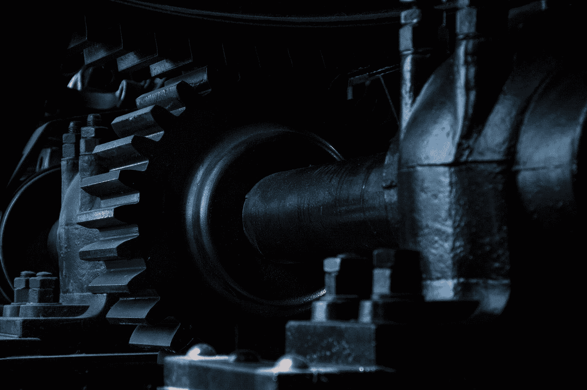
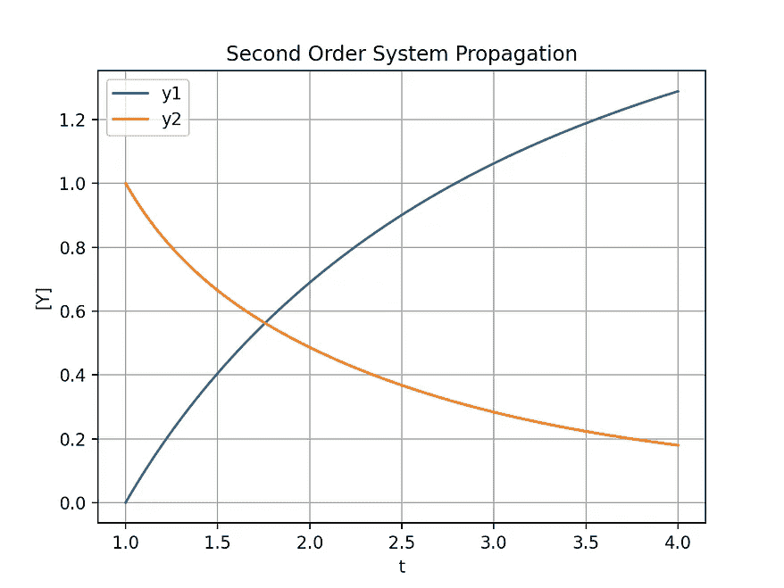
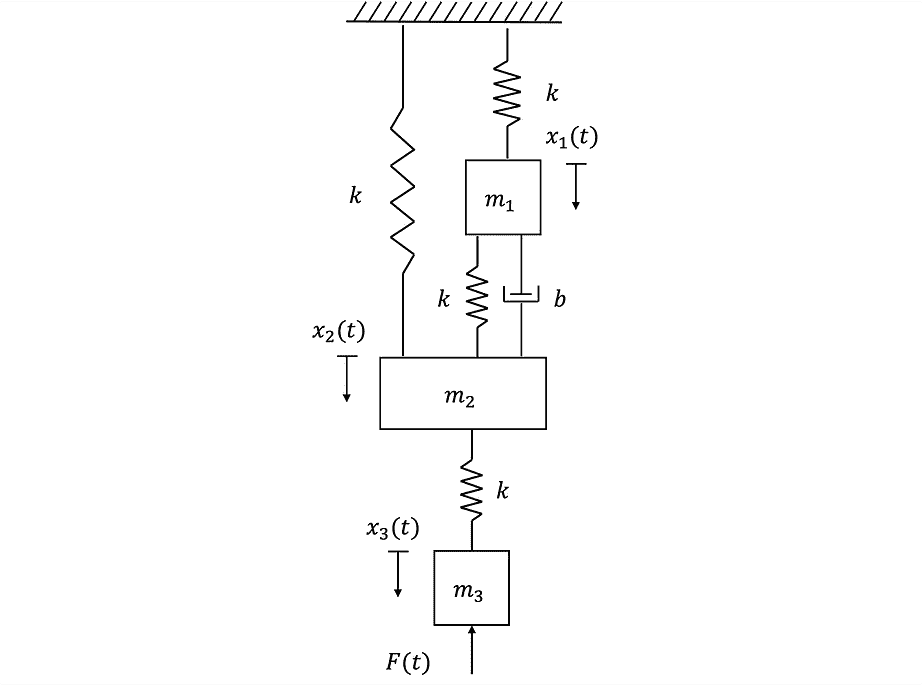
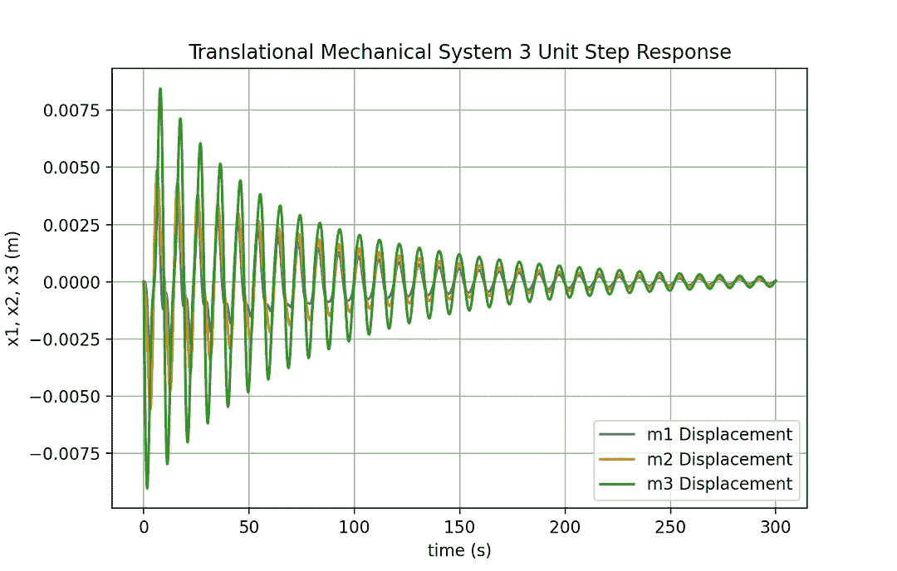
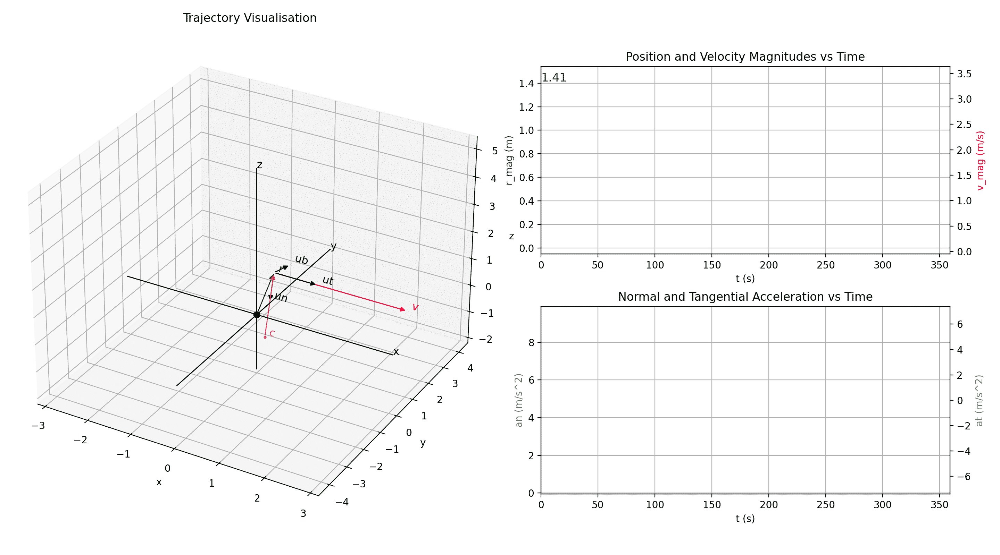
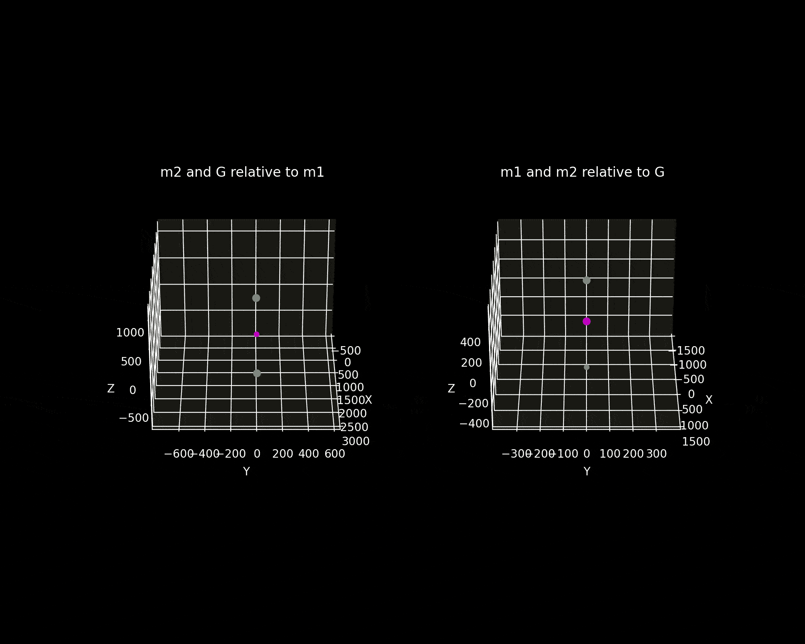
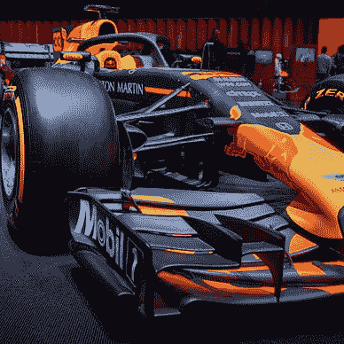

# 面向工程专业学生的 5 个 Python 项目

> 原文：<https://towardsdatascience.com/5-python-projects-for-engineering-students-8e951b7c131f>

## 面向工程师的初级到中级 Python 项目理念

*这篇文章为工程专业的学生提供了 5 个 Python 项目建议，这些学生希望在专注于工程的同时展示一些软件开发技能。*

由[Isis frana](https://unsplash.com/@isisfra?utm_source=medium&utm_medium=referral)在 [Unsplash](https://unsplash.com?utm_source=medium&utm_medium=referral) 上拍摄

## 介绍

Python 是一种非常流行的编程语言，在科学和工程领域都有很多应用。

作为*在爱尔兰的本科工程师*，我们只在 *MATLAB* 上完成了一个编程模块。结果，没有太多的重点放在提高你的软件开发技能上，当我进入这个行业时，我发现这个技能是至关重要的。

作为一个做过开发人员和测试人员，现在正走上 *AI* 和*数据科学*职业生涯的航天工程师，我所学的关于软件开发的一切都是**自学**。在很大程度上，今天仍然如此。

我希望我在大学里做的一件事是花更多的时间根据我在课堂上学到的东西修补和编写小程序。但是相反，我所做的是学习满足于通过考试的唯一目的。

> 让我们讨论一些 Python 项目，如果你有空闲时间或者想巩固你所学的一些理论，你应该作为一名工程师去探索。

下面你会找到这些建议，其中有简短的理由**为什么它有价值**以及**你可以遵循的最佳资源**来开始工作。

照片由[洛伦佐·埃雷拉](https://unsplash.com/@lorenzoherrera?utm_source=medium&utm_medium=referral)在 [Unsplash](https://unsplash.com?utm_source=medium&utm_medium=referral) 上拍摄

# 1)用泰勒多项式进行函数逼近

## 利益

泰勒级数让你*用数字估计一个函数*，比如 *sin(t)* 或者 *cos(t)* 。对工程师来说，编写代码是一项很棒的小任务，因为它需要了解 ***符号微分*** 和 ***数值方法。***

大多数学生在大学的第一年就获得了这些领域的足够知识。泰勒级数使用这些*基础技能*，它们构成了科学和工程中许多更高级主题的基础。

## 资源

*   有哪些工程、数学或计算机科学爱好者不知道格兰特·桑德森。要理解泰勒系列的本质，先看看**3 blue 1 brown**s[视频](https://youtu.be/3d6DsjIBzJ4)吧。
    如果左下角的动画看起来很熟悉，我是用3Blue1Brown 的数学动画软件 *Manim 制作的。*
*   另一个有益的资源是任何大学微积分教科书。例如，我使用罗伯特·A·亚当斯的*微积分——完整教程*。我没有很多课本，因为现在你可以很容易地找到在线书籍的讲义或免费的 PDF 版本。

泰勒多项式函数逼近(图片由作者提供)

# 2)龙格-库塔数值积分

## 利益

**龙格-库塔**是一种*数值积分技术*。模拟物理现象，例如由*牛顿冷却定律*描述的物体温度变化，结合了 ***常微分方程*** (ODEs)。求解常微分方程在工程和科学的许多分支中都是至关重要的。

完成这个脚本为剩下的三个提议奠定了基础，所以这可能是对一般工程熟练程度最重要的。

## 资源:

*   免费球的良好振动对于工程师来说是一个极好的 *YouTube* 频道。他在 Python 中实现了一个 **RK4** 积分器来解决 Python 中的质量-弹簧-阻尼器系统。
*   其次，听理查德·布伦顿的这个[讲座](https://youtu.be/5CXhHx56COo)是完成这个项目的理想选择。在课程结束时，他在 *MATLAB* 中为一个 *RK4 从头开始*提供了代码。因此，如果你正努力用 Python 来做这件事，那么根据你的目的修改 Matlab 代码。

龙格-库塔数值积分(图片由作者提供)

# 3)动态系统建模

## 利益

通过模拟平移机械系统的动态响应，强化**振动**的基本原理。如果你对*飞行器动力学*或*宇宙飞船动力学*感兴趣，这项事业就是*的精髓*。

比如你可以衍生出一辆 ***一级方程式*** 赛车的*悬挂*的基本模型，相当酷。通常，使用 *MATLAB* 和 *Simulink* 可以解决这些问题，但是没有什么可以阻止你在 Python 中做同样的事情。

## 资源

*   查尔斯·m·克洛斯的动态系统建模和分析。谁不喜欢在网上找一本免费的 PDF 版本的像样的教材呢？对于学习如何推导*系统运动方程*和寻找*样本问题*解决是非常有价值的。
*   [模拟动态系统](https://youtube.com/playlist?list=PL4VMBEQr3gME29eeHZyT_lDw3KCdAmwXR) —里克·希尔。里克·希尔博士从何说起。对于 MDS 和控制系统，Hill 博士在 YouTube 上的讲座非常出色。我相信这套课程在过去救了很多学生，包括我。先生，谢谢你的工作。
*   同样，对于对 MDS 感兴趣的工程师来说，自由球的良好振动是一个很好的渠道。如果你打算参与这个项目，请点击这个链接。有清晰、简洁的解释，问题根源于*实际应用*。

动态系统建模(图片由作者提供)

> 最后两个项目更侧重于航空航天工程。两者来自同一个资源，[工科学生的轨道力学](https://www.elsevier.com/books/orbital-mechanics-for-engineering-students/curtis/978-0-12-824025-0?format=print&utm_source=google_ads&utm_medium=paid_search&utm_campaign=ukdsa&gclid=Cj0KCQiAip-PBhDVARIsAPP2xc110yN_TrpjQLUuBqXEeBP0OXXWLogHO3JeOBVaqtHzU7_Q6mKp7T8aAn2DEALw_wcB&gclsrc=aw.ds)。

# 4)三维运动学可视化

## 利益

给定粒子位置作为时间的函数来模拟样本**轨迹**并计算各种其他*运动特性*为更多*复杂动力学*问题提供了良好的基础。

*不需要数值积分*；直接**堵**和**轧轧作响。**尽管轨迹可视化*相对具有挑战性*。然而，你不需要为这些作业制作动画。

> 动画是蛋糕上一颗漂亮的*樱桃*用来展示你为每个项目所做的工作，但是理解如何实现理论和生成数字结果是最有益的方面。

## 资源

*   这个项目源于工科学生在[轨道力学中的一道例题。这本书包含了你只使用 **Numpy** 和 **Matplotlib** 用 Python 编写这个 *chef-d'oeuvre(艺术杰作)*所需的数学背景。](https://www.elsevier.com/books/orbital-mechanics-for-engineering-students/curtis/978-0-12-824025-0?format=print&utm_source=google_ads&utm_medium=paid_search&utm_campaign=ukdsa&gclid=Cj0KCQiAip-PBhDVARIsAPP2xc110yN_TrpjQLUuBqXEeBP0OXXWLogHO3JeOBVaqtHzU7_Q6mKp7T8aAn2DEALw_wcB&gclsrc=aw.ds)

3D 运动学可视化(图片由作者提供)

# 5)两体问题

## 利益

清单上的最后一个项目不是最难的，但却是我最喜欢的。*谁不爱轨道力学？**两体问题*是一个**经典力学**问题，你的目标是想象两个物体仅仅由于它们的**相互** **引力吸引**而产生的运动。

你可以学习*推导运动方程*，其中的过程很可能*没有你想象的那么复杂*。此外，解决它们确实需要*数值积分。*

有大量奇妙的资源可以让你开始这个项目。如果这不是矛盾修饰法的话，这是一件令人愉快的差事，而且如果你能制作出动画，连续几个小时无休止地盯着它们看是相当令人满意的(不，只有我？).

## 资源

*   在整篇文章中，我大量引用了[工程学生的轨道力学](https://www.elsevier.com/books/orbital-mechanics-for-engineering-students/curtis/978-0-12-824025-0?format=print&utm_source=google_ads&utm_medium=paid_search&utm_campaign=ukdsa&gclid=Cj0KCQiAip-PBhDVARIsAPP2xc110yN_TrpjQLUuBqXEeBP0OXXWLogHO3JeOBVaqtHzU7_Q6mKp7T8aAn2DEALw_wcB&gclsrc=aw.ds)。*最终的两个项目*源自第 1 章中单独介绍的理论。在后面的章节中，你可以用 Python 探索项目和模拟的无数可能性。

二体问题(图片由作者提供)

# 项目列表

如果这些项目**想法**让你感兴趣，看看这个[列表](https://medium.com/@andrewdaviesul/list/86dc1df6935e)，其中的项目按照从*初级*到更高级*的顺序排列。我重点关注*工科生*。然而，这些项目是为任何对数学和科学感兴趣的人准备的。此外，我经常引用 *Python* ，因为那是我的编程语言偏好。如果你掌握了不同语言的技能，*带着这些想法去实践吧*。*

安德鲁·约瑟夫·戴维斯

## Python 中的工程项目

[View list](https://medium.com/@andrewdaviesul/list/engineering-projects-in-python-86dc1df6935e?source=post_page-----8e951b7c131f--------------------------------)8 stories [## 通过我的推荐链接加入媒体-安德鲁·约瑟夫·戴维斯

### 作为一个媒体会员，你的会员费的一部分会给你阅读的作家，你可以完全接触到每一个故事…

medium.com](https://medium.com/@andrewdaviesul/membership) 

> 如果您对 Python、工程和数据科学感兴趣，请随时关注和查看我的其他文章。

我希望你找到了有用的东西。感谢您的阅读。