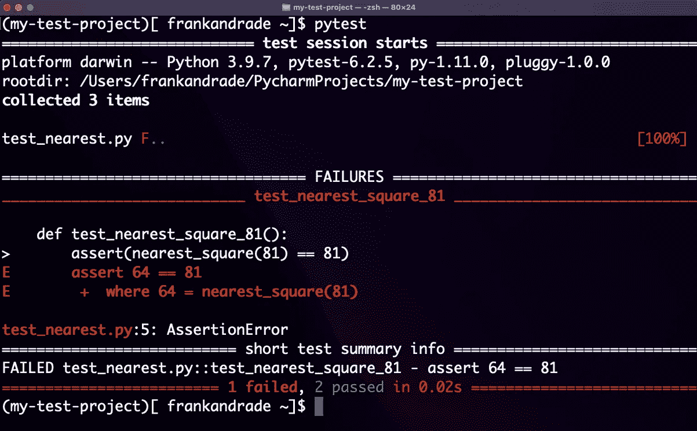

# 成为更好的数据科学家的 5 个软件工程实践

> 原文：<https://towardsdatascience.com/5-software-engineering-practices-to-become-a-better-data-scientist-61e6484ad8f5>

## 数据科学家应该向软件工程师学习的最佳实践。


穆罕默德·拉赫马尼在 [Unsplash](https://unsplash.com?utm_source=medium&utm_medium=referral) 上的照片

让我们面对现实吧，作为数据科学家，我们经常编写代码，但有时并不关注诸如编写高效代码、代码结构和可维护性之类的事情。

但是我们应该！

数据科学家通常是项目的一部分，包括与其他人合作和共享代码。这就是为什么我们需要编写健壮的代码，并遵循软件工程师的一些好的实践。

数据科学家和软件工程师有一些共同点，在本文中，我将向您展示 5 个软件工程最佳实践，您应该借鉴它们成为更好的数据科学家。

# 编写干净的代码

编写干净的代码意味着编写可读、简单、简洁的代码。干净的代码是易于维护的脚本的基础。

相信我，通过编写易于理解的代码，你会让你的队友生活得更轻松。简单比复杂好，所以不要写复杂的代码，即使你可能也很难理解。

下面是一个编写干净代码的例子:

以下是上一个示例中遵循的良好实践:

*   使用有意义的变量名:使你的变量名具有解释性和描述性。名为`end`的变量不如`end_time.` 有解释力，布尔变量`single`不如`is_single`有描述力。
*   不要在变量名中使用没人能理解的缩写(例如`t`和`c`)。
*   不要写太长没人会记得的变量名。
*   正确使用缩进和空白:这里有很多约定，比如使用四个空格缩进，或者用一个空行分隔各个部分。他们可能很难记住；幸运的是，像 Pycharm 这样的 ide 会建议您遵循这样的约定，并展示如何去做。
*   命名对象时尽可能遵循惯例(例如，如何使用大小写惯例，何时使用下划线等)

# 编写模块化代码

模块化代码意味着编写可以分成功能和模块的代码。

一个可以分解成模块的程序在调试时很有帮助。随着程序规模的增长，将代码分成模块是一个很好的做法。这让您可以很容易地查明错误的来源。

此外，模块化代码将帮助您避免重复，并编写高效和可重用的代码。

以下是开始编写模块化代码的一些建议:

*   不要重复:如果你使用相同的函数/方法来完成一个任务，考虑创建一个函数或 for 循环。

*   尽量减少函数、类和模块的数量
*   单一责任原则:一个类/函数应该只有一个责任。如果它们做不止一件事，考虑将它们重构为两个或更多的类/函数。
*   使用模块

# 优化您的代码

写有用的代码是好的，但是你知道什么更好吗？

编写运行速度快、占用内存和存储空间少的高效代码。这就是为什么您应该优化您的代码(即使它已经完成了工作)。

编写高效的代码并不容易。随着时间的推移，你会学到这种技能。也就是说，这里有一些建议可以帮助你现在就开始编写更高效的代码。

*   向量化操作:尽可能在循环中使用向量操作(Numpy)。
*   检查每个操作的运行时间:这将帮助您找到脚本中的瓶颈。
*   了解你的数据结构和哪些方法更快

让我们来看一个向量化操作如何帮助优化脚本性能的示例:

如果您运行上面的代码片段，您会看到两种解决方案得到相同的结果；然而，解决方案 1 完成这项工作需要大约 2.57 秒，而解决方案 2 只需要 0.06 秒。

虽然这个小小的调整仅仅为我们节省了 2 秒钟，但在更大的范围内，它可以在性能上产生很大的差异。

# 正确使用日志记录

Python 提供了一个内置的日志模块，我们可以将其用于我们的应用程序。

日志允许我们不断地查看我们的应用程序正在经历的流程，即使我们不在计算机前。这有助于我们记录运行程序时发生的事件，因此我们可以观察一段时间内的行为和错误，并更好地了解我们正在开发的应用程序。

虽然您可以用一个简单的`print`函数来完成所有这些，但是一旦您的应用程序超出了基本项目的范围，日志将会派上用场。例如，如果发生错误，日志可以提供深入的信息，比如程序在到达发生错误的代码行之前的状态。

以下是一些在编写日志消息时可以遵循的良好实践:

*   简洁并使用正常的大写字母
*   提供有用的信息

```
Bad: Failed to read the file
Better: Failed to read the file located at "..." 
```

*   选择适当的日志记录级别:日志记录级别允许我们指定想要记录的内容。有 5 个标准日志记录级别:

来源:[科里·斯查费](https://youtu.be/-ARI4Cz-awo)

默认的日志记录级别是`WARNING`，因此默认情况下，它将捕获在`WARNING`级别或更高级别(`WARNING`、`ERROR`和`CRITICAL`)的任何内容，而忽略下面的级别(`DEBUG`和`INFO`)。

也就是说，您可以通过编辑默认配置来更改日志记录级别。

假设我们想要将默认的日志记录级别更改为`DEBUG`:

```
**import** logginglogging.**basicConfig**(**level**=logging.DEBUG)
```

# 测试您的代码

如今，雇主正在寻找能够为行业环境编写代码的数据科学家；这就是为什么你需要测试你的代码。

在数据科学过程中可能会出现许多问题，这些问题不像导致程序崩溃的错误那样容易检测到。您的代码可能运行得很好，而您没有意识到一些值编码不正确。这就是为什么测试您的代码是一个好的实践，以避免意外的结果，并对最终的输出有信心。

在 Python 中有不同的方法来测试你的代码。您可以使用控制台来测试您的代码，但是您必须手动完成大部分工作，这在运行大量单元测试时并不理想。

为了在 Python 中快速开始测试，我们可以使用 Pytest。这是一个测试框架，使得构建简单且可伸缩的测试变得容易。使用 Pytest，我们可以从简单的单元测试到复杂的功能测试。此外，我们将能够运行所有的单元测试，并查看哪些测试失败了，哪些成功了(相反，控制台在每次失败时都会停止)

下面是我用 Pytest 做的一个简单测试:



Pytest

要安装它，请遵循其[文档](https://docs.pytest.org/en/6.2.x/getting-started.html)中的说明。

# 好处:重构你的代码

时不时地，你必须重构你的代码。代码重构是[在不改变外部行为的情况下重构现有计算机代码的过程](https://en.wikipedia.org/wiki/Code_refactoring)。这样做的目的是改进代码的设计、结构和实现，同时保留其功能。

您的代码可能已经工作了，但总有改进的空间，所以再次检查您的脚本以清理您的代码，使其模块化和高效。

你还可以从软件工程师那里学到其他好的实践，比如使用版本控制和记录你的代码。去吧，也试试看。

<https://medium.com/geekculture/is-a-degree-in-data-science-worth-it-1ca8c3bdb00c>  

[**与 7k 以上的人一起加入我的电子邮件列表，获取我在所有教程中使用的 Python for Data Science 备忘单(免费 PDF)**](https://frankandrade.ck.page/bd063ff2d3)

如果你喜欢阅读这样的故事，并想支持我成为一名作家，可以考虑报名成为一名媒体成员。每月 5 美元，让您可以无限制地访问数以千计的 Python 指南和数据科学文章。如果你使用[我的链接](https://frank-andrade.medium.com/membership)注册，我会赚一小笔佣金，不需要你额外付费。

<https://frank-andrade.medium.com/membership> 