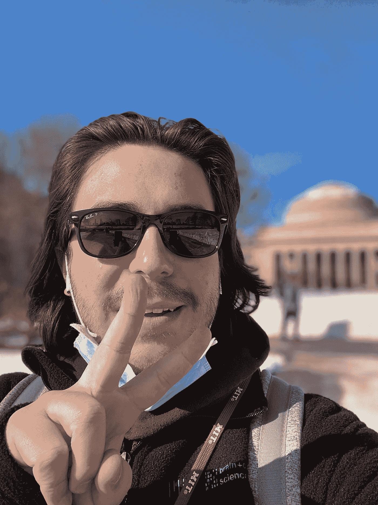

# 我在麻省理工学院人工智能研究实验室工作一年所学到的 5 件事

> 原文：<https://towardsdatascience.com/5-things-i-have-learned-working-in-an-mit-ai-research-lab-for-a-year-a65b4fcaef31>

## 它如何改变了我对生活、知识、真理的看法，以及它对人类意味着什么

2022 年 1 月，我在麻省理工学院的圆顶前被寒风彻底吹倒。

嗨大家好！我叫 Mike，是麻省理工学院大脑和认知科学系(MIT BCS)的一名研究软件工程师/ML 工程师。我专门研究 Brain-Score，这是一种测量人工智能有多像大脑的工具。我来这里一年了，2021 年春天从弗吉尼亚大学毕业。

我和你一样，被迫多次滚动到一篇文章的结尾，以获得实际的外卖点，(看看你们这些食谱作家！)，所以本着不做那件事的精神，我将直接进入它。以下是我在麻省理工学院人工智能实验室工作一年来学到的 5 件事——有些事我希望你会觉得有趣或对你自己的旅程有用，有些事深刻地影响了我看待生活、成功、知识和人类本身的方式。

# 1.当你不知道某事时，承认是可以的。

## 这是我必须学习的最难的东西，也是我至今仍在挣扎的东西。

> 不要去想你为什么质疑，干脆不要停止质疑。不要担心你不能回答的，也不要试图解释你不能知道的。好奇心是它自身的原因。当你思考永恒、生命、现实背后的奇妙结构的奥秘时，你不敬畏吗？这就是人类思维的奇迹——用它的结构、概念和公式作为工具来解释人类看到、感觉到和触摸到的东西。试着每天多理解一点。有神圣的好奇心。
> 
> ——阿尔伯特·爱因斯坦

我老实对你说——在我开始在麻省理工学院工作之前，我认为我很了不起。我刚刚从弗吉尼亚大学毕业，主修计算机科学和认知科学，辅修哲学和数学。我以为我很了解我的东西。然而，当我参加我的第一次每周麻省理工学院实验室会议时，这一切都被抛到了九霄云外——我可能理解了大约 10%—20 %(一个慷慨的上限),自从我第一次在高中三年级遇到物理并想知道实际的角动量是多少(仍然不完全确定)以来，我没有感到那么愚蠢？？).立刻，在接下来的几个星期里，我开始有一些严肃的问题。我在这里做什么？我是否足够聪明来问一个连贯的问题？我的智商是不是低到不能去麻省理工？为什么看起来我只是知道的还不够多？

最终，在与我的导师和其他实验室伙伴的交谈中，我意识到，是的，我只是知道的还不够多，这没关系。这就是我来这里的目的。*我是来学习更多的* - *这才是重点！*我突然发现，与我同处一个领域的专家们以最大的强度和动力研究这个领域，比我多花了 3 年到 40 年。仅在第一周，我就遇到了至少 5 或 6 个人，他们研究人工智能和神经科学的交集的时间比我活着的时间还要长，对于那些认为自己知道很多的人来说，这是一个令人羞愧但显然令人生畏的事实。我喜欢说这类似于谚语中的“*婊子打我的脸*”…

然而，真正让我感到困惑的是，这些已经研究这个课题几十年的人，这些在一个领域已经达到绝对顶峰的人，似乎总是在问问题。他们挖得很深。他们挑出每一个主张，每一个数据点，每一条趋势线。如果他们不理解为什么一个结果是重要的，为什么一个样本被排除在外，或者甚至不理解逻辑链本身如何从一个想法的概念流向一个真正的被证伪的假设 ***他们会问*** 。我一直注意到，房间里最聪明的人会问这样的问题:“对不起，我只是不明白这个”，或者“你说得太快了，我不能理解你说的话”，或者甚至是一个简单的“你把我搞糊涂了”。

这是一件神奇的事情——它证明了如果听众没有理解某人所说的话，他们没有错，但是演讲者有错。如果你愿意的话，它将“举证责任”，或者理解的责任，转移到了提出的人身上。他们的工作是确保科学是可以理解的，确保同行能够跟上思路，确保他们的论点是连贯的和有纪律的。他们的工作是预测问题，并放慢语速让听众跟上。这也展示了一种伟大的领导特质——这里是我们实验室最资深的成员，我的领导者，谦逊地承认他们不理解某些事情—*并一遍又一遍地做这件事。这是一种非官方的承认，即可以提问——对于实验室的新人来说，这是对好奇心本身的认可——这是一种明确的“这是我们这里所重视的，这是我们做事的方式。”因此，我想对任何想在提问中培养这种安全感的经理或领导者说，你首先必须这么做。*

起初，这对我来说很奇怪，我不得不去适应它(我第一次做实验报告是我一生中最紧张的两个小时之一)。但是，这又培养了一种神奇的环境，在这种环境中，人们感到安全，承认他们不明白发生了什么，而不是试图伪造他们的知识。现在对我来说，这几乎是*总是可以察觉到的*——如果有人被问到一个问题，考虑一下，然后以“我不确定，我必须研究一下”或“很好的建议，我必须进行更多的试验才能确定”来结束，而不是试图用一些垃圾词沙拉答案来胡说八道。

那么，这有什么意义呢？关键是，对于专家来说，对于*真正的大师*来说，一个共同点是他们从来不会停止提问。当他们不知道一些事情时，他们从不停止承认，因为这代表着一个机会，可以弥合*理解的差距，提高自己的知识，并在他们所做的事情上做得更好***。在我成长的过程中，很多时候在学校问问题经常被视为滑稽的事情——例如，“看看这个愚蠢的家伙，他甚至不知道角动量是什么”——但现在我个人认为这是体面的标志；这个人对自己的知识如此自信，对自己如此自信，对自己的身份如此自信，以至于他们不怕在同事面前变得脆弱。通过思考相反的情况，这一点会更加突出:同事似乎总是胜过你，总是想让别人知道他们有多聪明，总是对自己的职位没有安全感。**

**重要的是，在任何一个值得该死的安全环境中，这种友好和开放的意识都会如此。最好、最具创新性和包容性的环境将培养这种好奇心和无止境的改进循环。当你不知道某事时，承认是可以的。**

# **2.有时候直言不讳更有效。**

## **诚实、客观的反馈是你能得到的最有价值的东西之一。**

> **“不要粉饰太平——它只会阻碍科学进步。我们没时间听这些废话。”**
> 
> **我的匿名实验室成员，2021 年 7 月**

**当我第一次被告知我已经被麻省理工学院的实验室录取时，我联系了当时弗吉尼亚大学的一位教授，他在麻省理工学院 EECS 分校获得了学士和博士学位。我基本上是问他“麻省理工学院怎么了，他们和弗吉尼亚大学在文化上有区别吗？那个长相怪异的蒂姆·比弗是怎么回事？为什么波士顿这么贵？"**

**他告诉了我很多很棒的建议，但我特别记得的是他的“警告”:他告诉我，在麻省理工学院，*直率无处不在*。如果你有一个愚蠢的想法，人们会告诉你。如果你做得不好，人们会告诉你。如果你的假设是垃圾，人们会告诉你——不管是一对一的还是在一屋子其他博士中。所以我把它记为绝妙的建议，并在几个月后召开了我的第一次实验室会议…**

**…意识到他是对的。非常正确。我有一些不好的想法，有人当着所有人的面告诉我。我犯了技术错误，被判出局。幸运的是，知道这是我第一次这样做，我的实验室是理解的。但真正酷的是，它发生在*这里的每个人*身上——不管你是否已经发表了 13 篇*科学*论文，或者从未发表过。不仅仅是在我的实验室，似乎整个麻省理工学院都是如此——*这就是文化*。事实上，如果你的听众不断插话和提问，这甚至被视为一种尊重的表现——这意味着他们感兴趣！如果你在这里做报告，没有人打断，那么这可能是一件无聊的事情。**

**显然，这有可能让不习惯这种方式的人感到不快，包括我刚到这里时的自己。但很快我又意识到这是有原因的——这是获得坦诚、客观反馈的一种方式。这是事实，因为正如#1 所指出的，对知识的探索和对科学前沿的推进在这里是神圣的。这种类型的反馈是有效的——它帮助人们做得更好。如果科学家做得更好，根据定义，科学就会向前发展。这是有效的，节省时间。**

**所以，我要说的是，给予客观反馈是有时间和地点的，在麻省理工学院，时间和地点实际上是随时随地。这是非常有价值的，因为理论上你可以专注于作品，而不用担心评论是个人的还是针对个人的。对我来说，我意识到它们不是对我个人或迈克本人的攻击——它们是对我的工作的批评，这与我是分开的。在过去的几个月里，我开始寻求这种直言不讳和客观的反馈，因为它在随着时间的推移进行改进和获取该领域的知识方面提供了最“划算”的方式——我们的时间有限，无法尽可能多地学习，所以为什么要回避批评，而不在该反馈时给出反馈呢？**

**你还可以通过一个人如何处理对其工作的批评来判断他的很多方面——他们是否保持沉默并为自己辩护，或者似乎在内部庆祝，因为你刚刚强调了他们变得更好或学习更多的方法。这种直言不讳的概念是一把双刃剑——高风险但高回报——所以在你的生活中要小心使用。但是有时候，直率更有效。**

# **3.采取学徒心态**

## **通往精通的道路很漫长，但非常值得。**

> **“这样想吧:失败有两种。第一个是因为你害怕，或者因为你在等待最佳时机，所以从来没有尝试过你的想法。这种失败你永远无法吸取教训，这样的胆怯会毁了你。第二种来自大胆和冒险的精神。如果你以这种方式失败了，你学到的东西远远超过了你对自己声誉的打击。一次次的失败会磨练你的精神，让你明白事情必须怎么做。”**
> 
> **― **罗伯特·格林，** [**精通**](https://www.goodreads.com/work/quotes/19176675)**

**或者你们当中那些以前关注过我的文章的人，你们知道我是一个积极的读者，并且参加了三年多的每周一本书的挑战。我读过一些真正精彩的书，也读过一些我不得不停止阅读的书，因为我认为它们纯粹是垃圾。无论如何，我可以说真正改变了我对生活和工作的思考方式的书籍之一是罗伯特·格林的《掌握》(上面引用的)。**

**这本书有很多我喜欢的地方——格林以直接、实用的方式写作，并穿插了实证、真实的例子，说明他的假设为什么有效/它们如何得到案例研究的支持。这本书跟踪了他们领域的几位大师，从舞蹈到拳击到工程，跨越了许多社会经济背景和多样性，并提取了共同的特征。**

**我学到的是:要成为某方面的大师——也就是说，要真正理解一个领域并产生影响，你必须经历不同的发展阶段。在你的正式教育之后，你可以进入一个“学徒”阶段，在这个阶段，用格林的话来说，你就像一个研究新社区的人类学家。你必须学习做事的方式，规则，包括显性的和隐性的，以及如何取得进展。这可能会持续 3 到 10 年，但总的来说会给你这个领域的基础知识。接下来，你进入所谓的创造性活跃阶段，在这个阶段，你开始拓展并发挥你自己的创造性独立性。最后，你进入了精通阶段。《精通》这本书本身非常值得一读，我发现其中几乎每一行都可以引用。**

**主要的收获是，精通一门学科或领域本身就是一种投资；对一些对你有意义的事情的内在追求，一些你在空闲时间思考的事情，一些你记得在童年时喜欢或被吸引的事情。掌握了一门学科，你就与自己和谐相处，因为你正在以一种有意义的方式发挥你的全部潜力。简单地说，这是对未来幸福和满足的投资，也是避免陷入没有出路的职业生涯或随着年龄增长而不快乐的一种方式。日本人的 Ikigai 概念也非常相关，值得自己分析。**

**我目前正处于人工智能/神经科学的学徒阶段，我可以绝对明确地说，这种思维模式消除了我的冒名顶替综合症的感觉——事实上，当谈到我对同事们的领域知识时，我已经*承认我的劣势*，因为他们已经做了更长时间，知道的比我多得多——再次呼应#1，*这没关系*！对我来说，重要的是，如果你发现自己处于某种学徒阶段，或者刚刚开始某个地方，尽可能快地学习你所在领域的知识。你想把他们的知识提取到你自己的知识中，并把他们的掌握作为启动自己旅程的一个引导。合适的导师绝对是无价的。提出问题，在寻求知识的过程中保持热情，在学习的时候永远不要有优越感——任何和你领域相关的事情，甚至是看起来不相关的事情，都值得学习。**

**用格林的话说，“服从理想的学徒制度”。这将在以后的生活中带来幸福和工作保障，也是我所知道的对抗一直存在的骗子综合症的第一方法。所以，如果你刚刚起步，或者甚至正处于职业生涯的中期，*采取一种学徒的心态。***

# **4.科学可以深刻地影响一个人的世界观。**

## **这似乎是显而易见的，但比表面上看起来更微妙。**

> **"科学是一种思维方式，而不仅仅是一种知识体系。"**
> 
> **[**——卡尔·萨根**](https://www.brainyquote.com/authors/carl-sagan-quotes)**

**在美国，似乎有一种“反科学”的感觉正在上升，这种感觉非常令人不安，原因有很多。卡尔·萨根(Carl Sagan)在 1996 年就曾非常、甚至是非常可怕地这样预测过:**

> **“我有一种预感，在我的子孙后代的时代，美国将是一个服务和信息经济的时代；当几乎所有的制造业都转移到其他国家时；当令人敬畏的技术力量掌握在极少数人手中，甚至没有人代表公众利益能够抓住问题；当人民失去了设定自己的议程或明智地质疑当权者的能力时；当我们紧握着水晶，紧张地查阅我们的星座运势，我们的批判能力下降，无法区分什么感觉良好，什么是真实的，我们几乎没有注意到，滑回到迷信和黑暗中…**
> 
> **美国人的低俗化最明显地体现在影响力巨大的媒体中实质性内容的缓慢衰减、30 秒钟的新闻片段(现在缩短到 10 秒钟或更短)、最小公分母的节目、关于伪科学和迷信的轻信的介绍，但尤其是一种对无知的赞美”**
> 
> **― **卡尔·萨根，** [**恶魔出没的世界:黑暗中的科学蜡烛**](https://www.goodreads.com/work/quotes/252618)**

**吓人吧？似乎对科学事业本身持怀疑态度正变得越来越时髦，在谷歌上快速搜索一下“反科学运动”就能支持我的观点。那么有什么方法可以解决这个问题呢？我希望根据我在麻省理工学院一年来的观察，提供一些帮助我在新闻两极化、利益冲突和有偏见的故事时代保持理智的见解:**

**首先，就像我上面第一点所说的，质疑一切。没有任何东西，我的意思是没有任何东西，可以免于审查和适度的怀疑。遇到文章，看看是谁写的。在谷歌上搜索一下，看看他们是否写过其他东西，或者是否有任何经济动机来推动他们的叙述。在你做出结论之前，交叉参考来源并从*多个*来源确认。问问为什么有人想为他们正在争论的事情争论，问问他们能从正确中得到什么。如果一个观点只出现在一个地方，而那个地方有偏见的历史，那么你很可能只听到故事的一面。**

**第二，分析论点。寻找逻辑中的常见错误，如人身攻击、非逻辑推理和各种偏见，如选择和确认偏见(第一种偏见因其难以发现和可能产生的深远影响而臭名昭著)。从开始到结束，跟随作者如何提出他们的论点。在哲学中，确保论点是有效的(前提是正确的)和合理的(结论来自前提)。当心错误的暗示、无根据的主张和操纵的图表。为任何大的主张寻找证据，正如克里斯托弗·希钦斯所说:**

> **“没有证据就可以断言的东西，也可以在没有证据的情况下被驳回”**

**最后，承认每个人都是人。人会犯错，数据往往不完整或有偏差；思想会改变，如果有新的证据，那么*也应该*改变。这是成熟的做法——当新的事实出现时，让旧的观念消失，并承认任何错误。**

**我希望这些话题能有助于我们在这个看似后真实的世界中导航。我发现自己现在更深入地挖掘前提或论点，并仔细分析结论是如何得出的，我还有很长的路要走。萨根的开场白说得很好——科学是一种思维方式，*开明和怀疑之间的细微差别*。但关键是，通过一点实践，*科学可以深刻地影响一个人的世界观。***

# **5.成为一个有意识的、工作的人类本身就是一个非凡的壮举。**

## **大脑出现故障的方式似乎比正常运转的方式多。**

> **“我不能假装我没有恐惧。但我最主要的感觉是感激。我爱过也被爱过；我被给予了很多，我也给予了一些回报；我阅读、旅行、思考、写作。我和这个世界有过交流，作家和读者的特殊交流。**
> 
> **最重要的是，在这个美丽的星球上，我是一个有意识的生物，一个有思想的动物，这本身就是一种巨大的特权和冒险。"**
> 
> **― **奥利弗·萨克斯，** [**感恩**](https://www.goodreads.com/work/quotes/47201204)**

**人们很容易迷失在当今世界的日常琐事中。需要提交东西，需要发送电子邮件，需要预约。孩子们必须被接走，晚餐必须以某种方式出现。但是，当你退后一步，真正开始审视这些事情是如何表现出来的，你的大脑是如何回复电子邮件和查看塔可钟外卖菜单的，你开始真正对这些微小的任务有多么复杂感到敬畏。从光子击中你的视网膜到你的大脑意识到你正在看的东西实际上是一个蘸了调味汁的美味的意大利煎饼，许多令人惊讶的复杂事情发生了。神经元放电，这些信号被结合并传播成复杂的神经表征，然后在某个地方，类似于标签“Chalupa！”是吐出来，让我向等待我点菜的可怜灵魂确认，是的，我要牛排，不要鸡肉。**

**我在这篇咆哮中的观点(不幸的是没有赞助)是，可笑的复杂过程发生了，让你每天生活，并且有时，如果不是大多数时候，这些过程的本质没有被聚焦，它们的含义也没有被聚焦。我的意思是，你的大脑能够做出的惊人的事情往往被隐藏起来，并被认为是理所当然的，我可以告诉你，事情出错的方式比正确的方式多得多。多巴胺水平可能会失控，出现病变，信号丢失或被不恰当地重定向…可能的故障列表几乎是无穷无尽的。然而，你却在这里，不顾一切地读着这篇文章。**

**我请你花一点时间，意识到是什么让你能够偶然发现我的文章，阅读它，并一起存在——这种事情发生的几率几乎是无限小的，然而，你又在这里。在某个时刻，你将不复存在；这是一个令人不安的事实，你死后会发生什么谁也说不准。我*确实*知道此刻什么是真实的:这些快乐、悲伤、希望、胜利和失败、痛苦和渴望、狂喜和难以忍受的痛苦的有形时刻*非常*真实。它们是使我们成为人类的*非常*的东西，也是将很难在人工智能中很快复制的*非常*的东西。**

**一个人工智能是否能经历这样的事情是一个非常有争议和有争议的话题，对此我已经写了很多，惹恼了我的实验室同事，但我还没有找到答案；我根本不知道会发生什么。我只知道我是人类，因此我被灌输了几千年的进化遗产，就像你一样。我们来自一长串杰出的人类，希望会被一长串更杰出的人类所取代。**

**想想那些在你存在之前就已经湮没在历史中的故事——有着数千年历史价值的亲密爱情故事，腐败的背叛和邪恶的故事，不可思议的勇气和牺牲的故事，逆境战胜一切的故事——生存的故事。在许多方面，这些故事和它们的主题与 10，000 年前完全相同，只是人物和背景不同——但有一个主题跨越了几个世纪，一个短暂的存在和永恒的时间流逝:**

> **我今天坐在同一个地方**
> 
> **在过去的岁月里，其他人来坐下。**
> 
> **一千年后还会有人来。**
> 
> **谁是歌手，谁是听众？**
> 
> **——阮公楚，越南诗人**

**所以，不管你生活中发生了什么，好的或坏的，不管日常生活中无聊的任务，也不管你个人的成功和失败:只要记住*成为一个有意识的、工作的人本身就是一个非凡的壮举。***

****

**鸣谢:格雷戈·拉科齐 via [Unsplash](https://unsplash.com/@grakozy)**

**********

**感谢你的阅读，你可以在 Medium/TDS 上关注我，获取技术文章和哲学文章。你也可以在[*LinkedIn*](https://www.linkedin.com/in/mike-ferguson-b9a630184/)*上关注我。我希望很快有自己的网站，有邮件列表，如果你感兴趣，请继续关注。另外，如果你想在我写故事的时候得到通知，订阅我的邮件列表——我希望每周至少发布一次新故事。妈妈，如果你正在读这封信，我爱你。***

# **关于作者**

**迈克·弗格森是麻省理工学院吉姆·迪卡洛实验室的计算研究开发人员。他致力于大脑评分，这是一个测量人工神经网络有多像大脑的工具。他于 2021 年春季毕业于弗吉尼亚大学，获得了计算机科学和应用数学学士学位，以及认知科学和哲学学士学位。他是每周一本书挑战的参与者，在近四年的时间里，他阅读了超过 170 本关于人工智能、哲学以及对人类意味着什么的书籍。他在弗吉尼亚大学给 150 多名学生讲授了 3 个学期的人工智能课程，并在 2021 年夏天在南加州大学实习人工智能研究。**