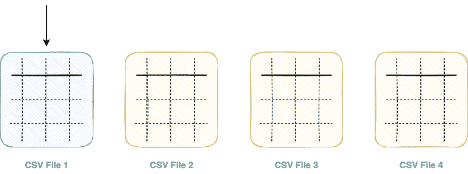
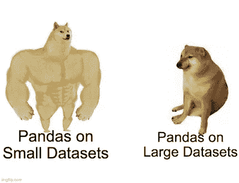

# 我希望熊猫图书馆能做的 5 件事

> 原文：<https://towardsdatascience.com/5-things-i-wish-the-pandas-library-could-do-e9017c127779>

## 讨论熊猫的五个微妙局限


Georg Bommeli 在 [Unsplash](https://unsplash.com?utm_source=medium&utm_medium=referral) 上的照片

多亏了 [Pandas](https://pandas.pydata.org/) 库，用 Python 处理、分析和处理表格数据从来没有像今天这样轻松和直接。

目前，Pandas API 提供了广泛的功能集合来管理表格数据，旨在为几乎每个数据科学项目服务，例如:

*   输入输出操作
*   数据过滤
*   表连接
*   数据可视化
*   重复数据处理，等等，你可以在这里阅读。

虽然 Pandas 确实是几乎所有使用表格数据的数据科学家的首选工具，但在我的项目中使用它让我意识到了它的一些主要警告/限制，我希望在本文中讨论这些。

因此，这篇文章提出了我希望熊猫在现实世界的表格数据集领域能够做的五件事。

本文的亮点如下:

[**#1 我希望熊猫可以并行读取一个 CSV 文件**](#982d)[**# 2 我希望熊猫可以一次读取多个 CSV 文件**](#f012)[**# 3 我希望熊猫数据帧使用更少的内存**](#f88c)**# 4 我希望熊猫可以用于大型数据集**

我们开始吧🚀！

# #1 我希望熊猫可以并行读取 CSV 文件

不幸的是，Pandas 对 CSV 文件的输入/输出操作是序列化的，这意味着 Pandas 没有固有的多线程支持。

首先，读取 CSV 文件上下文中的序列化意味着 Pandas 一次只能读取 CSV 文件中的一行(或一行)数据。下面的动画演示了这一点:


在熊猫中阅读 CSV(GIF by author)注意:CSV 文件是一个文本文件，上图并不是 CSV 的样子。这是为了直观地阐述观点。

和输入操作类似，输出操作也好不到哪里去。Pandas 也以序列化的方式将数据帧存储到 CSV 文件中。

串行输入和输出操作的过程使它变得非常低效和耗时。

## 可能的替代方案

根据我的研究，有两种潜在的解决方案可以用来提高总的输入输出运行时间。

*   更喜欢使用其他文件格式，如**泡菜**、**拼花**和**羽毛**来读取和存储数据帧。

除了速度快之外，这些格式存储数据占用的磁盘内存也更少。请在下面我的博客中阅读有关这些文件格式的更多信息:

[](/why-i-stopped-dumping-dataframes-to-a-csv-and-why-you-should-too-c0954c410f8f) [## 为什么我停止向 CSV 转储数据帧，为什么您也应该这样做

### 是时候告别 pd.to_csv()和 pd.read_csv()了

towardsdatascience.com](/why-i-stopped-dumping-dataframes-to-a-csv-and-why-you-should-too-c0954c410f8f) 

*   使用像 [**DataTable**](https://datatable.readthedocs.io/) 这样的库，它们不像 Pandas，拥有并行化能力。

在下面我的博客中阅读更多关于数据表的内容:

[](/its-time-to-say-goodbye-to-pd-read-csv-and-pd-to-csv-27fbc74e84c5) [## 是时候告别 pd.read_csv()和 pd.to_csv()了

### 讨论熊猫的另一个重要警告

towardsdatascience.com](/its-time-to-say-goodbye-to-pd-read-csv-and-pd-to-csv-27fbc74e84c5) 

# #2 我希望熊猫可以一次读取多个 CSV 文件

假设您有一个包含多个 CSV 文件的文件夹，您需要读取这些文件并将其作为 Pandas 数据帧导入。

在 Pandas 中实现这一点的唯一方法是遍历文件列表，一个接一个地读取它们，如下所示:



使用熊猫读取多个 CSV 文件(GIF 由作者提供)

上面的图示可以通过编程方式演示如下:

由于 Pandas 中缺乏多线程支持，一组可能并行读取的文件应该一个接一个地读取，导致运行时间增加和资源利用不足。

## 可能的替代方案

DataTable 库再次成为 Pandas 的一个很好的替代方案来解决这个限制。

使用 DataTable，您可以高效地读取多个 CSV 文件。下面演示了这一点:

在下面我的博客中阅读更多关于运行时性能的内容:

[](/how-to-read-multiple-csv-files-non-iteratively-and-without-pandas-984fd954999c) [## 如何非迭代地读取多个 CSV 文件(并且没有熊猫)

### 对熊猫的读 CSV 方法说不！

towardsdatascience.com](/how-to-read-multiple-csv-files-non-iteratively-and-without-pandas-984fd954999c) 

# #3 我希望熊猫数据帧使用更少的内存

Pandas 数据帧非常庞大，而且内存使用效率很低。例如，假设我们创建了一个包含两列的数据帧，如下所示:

接下来，让我们使用`dtypes`属性确定 Pandas 分配给上述数据帧`df`的两列的数据类型:

默认情况下，Pandas 总是将最高的内存数据类型分配给列。例如，一旦熊猫将上面的`colA`解释为整数值，就有四个可能的子类别(有符号)可供选择:

*   `int8` : 8 位整数数据类型，跨越来自 2⁷].-2⁷的整数
*   `int16` : 16 位整数数据类型，跨越从[-2 ⁵，2 ⁵].]的整数
*   `int32` : 32 位整数数据类型，跨度为[-2，2 ]的整数。
*   `int64` : 64 位整数数据类型，跨越来自【2⁶-2⁶】的整数。

然而，Pandas 将`int64`指定为整数值列的数据类型，而不考虑列中当前值的范围。我们注意到`colB`有类似的数据类型行为。

## 可能的替代方案

为了优化内存利用率，您可以探索一个方向，我称之为 **min-max-reduce** 分析。

第一步是找到感兴趣的列中的最小值和最大值。

最后一步是删节( **reduce** )列的数据类型。

由于当前范围的值可以被压缩到`int16`数据类型中(因为-2 ⁵ < 10000(最小值)< 30000(最大值)< 2 ⁵)，我们将使用`astype()`方法将数据类型从`int64`转换为`int16`，如下所示:

通过这个简单的单行数据类型转换，`colA`列使用的总内存减少了大约 **40%** 。

通过类似的 **min-max-reduce** 分析，您还可以改变其他整型和浮点型列的数据类型。

在我的博客中阅读更多关于内存优化技术的内容:

[](/seven-killer-memory-optimization-techniques-every-pandas-user-should-know-64707348ab20) [## 每个熊猫用户都应该知道的七个黑仔内存优化技术

### 优化熊猫记忆利用的简单技巧

towardsdatascience.com](/seven-killer-memory-optimization-techniques-every-pandas-user-should-know-64707348ab20) 

# #4 我希望熊猫可以用于大型数据集

如上所述，Pandas 没有固有的多线程支持。因此，无论数据的规模如何，Pandas 将始终坚持单核利用率，从而导致运行时间增加，这与数据的大小成正比。



作者的 Doge meme(使用[imgflip.com](https://imgflip.com/)创建)

例如，考虑一个实验来研究数据帧大小和在数据帧上执行函数的运行时间之间的相关性。

我们从包含一千行和两列的随机数据帧开始。

接下来，我们定义一个函数，它接受数据帧的一行并返回其总和。该功能实现如下:

在每次迭代中，我们确定计算数据帧中每行总和的时间。为了消除随机性，我们将重复每次迭代`runs`次。在每次迭代结束时，我们将把数据帧的大小增加两倍。

该实验在下面实现:

下图描绘了迭代与运行时的关系图。随着每次迭代，数据帧的大小加倍，Pandas 的运行时间也加倍，这表明 Pandas 的运行时间总是与数据帧的大小成比例，并且它从不采用并行化。


数据帧与运行时图(图片由作者提供)

## 可能的替代方案

Pandas 非常适合处理小型数据集。然而，随着数据规模和管道复杂性的增加，作为一名数据科学家，您应该避免利用它，因为上面讨论了其深刻的运行时警告。

如果您的目标是将项目投入生产，PySpark 是理想的方法。其他备选方案包括 Terality、Vaex、DataTable 和 Dask——主要推荐用于大型数据集上 Pandas 的本地计算。

# #5 我希望熊猫支持像 SQL 这样的条件连接(不知何故)

使用 SQL 的人喜欢编写复杂的连接条件来合并表的自由，不是吗？

顾名思义，条件连接超越了简单的基于等式的合并条件。换句话说，您可以在多个表的字段之间建立基于条件而不是相等的连接。

例如，假设您有两个表，`table1`和`table2`:

目标是基于以下条件连接这些表

```
(table1.col1 = table2.col1 + 2) and (table2.col2 >= table2.col2 - 2) and (table2.col2 <= table2.col2 + 2)
```

## SQL 连接

上面的条件连接在 SQL 中非常简单。SQL 查询在下面实现，生成查询后的输出:

## 熊猫加入

Pandas 只能在数据帧上执行基于等式的连接。换句话说，只有当连接列中的值相同时，Pandas `merge()`方法才会连接两个记录——消除了条件连接的范围。

因此，使用 Pandas 的`merge()`方法执行条件连接的几种方法是:

1.  使用联接条件中定义的操作创建联接列，并对新列执行合并。
2.  执行交叉连接并过滤数据帧。在大型数据集的情况下，这可能极具挑战性。

下面展示了方法 1 和方法 2 的组合。

首先，我们创建两个数据帧来合并并定义连接条件。

```
(table1.col1 = table2.col3 + 2) and (table2.col2 >= table2.col4 - 2) and (table2.col2 <= table2.col4 + 2)
```

由于连接条件由不等式组成，让我们暂时把它们放在一边，先对等式执行连接`(table1.col1 = table2.col3 + 2)`。之后，我们将过滤结果，以纳入接下来的两个条件。

首先，我们将在`table2`中创建一个新列。姑且称之为`col3_1`。

接下来，我们将对来自`table1`的`col1`和来自`table2`的`col3_1`执行连接，然后根据连接条件中剩余的条件过滤得到的记录。这在下面实现:

## 可能的替代方案

PandaSQL 是一个流行的 python 包，它混合了 Pandas 和 SQL，允许您在 python 环境中利用 SQL 语法的强大功能。

因此，PandaSQL 使您能够使用 SQL 语法查询 pandas 数据帧。要执行类似 SQL 的连接，可以探索 PandaSQL。

然而，在 Pandas 数据帧中使用 SQL 的便利性是以运行时间为代价的。我在之前的博文中讨论过这个问题:

[](/the-downsides-of-pandasql-that-no-one-talks-about-9b63c664bef4) [## PandaSQL 简介:没人谈论的缺点

### 熊猫+ SQL = PandaSQL =一塌糊涂

towardsdatascience.com](/the-downsides-of-pandasql-that-no-one-talks-about-9b63c664bef4) 

# 结论

总之，在这篇文章中，我讨论了熊猫的五个主要局限性，以及如果你陷入其中任何一种情况时的解决方法。

Pandas 非常适合处理日常的表格数据分析、管理和处理。

但是，假设您正在开发一个生产级别的解决方案，或者有大量的数据要处理。在这种情况下，Pandas 将不会对您有太大的帮助，因为它没有并行化和资源利用不足的限制。

**感谢阅读！**


作者的迷因(使用[imgflip.com](https://imgflip.com/)创建)

[🧑‍💻**成为数据科学专家！获取包含 450 多个熊猫、NumPy 和 SQL 问题的免费数据科学掌握工具包。**](https://subscribepage.io/450q)

✉️ [**注册我的电子邮件列表**](https://medium.com/subscribe/@avi_chawla) 不要错过另一篇关于数据科学指南、技巧和提示、机器学习、SQL、Python 等的文章。Medium 会将我的下一篇文章直接发送到你的收件箱。