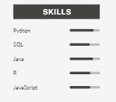

# 简历中阻碍你获得第一份数据科学工作的 5 件事

> 原文：<https://towardsdatascience.com/5-things-in-your-resume-that-are-keeping-you-from-getting-your-first-job-in-data-science-1a4d474ff3e4>

## 解决这些问题会让招聘人员看你简历的时间超过 7.4 秒

里卡多·特里梅洛尼在 [Unsplash](https://unsplash.com?utm_source=medium&utm_medium=referral) 上拍摄的照片

学习所需的技能有时被认为是成为数据科学家过程中容易的一部分。最困难的部分往往是在申请工作的时候。

如今，许多人可以自称为数据科学家，尽管他们提供影响的能力和才能各不相同，这意味着你需要从人群中脱颖而出。

然而，在现代求职过程中，如果你不能亲自与招聘人员交谈，你甚至很难迈出第一步。随着我们中的许多人把简历投到了空白的地方，我们很难知道我们是否给人留下了正确的印象。

幸运的是，有一些简单的方法可以美化你的简历，确保招聘人员比平均的 [7.4 秒](https://www.hrdive.com/news/eye-tracking-study-shows-recruiters-look-at-resumes-for-7-seconds/541582/#:~:text=In%20its%202018%20Eye%2DTracking,an%20average%20of%207.4%20seconds.)看得更久。

以下是简历中阻碍你获得数据科学领域工作的五个不同因素，以及解决它们的五种方法:

# 1.表示技能熟练程度的技能水平条

简历制作的最新趋势之一是技能的图形化表示，使用技能条、百分比或其他图形来展示你的技能掌握水平。

来源:麦迪逊·亨特

虽然这一选项在许多准备发送给时尚、创业型公司的简历模板上都有，但它对你不利，甚至可能在他们见到你之前就让你在求职过程中打折扣。

首先，技能等级对招聘人员来说毫无意义。除非你开发了一个评分系统，否则招聘人员怎么知道“Python 熟练程度 4/5 星”是什么意思？此外，为了帮助招聘人员更好地理解你的评级系统，你需要为每项技能制定标准和客观测试，这样你就可以解释为什么你会给自己打这个分数。

第二，技能条是主观的。简而言之，[人们在任何事情上都不擅长给自己打分](https://dev.to/tim012432/do-not-put-skill-bars-on-your-resume-lh6)，越聪明的人越倾向于给自己擅长的技能打分，越不聪明的人越倾向于给自己不擅长的技能打分。

第三，你给自己技能打分的能力完全不靠谱。如果没有一个可靠的、广为人知的测试量表来确定你的技能熟练程度，比如全球公认的[欧洲通用语言参考框架](https://en.wikipedia.org/wiki/Common_European_Framework_of_Reference_for_Languages)，你自己确定自己技能水平的能力是完全不可靠的。例如，如果你告诉某人你的西班牙语达到了 B2 水平，他们可能会明白你的语言熟练程度。然而，如果你告诉某人你懂 80%的 Python，他们将不知道你的能力是什么——因为，让我们面对现实吧，80%的 Python 知识看起来像什么？

最终，在简历中使用技能等级栏会让你在踏入职场之前失去很多工作机会。招聘人员可能认为你是一个理想的候选人，但他们可能更愿意面试一个对 Python 有 80%熟练程度的人，而你只有 70%。

## 取而代之做什么

不要用技能水平条，而是讨论你在描述以前的工作和项目时使用的技能，来证明你使用这项技能有多长时间了，你用这项技能做了什么，以及使用这项技能产生了什么影响。

# 2.缺乏展示现实世界解决问题的个人项目

科技招聘人员最常见的抱怨之一是，候选人缺乏解决现实问题的技能。

大学里的问题很容易解决，只要它清楚地摆在你面前，有开头、中间和结尾，而且教授愿意回答你关于如何获得预期结果的问题。

然而，现实世界会向你抛出没有具体开始、中间或结束的问题，可能只有一个模糊的业务问题，现在你的工作是使用数据来回答。你申请加入的工作环境并不像你在大学或编码训练营经历的那样干净，这意味着你需要发展你在现实世界中解决问题的技能。

## 取而代之做什么

这里的关键是要记住一句老话，“秀，不要说。”

虽然*很容易告诉*雇主你已经通过你的独立研究项目解决了许多现实世界中的问题，但是如果你*向*他们展示你解决的问题以及你是如何解决的，会更有影响力。

与你的简历相关联的个人作品集会在这方面帮到你。在那个投资组合中，你想开发几个项目，找出你的目标行业中的具体问题。例如，如果你想从事气候科学，在你的文件夹中放满分析空气污染水平的项目，并描述污染水平如何与对比大城市的住院率相关联。

# 3.不适合这份工作的编程技能

第一次找数据科学工作的求职者将在简历中列出他们精通的 20 种编程语言，而不是专注于雇主在招聘广告中专门寻找的语言。

列出 20 种编程语言或技能对于一个只想知道你是否会使用 Python、Excel 和 SQL 的雇主来说是没有用的。此外，这也表明求职者缺乏准备，因为这份简历是为求职过程设计的“一刀切”的解决方案。

记住，多并不总是好的。招聘人员更希望看到他们公司正在寻找的编程语言和技能的具体经验证据，而不是 20 种不同语言的随机经验。

招聘人员倾向于只看简历 7.4 秒，这意味着如果他们不得不从你的技能列表中筛选出适用于他们公司的技能，那么你已经成为一个容易被淘汰的候选人。

## 取而代之做什么

仔细浏览招聘广告，突出他们需要的语言和技能，为每份工作申请准备一份量身定制的简历。然后，通过给出你的语言或技能能力的具体例子，并链接到展示你能力的项目，让招聘人员容易理解(再次强调，“展示，不要说”)。

关注特定公司正在寻找的语言和技能很重要，因为他们的业务流程围绕着这些语言。除非一家公司雇佣你来建立他们的数据分析流程，否则他们寻找的是一个能够使用他们所需的语言和技能无缝融入他们现有团队和流程的候选人。

简而言之，重点应该是让招聘人员容易想象你成功地成为团队中有价值的一员。

# 4.关注算法和代码，而不是结果

正如[肯·吉的文章*数据科学简历错误避免*所言，数据科学家的价值在于他们对公司的影响以及他们的工作产生的结果。](/data-science-resume-mistakes-to-avoid-2867460659ac)

如果你的简历更多地关注你用来解决问题的奇特算法，而不是解决问题的结果，招聘人员可能不会相信你的分析所产生的影响。

## 取而代之做什么

不要把你的整个项目描述都集中在你使用的算法或者你写的代码上，而是在你描述你的分析所产生的影响或者你的项目的结果的地方添加句子。

这种描述应该包括可量化的信息，如百分比、增长指数和货币价值。例如，你可以说你为你所在城镇的一家小企业做的公益项目帮助他们提高了流程效率，使他们的收入立即增加了 30%。或者，你可以说，你对大气污染水平的分析表明，到 2100 年，全球气温可能上升 2 摄氏度。

向招聘人员详细介绍你的项目所产生的影响或结果，会让他们觉得你有能力对他们的公司产生积极的影响。

# 5.没有终身学习的迹象

如前所述，数据科学家的价值取决于他们对公司的影响。这意味着数据科学家必须在整个职业生涯中保持相关性，不断学习新技能，自学所在行业的新趋势，并接触对公司流程更有效的最新技术。

没有任何继续教育的迹象，无论是通过课程、训练营还是个人项目，或者当前时间与你上一次参加的课程之间的巨大差距，都可能向招聘人员表明你对数据科学家至关重要的终身学习不认真。

## 取而代之做什么

时常做一些个人研究项目，向招聘人员展示你一直在寻求提高技能和学习新东西。

每个新项目不必很大，但它应该集成一些新技术、算法或思维过程来解决现实世界的问题。每个项目都应该在你的简历中用一个简短的句子来描述，抓住你技能的进步和你要解决的问题。

将链接添加到您的项目存储库或文件夹是让招聘人员亲自了解您的工作的好方法。

# 关键要点

*   不要用技能水平条来表示技能熟练程度，因为它们对招聘人员来说毫无意义，也因为它们不能可靠地表明你在某项技能上的能力。
*   与你的简历相关联的个人作品集可以让招聘人员直接看到你的工作，并让他们感受到你解决现实问题的能力。
*   把你的简历集中在每个独特工作所需的技能和编程语言上。
*   使用可量化的变量来表示项目的影响和结果。
*   在整个求职过程和职业生涯的剩余时间里保持自我教育，以保持相关性——你为作品集完成的每个新项目都应该融入新的技能，向招聘人员表明你对终身学习的承诺。

订阅将我的故事直接发送到您的收件箱:[故事订阅](https://madison13.medium.com/subscribe)

请成为会员，使用我的推荐链接获得无限制的媒体访问权限(我将收取少量佣金，无需额外费用):[媒体会员](https://madison13.medium.com/membership)