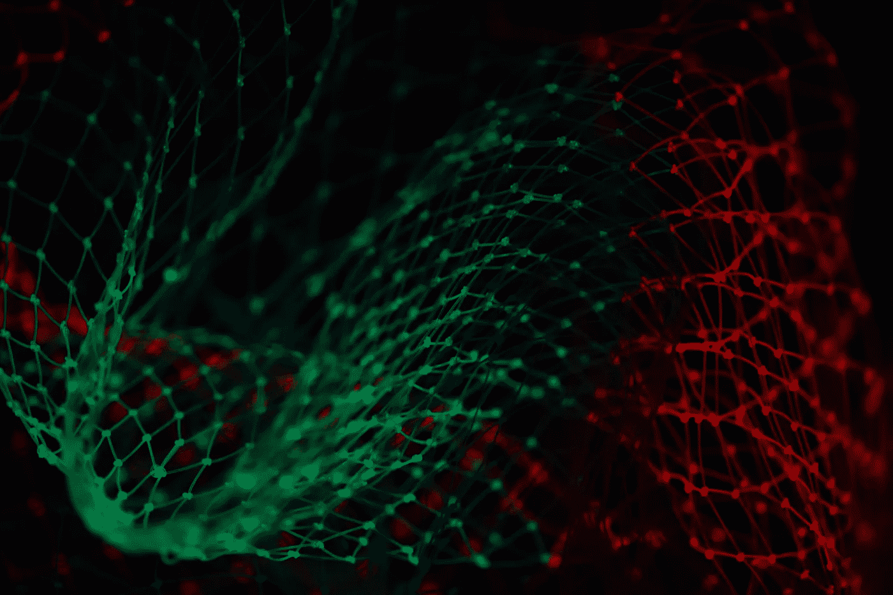
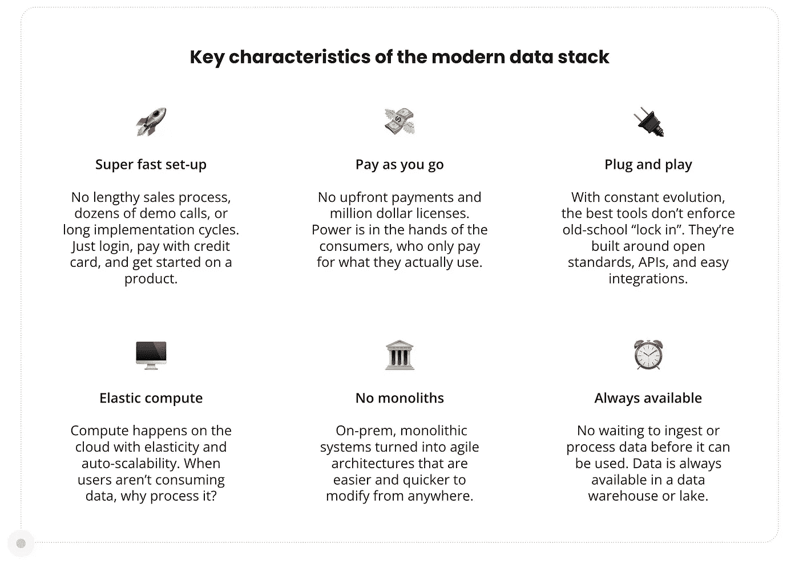
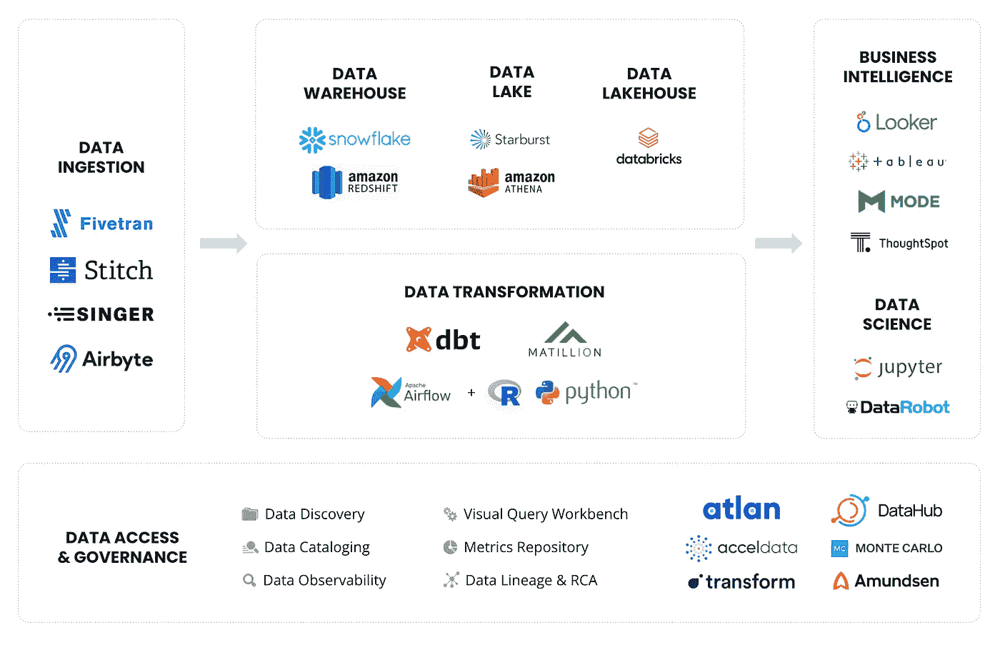
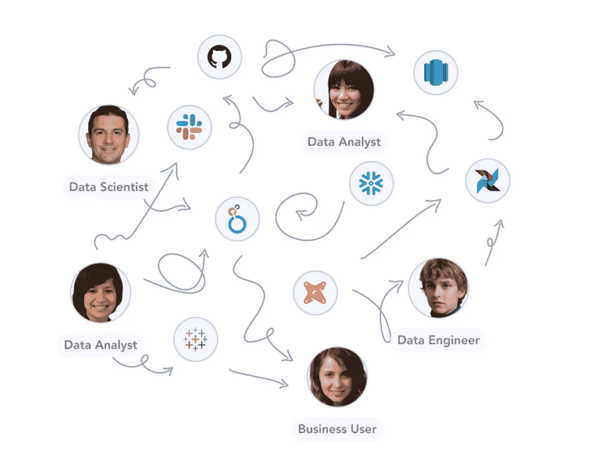
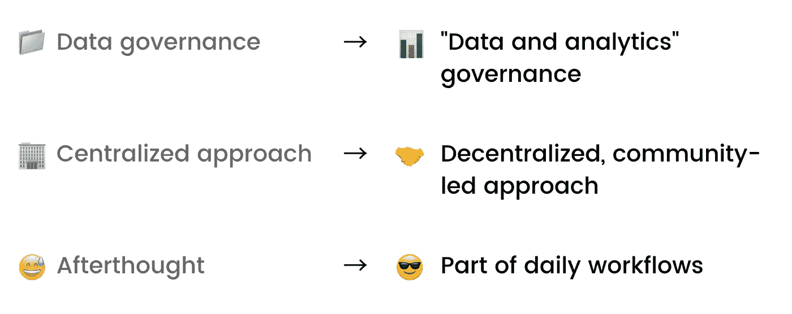
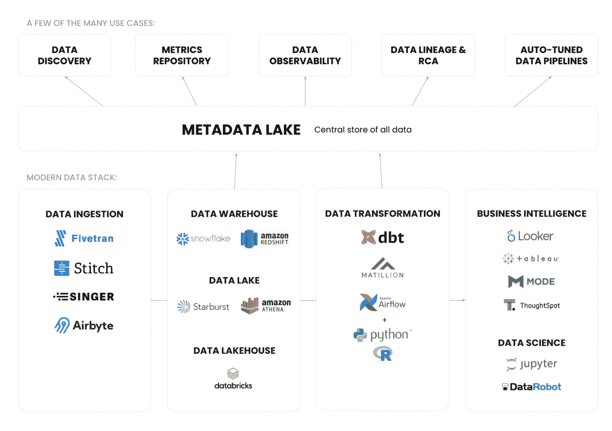
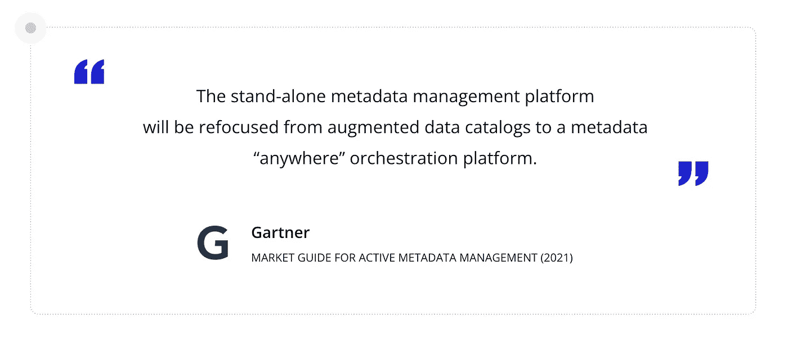

# 推动 2022 年元数据新世界的 5 大趋势

> 原文：<https://towardsdatascience.com/5-trends-driving-the-new-world-of-metadata-in-2022-721f974cdf87>

## 这些趋势汇聚起来，围绕着一种新的、现代的元数据概念掀起了一场风暴。

由 [Unsplash](https://unsplash.com/?utm_source=unsplash&utm_medium=referral&utm_content=creditCopyText) 上的 [Pietro Jeng](https://unsplash.com/@pietrozj?utm_source=unsplash&utm_medium=referral&utm_content=creditCopyText) 拍摄

去年，我们在元数据领域达到了一些重要的里程碑。Gartner 放弃了元数据管理的魔力象限，公司开始要求第三代数据目录，现代元数据公司(像我的！)发起并筹集了一些重要的风投资金。

所有这一切实际上促使我将元数据作为[我今年](/the-future-of-the-modern-data-stack-in-2022-4f4c91bb778f)的六个关键数据想法之一。

但是为什么元数据现在在数据世界里是一个如此热门的话题呢？所有这些炒作的背后是什么？

在本文中，我将分析这个元数据新世界背后的五种趋势。有些是五年前开始的，而有些只有几个月的历史——今天，它们聚集在一起，围绕一种新的、现代的元数据概念掀起了一场风暴。

# TL；大卫:五大趋势

*   **现代数据堆栈成为主流**，拥有一系列前所未有的快速、灵活的云原生工具。问题是——元数据被遗漏了。
*   **数据团队比以往更加多样化**，导致混乱和协作开销。上下文是关键，元数据是解决方案。
*   **数据治理正在被重新构想**从自上而下的集中式规则到自下而上的分散式计划，这需要对元数据平台进行类似的重新构想。
*   随着元数据成为大数据，**元数据湖现在和将来有无限的用例**。
*   被动元数据系统正在被抛弃，取而代之的是**主动元数据平台**。

# 1.现代数据堆栈的创建

大约从 2016 年开始，现代数据堆栈成为主流。这指的是帮助当今企业存储、管理和使用其数据的工具和功能的灵活集合。

这些工具由三个关键理念统一起来:

*   面向各种用户的自助服务
*   “敏捷”数据管理
*   云优先和云原生

当今的现代数据堆栈易于设置、按需付费、即插即用，如今人们再也无法忍受其他任何东西了！像 Fivetran 和 Snowflake 这样的工具可以让用户在不到 30 分钟的时间内建立一个数据仓库。

图片由[图集](https://atlan.com/)

在一个越来越简单、快速、互联的数据工具的生态系统中，旧的元数据概念——被动、孤立的数据清单，由一群数据管家提供动力——不再适用。许多早期的[第二代数据目录](/data-catalog-3-0-modern-metadata-for-the-modern-data-stack-ec621f593dcf)仍然需要大量的工程时间进行设置，更不用说与销售代表进行至少五次通话以获得演示。那么，有人对数据世界急切地寻找处理元数据的更好方法感到惊讶吗？

[***阅读更多关于现代数据栈的信息。***](/the-building-blocks-of-a-modern-data-platform-92e46061165)

现代数据栈的最新版本。(图片由 [Atlan](https://atlan.com/) 提供)。)

# 2.多样化的数据人类

几年前，只有“IT 团队”会接触数据。

然而，今天的数据团队比以往任何时候都更加多样化。他们包括数据工程师、分析师、分析工程师、数据科学家、产品经理、业务分析师、公民数据科学家等等。这些人中的每一个都有自己喜欢的、同样多样化的数据工具——从 SQL、Looker 和 Jupyter 到 Python、Tableau、dbt 和 r。

这种多样性既是一种力量，也是一种奋斗。

新的多样化数据团队。(图片由 [Atlan](https://atlan.com/) 提供)。)

所有这些人都有不同的工具、技能、技术组合、工作风格和处理问题的方式…本质上，他们每个人都有独特的“数据 DNA”。更多样化的视角意味着创造性解决方案和创新思维的更多机会。然而，这通常也意味着协作中的更多混乱。

这种多样性也意味着自助服务不再是可选的。现代数据工具需要对拥有各种技能的广大用户来说是直观的。如果有人想将数据带入他们的工作，他们应该能够轻松地找到他们需要的数据，而不必询问分析师或提出请求。

元数据正成为这些挑战的解决方案。正如 [Benn Stancil](https://benn.substack.com/p/metadata-money-corporation) 所写的，“今天的数据堆栈正在迅速分裂成更小、更专业的部分，我们需要某种东西将它们结合在一起。”他对此的回答是元数据。随着我们不断将越来越多样化的人员和工具引入我们的数据生态系统，元数据正在不断发展，以提供关键的上下文。

[***阅读更多关于人类的资料。***](/its-time-for-the-modern-data-culture-stack-493036315ed2)

# 3.数据治理的新愿景

数据治理被认为是一个官僚的、限制性的过程——一套从上面降下来的规则来减缓你的工作。而现实是，这通常是它实际工作的方式。

公司用复杂的安全流程和限制来包围他们的数据，所有这些都由远处的数据治理团队决定。

然而，随着现代数据堆栈使接收和转换数据变得更加容易，这种数据治理的想法已经成为日常数据工作中的最大障碍之一。

从业者第一次自下而上地感受到了治理的需要，而不是由于监管而自上而下地强制实施。这就是为什么数据治理目前正处于范式转变的中期。

引自 Tristan Handy 的“[现代数据堆栈:过去、现在和未来](https://blog.getdbt.com/future-of-the-modern-data-stack/)”。(图片由 [Atlan](https://atlan.com/) 提供。)

如今，治理正成为数据人类欣然接受而非畏惧的东西。就其核心而言，它现在更少涉及控制，而是更多地涉及帮助数据团队更好地合作。

因此，数据治理正在被重新设想为一套由令人惊叹的数据团队制定并为其服务的协作最佳实践，这些实践是关于授权和创建更好的数据团队，而不是控制他们。

当今的数据治理演变。(图片由 [Atlan](https://atlan.com/) 提供。)

现代的、社区主导的数据治理需要一种全新的元数据管理平台。例如，旧的自上而下、基于管家的数据管理流程不再适用。工具需要适应允许数据用户众包上下文，作为他们在 Slack 或微软团队中日常工作流程的一部分。另一个关键方面涉及使用元数据来自动化数据分类，例如自动分类和限制对具有 PII 数据的资产的访问。

[***了解更多关于现代数据治理的信息。***](/data-governance-has-a-serious-branding-problem-7925b909712b)

# 4.元数据湖的兴起

2005 年，收集的数据比以往任何时候都多，使用数据的方式也比单个项目或团队想象的多。数据有无限的潜力，但是如何为无限的用例建立数据系统呢？这导致了数据湖的诞生。

今天，元数据在同一个地方。元数据本身正在成为大数据，雪花和红移等计算引擎的技术进步(即弹性)使得从元数据中获取智能成为可能，这种方式甚至在几年前都是不可想象的。

随着元数据的增加，我们可以从中获得的智能也在增加，元数据可以支持的用例的数量也在增加。

今天，即使是最受数据驱动的组织也只是触及了元数据的皮毛。然而，元数据正处于从根本上改变我们数据系统运行方式的尖端。元数据湖使这成为可能。

元数据湖是一个统一的存储库，可以存储所有类型的元数据，包括原始的和进一步处理的形式，以一种可以与数据堆栈中的其他工具共享的方式来驱动我们今天和明天已知的用例。

就像数据变得更容易使用数据湖一样，元数据湖让我们最终理解我们将如何能够使用今天泛滥的元数据。

[***阅读更多关于元数据湖的信息。***](/the-rise-of-the-metadata-lake-1e95127594de)

元数据湖的架构。(图片由 [Atlan](https://atlan.com/) 提供。)

# 5.主动元数据的诞生

2021 年 8 月，Gartner 放弃了元数据管理魔力象限，代之以主动元数据管理市场指南。这标志着传统元数据管理方法的终结，并开启了一种新的元数据思维方式。

引自 Gartner 的 [*活动元数据管理市场指南*](https://www.gartner.com/en/documents/4006759/summary-translation-market-guide-for-active-metadata-management) 。(图片由 [Atlan](https://atlan.com/) 提供)。)

传统的数据目录是被动的。它们从根本上来说是静态系统，不驱动任何操作，依靠人工来管理和记录数据。

然而，一个活跃的元数据平台是一个永远在线的、智能驱动的、面向行动的系统。

*   **永不停机**:它不断从日志、查询历史、使用统计等中收集元数据，而不是等待人工输入元数据。
*   **智能驱动**:不断处理元数据，将点与点连接起来，创造智能，比如通过查询日志解析自动创建血统。
*   以行动为导向的:这些系统不是被动的观察者，而是驱动建议，产生警报，并实时运作情报。

主动元数据平台充当双向平台，它们不仅像元数据湖一样将元数据集中到单个存储中，还利用“反向元数据”使元数据在日常工作流中可用。

[***阅读有关活动元数据的更多信息。***](/the-gartner-magic-quadrant-for-metadata-management-was-just-scrapped-d84b2543f989)

我们对活动元数据的愿景。(图片由 [Atlan](https://atlan.com/) 提供)。)

# 展望未来

抱怨元数据的状态很容易。但是当我回顾五年前的情况时，我们已经取得了惊人的进步。

由于这五大趋势的融合，我们正处于元数据管理的转折点——从老式的被动工具向现代的主动元数据转变，为我们的整个数据堆栈提供动力。

元数据不再是静态的文档，它是开启我们真正智能数据管理系统梦想的钥匙。我们还有很长的路要走，但我个人迫不及待地想知道明年元数据会怎么样。

**觉得这个内容有帮助？在我的时事通讯《元数据周刊》上，我每周都写关于活动元数据、数据操作、数据文化和我们的学习建设的文章** [**Atlan**](https://atlan.com/) **。** [**在此订阅。**](https://metadataweekly.substack.com/)