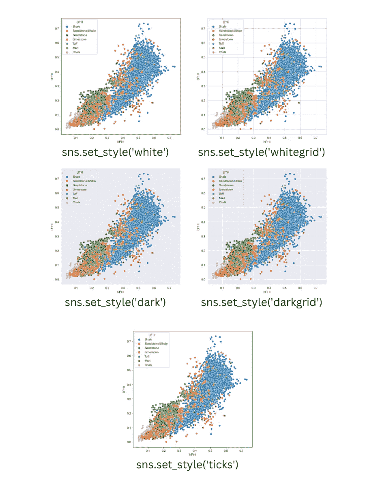
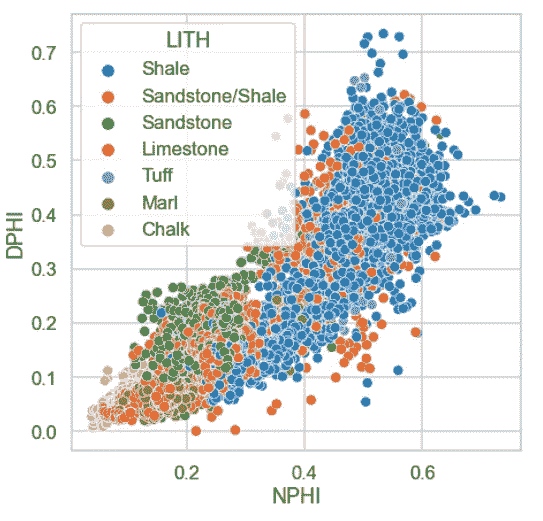
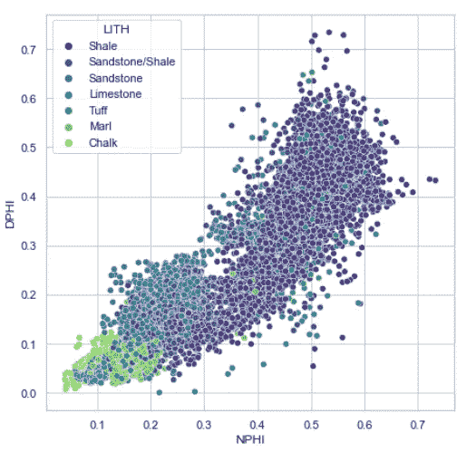
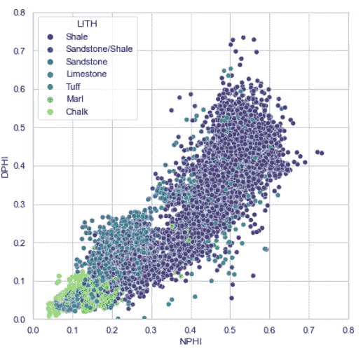

# 转变 Seaborn 数据可视化的 5 种方法

> 原文：<https://towardsdatascience.com/5-ways-to-transform-your-seaborn-data-visualisations-1ed2cb484e38>

## 数据可视化| Python | Seaborn

## 简单而容易的代码来增强你的 seaborn 散点图


卢卡斯摄影:[https://www.pexels.com/photo/white-printer-paper-590011/](https://www.pexels.com/photo/white-printer-paper-590011/)

[Seaborn](https://seaborn.pydata.org/) 是一个流行的 python 数据可视化库，构建在 [matplotlib](https://matplotlib.org/) 之上。尽管 matplotlib 是最流行的数据可视化库之一，但它有许多缺点。这包括需要更多的代码来创建高级图形。这就是 seaborn 的用武之地。它为 [matplotlib](https://matplotlib.org/) 提供了一个高级接口，使得用简短的代码生成图表变得更加容易。

在本文中，您将发现 5 种不同的方法来快速转换您的 [seaborn](https://seaborn.pydata.org/) 数据可视化。你将看到如何从默认的情节到一个根据你的需要定制的，更具视觉吸引力的情节。


增强默认 seaborn 散点图之前和之后。图片由作者提供。

如果您经常使用 matplotlib，那么我建议您查看我以前的文章:

[](/7-simple-ways-to-enhance-your-matplotlib-charts-a232823efed9)  

# 数据源

在下面的例子中，我们将看到如何用 [seaborn](https://seaborn.pydata.org/) 增强散点图。为此，我们将使用一个更大数据集的子集，该数据集曾被用作 Xeek 和 FORCE 2020 *(Bormann 等人，2020)* 举办的机器学习竞赛的一部分。它是在挪威政府的 NOLD 2.0 许可下发布的，详细信息可以在这里找到:[挪威开放政府数据许可(NLOD) 2.0](https://data.norge.no/nlod/en/2.0/) 。

完整的数据集可通过以下链接获得:[https://doi.org/10.5281/zenodo.4351155](https://doi.org/10.5281/zenodo.4351155)。

本文中的所有示例都可以用于任何数据集。

# 导入库和数据

对于本教程，我们将需要导入， [seaborn](https://seaborn.pydata.org/) ， [matplotlib](https://matplotlib.org/) 和 [pandas](https://pandas.pydata.org/) 。

然后使用 [pandas](https://pandas.pydata.org/) 方法`read_csv()`将数据读入数据帧。我们还将计算密度孔隙度(DPHI)栏，我们将使用它来绘制中子孔隙度(NPHI)。

这是可选的，并且只适用于这种类型的数据。

```
import pandas as pd
import seaborn as sns
import matplotlib.pyplot as pltdf = pd.read_csv('data/Xeek_Well_15-9-15.csv')df['DPHI'] = (2.65 - df['RHOB'])/1.65df.describe()
```

当我们运行上面的代码时，我们用新的 DPHI 列得到下面的数据摘要。


Xeek / Force 2020 数据集中 15/9–15 井测井测量的统计总结。图片由作者提供。

# 创建起始地块

一旦我们的数据被加载，我们可以用一行代码创建一个简单的 [Seaborn 散点图](https://seaborn.pydata.org/examples/different_scatter_variables.html)。x 轴将设置为 [NPHI(中子孔隙度)](https://glossary.slb.com/en/terms/n/neutron_porosity)，y 轴设置为 DPHI(密度孔隙度)，我们将颜色点设置为[岩性](https://glossary.slb.com/en/terms/l/lithology)。

```
sns.scatterplot(x='NPHI', y='DPHI', hue='LITH', data=df)
```


seaborn 生成的默认散点图显示岩性变化。图片由作者提供。

用这段代码生成的图看起来已经很合理了，可以直接用于快速可视化。然而，我们可以通过改变几个参数来进一步改进它。

# 设置 Seaborn 图的图形大小

我们首先要改变的是体型。目前，该地块看起来有点拥挤和狭小。

为了改变图形大小，我们将调用`plt.figure()`并传入一个`figsize`参数。

```
plt.figure(figsize=(7,7))
sns.scatterplot(x='NPHI', y='DPHI', hue='LITH', data=df)
```


更改图形大小后的 Seaborn 散点图。图片由作者提供。

生成的图感觉不那么狭窄，图例也位于不与任何数据点重叠的位置。

# 设置 Seaborn 打印样式

Seaborn 附带的功能允许您通过一个简单的调用来改变您的绘图风格。它允许自定义背景颜色，网格线颜色和刻度线。

Seaborn 内置了五个主题:

*   黑暗网格
*   白色网格
*   黑暗
*   白色
*   一会儿

为了使用这些主题，我们调用`sns.set_style()`并传递我们选择的主题。

```
sns.set_style('whitegrid')plt.figure(figsize=(7,7))
sns.scatterplot(x='NPHI', y='DPHI', hue='LITH', data=df)
```


使用 sns.set_style()应用 whitegrid 样式后的 Seaborn 散点图。图片由作者提供。

这里是不同风格的并列:



不同 seaborn 风格的插图。图片由作者提供。

# 设置 Seaborn 环境

默认情况下，标签尺寸在我们的图中显得很小。如果我们计划在一次会议的报告或海报上展示我们的情节，那么这些文字可能很难阅读。我们可以手动更改标题、轴和图例的字体大小，但如果我们很急，需要尽快使用，我们可以通过简单的调用来更改。

我们可以用 Seaborn 通过使用`sns.set_context()`函数并传入以下内容之一来控制这一点:

*   纸张(最小字体大小)
*   笔记本(笔记本中的默认大小)
*   讨论
*   海报(最大字体)

```
sns.set_style('whitegrid')
sns.set_context('talk')plt.figure(figsize=(7,7))
sns.scatterplot(x='NPHI', y='DPHI', hue='LITH', data=df)
```



使用 sns.set_context()应用“talk”上下文样式后的 Seaborn 散点图。图片由作者提供。

我们的图现在更易于展示，但是，我们需要通过将图例移到图的右侧来进一步调整它的样式，这样我们就不会模糊任何点。

# 设置颜色

Seaborn 使用的默认配色方案开箱即用，但是，如果我们想改变这一点，并将所有绘图的默认颜色设置为特定的颜色，该怎么办？

## 使用调色板

一种选择是指定一个自定义调色板，并应用 matplotlib 中许多可用的颜色映射之一。你可以在这里找到可用彩色地图的完整列表[。](https://matplotlib.org/stable/tutorials/colors/colormaps.html)

让我们把我们的彩色地图改成绿色。由于我们有 7 个类别，我们还可以为`n_colors`指定一个值。该色图对比高值和低值，同时保持一致性，并且是色盲友好的。

```
sns.set_style('whitegrid')
sns.set_context('notebook')
sns.set_palette('viridis', n_colors=7)plt.figure(figsize=(7,7))
sns.scatterplot(x='NPHI', y='DPHI', hue='LITH', data=df)
```



使用 sns.set_palette()应用 Viridis 颜色图后的 Seaborn 散点图。图片由作者提供。

## 定义自定义颜色

另一个选择是指定我们自己的配色方案。例如，也许我们有行业定义的类别颜色，我们希望保持这种配色方案。我们可以通过向`sns.palette()`传递一个颜色名称列表来实现。

可用颜色的完整列表可在[这里](https://matplotlib.org/3.1.0/gallery/color/named_colors.html)找到。或者，如果我们找不到我们喜欢的颜色，我们可以提供十六进制的颜色。如果你想制作自己的调色板，我强烈推荐去看看 coolors.co。

```
sns.set_style('whitegrid')
sns.set_context('notebook')
sns.set_palette(['grey', 'salmon', 'blueviolet', 'blue', 'pink', 'teal', 'skyblue'])plt.figure(figsize=(7,7))
sns.scatterplot(x='NPHI', y='DPHI', hue='LITH', data=df)
```


使用 sns.set_palette()应用自定义颜色列表后的 Seaborn 散点图。图片由作者提供。

# 在 Seaborn 设置 X 和 Y 限制

你可能注意到了，我们的原点(0，0)是浮动的。这可以通过调用`plt.xlim()`和`plt.ylim()`并传入我们希望图形覆盖的最小和最大值来轻松解决。

```
sns.set_style('whitegrid')
sns.set_palette('viridis', n_colors=7)sns.set_context('notebook')plt.figure(figsize=(7,7))
sns.scatterplot(x='NPHI', y='DPHI', hue='LITH', data=df)
plt.ylim(0,0.8)
plt.xlim(0,0.8)
```



应用 x 轴和 y 轴限制后的 Seaborn 散点图。图片由作者提供。

现在我们的图形从原点开始看起来好多了。显然，如果我们的数据集中出现了负值，我们可能会在不希望出现负值的情况下对其进行调查。

# 摘要

在这个简短的教程中，我们看到了如何通过几个简单的调用来增强 Seaborn 生成的基本散点图。这不仅使一个更具视觉吸引力的情节，而且让我们能够控制它的可读性，为我们的目标观众。


增强默认 seaborn 散点图之前和之后。图片由作者提供。

*感谢阅读。在你走之前，你一定要订阅我的内容，把我的文章放到你的收件箱里。* [***你可以在这里做！***](https://andymcdonaldgeo.medium.com/subscribe)**或者，您也可以* [***注册我的简讯***](https://fabulous-founder-2965.ck.page/2ca286e572) *免费将更多内容直接发送到您的收件箱。**

*其次，通过注册会员，你可以获得完整的媒介体验，并支持我和其他成千上万的作家。每月只需花费你 5 美元，你就可以接触到所有精彩的媒体文章，也有机会通过写作赚钱。如果你用 [***我的链接***](https://andymcdonaldgeo.medium.com/membership)**报名，你直接用你的一部分费用支持我，不会多花你多少钱。如果你这样做了，非常感谢你的支持！***

# **参考**

**博尔曼，彼得，奥桑德，彼得，迪里布，法哈德，曼拉尔，投降，&迪辛顿，彼得。(2020).机器学习竞赛 FORCE 2020 井测井和岩相数据集[数据集]。芝诺多。[http://doi.org/10.5281/zenodo.4351156](http://doi.org/10.5281/zenodo.4351156)**