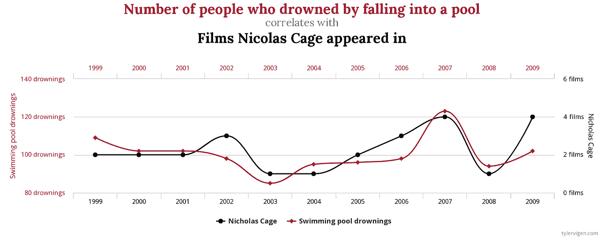

# 需要警惕的 6 个数据谬误

> 原文：<https://towardsdatascience.com/6-data-fallacies-to-watch-out-for-74866fd20d2>

## 数据素养

## 了解这些常见的逻辑陷阱将有助于您避免在分析中犯错误

在最近的一篇文章中，我从读写能力的一般定义开始定义了数据读写能力，并将其应用于数据世界:

 [## 什么是数据素养？

### …为什么它很重要？

towardsdatascience.com](/what-is-data-literacy-9b5c3032216f) 

这篇文章遵循类似的思路——它的灵感来自我在高中学到的[逻辑谬误](https://blog.hubspot.com/marketing/common-logical-fallacies)。如果你在论证推理中会犯逻辑错误，那么你在数据分析和统计推理中也会犯逻辑错误。

Geckoboard 的这篇博文是我研究的一个有用的起点:

 [## 统计谬误和如何避免它们

### 统计谬误是数据对你玩的常见把戏，它会导致数据解释和分析中的错误

www.geckoboard.com](https://www.geckoboard.com/best-practice/statistical-fallacies/) 

从那以后，我陷入了我经历最多的几个谬误。我为这篇文章挑选的六个是容易犯的常见错误。因此，请继续阅读，了解更多关于处理数据时可能会陷入的逻辑陷阱。

为了给每个谬误的解释增添一些色彩，我加入了我自己的经历，并从网上各种来源找到了一些有趣的例子。

# 收集数据时出现的错误

在进行分析之前，您需要数据！如果你必须自己收集数据，这里有一些要避免的谬误。

## 观察者效应(又名霍桑效应)

当你被人注视时，你的表现会有所不同吗？我知道我有。如果研究人员不小心，这种人类倾向会影响他们的数据。当观察者的存在或被观察的知识影响到收集的数据时，就会发生观察者效应。

作为一名工业工程实习生，我经常思考这个问题，因为我被要求收集生产线上的时间研究数据。我非常清楚，如果员工知道我在给他们计时，他们的表现可能会与平时不同(即使我明确表示我的测量并不是为了以任何方式评估他们的表现)。

[国立癌症研究所](https://unsplash.com/@nci?utm_source=medium&utm_medium=referral)在 [Unsplash](https://unsplash.com?utm_source=medium&utm_medium=referral) 上拍摄的照片

这是制造环境中的另一个例子:

> “当时，西部电气公司是美国电话电报公司唯一的电话设备供应商，霍桑工厂是一家技术先进的工厂，员工约 35，000 人。这些实验旨在研究照明水平对输出的影响。这一假设得到了发展，研究人员对不同的工人群体进行了研究，以了解不同的照明水平、清洁程度或工作站的不同位置是否会影响产量。
> 
> 主要的发现是，无论工人面临什么样的变化，产量都会提高。但是，生产在研究结束时恢复正常。这表明被监视的员工工作更加努力。"[ [1](https://www.statisticshowto.com/experimental-design/hawthorne-effect/)

## 抽样偏误

抽样偏倚是指当您收集数据的样本总体不能代表您想要得出结论的总体时。获得有代表性的样本并不总是容易的——这会花费额外的时间和金钱。但是如果这些数据被用来做决定，而这些决定会影响你的样本人群之外的人的生活，那么你必须避免这个错误。

知道了这种逻辑谬误，让我回想起大学早期的日子，畏缩不前。有时我们必须收集数据并得出结论，我会调查我的朋友。如果我试图对整个美国人口甚至整个大学人口做出结论，我的样本是**而不是**代表整体。(好在这只是为了大学学分，而不是新产品或政策或其他什么。)

下面是一个测量技术可能存在不足的例子:

> 例如，一个“街上的人”采访选择了走过某个特定地点的人，这个采访将会过多地代表健康的人，他们比慢性病患者更有可能不在家。这可能是一种有偏抽样的极端形式，因为总体中的某些成员被完全排除在样本之外(即他们被选中的概率为零)。”[ [2](https://en.wikipedia.org/wiki/Sampling_bias#:~:text=For%20example%2C%20a%20survey%20of,to%20others%20in%20the%20population.)

克里斯·巴尔巴利斯在 [Unsplash](https://unsplash.com?utm_source=medium&utm_medium=referral) 上的照片

## 生存偏差

有些人是幸运的——他们在逆境中生存下来。自然灾害、经济衰退、高风险的商业冒险等。当他们度过难关后，他们可能会回过头来想，成功比他们成功后更常见。或者，从外面看的人可能只听到成功的故事，而不是无数的失败或悲剧。

这就是生存偏差:当成功的群体被误认为是整个群体。由于幸存/成功的群体更加可见，人们开始认为它真的是整个群体(人口)。

这里有一个例子可以说明这种偏见如何影响我们在学校遇到的数据:

> ”商学院的学生可以回忆起独角兽初创企业在课堂上是如何受到欢迎的，这是学生应该努力追求的一个例子——成功的典型象征。尽管《福布斯》报道称 90%的初创企业都失败了，但所有的学位都致力于创业，许多学生声称他们有一天会创办一家初创企业并获得成功。[ [3](https://thedecisionlab.com/biases/survivorship-bias)

[拉拉·阿兹利](https://unsplash.com/@lazizli?utm_source=medium&utm_medium=referral)在 [Unsplash](https://unsplash.com?utm_source=medium&utm_medium=referral) 上的照片

# 解释结果时出现的错误

希望您没有任何错误地完成了数据收集。当你解释你的分析结果时，你仍然需要小心！

## 采摘樱桃

你可能听说过摘樱桃数据这句话。它指的是只选择支持你的论点的数据点或结果，并方便地省去为反论点提供证据的数据。

当我想到这个术语时，我会想到政治家使用数据。你可以只选择一部分研究结果放在演讲中，从而给研究结果增加许多积极或消极的因素。这符合他们的最大利益，不幸的是，这种情况相对普遍(在政治光谱的各个方面)。

你还会在媒体上看到摘樱桃:

> “例如，考虑这样一种情况，一项基于某一领域数千名科学家的投入的新研究发现，99%的人同意对某一现象的共识立场，只有 1%的人不同意。在报道这项研究时，一名参与摘樱桃的记者可能会说:
> 
> 最近的一项研究发现，有很多科学家不同意对这一现象的一致看法
> 
> 这种说法代表了一个摘樱桃的例子，因为它只提到了一个事实，即研究发现一些科学家不同意关于所讨论现象的共识立场，而忽略了一个事实，即所讨论的研究也发现绝大多数科学家支持这一立场。"[ [4](https://effectiviology.com/cherry-picking/)

## 赌徒谬误

“哇，他现在已经连续掷出三个 4 了——下一次不可能是 4 了！”

由[阿洛伊斯·科门达](https://unsplash.com/@aloisk?utm_source=medium&utm_medium=referral)在 [Unsplash](https://unsplash.com?utm_source=medium&utm_medium=referral) 上拍摄

你听过有人在游戏里说这样的话吗？一开始很直观，但是当你从逻辑上来看，你必须认识到掷骰子是一个独立的事件(从统计学上来说)。每次掷骰对下一次掷骰的概率没有影响。

这个例子把我们带到了赌徒谬误:“相信未来发生的随机事件的概率会受到该类事件的先前实例的影响。”[ [5](https://thedecisionlab.com/biases/gamblers-fallacy)

除了实际的赌博，这种谬误还可以在其他严重依赖历史数据的应用中看到，比如金融分析:

> “赌徒谬误已经被证明会影响金融分析。投资者倾向于持有已经贬值的股票，卖出已经升值的股票。例如，他们可能会将股票价格的持续上涨视为该股即将崩盘的迹象，因此决定卖出。赌徒谬误可能在这里起作用，因为投资者是基于一个相当随机的事件(股票价格)的概率做出决策的，而这个概率是基于类似的过去事件的历史(其先前价格点的趋势)。这两者没有必然联系。它过去的价格轨迹本身并不能决定它未来的轨迹。”

决定股票价格的因素很多，但是将数据简化为历史价格，并根据历史价格做出买卖决定，这似乎属于赌徒谬误的范畴。

## 虚假因果关系

仅仅因为两个变量相关并不意味着一个导致了另一个。相关性不等于因果关系！当假设一个变量的趋势导致了另一个变量的趋势，而没有考虑其他可能的因素和原因时，就会出现错误的因果数据谬误。

关于一些奇怪的例子，请看这个网站的图表。希望你们中没有人会说这些变量中的一个导致了另一个——尼克·凯奇不应该这样:

图由[泰勒·维根](http://www.tylervigen.com/spurious-correlations?_ga=2.43335970.682912889.1661539474-1090090684.1661539474) ( [授权分享](https://creativecommons.org/licenses/by/4.0/))

# 结论

如果你曾经陷入这些数据谬误之一，你并不孤单！这就是为什么让人们查看你的数据分析是有建设性的，无论是为了工作还是学校，指出你在方法或推理中可能存在的盲点。

让我们一起努力提高我们的数据素养技能，并对数据谬误保持警惕！