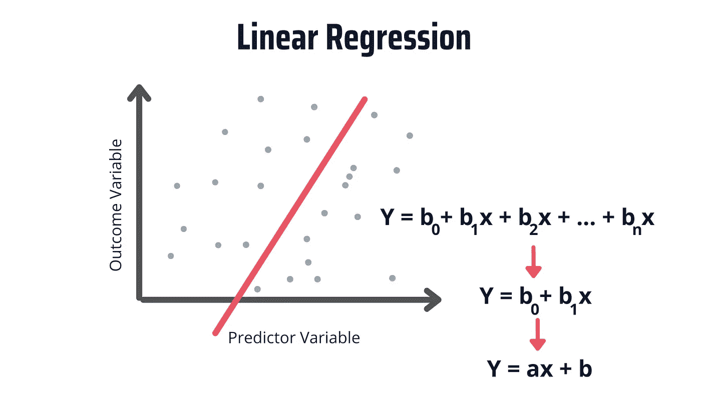
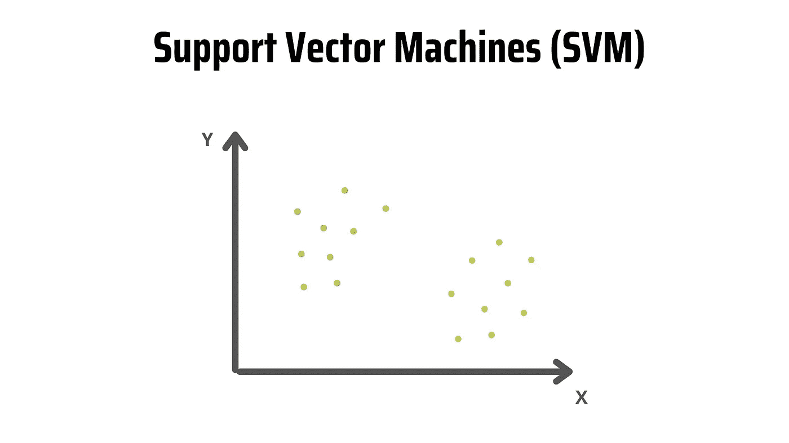
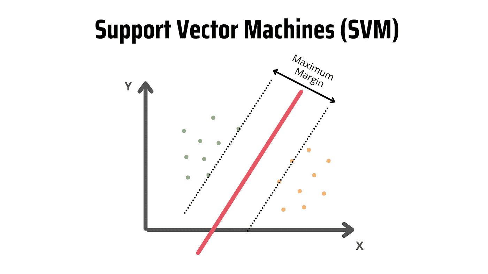
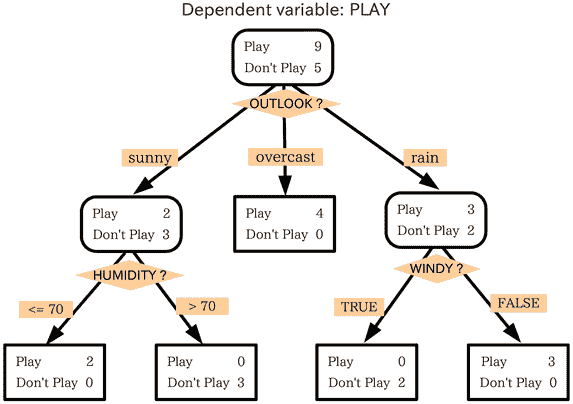
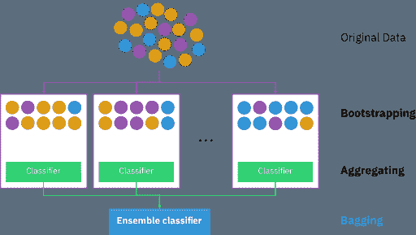
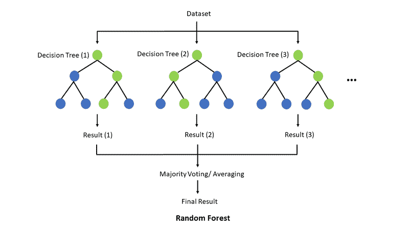
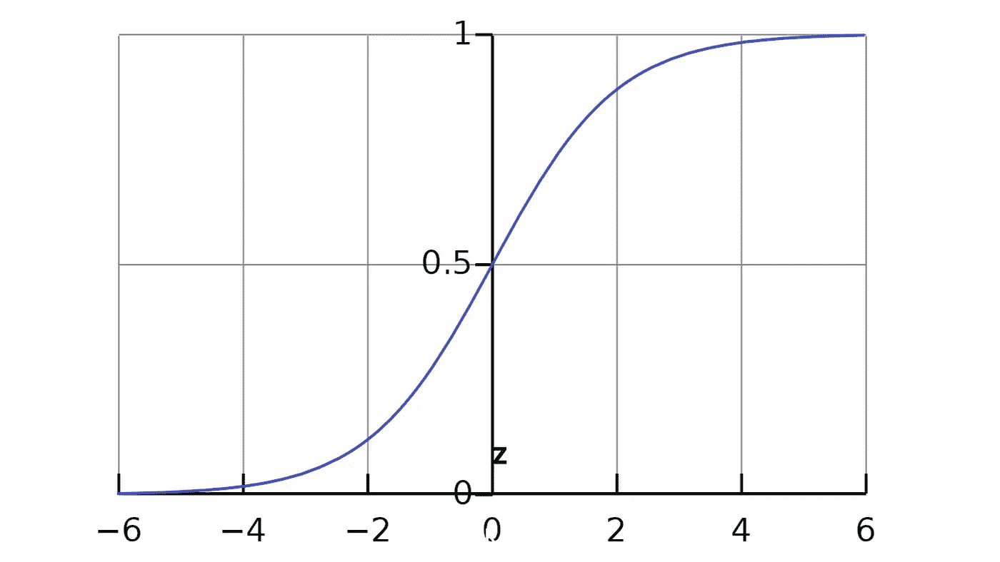

# 任何学习数据科学的人都应该知道的 6 种机器学习算法

> 原文：<https://towardsdatascience.com/6-machine-learning-algorithms-anyone-learning-data-science-should-know-cb6c388a6fb3>

## 用简单的英语解释机器学习算法


图片来自 Shutterstock，授权给 Frank Andrade

机器学习是任何学习数据科学的人都应该知道的领域之一。如果你是数据科学的新手，你可能听说过“算法”或“模型”这些词，但不知道它们与机器学习有什么关系。

机器学习算法分为有监督的和无监督的。

监督学习算法对标记的输入和输出数据(也称为目标)之间的关系进行建模。然后，该模型用于使用新标记的输入数据来预测新观察的标记。如果目标变量是离散的，我们处理的是分类问题，而如果目标变量是连续的，我们处理的是回归问题。

相比之下，无监督学习不依赖于标记的输入/输出数据，而是处理未标记的数据。


作者在 Canva 上制作的图像

这里有 6 个监督学习算法，任何学习数据科学的人都应该知道。

# 1.线性回归

线性回归是机器学习中使用的最简单的算法。该算法用于模拟两个或多个变量之间的关系。有两种类型的线性回归—简单线性回归和多元线性回归。

在简单线性回归中，有一个自变量和一个因变量，而在多元线性回归中，有多个自变量和一个因变量。

多元线性回归方程如下:


其中，`y`为因变量(目标值)，`x1, x2, … xn`为自变量(预测值)，`b0`为截距，`b1, b2, ... bn`为系数，`n`为观察次数。

在下图中，您将看到线性回归方程的简化版本。



作者图片

正如你在上面的图片中看到的，有一个线性关系，所以如果一个变量增加或减少，另一个变量也会增加或减少。

我们可以用线性回归来预测分数、工资、房价等。也就是说，预测精度不如其他算法。

# 2.SVM

支持向量机(SVM)是一种受监督的学习算法，主要用于分类问题。我们通常向 SVM 模型提供带标签的训练数据来对新文本进行分类。

当我们的样本数量有限并且速度是首要考虑因素时，SVM 是一个不错的选择。这就是当我们在文本分类中处理具有几千个标记样本的数据集时使用它的原因。

为了更好地理解 SVM 是如何工作的，让我们看一个例子。

在下图中，我们有两个标签(绿色和黄色)和两个特征(x 和 y)。假设我们想要构建一个分类器来发现我们的文本数据是绿色还是黄色。如果是这种情况，我们将在一个 n 维空间中绘制每个观察值(也称为数据点)，其中“n”是使用的特征的数量。

我们只有两个特征，所以观察结果绘制在二维空间中，如下图所示。



作者图片

SVM 获取数据点，并制作一个超平面来最好地区分这些类别。因为观察值是在二维空间中绘制的，所以超平面是一条线。



作者图片

这条红线也被称为决策边界。决策边界决定了数据点是属于一个类还是属于另一个类。在我们的例子中，如果数据点落在左侧，它将被分类为绿色，而如果它落在右侧，它将被分类为黄色。

# 3.决策图表

如果你对机器学习一无所知，你可能仍然知道决策树。

决策树是一种用于规划、统计和机器学习的模型，它使用决策/结果的树状结构来评估特定问题中涉及的可能事件。

这是一个决策树，评估人们想踢足球的场景。



来源:[维基共享资源](https://commons.wikimedia.org/wiki/File:Decision_tree_model.png)

每个正方形称为一个节点。决策树的最后节点被称为树叶。为了进行预测，我们从树根(第一个节点)开始。将评估决策树中的每个节点。然后我们沿着与评价一致的分支，跳到下一个节点。

决策树算法可用于解决回归和分类问题。我们使用决策树来建立一个模型，该模型可以通过学习从训练数据中推断出的决策树规则来预测目标变量的类或值。

# 4.随机森林

随机森林是许多决策树的集合。它结合了决策树的简单性和灵活性，从而提高了准确性。

要创建随机森林，首先，我们需要创建一个“引导”数据集。Bootstrapping 是从原始数据中随机选择样本(我们甚至可以多次选择同一个样本)。然后，我们使用自举数据集来创建决策树。



[维基共享资源](https://commons.wikimedia.org/wiki/File:Ensemble_Bagging.svg)

这种方法被称为“装袋”如果我们多次重复前面的步骤，我们会得到很多树。这种树的多样性使得随机森林比单一的决策树更有效。



[维基共享资源](https://commons.wikimedia.org/wiki/File:Random_forest_explain.png)

如果随机森林用于分类任务，模型将选择每个决策树的预测模式。对于回归任务，模型从决策树中选择结果的平均值。

# 5.朴素贝叶斯

朴素贝叶斯是一种有监督的学习算法，使用条件概率来预测一个类。

朴素贝叶斯算法基于贝叶斯定理:


```
p(A|B): Probability of event A given event B has already occurred
p(B|A): Probability of event B given event A has already occurred
p(A): Probability of event A
p(B): Probability of event B
```

朴素贝叶斯假设每个特征都是相互独立的，但事实并非总是如此，所以在选择该算法之前，我们应该检查我们的数据。

特征相互独立的假设使得朴素贝叶斯比更复杂的算法更快**；但是，这也使得该算法不太准确。**

**我们可以使用朴素贝叶斯来预测天气预报、欺诈检测等等。**

# **6.逻辑回归**

**逻辑回归是一种监督的学习算法，常用于二元分类问题。这意味着我们可以使用逻辑回归来预测客户是否会流失，并发现邮件是否是垃圾邮件。**

**逻辑回归基于逻辑函数(也称为 sigmoid 函数)，它接受一个值，并分配一个介于 0 和 1 之间的概率。**

**这是逻辑回归的图表:**

****

**为了更好地理解逻辑回归是如何工作的，考虑一个场景，我们需要对一封电子邮件是否是垃圾邮件进行分类。**

**在图中，如果 Z 趋于无穷大，Y(我们的目标值)将变为 1，这意味着该电子邮件是垃圾邮件。但是，如果 Z 趋于负无穷大，Y 将变为 0，这意味着该邮件不是垃圾邮件。**

**输出值是一个概率，所以如果我们得到的值是 0.64，这意味着有 64%的机会，一封电子邮件将是垃圾邮件。**

**用 Python 学习数据科学？ [**通过加入我的 10k+人电子邮件列表，获取我的免费 Python for Data Science 备忘单。**](https://frankandrade.ck.page/26b76e9130)**

**如果你喜欢阅读这样的故事，并想支持我成为一名作家，可以考虑报名成为一名媒体成员。每月 5 美元，让您可以无限制地访问数以千计的 Python 指南和数据科学文章。如果你使用[我的链接](https://frank-andrade.medium.com/membership)注册，我会赚一小笔佣金，不需要你额外付费。**

**[](https://frank-andrade.medium.com/membership) [## 通过我的推荐链接加入媒体——弗兰克·安德拉德

### 作为一个媒体会员，你的会员费的一部分会给你阅读的作家，你可以完全接触到每一个故事…

frank-andrade.medium.com](https://frank-andrade.medium.com/membership)**