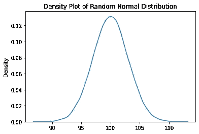

# 数据科学家的 6 个统计概念

> 原文：<https://towardsdatascience.com/6-statistical-concepts-for-data-scientists-337016d07698>

## 了解一些统计概念，这将有助于您成为数据科学家或分析师

*【免责声明:此帖子包含一些我的 Udemy 课程的附属链接】*

统计是数据科学家工作描述的主要组成部分之一。在对数据或模型做出结论时，了解统计学尤其重要，可以避免我们在构建模型或分析时可能陷入的常见陷阱。

在一个计算能力和人工智能创新每天都在提升的世界里，可能会有抛弃统计数据的诱惑。当人们可以用强大到甚至可以说话或看得见的模型构建一个简单的`.fit`时，为什么还要学习 p 值、数据分布或相关性与因果关系？

有三个论点为丢弃统计数据提供了相反的观点:

*   使用最先进的人工智能无法解决大多数问题。
*   大多数组织没有准备好每天对模型进行再培训。
*   统计学是一门研究归纳能力并对你没有的数据做出估计和假设的科学。

在本帖中，我们将讨论 6 个统计概念，数据科学家可以研究这些概念来提高他们的统计知识，并更深入地了解统计世界的美丽。

# 数据分布

大多数变量遵循特定的数据分布。你可能见过随机变量，绘制时如下所示:

生成的随机“正态分布”—由作者生成的图像

这就是著名的代表正态分布的钟形曲线。但是还有很多其他的，比如对数正态分布:

生成随机的“对数正态分布”—图片由作者生成

分布由定义其形状的参数来表征。此外，变量的类型(连续或离散)是定义预期行为和变量取值的另一个重要特征。

您可以在下面的资源中查看有关数据分布的更多信息:

*   [数据科学家的 5 种数据分布](/5-data-distributions-for-data-scientists-97d92d028190)
*   [数据分布概述](https://www.kdnuggets.com/2020/06/overview-data-distributions.html)

# CLT(中心极限定理)

中心极限定理(CLT)是一个非常强大的规则，它将帮助你理解基于随机抽取的样本的总体均值。基本上，如果您有一个变量 *x* 并且您想要发现变量(μ)的真实平均值，您可以记录较小样本的平均值(建议至少为 *n* =30)，这些样本平均值将具有近似正态分布，其平均值与总体的μ相似。

最精彩的部分？不管潜在的人口分布是什么，这个规律都成立。例如，如果分布是*对数正态*并且你从该变量中随机抽取样本，样本均值也将趋向真实总体μ！

为了使 CLT 成立，从总体中抽取样本时必须考虑一些假设:

*   样本必须从总体中随机抽取。如果绘制有偏差的样本(例如，仅基于变量的筛选部分)，则 CLT 不适用于整个总体。
*   n ≥ 30。如果确定底层数据分布正常，甚至可以少用一些数据。
*   样本是独立的。

关于 CLT 的更多详情:

*   [维基百科的 CLT 页面(有技术和数学信息)](https://en.wikipedia.org/wiki/Central_limit_theorem)；
*   [统计学由吉姆·CLT 解释；](https://statisticsbyjim.com/basics/central-limit-theorem/)

# 相关性与因果性

如果你在数据行业工作，你可能已经听过无数次了。理解这种说法是数据科学家的基础。在这个时代，发现虚假的相关性只需要几行代码，理解说某件事*导致*另一件事的影响更加重要。

当然，对于一些项目来说，这不是问题。但是大多数时候，当你在一个数据项目中，需要知道*为什么*现象是联系在一起的，而不仅仅是*它们是如何联系在一起的。*

说到数据科学项目，你真的需要了解你的用户在寻找什么。变量对结果的影响会以某种方式使用吗？例如，如果你正在建立一个客户流失模型，你发现打电话给客户的公司和客户流失之间存在正相关关系，这是否意味着该公司应该停止打电话给客户，他们将不再流失？不要！

通过进一步挖掘数据，您会发现还有第三个变量可以解释这种行为——该公司之所以给客户打电话，是因为他们的服务首先出现了一些问题，这也是他们不断抱怨的原因！

为了确保因果关系，必须进行某种类型的受控 A/B 测试或使用其他统计测试。观察研究是不够的，因为它们不能保证可交换性或不纯粹性。

在这里阅读更多关于相关性和因果性的内容:

*   [可汗学院的文章](https://www.khanacademy.org/test-prep/praxis-math/praxis-math-lessons/gtp--praxis-math--lessons--statistics-and-probability/a/gtp--praxis-math--article--correlation-and-causation--lesson)
*   [决策实验室的文章](https://thedecisionlab.com/reference-guide/philosophy/correlation-vs-causation)

# 集中趋势和分散

两个变量可能有完全相同的平均值，但它们的取值范围有很大的不同。理解这一点是理解采样和比较两个样本之间差异的关键。

集中趋势和分散是数据分布的两个极其重要的特征。集中趋势可以用不同的度量来测量，例如平均值、中间值或众数，而分散性可以用标准偏差或方差来测量。通过了解这两个参数和分布类型，您将能够部分地可视化分布的形状以及随机变量如何围绕其期望值流动。

发现这两个论点对于理解人们对随机变量未来行为的预期非常重要，特别是在比较样本或理解数据相似程度时。例如，在数据科学的背景下，理解集中趋势和分散将有助于您处理期望值并创建一些健壮的异常值检测技术。

您可以通过以下链接了解更多信息:

*   [中央倾向的例子；](https://www.statisticshowto.com/central-tendency-2/)
*   [分散的例子；](https://www.statisticshowto.com/variability/)

# p 值

p 值是假设零假设为真，我们在统计测试中观察到某个值的概率。

例如，在回归模型中，每个系数都有一个附加的 p 值。为什么？因为那个 *p 值*正被用来测试系数效应为 0 的假设。如果你的系数有一个低的 p 值(例如，0.01)，那么你就是在说这个系数为 0(也就是对结果没有影响)的概率大约是 1%，这是一个非常低的概率。

p 值对于理解统计假设检验非常重要，可以用一句话来概括:“如果我的零假设为真，我有多大可能看到这个 *p 值*？”。在统计测试中，你通常以拒绝你的零假设的低 p 值为目标。

重要的一点是:由于 p 值与检验零假设相关，因此 *p 值*并不意味着替代假设有效。

您可以通过以下链接了解有关 p 值的更多信息:

*   [了解 p 值；](https://www.scribbr.com/statistics/p-value/)

希望您喜欢这份总结，它为您在统计之旅中的下一步研究提供了很好的指导！其中一些概念对于您作为数据科学家或分析人员将面临的多项任务非常重要，例如:

*   当构建离群点检测时
*   回归模型
*   假设检验
*   基于数据分布构建要素
*   执行 A/B 测试

您认为属于本指南的其他统计概念有哪些？把它们写在下面的评论里吧！

*如果你想参加我的 R 课程，请随时加入这里(* [*绝对初学者 R 编程*](https://www.udemy.com/course/r-for-absolute-beginners/?couponCode=MEDIUMREADERSSEP) *)或这里(* [*数据科学训练营)*](https://www.udemy.com/course/r-for-data-science-first-step-data-scientist/?couponCode=MEDIUMREADERSSEP) *)。我的课程大体上适合初学者/中级开发人员，我希望有你在身边！*

[数据科学训练营课程](https://www.udemy.com/course/r-for-data-science-first-step-data-scientist/?couponCode=MEDIUMREADERSSEP) —图片作者

<https://medium.com/membership/@ivopbernardo> 