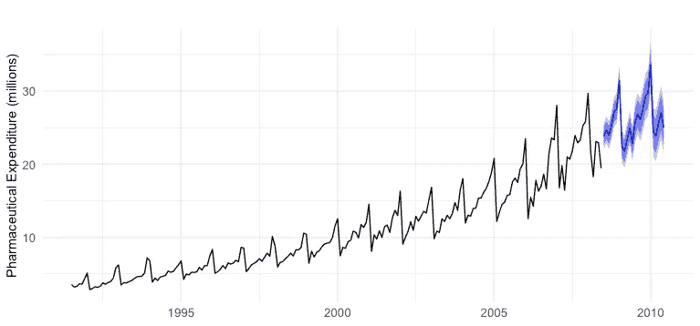

# 你应该知道的 6 个时间序列预测任务

> 原文：<https://towardsdatascience.com/6-time-series-predictive-tasks-you-should-know-about-b899fb83b6bf>

## 不同的问题是如何在时间序列中出现的以及与之相关的挑战

[安德鲁·尼尔](https://unsplash.com/@andrewtneel?utm_source=medium&utm_medium=referral)在 [Unsplash](https://unsplash.com?utm_source=medium&utm_medium=referral) 上拍照

在这篇文章中，我将描述 6 个可以和时间序列数据集放在一起的预测任务。这些任务中的每一个都有许多相关的应用。因此，如果您是一名处理时间序列数据的数据科学家，这些可能有助于从您的数据中提取价值。我所说的预测性是指目标是预测时间序列的未来状态，或者不容易观察到的当前状态的任务。

以下是每项任务的简要概述:

1.  **时间序列预测**:预测一个时间序列的未来值；
2.  **时空预测**:类似于时间序列预测，但针对几个位置或轨迹；
3.  **超越预测**:预测即将到来的值是否将超过预定义的阈值；
4.  **异常检测(又称活动监控)**:及时检测需要采取行动的罕见但具有破坏性的事件；
5.  **时间序列分类**:将时间序列分类到预定义的类别中；
6.  **生存分析**:预测感兴趣的事件发生的时间。

# 1.时间数列预测法

(图片由作者提供)图 1:澳大利亚政府每月在制药项目上的支出(百万美元)。蓝色部分代表未来 24 个月的预测。源是 fpp2 R 包中可用的名为“ *a10”的数据集。*

预测是指**预测一个时间序列**(图 1)即将到来的观测值的过程。这是一个具有挑战性的问题，因为这是一个外推过程，并且在估计中存在很大的不确定性。模型依赖于从过去数据得出的假设，而这些假设通常不成立。

在之前的一篇文章中，我描述了在建模时间序列时需要考虑的几个重要方面。其中包括趋势或季节性等基本要素，以及反身性或变化检测等更复杂的问题。

除此之外，预测过程本身也带来了额外的挑战。例如，在大多数应用中，我们感兴趣的是**提前预测许多值**(例如，接下来 24 小时的每个值)。虽然大的预测范围是可取的，但由于不确定性的增加，这大大增加了任务的难度——预测短期或近期的未来更容易。

另一个挑战是不确定性的**量化**。预测特定值(点估计)有助于减少未来的不确定性。然而，提供一个似是而非的值区间对于最佳决策更好。或者，在二元事件的情况下，事件发生的概率。例如，“明天有 80%的可能性会下雨”这句话比简单地说“明天会下雨”更能说明问题。

另一个挑战是极端值的**预测，这可能与某些领域相关。例如，在能源市场中，重要的是捕获能源负载峰值，以便有效管理电网。**

# 2.时空预测

可以使用支持 GPS 的传感器在多个位置捕获时间序列。例如，几个浮标站放置在沿海不同的固定位置，测量海洋状况。对于时空数据，**目标是预测每个位置的未来值**。

照片由[艾美奖 C](https://unsplash.com/@emmy__c?utm_source=medium&utm_medium=referral) 在 [Unsplash](https://unsplash.com?utm_source=medium&utm_medium=referral) 上拍摄

时空数据背后的主要挑战之一与它所带来的额外依赖性有关。给定位置的观测值不仅与该位置先前的观测值相关，还与其邻居的观测值相关。时空相关性的适当建模对于获得准确可靠的预测至关重要。

有时传感器不固定在某个位置，例如出租车车队中的 GPS 设备。有了这样的数据，目标可以是，例如，使用历史轨迹来预测正在进行的或即将到来的旅行的持续时间。

# 3.超越概率预测

(图片由作者提供)图 2:海浪高度时间序列。预测它是否超过预定义的阈值(红色虚线)对于确保海上作业的安全非常重要。源数据在处[可用。](https://data.gov.ie/dataset/smartbay-ireland-cork-buoy-wave/resource/e58ebc3e-edcc-4bb8-9cc2-112da4465477)

**超越概率是一个预测问题，其目标是估计一个时间序列在预定的未来时期内超过预定阈值的概率。**在极值(分布的尾部)高度相关的领域中，这项任务非常重要。

一个实际应用是通货膨胀率预测。如果通货膨胀率很有可能超过给定的百分比，那么中央银行可能会被提示提高利率。另一个例子是自然灾害，如洪水或地震。

通常，超越预测是二元分类问题，旨在预测阈值被超越的概率。然而，非二元问题也可以基于不同的阈值来定义。例如，股票市场交易者可能对根据价格变动预测买入、卖出或持有信号感兴趣。在预测价格回报方面超过正阈值可以用作买入信号；相反(预测价格回报低于负阈值)可以代表卖出触发。如果没有一个阈值被满足，那么交易者应该持有当前的头寸。

# 4.异常检测

有时我们感兴趣的是预测，而不是时间序列的一般行为(例如，在下一次观察中它是上升还是下降，以及各自的大小)，而是感兴趣的特定和罕见的事件。解决这种情况的预测任务是时间序列异常检测，也称为**活动监控**。

**时间序列异常检测背后的主要目标是及时检测有趣但罕见的事件，这些事件在特定的应用领域可能具有破坏性**。这对于决策制定至关重要，因为它使专业人员能够采取适当的行动来防止这些事件或减轻其后果。因此，从机器学习的角度来看，预测模型的输出是二进制的，这表示感兴趣的事件是否发生。

关于活动监控有两个主要挑战。首先是隐含在*这个词中的适时*。这一表述意味着，在发出有关即将发生的事件的警报的时间点和事件发生或开始的时间点之间，有一个适当的警告期。这个时间间隔对专业人员来说至关重要，因此他们可以评估形势并决定行动方针。第二个挑战是感兴趣的事件很少。因此，学习这些事件背后的概念代表了不平衡的学习问题。

这项任务有点类似于上文所述的超越预测。超越概率预测。然而，还是有一些重要的区别。超越预测通常(但不一定)与单个时间序列有关。另一方面，时间序列异常检测通常涉及随时间监控多个实体，这些实体可能经历或可能不经历感兴趣的事件。此外，在时间序列异常检测中，事件是任意定义的，并不特定于特定阈值的超出，尽管情况可能是这样。

# 5.时间序列分类

**时间序列分类是给一个时间序列分配一个类的过程。**这个问题类似于传统的分类，但是属性是按时间排序的。

时间序列分类和上述经典的时间序列预测任务有两个重要的区别( **1。时间序列预测**)。首先，它代表一个分类任务，而预测通常是一个回归问题。第二，在时间序列分类中，每个观察值都是独立于其他时间序列的单独时间序列(通常是单变量和数字的)。在预测的情况下，每个观测值都是一个更大的时间序列的子序列，观测值之间存在一定程度的依赖关系。

有时目标是在不牺牲性能的情况下尽可能早地对时间序列进行分类，这代表了一个**早期时间序列分类**任务。每一项测量都可能是昂贵的，或者尽快采取行动可能是重要的。这导致了一种折衷，因为较少的观察通常会导致较差的性能。

虽然不太常见，但也有**时间序列回归**问题，其中与时间序列相关的目标变量是数字。

# 6.生存分析

**生存分析的目标是预测感兴趣的事件发生的时间。**这个问题通常与随着时间的推移观察一组实体(如人、设备)的领域相关。示例应用包括犯罪学(预测再犯前的时间)、工程可靠性(预测设备故障前的时间)或客户管理(预测客户流失前的时间)。

生存分析问题的关键挑战是观察值经常被删截——关于某些实体的信息只是部分可用的。这可能是因为在事件发生之前，实体可能停止被观察。

# 其他任务

还有其他时序任务，其主要目标是知识发现。这些本质上不是预测性的，但仍然非常相关。它们提供了有关时间序列的重要信息，并可用作预测任务的子程序。例子包括:

*   **聚类**:在时间序列中，聚类是指寻找彼此相似但与其他时间序列组不同的时间序列组的过程。聚类可用于查找完整时间序列组(全序列聚类)或查找更大时间序列内的子序列组(子序列聚类)；
*   **总结**:有时时间序列非常长，这给它们的处理带来了困难。因此，通常进行总结以减少它们的维数，同时仍然保留基本结构；
*   **Motif** **Discovery** :在时间序列中，Motif 代表重复出现的模式——一个时间序列的子序列，在一段时间内大致重复。

如果你想让我详细阐述这些任务，请在评论中告诉我！

## 进一步阅读

[1]埃斯林、菲利普和卡洛斯·阿贡。"时间序列数据挖掘."*美国计算机学会计算调查(CSUR)*45.1(2012):1–34。

[2]玛丽安娜·奥利维拉。"时空数据的预测分析."(2021)博士论文。

[3]王，平，，钱丹. k .雷迪。"生存分析的机器学习:综述."*美国计算机学会计算调查(CSUR)*51.6(2019):1–36。

[4] Mueen，Abdullah 等，“时间序列主题的确切发现”*2009 SIAM 数据挖掘国际会议论文集*。工业和应用数学学会，2009 年。

[5] Bagnall，Anthony 等人，“时间序列分类大赛:对最近算法进展的回顾和实验评估”*数据挖掘与知识发现*31.3(2017):606–660。