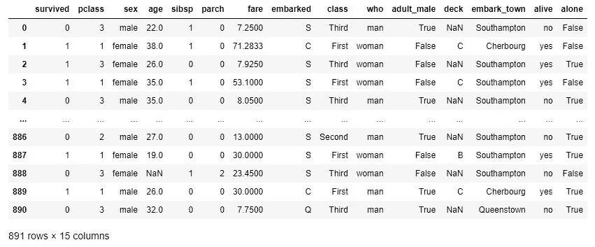
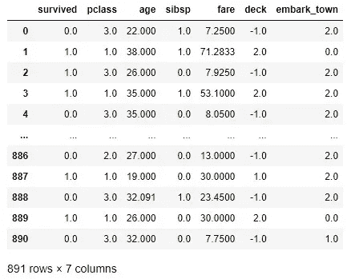

# 处理空值的 6 个技巧

> 原文：<https://towardsdatascience.com/6-tips-for-dealing-with-null-values-e16d1d1a1b33>


本·赫尔希在 [Unsplash](https://unsplash.com?utm_source=medium&utm_medium=referral) 上的照片

## 包括迭代方法、平均值和中值填充以及分组依据、平均值和中值填充

空值是机器学习和深度学习中的一个大问题。如果您使用的是 sklearn、TensorFlow 或任何其他机器学习或深度学习包，则需要在将数据传递给机器学习或深度学习框架之前清理空值。否则，它会给你一个又长又难看的错误信息。

在本文中，我们将研究如何处理空值。首先，会有一些非常简单的方法，慢慢地我们会转向一些更复杂和更有效的方法。

为了演示空值的处理，我们将使用著名的 titanic 数据集。

```
import pandas as pd
import numpy as np
import seaborn as sns
titanic = sns.load_dataset("titanic")
titanic
```



预览已经显示了一些空值。让我们检查每一列中有多少个空值:

```
titanic.isnull().sum()
```

输出:

```
survived         0
pclass           0
sex              0
age            177
sibsp            0
parch            0
fare             0
embarked         2
class            0
who              0
adult_male       0
deck           688
embark_town      2
alive            0
alone            0
dtype: int64
```

年龄列有 177，embark_town 列有 2 个空值。但是 deck 列在 891 行数据中有最多的空值 688 行。出于机器学习或任何其他类型的数据分析目的，我想完全删除这个专栏。

我们将重点关注 age 和 embark_town 列，并处理这些列的空值。

开始吧！

> 我会从最简单的策略开始，慢慢走向更复杂的招数。

## 1.简单地放弃

如果您有足够大的数据，最简单的策略是使用下面的代码删除包含空值的行:

```
titanic.dropna()
```

但是泰坦尼克号的数据集并不太大。事实上**在现实世界中，我们也没有足够的时间删除数据，因为在删除所有空值行后，我们没有足够的数据。**

## 2.用零填充

另一个非常简单的方法。您可以用零填充所有的空值，从而使这个过程变得非常简单。我们可以用零填充年龄列中的空值，如下所示:

```
titanic['age'].fillna(0)
```

输出:

```
0      22.0
1      38.0
2      26.0
3      35.0
4      35.0
       ... 
886    27.0
887    19.0
888     0.0
889    26.0
890    32.0
Name: age, Length: 891, dtype: float64
```

看第 888 行。以前是空的，现在是零。**这也是很幼稚的做法。尤其是在这种情况下，年龄不能为零。**

## 3.向前和向后填充

这也是填充空值的常用技术。向前填充表示使用序列中的前一个值填充空值，向后填充表示使用序列中的下一个值填充空值。

```
titanic['age'].ffill()
```

输出:

```
0      22.0
1      38.0
2      26.0
3      35.0
4      35.0
       ... 
886    27.0
887    19.0
888    19.0
889    26.0
890    32.0
Name: age, Length: 891, dtype: float64
```

请注意，888 行现在是 19，和 887 行一样。

```
titanic['age'].bfill()
```

输出:

```
0      22.0
1      38.0
2      26.0
3      35.0
4      35.0
       ... 
886    27.0
887    19.0
888    26.0
889    26.0
890    32.0
Name: age, Length: 891, dtype: float64
```

该行 888 已经从行 889 取得了值。

## 4.平均和中间填充

在大多数情况下，我更喜欢这个，用平均值和中间值填充空值。这里我用的是中间值:

```
titanic['age'].fillna(titanic['age'].median(), inplace = True)
titanic['age']
```

输出:

```
0      22.0
1      38.0
2      26.0
3      35.0
4      35.0
       ... 
886    27.0
887    19.0
888    28.0
889    26.0
890    32.0
Name: age, Length: 891, dtype: float64
```

现在，行 888 中的空值是 28，这是列年龄的中间值。

## 5.使用 Groupby 的平均值和中间值填充

简单的方法是放入整个列的中间值或平均值。但是我喜欢更具体的方法来计算中间值和平均值。不是取整个年龄列的中值，把所有的空值都填满，而是用每个 pclass 和' alive '的平均年龄来填满空值会更准确。

让我们看看“pclass”和“alive”的平均年龄，如果它们有所不同的话:

```
titanic.groupby(['pclass', 'alive'])['age'].mean()
```

输出:

```
pclass  alive
1       no       43.695312
        yes      35.368197
2       no       33.544444
        yes      25.901566
3       no       26.555556
        yes      20.646118
Name: age, dtype: float64
```

是的，它们确实变化很大。

如果我们用相应的平均值填充这些组中每一组的空值，将会更准确。

```
titanic['age'].fillna(titanic.groupby(['pclass', 'sex'])['age'].transform('mean'))
```

输出:

```
0      22.00
1      38.00
2      26.00
3      35.00
4      35.00
       ...  
886    27.00
887    19.00
888    21.75
889    26.00
890    32.00
Name: age, Length: 891, dtype: float64
```

现在，888 排变成了 21 排。相比之下 28

> **分类空值插补**

embark_town 列是一个分类列，我们仍然可以对它应用与上一个示例相同的过程。

但在此之前,“embark_town”列的值需要表示为数值:

```
titanic['embark_town'] = titanic['embark_town'].astype('category')
titanic['embark_town'] = titanic['embark_town'].cat.codes
titanic['embark_town']
```

输出:

```
0      2
1      0
2      2
3      2
4      2
      ..
886    2
887    2
888    2
889    0
890    1
Name: embark_town, Length: 891, dtype: int8
```

我将按“pclass”和“alive”对数据进行分组，并用中间值填充空值。

```
titanic['embark_town'] = titanic['embark_town'].fillna(titanic.groupby(['pclass', 'alive'])['embark_town'].transform('median'))
```

## 6.基于机器学习模型的迭代插补

这是输入空值的一种非常好且有效的方法。在这个过程中，每一列中的空值被填充。每一列作为一个指定的机器学习模型的标签逐一使用。

然后，具有非空值的行被用于训练机器学习模型，并且具有空值的行使用该训练的模型来预测。

在这个演示中，我只使用了几个列。还记得在开始时我们检查了哪些列有空值，我们看到 age、embark_town 和 deck 列有空值。

但是，该列有太多的空值，我们希望避免该列。但是出于演示的目的，我将在 titanic1 数据集中添加 deck 列。

我在这里使用 RandomForestRegressor。您可以使用任何其他回归模型。

```
from sklearn.experimental import enable_iterative_imputer
from sklearn.impute import IterativeImputer
from sklearn.ensemble import RandomForestRegressor
titanic1 = titanic[['survived', 'pclass', 'age', 'sibsp', 'fare', 'embark_town']]
```

让我们现在做插补，我将插补数据集保存为 titanic2。

```
imptr = IterativeImputer(RandomForestRegressor(), max_iter=10, random_state=0)
titanic2 = pd.DataFrame(imptr.fit_transform(titanic1), columns = titanic1.columns)
titanic2
```



888 排年龄现在 32 了！

我们应该检查 titanic2 数据集中是否还有空值:

```
titanic2.isnull().sum()
```

输出:

```
survived       0
pclass         0
age            0
sibsp          0
fare           0
deck           0
embark_town    0
dtype: int64
```

任何列中都不再有空值。

这些都是我今天想分享的关于空值的技巧。

## 结论

如果您愿意，也可以为各个色谱柱选择不同的技术。如果您发现任何其他处理空值更有效的技术，请随时分享。

请随时在[推特](https://twitter.com/rashida048)和[脸书页面](https://www.facebook.com/Regenerative-149425692134498)上关注我

## 更多阅读

<https://pub.towardsai.net/how-to-create-and-use-multi-index-dataframe-to-scale-up-your-data-analysis-fa80ed025d42>  </animated-and-racing-bar-plots-tutorial-7967a45c4753>  <https://pub.towardsai.net/an-overview-of-the-major-sql-query-clauses-and-most-commonly-used-functions-60720e2a20d7>  </regression-in-tensorflow-using-both-sequential-and-function-apis-314e74b537ca>  <https://pub.towardsai.net/data-analysis-91a38207c92b>  </simple-explanation-on-how-decision-tree-algorithm-makes-decisions-34f56be344e9> 