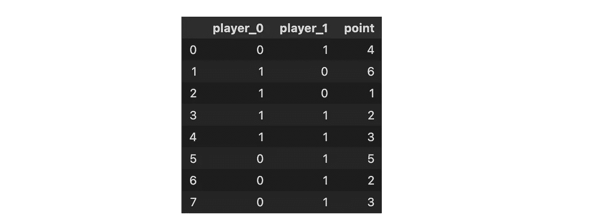

# 机器学习算法的 6 种特征编码方式

> 原文：<https://towardsdatascience.com/6-ways-to-encode-features-for-machine-learning-algorithms-21593f6238b0>

## 将分类变量编码成数字


照片由[波普&斑马](https://unsplash.com/@popnzebra?utm_source=medium&utm_medium=referral)在[挡泥板](https://unsplash.com?utm_source=medium&utm_medium=referral)上拍摄

机器学习算法需要能够理解它接收的数据。例如，“小”、“中”、“大”等类别需要转换成数字。为了解决这个问题，我们可以将它们转换成数字标签，其中“1”代表小号，“2”代表中号，“3”代表大号。

但这真的是最好的方法吗？

将分类变量编码成数字的方法有很多，每种方法都有自己的优缺点。

为了发现它们，我们将看到以下编码分类变量的方法:

1.  独热/虚拟编码
2.  标签/序数编码
3.  目标编码
4.  频率/计数编码
5.  二进制编码
6.  特征散列

我们将用一个非常简单的数据框架来说明这些概念:一个 NBA 顶级球员的玩具数据集，以及他们在过去比赛中通过罚球获得的分数。


说明特征编码概念的玩具数据集(图片由作者提供)

我还推荐使用[这个 python 库](https://github.com/scikit-learn-contrib/category_encoders)将分类变量编码成数字:

```
pip install category_encoders
```

在进一步挖掘之前，我们需要澄清一些概念:

*   **名义变量**是没有固有顺序的变量。它们只是可以相互区分的类别。
*   **序数变量**有一个固有的顺序。它们可以从最高到最低排列，反之亦然。
*   **无监督** **编码方法**不利用目标变量对分类变量进行编码(例如，用一个公式对球员姓名进行编码，该公式计算他们得分)。
*   **监督编码方法**使用目标变量对分类变量进行编码。
*   **分类变量**的“基数”代表该变量所代表的类别数。
*   **当一个变量用于训练但在推理时不可用时，目标泄漏**发生。

# 独热/虚拟编码

在一键编码中，分类数据被表示为 0 和 1 的向量。这是通过为每个类别使用单独的虚拟变量来实现的，如果观察值属于该类别，则将虚拟变量的值设置为 1，否则设置为 0。

例如，如果有三个类别，每个类别可以表示为一个零向量，在对应于该类别的位置有一个 1。

```
from category_encoder import OneHotEncoder
OneHotEncoder(cols=['player']).fit(df).transform(df)
```


玩具数据集上的一键编码(图片由作者提供)

# 标签/序数编码

这可能是为机器学习算法编码特征的最简单的方式。在这种方法中，分类数据被转换成数字数据。每个类别都有一个数值。

通过我们的玩具数据集，我们可以随机给玩家分配数字，比如斯蒂芬·库里“1”，安东尼·爱德华兹“2”，杜灿·罗宾逊“3”。

但是如果我们需要对序数变量进行编码呢？

在这种情况下，我们可以为每个玩家手动定义映射。假设我们考虑一个订单，如斯蒂芬·库里

```
from category_encoder import OrdinalEncodermapping = [{'col': 'player', 'mapping': {"Stephen Curry": 1,  "Duncan Robinson": 2, "Anthony Edwards": 3}}]OrdinalEncoder(cols=['player'], mapping=mapping).fit(df).transform(df)
```


玩具数据集上的标签编码(图片由作者提供)

# 目标编码

目标编码是一种通过使用目标值对特征的分类值进行编码的技术。这种技术背后的思想是，如果特征是目标的良好预测器，那么它的值应该更接近目标。

*   目标均值编码:我们用目标值的均值替换类别。这种方法通常与平滑一起使用，以避免目标泄漏。
*   留一编码:这种方法与目标均值编码非常相似，但不同之处在于，在留一编码中，我们取除了我们要预测的样本之外的所有样本的目标值的均值。

例如，留一编码如下所示:

```
from category_encoder import TargetEncoder
TargetEncoder(cols=['player'], smoothing=1.0).fit(df, df['point']).transform(df)from category_encoder import LeaveOneOutEncoder
LeaveOneOutEncoder(cols=['player']).fit(df, df['point']).transform(df)
```


玩具数据集上的目标均值编码(图片由作者提供)

# 频率/计数编码

计数编码是一种使用类别计数来表示分类数据的方法。频率编码只是计数编码的标准化版本。

```
from category_encoder import CountEncoder
CountEncoder(cols=['player']).fit(df).transform(df)
```


玩具数据集上的计数编码(图片由作者提供)

```
from category_encoder import CountEncoder
CountEncoder(cols=['player'], normalize=True).fit(df).transform(df)
```


玩具数据集上的频率编码(图片由作者提供)

# 二进制编码

二进制编码是一种通过将类别编码为整数，然后将其转换为二进制代码，从而将分类数据转换为数字数据的技术。

```
from category_encoder import BinaryEncoder
BinaryEncoder(cols=['player']).fit(df).transform(df)
```



玩具数据集上的二进制编码(图片由作者提供)

# 特征散列

特征散列是一种使用固定大小的数组在高维空间中表示数据的方式。这是通过在散列函数的帮助下对分类变量进行编码来实现的。

```
from category_encoder import HashingEncoder
HashingEncoder(cols=['player']).fit(df).transform(df)
```


玩具数据集上的特征散列(图片由作者提供)

# 结论

那么，你应该用哪一个呢？

这取决于数据集、模型和您试图优化的性能指标。一般来说，一键编码是名义变量最常用的方法。它易于理解和实现，并且适用于大多数机器学习模型。为了对抗维数灾难，二进制编码可能是一个好的选择，因为它在编码分类变量时创建的列更少。

如果分类变量的顺序很重要，序数编码是一个很好的选择。例如，如果我们预测一所房子的价格，标签“小”、“中”和“大”将意味着小房子比中房子便宜，中房子比大房子便宜。标签很容易反转，不会增加数据的维度。

另一方面，目标编码是受监督的编码器，其捕获关于标签和潜在预测特征的信息。这种编码器不会增加特征空间的维数，但是会导致过拟合，并且容易出现目标泄漏。

频率和计数编码器也是监督方法，不会增加特征空间的维度。然而，这些方法只能在计数引用目标变量时使用，否则，所有具有相似基数的类别都将被同样计数。

当基数非常高时，特性散列是处理分类变量的好方法，因为它计算速度快，并且在添加类别时大小不会增长。

为了更深入地研究这个主题，我建议阅读以下有趣的文章:

*   哈希技巧

<https://booking.ai/dont-be-tricked-by-the-hashing-trick-192a6aae3087>  

*   光谱编码

</spectral-encoding-of-categorical-features-b4faebdf4a>  

好奇想了解更多关于 Anthony 的工作和项目吗？在[中](https://medium.com/@anthonycvn)、 [LinkedIn](https://www.linkedin.com/in/anthonycavin/) 、 [Twitter](https://twitter.com/Anthony66333223) 上关注他。

*需要技术写手？将您的请求发送到*[*https://amigo CCI . io*](https://amigocci.io/blog/mlops-at-medium-scale/)*。*