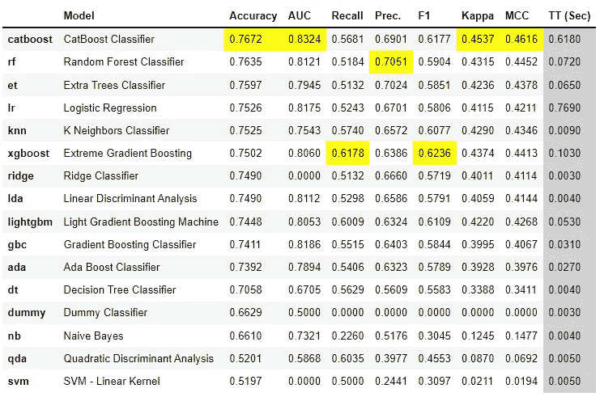
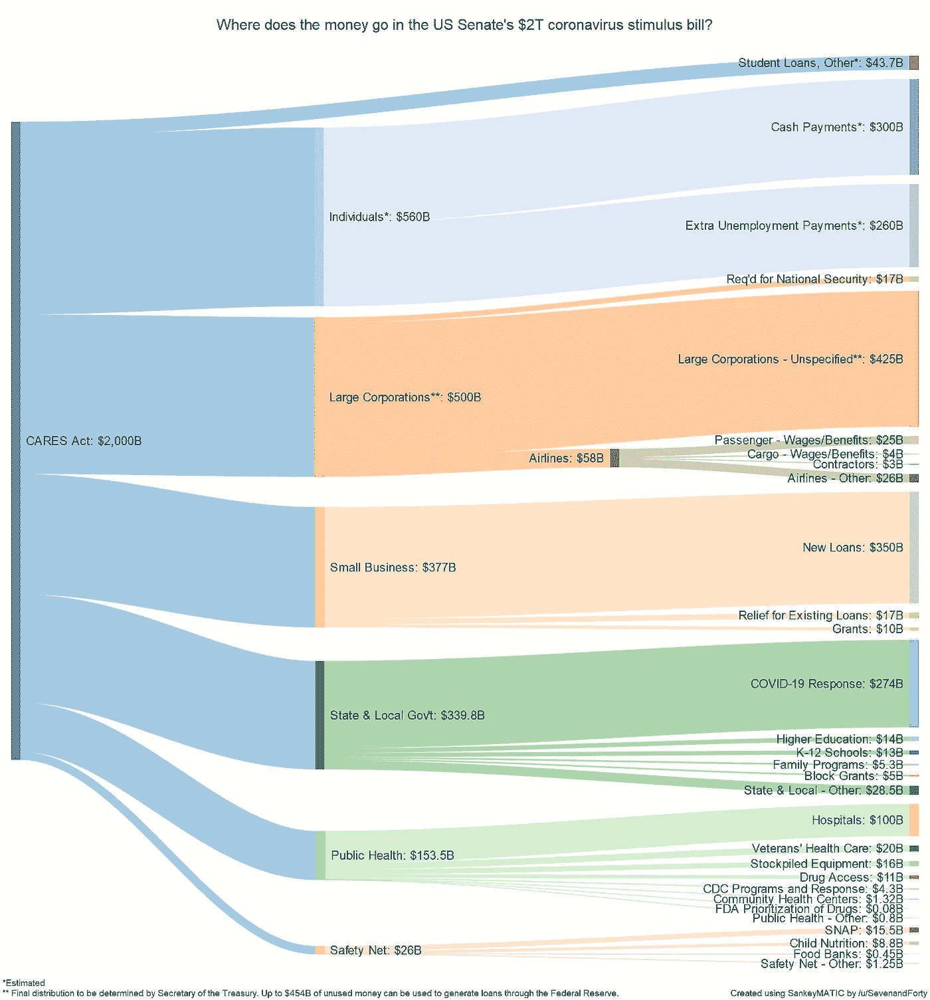

# 7 个数据科学图书馆，让你在 2022 年的生活更轻松

> 原文：<https://towardsdatascience.com/7-data-science-libraries-that-will-make-your-life-easier-in-2022-56951c729747>


弗洛里安·奥利佛在 [Unsplash](https://unsplash.com?utm_source=medium&utm_medium=referral) 上拍摄的照片

## 这些 Python 库今年将为您节省大量时间

在做数据科学的时候，你最终可能会浪费大量的时间编码，等待计算机运行某些东西。我选择了几个 Python 库，可以在这两种情况下节省您的时间。即使你只是将其中一个整合到你的武器库中，你仍然可以在下一次做项目时节省宝贵的时间。

# 奥普图纳

Optuna 是一个开源的超参数优化框架。这意味着它可以帮助你找到机器学习模型的最佳超参数。

最基本的(也可能是众所周知的)替代方案是 sklearn 的 GridSearchCV，它将尝试超参数的多种组合，并基于交叉验证选择最佳组合。

GridSearchCV 将在您预先定义的空间内尝试组合。例如，对于一个随机森林分类器，您可能想要测试估计器数量和树的最大深度的几个不同值。因此，您可以为 GridSearchCV 提供每个超参数的所有可能值，它会查看所有组合。

另一方面，使用 Optuna，您首先建议一个搜索空间，它将从那里开始查找。然后，它使用自己尝试的历史来确定接下来要尝试哪些值。它使用的方法是一种叫做“树形结构 Parzen 估计器”的贝叶斯优化算法。

这种不同的方法意味着，它不是天真地尝试任意值，而是在尝试之前寻找最佳候选值，这样可以节省时间，否则这些时间将用于尝试没有前途的替代方案(也可能产生更好的结果)。

最后，它是框架不可知的，这意味着你可以使用 TensorFlow，Keras，PyTorch 或任何其他 ML 框架。

# ITMO_FS

ITMO_FS 是一个特征选择库，这意味着它可以帮助您为 ML 模型选择特征。你的观察值越少，你就越要小心不要有太多的特征，以避免过度拟合。所谓“谨慎”，我的意思是你应该规范你的模型。更简单的模型(更少的特性)通常也更好，因为它更容易理解和解释。

ITMO FS 可以帮助你做到这一点，算法分为 6 个不同的类别:监督过滤器，非监督过滤器，包装器，混合，嵌入式，集成(尽管它主要侧重于监督过滤器)。

“监督过滤器”算法的一个简单例子是根据特征与目标变量的相关性来选择特征。阿姆就是一个众所周知的“包装者”的例子。开个玩笑:)我指的是
“反向选择”，你试着一个接一个地删除特性，看看这会如何影响你的模型预测能力。

下面是一个如何使用 ITMO 函数及其对模型分数影响的普通示例:

```
>>> from sklearn.linear_model import SGDClassifier
>>> from ITMO_FS.embedded import MOS>>> X, y = make_classification(n_samples=300, n_features=10, random_state=0, n_informative=2)
>>> sel = MOS()
>>> trX = sel.fit_transform(X, y, smote=False)>>> cl1 = SGDClassifier()
>>> cl1.fit(X, y)
>>> cl1.score(X, y)
0.9033333333333333>>> cl2 = SGDClassifier()
>>> cl2.fit(trX, y)
>>> cl2.score(trX, y)
0.9433333333333334
```

ITMO_FS 是一个相对较新的库，所以它仍然有点不稳定，它的文档可以更好一点，但我仍然建议你尝试一下。

# shap-hypetune

到目前为止，我们已经看到了用于特性选择和超参数调整的库，但是为什么不能同时使用这两种库呢？这是 shap-hypetune 的承诺。

我们先来了解一下什么是“SHAP”:

> **“SHAP(SHapley Additive exPlanations)**是一种博弈论方法，用来解释任何机器学习模型的输出。”

SHAP 是用于解释模型的最广泛使用的库之一，它通过在模型的最终预测中产生每个特征的重要性来工作。

另一方面，shap-hypertune 受益于这种方法来选择最佳特征，同时也选择最佳超参数。你为什么想要那个？独立地选择特性和调整超参数可能会导致次优的选择，因为您没有考虑到它们之间的相互作用。同时做这两件事不仅考虑到了这一点，而且还为您节省了一些编码时间(尽管由于搜索空间的增加，可能会增加运行时间)。

搜索可以用三种方式完成:网格搜索、随机搜索或贝叶斯搜索(另外，它可以并行化)。

不过，有一个重要的警告:shap-hypertune 只适用于梯度增强模型！

# PyCaret

PyCaret 是一个开源的、低代码的机器学习库，可以自动化机器学习工作流。它涵盖了探索性数据分析、预处理、建模(包括可解释性)和 MLOps。

让我们看看他们网站上的一些实际例子，看看它是如何工作的:

```
# load dataset
from pycaret.datasets import get_data
diabetes = get_data('diabetes')# init setup
from pycaret.classification import *
clf1 = setup(data = diabetes, target = 'Class variable')# compare models
best = compare_models()
```



来源:PyCaret 网站

在短短几行代码中，您已经尝试了多个模型，并通过主要的分类指标对它们进行了比较。

它还允许您创建一个基本应用程序来与您的模型进行交互:

```
from pycaret.datasets import get_data
juice = get_data('juice')
from pycaret.classification import *
exp_name = setup(data = juice,  target = 'Purchase')
lr = create_model('lr')
create_app(lr)
```

最后，您可以轻松地为您的模型创建 API 和 Docker 文件:

```
from pycaret.datasets import get_data
juice = get_data('juice')
from pycaret.classification import *
exp_name = setup(data = juice,  target = 'Purchase')
lr = create_model('lr')
create_api(lr, 'lr_api')
create_docker('lr_api')
```

没有比这更简单的了，对吧？

它是一个如此完整的库，以至于很难在这里涵盖所有内容，所以我可能会在不久的将来专门写一篇完整的文章来介绍它，但是我建议您现在就下载它，并开始使用它来了解它在实践中的一些功能。

# 流动者

floWeaver 从流的数据集生成 Sankey 图。如果你不知道什么是桑基图，这里有一个例子:



七十，CC BY-SA 4.0<[https://creativecommons.org/licenses/by-sa/4.0](https://creativecommons.org/licenses/by-sa/4.0)>，通过维基共享

当显示一家公司或政府的转换渠道、营销旅程或预算分配的数据时，它们真的很有帮助(如上例)。条目数据应该是下面的格式:“源 x 目标 x 值”，创建这种类型的图需要一行代码(这很具体，但也很直观)。

# 格拉迪欧

如果你读过[敏捷数据科学](https://medium.com/dataseries/book-summary-agile-data-science-2-0-f008c6bcfaa7)，你就会知道拥有一个前端界面，让你的终端用户从项目一开始就能与数据进行交互是多么有帮助。即使对你来说，它也能帮助你熟悉数据，发现任何不一致的地方。最常用的工具之一是 Flask，但它对初学者不太友好，它需要多个文件和一些 html、css 等知识。

Gradio 允许您通过设置输入类型(文本、复选框等)来创建简单的界面。)，您的功能和输出。虽然看起来比 Flask 的可定制性差一些，但是直观的多。

此外，由于 Gradio 现在已经加入了 Huggingface，他们提供了在互联网上永久托管您的 Gradio 模型的基础设施，而且是免费的！

# Terality

理解 Terality 的最好方法是把它想象成“熊猫，但是更快”。这并不意味着完全替换 pandas，并且必须重新学习如何处理数据帧:Terality 与 Pandas 具有完全相同的语法。实际上，他们甚至建议你“将 Terality 作为 pd 导入”，并继续以你习惯的方式编码。

快了多少？他们的网站有时声称速度快 30 倍，有时快 10-100 倍。

另一个很大的特点是 Terality 允许并行化，它不在本地运行，这意味着你的 8GB 内存笔记本电脑将不再抛出内存错误！

但是它在幕后是如何工作的呢？理解 Terality 的一个很好的比喻是，他们在 Spark 后端增加了一个你在本地使用的 Pandas 前端，这个后端运行在他们的基础设施上。

基本上，你不用在你的电脑上运行，而是用他们的，以一种完全无服务器的方式(意味着不需要基础设施设置)。

那有什么条件呢？你每月只能免费处理 1TB 的数据。如果你需要更多，你每个月至少要付 49 美元。1TB/月对于测试该工具和个人项目来说可能绰绰有余，但是如果您需要它用于实际的公司用途，您可能需要付费。

如果你喜欢这篇文章，你可能也会喜欢这些:

[](/the-one-data-science-tool-you-should-master-in-2022-c088bb4371b2) [## 2022 年你应该掌握的一种数据科学工具

### 这个工具节省了我很多时间，现在它正在占领市场！

towardsdatascience.com](/the-one-data-science-tool-you-should-master-in-2022-c088bb4371b2) [](https://medium.datadriveninvestor.com/why-machine-learning-engineers-are-replacing-data-scientists-769d81735553) [## 为什么机器学习工程师正在取代数据科学家

### 以及你应该做些什么

medium.datadriveninvestor.com](https://medium.datadriveninvestor.com/why-machine-learning-engineers-are-replacing-data-scientists-769d81735553) [](/8-data-science-side-projects-for-2022-3da85d3251f9) [## 2022 年的 8 个数据科学边项目

### 在 2022 年，将提升你的数据科学技能的边项目的独特想法

towardsdatascience.com](/8-data-science-side-projects-for-2022-3da85d3251f9) 

> 如果你想进一步讨论，请随时通过 LinkedIn 联系我，这将是我的荣幸(老实说)。