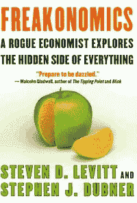
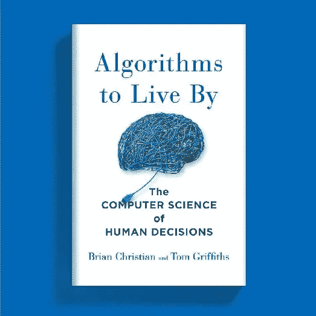
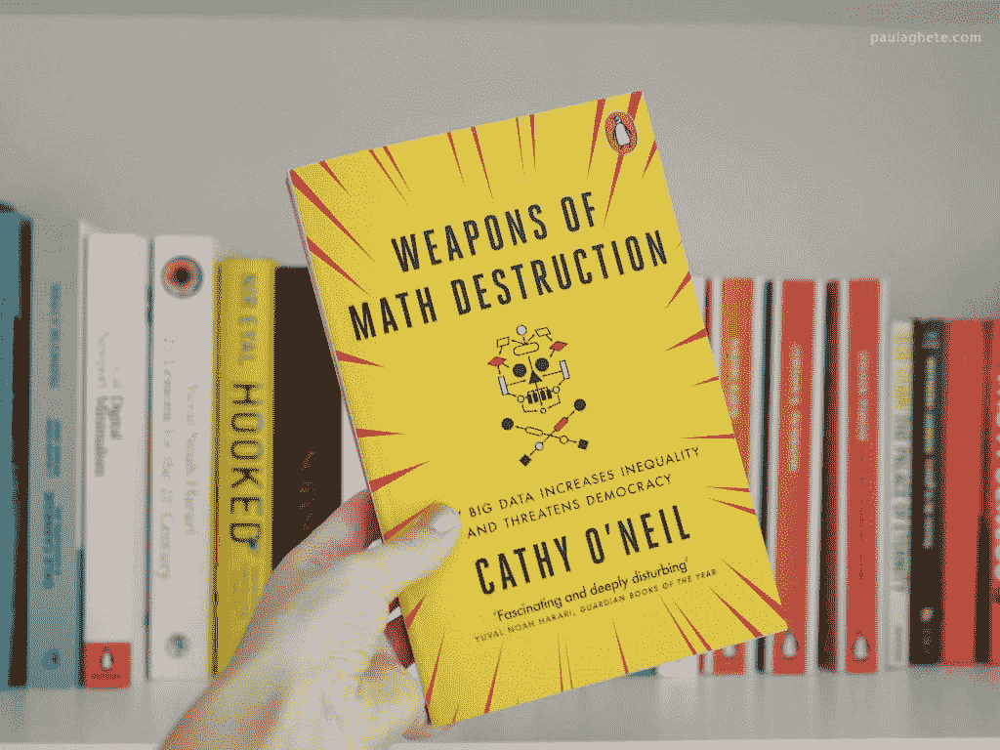
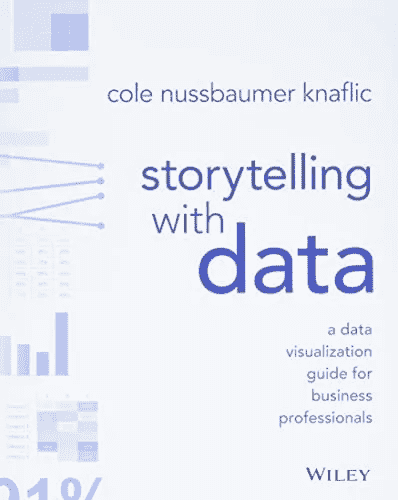
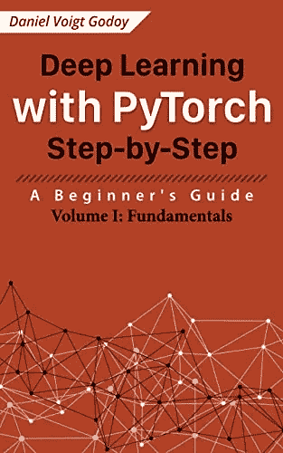
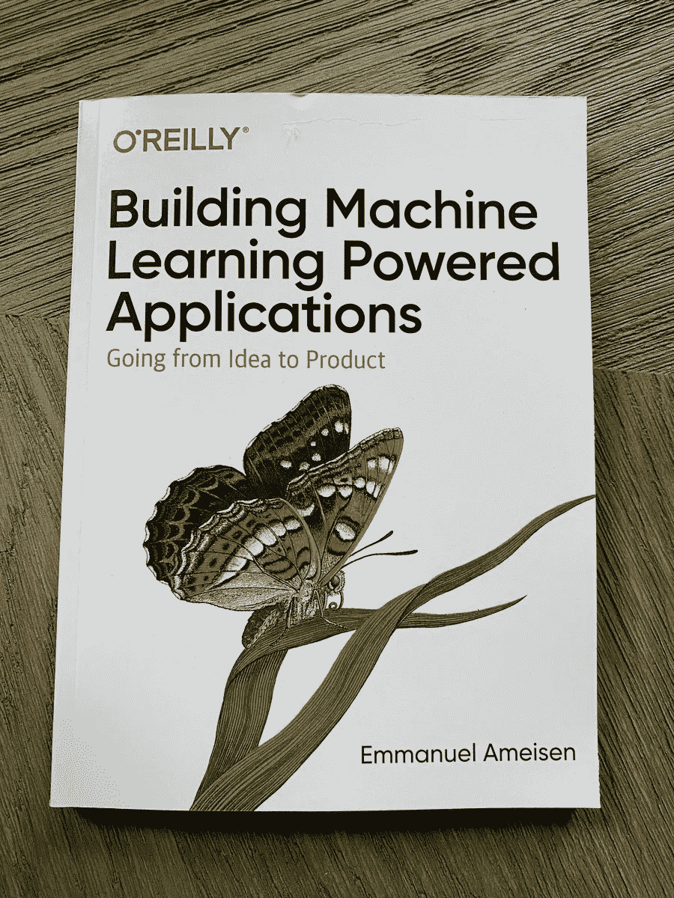

# 2022 年数据科学家必读的 7 本书

> 原文：<https://towardsdatascience.com/7-must-read-books-for-data-scientists-in-2022-aa87c0f9bffb>

照片由[思想目录](https://unsplash.com/@thoughtcatalog?utm_source=medium&utm_medium=referral)在 [Unsplash](https://unsplash.com?utm_source=medium&utm_medium=referral) 上拍摄

## 帮助你成为更好的数据科学家的技术和非技术书籍

阅读无疑是数据科学家最重要的品质之一。随着大量信息通过 YouTube 视频、课程和博客涌入(是的，我明白了其中的讽刺)，我们认为我们可以获得数据科学家理解技术概念所需的一切。然而，从阅读书籍中可以获得如此多的东西，我们可能会因为其他来源的信息过载而错过。因此，我决定写一些与当今数据科学家相关的知识渊博的标题。

排名不分先后，我读过的一些最有趣的书帮助我成为了一名数据科学家。让我们开始吧！

# 1.[魔鬼经济学:*一个流氓经济学家探索一切事物隐藏的一面*](https://freakonomics.com/books/)

**作者:**斯蒂芬·j·杜布纳和史蒂芬·列维特

书籍封面的副本(来源:[维基百科](https://en.wikipedia.org/wiki/Freakonomics))

如果你没有听说过这本书，那你一定是生活在岩石下，这本书是由芝加哥大学经济学家史蒂芬·列维特和《纽约时报》记者斯蒂芬·j·杜布纳于 2005 年出版的。它已经被认为是经济学家中最受欢迎的书籍之一，但这本书对数据科学家的重要性没有得到足够的强调。

这本书研究了人们的一些日常信念，并应用计量经济学和数据挖掘方法来揭穿这些信念，如“是什么导致了美国犯罪的减少？”“为什么毒贩和他们的父母住在一起？”、“老师阅卷时作弊吗？”。作者提出了一些古怪的假设，然后遵循结构化数据分析方法来证明这一点，这是数据科学家经常做的事情。

这本书的重点不是教你如何进行数据分析或如何使用尖端技术。相反，这本书侧重于数据科学的基础:提出正确的问题，在数据中寻找模式，识别正确的数据源，打破传统智慧，并提出更多的问题。

事实上，我会向刚进入这个领域的人强烈推荐这个，看看你是否有兴趣从事数据科学的全职工作。

# 2.[算法赖以生存的](https://www.amazon.in/Algorithms-Live-Computer-Science-Decisions/dp/1627790365)

**作者:**布莱恩·克里斯蒂安和汤姆·格里菲斯

**的封面图片*算法被*** *点击* [PT Medika](https://jualperalatankesehatan.com/fieldsn/index.php?keyword=We-Unique-A-Scientist-Explores-the-582281)

这本书不仅仅是给数据科学家的，几乎每个人都可以从中受益。任何想要探索算法世界的人都必须阅读这本书。Christian 和 Griffiths 通过探索各种计算机科学算法如何应用于我们的日常生活，提供了对这些算法的深入理解。*算法生存法则*通过简单的写作和相关的轶事，帮助解决常见的决策问题，并阐明人类思维的运作。

处理真实世界数据的数据科学家需要彻底理解算法和数据结构以及统计和概率知识，这本书是深入研究算法及其相关概念的完美方式。

请注意，这本书不仅仅是关于编程或解决编码问题。它不会教你如何用各种语言编写所有不同的排序算法，相反，它会给你一个现实世界的例子，说明排序在哪里应用，以及它如何使世界变得不那么复杂。作者确实讨论了像时空复杂性、最优搜索等技术概念，但即使是这样，也是以技术人员和非技术人员都能理解的方式讨论的。

这种技术概念的可访问性是我喜欢这本书的原因，也是我向数据科学家推荐这本书的原因，因为数据科学也是一个多样化的领域，人们来自经济学、统计学、心理学、商业等背景。这本书确保算法不仅仅被计算机科学家垄断，而且这种知识可以与来自各种背景的人分享。

# 3.黑天鹅:极不可能事件的影响

**作者:**纳西姆·尼古拉斯·塔勒布

来自 [Goodreads](https://www.goodreads.com/book/show/242472.The_Black_Swan) 的书《黑天鹅》的封面

这是一位前期权交易员写的书，出版于 2007 年。它讨论了罕见的和不可预测的异常事件的极端影响，以及人类倾向于为这些事件寻找简单的解释。这些异常事件被称为**‘黑天鹅事件’。**

根据 Investopedia 的说法，黑天鹅是一种不可预测的事件，超出了正常情况下的预期，具有潜在的严重后果。它们有三个主要特征:

*   它们极其罕见
*   它们产生了严重而广泛的影响
*   人们经常试图提出解释，解释为什么它们在事后是显而易见的

> 具有讽刺意味的是，这本书正好在本世纪最大的黑天鹅事件之一——2008 年金融危机——之前出版。当我写这篇文章时，我们正在摆脱另一个黑天鹅事件，即 Covid19 疫情。

“黑天鹅事件”这个名字来源于这样一个故事:所有的天鹅都是白色的，这曾经是一个普遍的观念，因为人们从来没有见过其他东西来说服他们。然而，他们震惊地发现了一只黑天鹅，这最终让他们意识到黑天鹅的存在实际上在基因上是可能的。

这本书有很多关于不确定性、概率、风险和人类决策的内容。作为数据科学家，我们经常处理异常值，并提出了许多方法来处理它们。然而，这些事件不仅仅是离群值，学习如何处理它们本身就是一种技能。塔勒布讨论了如何不去试图预测黑天鹅事件，我们应该建立对负面事件的鲁棒性，并学会利用正面事件。对于任何处理现实世界数据的人来说，这都是一本很好的读物，因为现实世界的数据会受到像这样的全球性事件的影响。

# 4.[数学毁灭武器](https://www.amazon.in/Weapons-Math-Destruction-Increases-Inequality/dp/0553418815)

**作者:**凯茜·奥尼尔

大规模杀伤性武器封面图片[保拉·盖特](https://paulaghete.com/weapons-of-math-destruction/)

这本书由哥伦比亚大学数据科学项目的前主任撰写，于 2016 年出版，并于 2019 年获得[欧拉图书奖](https://en.wikipedia.org/wiki/Euler_Book_Prize)。

这本书探讨了数据科学和大数据如何越来越多地被用于强化社会中预先存在的不平等。Cathy O'Neil 分析了大数据算法在保险、教育、金融、警务等领域的应用，并展示了这些算法如何加剧我们社会中存在的种族主义、不平等和偏见。

这本书增加了当前围绕机器学习系统的可解释性和公平性的讨论。强烈建议初出茅庐和经验丰富的数据科学家了解他们所构建模型的真实影响，尤其是在处理社会经济应用时。

# 5.[用数据讲故事](https://www.amazon.in/Storytelling-Data-Visualization-Business-Professionals/dp/1119002257)

**作者:**科尔努斯鲍默·奈弗利克

来自[威利](https://www.google.com/imgres?imgurl=https%3A%2F%2Fmedia.wiley.com%2Fproduct_data%2FcoverImage300%2F57%2F11190022%2F1119002257.jpg&imgrefurl=https%3A%2F%2Fwww.wiley.com%2Fen-us%2FStorytelling%2Bwith%2BData%253A%2BA%2BData%2BVisualization%2BGuide%2Bfor%2BBusiness%2BProfessionals-p-9781119002253&tbnid=B6eX3FW6zEAIgM&vet=12ahUKEwjVr7Wjz9X3AhUY7nMBHekXBikQMygAegUIARCqAQ..i&docid=ac68C2wKL_yXMM&w=300&h=374&q=Storytelling%20with%20Data%3A%20A%20Data%20Visualization%20Guide%20for%20Business%20Professionals&ved=2ahUKEwjVr7Wjz9X3AhUY7nMBHekXBikQMygAegUIARCqAQ)的书的封面

数据科学不仅仅是构建复杂的模型和对数据应用高级统计概念。它还确保技术和非技术的利益相关者理解您从数据中呈现的分析。这里的一个主要因素是你从你的数据中讲述的故事，这本书是了解更多的最佳途径。

这本书深入研究了有效的可视化和沟通的世界，从你的数据中制作一个关键的故事。作者提供了理论和现实世界例子的平衡，可以转化为你的日常工作。这本书展示了如何使用传统和非常规的工具从你的数据中挖掘见解，并以一种令人愉快的方式呈现出来。重点关注的一些内容是如何:

*   理解语境的重要性
*   为每种情况选择适当的图表
*   将观众的注意力引向你想要的地方
*   消除相关信息周围的混乱
*   将设计的概念融入你的数据可视化

我曾亲身经历过这样的情况，我知道项目的所有技术方面，但我仍然无法说服利益相关者或我的领导我的项目的影响，因为我无法解释一个令人信服的故事。我现在希望我早些时候读过这本书，并从中吸取教训。对于那些已经确定了技术概念，并希望了解更多关于展示结果和令人信服的工作故事情节的资深数据科学家来说，这是一个很好的建议。

# 6.[深度学习用 PyTorch 循序渐进](https://www.amazon.com/Deep-Learning-PyTorch-Step-Step-ebook/dp/B09R144ZC2)

**作者:**丹尼尔·戈多伊

深度学习与 PyTorch 图书封面来自[亚马逊](https://www.amazon.com/Deep-Learning-PyTorch-Step-Step-ebook/dp/B09R144ZC2)

PyTorch 是脸书 AI 研究(FAIR)团队在[sou Smith chint ala](https://soumith.ch/)的领导下，于 2017 年开发的优化深度学习框架。自从发布以来，PyTorch 已经成为深度学习社区中非常受欢迎的框架，尤其是在研究人员中(包括我自己)。

数据科学家必须了解 PyTorch，因为这是一个非常有用的工具。PyTorch 的专业知识可以帮助你在工业界和学术界工作，PyTorch 的受欢迎程度只会越来越高。

这本书是开始学习 PyTorch 的好地方，因为作者以非常清晰明了的方式写作，初学者和专家都可以理解。他涵盖 PyTorch 的基础知识，如张量和梯度，以及 PyTorch 在计算机视觉和 NLP 领域的应用。

# 7.[构建机器学习驱动的应用:从想法到产品](https://www.amazon.com/Building-Machine-Learning-Powered-Applications/dp/149204511X)

**作者:**艾曼纽·阿梅森

杰克·卡拉姆卡的封面

如果我不谈论将 ML 模型部署到生产中，任何关于数据科学书籍的文章都是不完整的，这是现实世界数据科学的一个重要方面。在这个时代，知道如何构建数据应用程序已经成为数据科学家的一项基本技能。

这本书解决了机器学习中模型部署过程的复杂性，并为解决这个问题提供了一个框架。这本书的主要焦点是创建一个易于理解的指南，帮助人们浏览开发基于 ML 的应用程序的过程。作者关注了模型部署的以下几个方面:

*   计划 ML 应用并确定成功标准。
*   部署过程和缺陷
*   微调 ML 模型
*   在部署阶段后监控模型

这本书推荐给有一些行业经验的数据科学家，他们也希望进入产品开发领域。还需要精通 Python 编程。

# 结论

在本文中，我谈到了一些帮助我成为更好的数据科学从业者的书籍，我希望这些书籍也能帮助其他数据科学家。显然还有很多书我想提及，所以我可能会写另一篇类似的文章。我也总是乐于接触新书，所以如果你有任何建议，请在回复中提出。

 [## 特征重要性的一种新方法——Shapley 附加解释

### 最先进的功能重要性

towardsdatascience.com](/a-novel-approach-to-feature-importance-shapley-additive-explanations-d18af30fc21b)  [## 使用 Streamlit 创建多页面应用程序(高效！)

towardsdatascience.com](/creating-multipage-applications-using-streamlit-efficiently-b58a58134030)