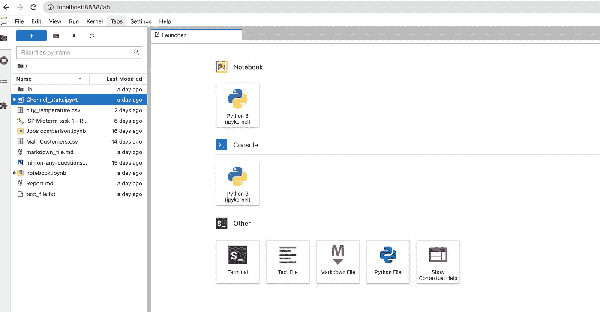
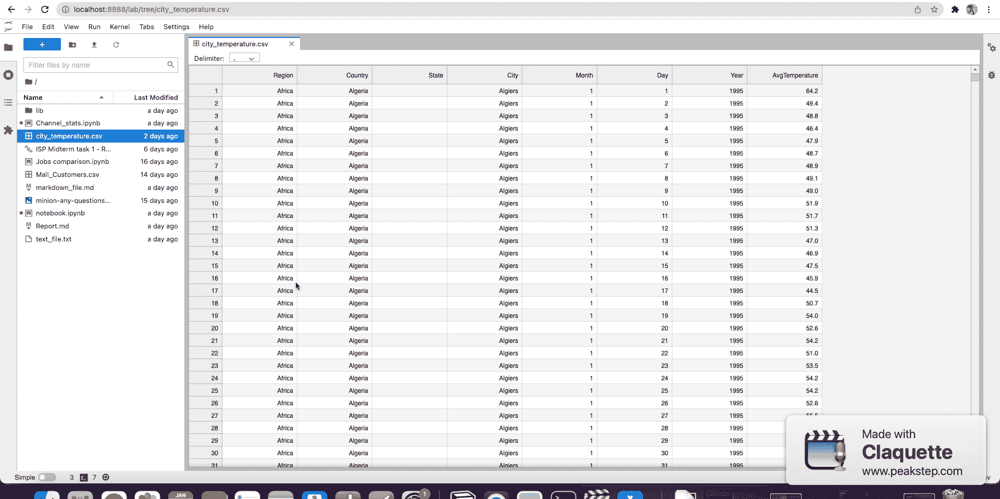
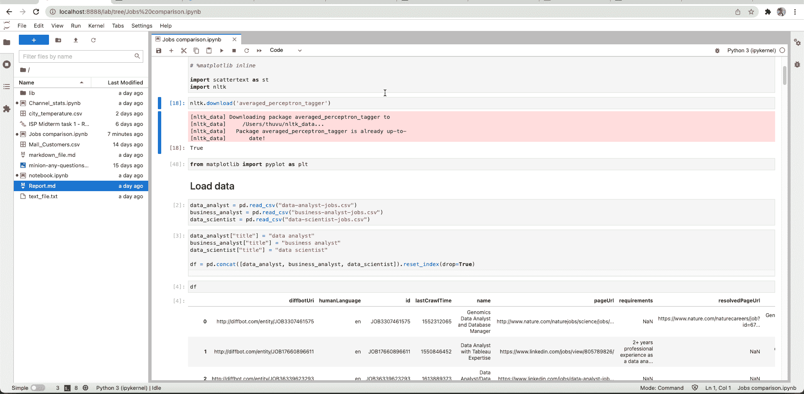
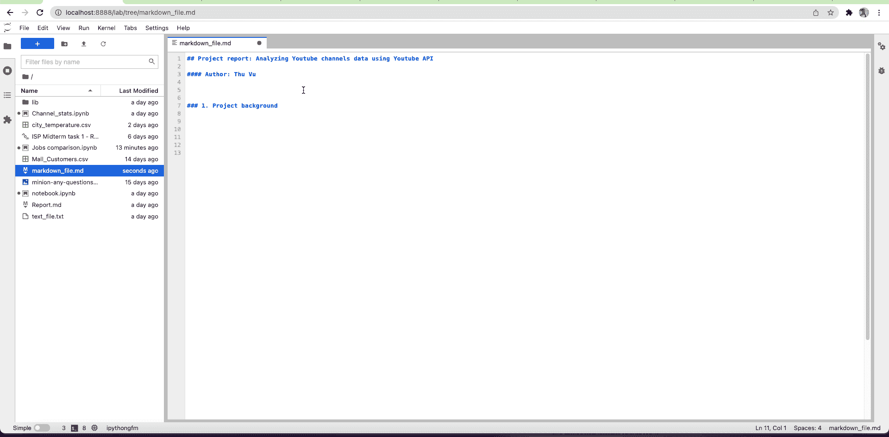

# 您应该将 Jupyterlab 用于数据科学的 7 个理由

> 原文：<https://towardsdatascience.com/7-reasons-why-you-should-use-jupyterlab-for-data-science-7c2a3db8755a>


米利安·耶西耶在 [Unsplash](https://unsplash.com?utm_source=medium&utm_medium=referral) 上拍摄的照片

Jupyter Notebook 已经成为任何使用 Python 的数据科学家和数据分析师的主要工具。事实上，大多数在线 Python 和数据科学课程都是使用 Jupyter Notebook 教授的。虽然 Jupyter Notebook 很简单，对初学者也很友好，但当你在进行一个大型数据分析项目时，它不再是最好的工具。

在本文中，我将与您分享 7 个令人信服的理由，说明您为什么应该在下一个数据项目中从 Jupyter 笔记本电脑转向 Jupyterlab。

# Jupyterlab 是什么？

首先，你可能已经知道也可能不知道——JupyterLab 是**最新的基于 web 的交互式开发环境，用于笔记本、代码和数据。通过 conda 或 pip 安装 Jupyterlab 非常简单:**

```
conda install -c conda-forge jupyterlab
```

或者，

```
pip install jupyterlab
```

注意，如果你在 MacOS 上使用 Python 3，你应该使用 **pip3** 而不是 **pip** 。

# **为什么是 Jupyterlab？**

Jupyterlab 比传统的 Jupyter 笔记本更好的原因有很多。以下是最重要的原因，我相信其中一些会让你大吃一惊。

## #1.一切尽在一景

如果你曾经厌倦了仅仅为了查看根目录或者在 Jupyter 笔记本上创建一个新文件而不得不在不同的标签之间切换，我听你的！这是 Jupyterlab 将为您的数据科学生活带来的关键变化之一。它将传统的笔记本、文本编辑器、终端和目录查看器都放在一个视图下。它让一切对你来说更有效率，创造一个你会喜欢的更统一的体验。现在，您可以在笔记本上工作，与终端交互，并在 markdown 文件上书写，所有这些都可以同时进行！



Jupyterlab 发射器。

## #2.观看 CSV 要好得多

您可能已经注意到，在 Jupyter notebook 中，我们只能将 CSV 文件作为文本文件查看。但是在 Jupyterlab 中，可以像在 Excel 中一样以表格格式查看。我还尝试在 Jupyterlab 中打开几百万行的大型 CSV 文件，它运行得非常好，没有任何故障。所以下次如果你因为超过一百万行而无法在 Excel 中打开 CSV 文件，你知道去哪里找。



在 Jupyterlab 中查看 CSV 文件。

不仅是 CSV，您还可以查看 PDF 文件、图片和 markdown 文件，这在您阅读 PDF 文档的同时处理项目报告时非常方便。

## #3.笔记本电脑的第二视图

这绝对是我在 Jupyterlab 中最喜欢的功能之一:你可以为你的笔记本创建第二个视图，并将这两个视图并排放置进行比较。您只需右键单击您的笔记本标签标题，并选择 ***笔记本*** 的新视图。

好的一面是，您对其中一个视图所做的任何更改也将反映在另一个视图中，并保存在笔记本中！


Jupyterlab 笔记本电脑的第二个视图。

当我的笔记本变得更大，我不得不来回滚动时，我发现这个功能非常有用。例如，如果我想检查列的名称，不必一次又一次地打印数据帧或滚动到实际打印的位置，我只需在一个单独的视图中打开数据帧。这避免了我写多余的代码，也节省了我大量的滚动时间。

## #4.拆分视图

第四个点是上面第三个点的延伸，但是这一次我们可以通过拖拽来进一步分割视图。现在，您可以同时查看和处理多个笔记本和文件。我只是喜欢一切都是如此灵活，它真的感觉像一个真正的 IDE，我可以控制我想如何安排我的工作流程。老实说，我一点也不怀念以前在 Jupyter 笔记本上工作时痛苦地切换标签的感觉。


Jupyterlab 中的拆分视图。

## #5.重新排列笔记本中的单元格

第五点是你可以拖动单元格来重新排列它们。这在经典的 Jupiter 笔记本中是不可能的，这也是当我清理和重新排列我的笔记本以使其对观众有意义时最让我恼火的地方。这会让你大吃一惊，在拆分视图中，你可以将一个单元格从一个笔记本拖到另一个笔记本，这就是你如何将一个单元格从一个笔记本复制到另一个笔记本。你可能通常不需要这样做，但如果你这样做了，这是非常整洁的。


拖放单元格以在笔记本中重新排列它们，或者将单元格从一个笔记本复制到另一个笔记本。

## #6.代码控制台

如果我们想测试一段代码或者检查一个函数返回什么，我们通常求助于代码控制台，因为这是运行代码最简单的方式。代码控制台实际上是为测试代码而设计的地方，因为它们提供了交互性。在 Jupyterlab 中，你所要做的就是在笔记本任意位置点击右键，选择 ***笔记本*** 新控制台。然后，您可以前往代码控制台，在这里使用您的代码。



使用代码控制台进行测试。

## #7.降价同步预览

通常，您会希望与社区共享您的数据科学项目，或者简单地记录您所做的工作。在 Jupyter 笔记本上写 Markdown 是相当令人沮丧的，因为你必须一次又一次地运行你的单元格，仅仅是为了预览和检查文件看起来如何，以及你是否得到了正确的语法。在 Jupyterlab 中，您可以通过右键单击文件上的任意位置并选择 ***显示 markdown 预览*** 来预览 markdown 文件，现在您可以看到您的文档正在随着您的键入而实时更新。这个功能非常方便，可以节省你写文档的时间。



预览 Jupyterlab 中的降价功能。

Jupyterlab 已经成为我最喜欢的 Python 数据分析工具，我认为如果您是新手，您绝对应该尝试一下，看看它如何改进您的分析工作流或您的 Python 学习体验。这绝对是我为提高 Python 的工作效率所做的最好的事情之一。

如果你已经看到了这篇文章的这一部分，感谢你的阅读和关注！你也可以在下面我的 Youtube 频道找到这篇文章的**视频版本**。

***如果你喜欢我关于数据科学的内容(以及偶尔与技术相关的东西和个人成长)，别忘了在 Medium 上关注我。***

***想要连接？*** *你可以在*[*LinkedIn*](https://www.linkedin.com/in/thu-hien-vu-3766b174/)*，*[*Youtube*](https://www.youtube.com/c/Thuvu5/videos)*，或者*[*GitHub*](https://github.com/thu-vu92)*上联系我。我随时欢迎快速聊天或虚拟咖啡:)。*