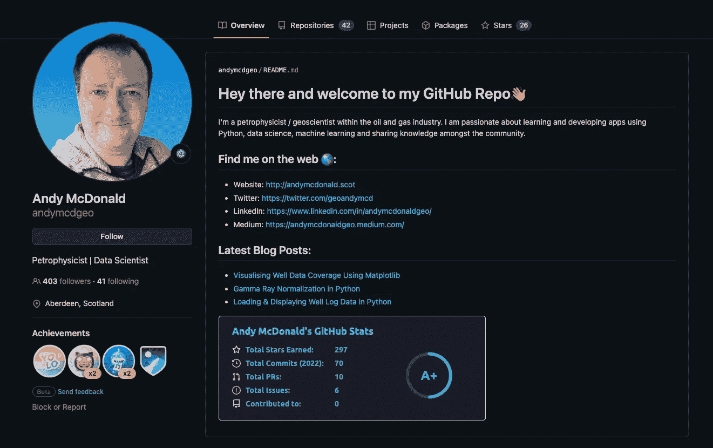
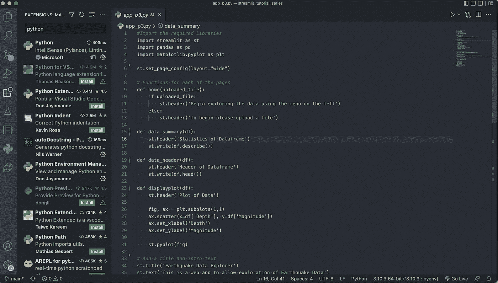
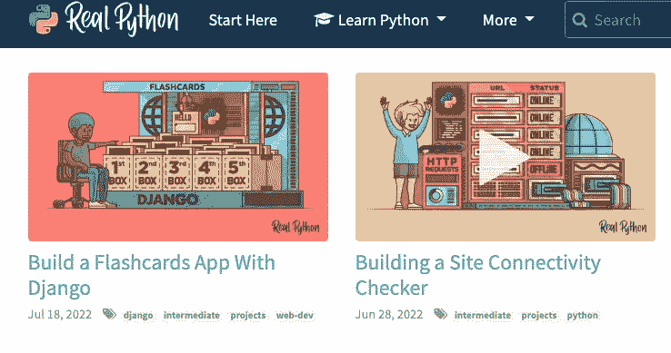
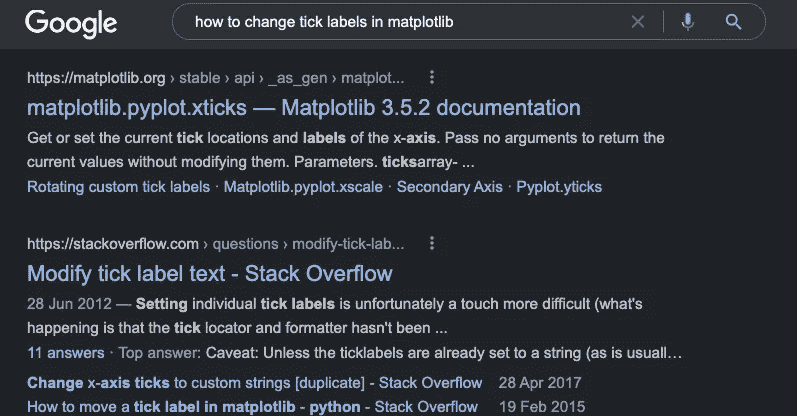

# 让你在学习 Python 时有一个良好开端的 7 个技巧

> 原文：<https://towardsdatascience.com/7-tips-to-get-you-off-to-a-great-start-when-learning-python-c878113b8082>

## 从 5 年的 Python 技能开发中获得的经验教训

来自 [Pixabay](https://pixabay.com/photos/laptop-code-programming-computer-2557586/) 的 StockSnap 图像。

你有没有从朋友那里或者网上听说过 Python，想尝试一下却不知道从何下手？如果是这样，那么这篇文章是给你的。

大约 5-6 年前，我处于非常相似的境地。作为我工作的一部分，我需要为软件包中的一些方程编写一个自定义脚本。这个脚本比简单的方程要复杂一些，我需要在其中包含适当的逻辑。这是我转向 Python 并拼凑出我的第一个脚本的时候。

这些年来，我的 Python 编程技能有了很大的提高，教授了许多关于这个主题的课程，并开设了一个 YouTube 频道来分享我所学到的东西。如果你想学习 Python，这里有一些我一路走来学到的技巧，希望对你也有帮助。

# 1.参加一门课程——但不要太多

Udemy 上 Python 可用的课程示例。图片由作者提供。

在各种各样的平台上有许多课程( [Udemy](https://www.udemy.com/) 、 [Coursera](https://www.coursera.org/) 、 [EdX](https://www.edx.org/) 等)，将带你从一个完全的新手到相当有能力编写 Python 代码。

我强烈推荐参加 Python 初学者课程，该课程将带您了解基本知识，包括什么是函数、变量类型、流控制以及使用常见库，如 [matplotlib](https://matplotlib.org/) 、 [pandas](https://pandas.pydata.org/) 和 [numpy](https://numpy.org/) 。然而，在完成那门课程后，我会建议你动手做你自己的项目。你最不希望的就是被困在一个“教程地狱”里，在那里你所做的一切就是看视频和运行练习脚本。

这并不是说应该避免更高级的教程和课程，而是在你完成基础课程后从事项目和现实生活中的问题可以让你巩固你的学习并建立你的基本技能。然后在未来的某个时候，你可以根据自己的需求，确定自己想上的具体的高级课程。

# 2.使用 GitHub 建立投资组合

GitHub 概要文件是展示您的项目和编码能力的好方法。图片由作者提供。

如果你正在寻找一个新的职业或寻找你的第一份 Python 编程工作，那么拥有一份你的工作作品集是向潜在雇主展示你所知道的和你所学到的技能的一个很好的方式。

许多程序员使用 GitHub 作为存储和展示他们的项目的地方，这是开始你的作品集的好地方。

一个 [GitHub](https://github.com/andymcdgeo) 作品集应该是一种展示你的技能的方式，当它们被应用于现实世界的问题时。值得记住的是，即使你可以使用 GitHub 来存储你的课程作业，除了表明你已经学习了 Python 的基础知识之外，这些并不能向雇主传达太多信息。对于这些，我建议建立一个单独的存储库，并将所有的课程笔记/脚本保存在子文件夹中。

建议您在学习之旅的早期开始一个文件夹，因为它会让您熟悉版本控制和代码项目管理。

# 3.获取 IDE

一个 Visual Studio 代码的例子，一个用于编写和管理 Python 代码的 IDE。图片由作者提供。

当你开始编写 Python 代码时，你可能会在 [Jupyter](https://jupyter.org/) 笔记本上学习。这是一个很好的工具，但是，总有一天你会需要集成开发环境(IDE)的功能。

[Jupyter Notebooks](https://jupyter.org/) 可以被视为一种工具，用于快速构建代码原型、创建快速可视化，以及创建包含代码和理论的动态文档，这些文档可以轻松传递给我们的数据科学同事。

随着你的 Python 代码开始变得更加复杂，你将开始受到笔记本系统工作方式的限制。IDE 允许您使用多个文件构建更复杂的程序，更有效地管理这些文件，并提供了许多工具来帮助您在保持一致性的同时加快编码速度。Python 有两种流行的 ide:[py charm](https://www.jetbrains.com/pycharm/)和 [Visual Studio Code](https://code.visualstudio.com/) ，它们各有优缺点。

# 4.写/谈论你学到的东西

在您开始发展 Python 技能时，Medium 是分享您的学习和知识的好方法。图片由作者提供。

当我开始学习 Python 的时候，我所做的只是从课程和文章中获取内容。有些从未被记住，最终被遗忘了。

如果你真的想巩固你的知识，那么写作或谈论你所学到的是一个很好的方法。当你开始用自己的话分享你在机器学习算法或 Python 代码上所学到的东西时，你不仅会展示你所知道的，还会识别你所不知道的。这可以引导你进行进一步的研究，扩大你的知识面。

除了分享你的知识并贴在互联网上，你也开始建立你的个人品牌和个人资料。这可能需要时间，但它确实有帮助，而且你永远不知道它会把你带到哪里。这可能是一份新工作，也可能是未来项目的新联系人。

有很多地方你可以通过写作来分享你的知识。我强烈建议用媒体写作，而不是个人博客，因为你更容易被人看到。此外，你还可以从阅读你作品的人那里兼职赚钱。

如果你喜欢通过视频分享，那么 YouTube 是一个很好的起点。去年，我在 YouTube 上开设了一个频道，专注于 Python 和机器学习在地球科学领域的应用。这是我走出舒适区的一大步，但迄今为止这是一个伟大的旅程。你可以看看下面我的 YouTube 频道，看看我过去一年的进步。

  

# 5.从事一个项目

来自真实 Python 网站的示例项目。图片由作者提供。

当你开始学习所有这些新功能、工具、代码片段等时，这一切都很好，但是，人类的大脑很容易忘记你最近学过的内容。

课程和教程涵盖的内容可能非常全面。它们涵盖了许多主题和功能，这些主题和功能在您的学习过程中的这个阶段可能并不立即需要。帮助巩固所学知识的一个很好的方法是做项目。项目通过将所学付诸实践，帮助你朝着学习 Python 的目标努力。

有许多文章列出了对初学者有帮助的各种项目，包括制作简单的计算器到更复杂的应用程序，如井字游戏和自动化电子邮件。

查看下面的网站和文章，寻找一些开始的灵感。

*   [https://realpython.com/tutorials/projects/](https://realpython.com/tutorials/projects/)
*   [https://medium . com/coders-camp/60-python-projects-with-source-code-919 CD 8 a6 e 512](https://medium.com/coders-camp/60-python-projects-with-source-code-919cd8a6e512)
*   [https://www . freecodecamp . org/news/python-projects-for-初学者/](https://www.freecodecamp.org/news/python-projects-for-beginners/)

# 6.不要害怕谷歌

matplotlib 中更改刻度标签的 Google 搜索示例。图片由作者提供。

当你第一次开始学习 Python 时，你可能会感到畏惧，你会看到许多其他程序员似乎能够以极快的速度从头开始编写代码。

事实上，当学习 Python 或任何其他编程语言时，你不必记住你所学的所有东西或记住每一段语法。(大多数)开发人员并没有将他们所学的每一段代码片段和功能都记在脑子里。相反，当他们遇到新事物或遇到他们无法轻松解决的问题时，他们可能会求助于谷歌并搜索他们遇到的问题。大多数情况下，其他人会遇到同样的问题，并在 [StackOverflow](https://stackoverflow.com/) 或 [Reddit](https://www.reddit.com/r/Python/) 上询问这个问题。

但是，请注意，当你遇到一个答案时，目标不是复制和粘贴你找到的内容，而是尝试并理解所提供的解决方案。如果你将代码复制粘贴到商业应用程序中，代码扫描工具会将其标记为剽窃。

# 7.记录您的代码

使用注释记录代码的例子。图片由作者提供。

当你刚开始用 Python 编码时，你可能非常渴望编写代码并让它工作，最终你会得到 x，y，a，b 等变量名，这是非常容易理解和理解的。然而，当你回头再看这段代码的时候，你可能会挠头，不知道它到底在做什么。

我刚开始的时候也是类似的情况。当我回顾我几个月前写的一些代码时，我对它在做什么以及为什么我以某种方式写它感到困惑。在这种情况下，用注释、文档字符串和适当的变量名来记录代码会有很大的帮助，尤其是当其他人正在查看您的代码时。

注释是解释代码背后原因的好方法，文档字符串有助于解释函数正在做什么，以及它们需要什么才能运行。

确保编写代码文档是成为一名优秀 Python 程序员的重要组成部分。如果及早练习，它将成为你以后职业生涯中的第二天性。

如果您想了解如何记录您的代码，请查看下面的这篇文章。

  

*感谢阅读。在你走之前，你一定要订阅我的内容，把我的文章放到你的收件箱里。* [***你可以在这里做！***](https://andymcdonaldgeo.medium.com/subscribe)**或者，您可以* [***注册我的简讯***](https://fabulous-founder-2965.ck.page/2ca286e572) *免费获取更多内容直接发送到您的收件箱。**

*其次，通过注册会员，你可以获得完整的媒介体验，并支持我自己和成千上万的其他作家。它每个月只花你 5 美元，你可以完全接触到所有令人惊叹的媒体文章，也有机会用你的写作赚钱。如果你用 [***我的链接***](https://andymcdonaldgeo.medium.com/membership)**报名，你直接用你的一部分费用支持我，不会多花你多少钱。如果你这样做了，非常感谢你的支持！***