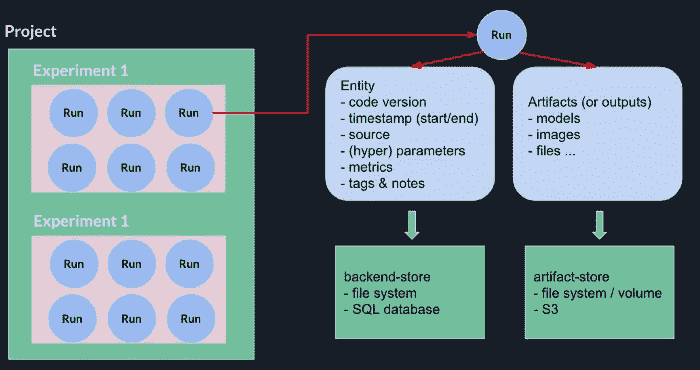
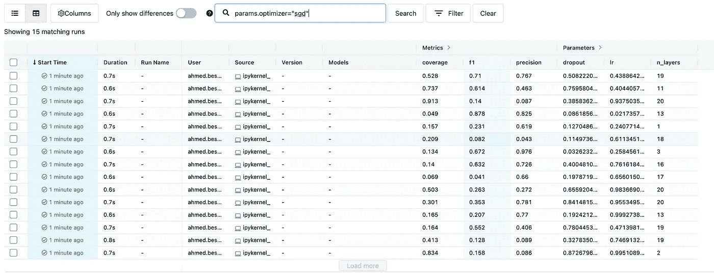
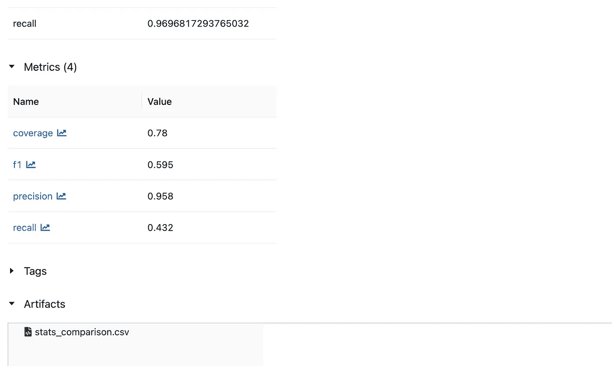
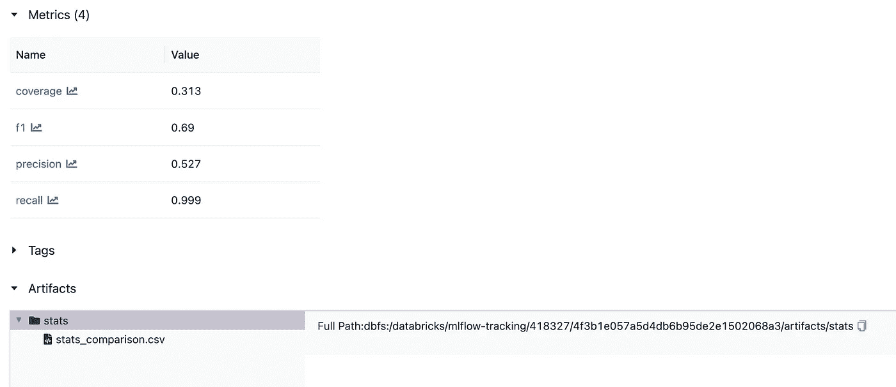
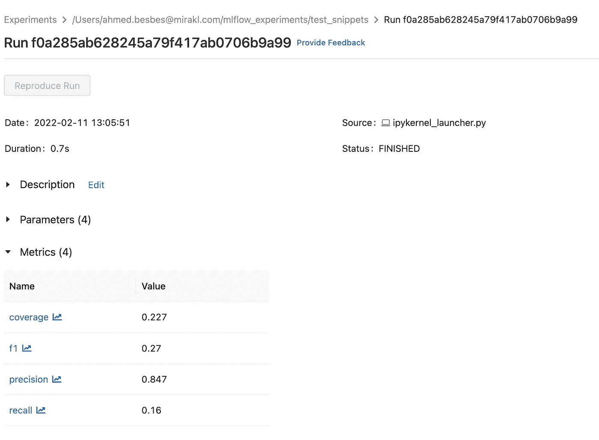
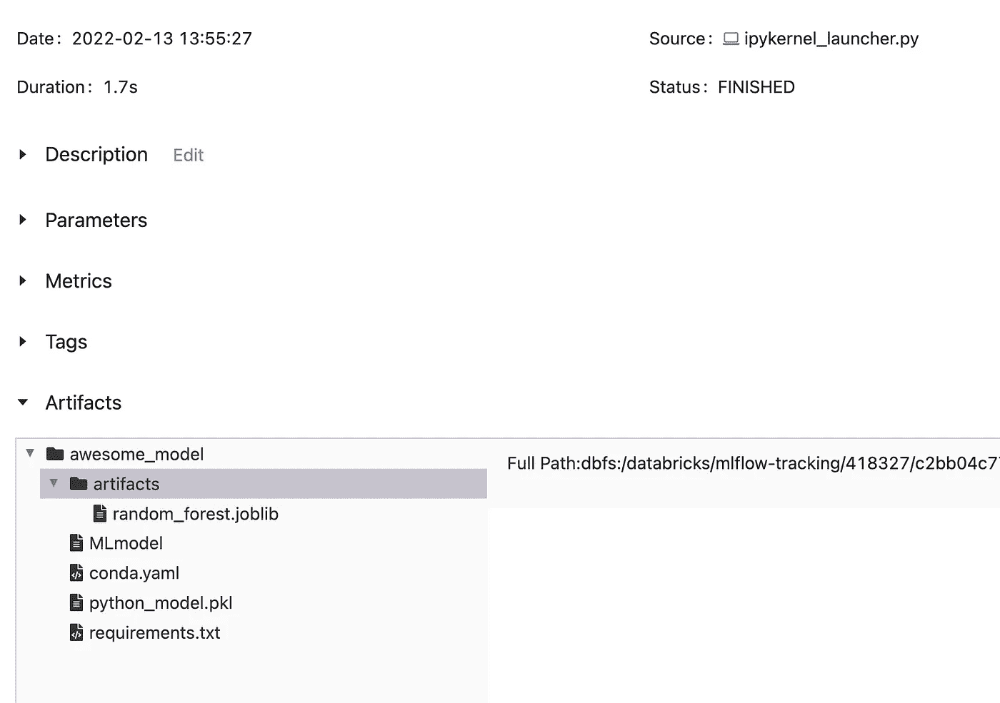

# 快速入门 MLflow 跟踪的 8 个代码片段

> 原文：<https://towardsdatascience.com/8-code-snippets-to-quickly-get-started-with-mlflow-tracking-63064d99d3ff>

## 更好地记录实验和重现实验的技巧


照片由 [Fotis Fotopoulos](https://unsplash.com/@ffstop?utm_source=medium&utm_medium=referral) 在 [Unsplash](https://unsplash.com?utm_source=medium&utm_medium=referral) 上拍摄

作为一名数据科学家，我每天都在使用 MLflow。

我用它来跟踪机器学习实验，将模型推送到注册表并对其进行版本管理，并轻松地与同事就相同的项目进行协作。

> *在深入使用这个工具一年多后，我开始了解它的来龙去脉，作为对这段经历的总结* ***，这篇文章是我经常使用的 8 个有用代码片段的汇总。***

随意跳过你知道的，浏览那些你不太熟悉的。

事不宜迟，我们来看看吧！🔍

# 📚MLflow 术语的 30 秒快速回顾

*之前在 MLflow 上写过帖子。如果您有兴趣了解更多关于这个 MLOps 工具的信息，这里有一个 6 分钟的故事，涵盖了基本知识⏬*

[](/how-to-use-mlflow-on-aws-to-better-track-machine-learning-experiments-bbcb8acded65)  

MLflow 有四个组件。

我们今天感兴趣的一个叫做 **MLflow Tracking** :广义来说，你可以把它看作模型和机器学习项目的 GIT 仓库。

它允许您在一个中心位置，即一个远程服务器，跟踪参数、指标和文件(也称为工件)。

MLflow 跟踪被组织成实验，并且每个实验被分成运行(这就是你在这篇文章的其余部分需要知道的)。



作者图片— MLflow 术语

例如，一个实验可以专用于训练用于肺炎检测的计算机视觉模型，并且该实验中的每次运行将与特定的训练会话相关。因此，跑步与其他跑步不同，每次跑步都有:

*   **一组特定的超参数:**学习率、辍学率、层数等。
*   **性能指标** : f1 分数、准确度等。
*   **工件**:这些可以是不同格式的文件:分类/误分类图像样本、用于视觉解释的激活图、CSV 文件中的预测、HTML 报告等。

考虑到这一点，现在让我们来看看有望让您提高工作效率的代码片段。

*PS*:在运行以下代码片段之前，您应该创建一个 MLflow 实验并启动一个 UI 服务器。如果不知道怎么做，可以查看我之前的* [*帖子*](/how-to-use-mlflow-on-aws-to-better-track-machine-learning-experiments-bbcb8acded65) *。*

# 1-记录运行中的数据

在 MLflow 上创建一个实验之后，记录数据可能是您与该工具的第一次交互。

要记录一些参数和指标，首先需要开始一次运行，并在其上下文中调用`log_param`和`log_metric`方法。

这两个方法将一个键和值作为第一个和第二个参数。

这里有一个例子:

或者，也可以使用`log_param**s**` 和`log_metric**s**` 的方法。在这种情况下，您必须传递一个参数或度量的字典。

👉在`with`语句后声明的`run`对象允许你访问当前运行的信息。

该信息可通过`to_dictionary`方法提取。

**小心⚠️**

当指标对您的数据有意义时，或者如果您想根据它们的值对您的跑步进行排序，请使用指标。例如，如果您想按递减的层数对运行进行排序，`n_layers`应该是一个度量而不是一个参数。

下面是当`n_layers`作为一个参数被记录时发生的情况:它被认为是一个字符串，递增顺序变成`1`、`10`、`11`等等。


作者截图— n_layers 被视为字符串

# 2-记录嵌套运行中的数据

不管出于什么原因，这种情况可能会发生，您可能希望在另一个运行中创建一个运行。语法和以前一样:唯一的区别是在创建嵌套运行时，您必须将`nested`参数设置为 True。

下面是 MLflow UI 上的视觉效果:可以折叠内部有嵌套运行的运行。


作者截屏—嵌套运行的示例

**👉值得注意的是，这两个运行——父运行和嵌套运行——有两个不同的运行 id。**

# 3-根据其 id 获取运行并访问其数据

给定运行 id，您可以提取一个运行对象，这允许轻松地访问它的数据:参数、度量、标签和元数据。

运行对象将有两个属性:

*   `data`:封装了一个`RunData`对象，其中包含了度量、参数和标签

```
**>>> run.data.metrics
{'coverage': 0.76, 'f1': 0.83, 'precision': 0.76, 'recall': 0.92}****>>> run.data.params
{'dropout': '0.25', 'lr': '0.01', 'n_layers': '5', 'optimizer': 'Adam'}**
```

*   `info`:它封装了一个`RunInfo`对象，该对象包含额外的运行元数据，比如开始和结束时间、run_id、实验 id 和工件 URI。

```
**>>> run.info.run_id
'5aa1f947312a44c68c844bc4034497d7'****>>> run.info.experiment_id
'418327'**
```

# 4-基于搜索查询过滤运行

您可以轻松搜索跑步记录。

让我们首先创建 50 个具有随机度量值和参数值的假运行。

如果您想要基于特定的过滤器搜索这些运行，您可以直接从界面中进行搜索。

例如，如果您想要过滤使用 SGD 作为优化器的运行，您必须在搜索框中输入以下查询:

```
**params.optimizer="sgd"**
```



用户截屏—基于搜索查询的过滤器运行

如果您想以编程方式实现这一点，您必须使用`search_runs`方法并将搜索查询传递给`filter_string`参数。

您还可以有更复杂的搜索查询。

**👉点击** **可以了解更多搜索语法** [**。**](https://www.mlflow.org/docs/latest/search-syntax.html)

# 5-上传工件

除了参数和度量之外，运行还可能包含诸如 CSV 文件、二进制对象、HTML 页面、图像等工件。

要上传工件，请使用`log_artifact`。作为第一个参数，这个方法采用本地文件系统上的工件路径。

一旦工件被记录，您可以从 UI 中点击 run 并检查文件是否被正确上传。



图片由作者提供—上传的工件

如果我们想要提供一个目标文件夹来写入工件，我们可以在`artifact_path`参数中设置它。

例如，让我们将`artifact_path`设置到一个名为`stats`的文件夹中。

如果我们再次检查 UI，我们会看到`stats_comparison.csv`文件现在在`stats`文件夹中。



作者截屏——上传的工件和目标文件夹

我们也可以使用`log_artifact**s**`方法来上传一个目录的全部内容。


**→简而言之:**

*   您可以在每次运行时上传任何想要的工件
*   您可以自定义目标文件夹层次结构
*   要上传文件夹的全部内容，请使用`log_artifact**s**`
*   要上传单个文件，请使用`log_artifact`

# 6-下载工件

正如所料，下载运行的工件也是可能的:您可以通过调用`download_artifacts`方法来完成。

让我们使用之前的运行，在其中我们将图像记录为工件，并在本地创建一个`downloads`文件夹来下载它们。

`download_artifacts`除了运行 id 之外，还有两个重要的参数。

*   `path`是 MLflow 跟踪服务器中所需工件的相对源路径
*   `dst_path`是下载指定工件的本地文件系统目标目录的路径。该目录必须已经存在。

如果我们将`path`设置为`**.**`并将`dst_path`设置为`**downloads**`，那么运行中记录的所有内容都将被下载到`**downloads**`文件夹中。

但是您也可以将`**path**`参数设置为运行中任何想要的工件路径。你不必下载所有的东西。

# 7-更新现有运行

如果运行已经存在，您可以向其中添加更多数据，也可以更新现有数据。你所需要的只是它的运行 id。

让我们更新之前运行的指标。

以下是更新前的运行指标:



作者截图—更新前运行

让我们生成一些随机指标，并用它们来覆盖前面的指标。这是通常的语法。唯一的区别是您设置了`run_id`参数，而不是`experiment_id`。

如果我们在 UI 上再次检查相同的运行，我们将看到指标已经更新。


作者截图—更新后运行

## ⚠️关于更新运行参数的说明

出于某种原因，MLflow 不允许您覆盖现有运行的**参数**。

如果您运行以下代码:

您将面临以下错误:


作者截图—参数覆盖后的 MLflowException

我承认，更新运行参数在许多情况下都是有用的。如果你知道一个简单的方法，请在评论中告诉我。

# 8-创建并上传自定义 Pyfunc 模型

除了支持用通用框架(scikit-learn、Keras、Gluon 等)构建的机器学习模型的日志记录。)，MLflow 提供了将任意 python 代码包装在一个类中并使用它进行推理的灵活性。

当您的推理管道不标准时，这非常有用。当您的模型在预测时需要包含外部工件，或者当它需要发送多个输出或执行某种后处理时，可能会发生这种情况。

当您还需要在预测管道中集成一些业务逻辑时，使用自定义模型会很有价值:这是发挥创造力的地方。

👉让我们构建一个定制的 pyfunc 模型来演示这是如何实现的。

这个模型将使用一个经过训练的随机森林作为工件。它将通过添加一些数据验证来自定义推理，并将在一个字典中返回多个输出。

> 这只是一个例子，但是它应该给你一些灵感来开发更复杂的管道。

*   首先，让我们训练一个随机森林模型。为了简单起见，我们将使用虹膜数据集。
    一旦通过交叉验证对模型进行了训练和评估，我们将使用 joblib 库保存它。

*   我们准备了一个字典，列出了所有将与模型一起上传的工件。
    该字典将引用每个工件的本地路径，MLflow 稍后将负责上传它。

*   通过继承 PythonModel 类来定义 MLflow 包装器。

这个类必须覆盖两个方法:`load_context`和`predict`。

1.  `load_context`接收一个上下文参数，其中包含模型的工件路径。该方法作为一个构造函数，用于将模型工件作为属性加载。
2.  `predict`接收上下文和输入参数。`inputs`论证是一本字典。这是你获得创造力和定制推理逻辑的地方。

在下面的例子中，`predict`方法提取输入特征，验证它们的形状，并将它们传递给预加载的模型工件。

然后，它提取多个预测，如概率分数和预测标签，并用成功消息将所有内容打包到一个字典中。

*   为了上传定制模型，我们首先需要创建一个 AwesomeModel 类的实例，并将其传递给`mlflow.pyfunc.log_model`函数。
    这个函数也采用我们在下面定义的工件字典。

一旦模型被记录，它就在 MLflow UI 上变得可见。

注意 MLflow 是如何自动添加一个包含预先训练的随机森林模型的`artifacts`文件夹的。



作者截图—上传的 pyfunc 模型

*   现在给定运行 id，您可以本地加载模型并执行推理。
    一切都打包成这个模型。

酷吧？

# 资源:

这里有一个材料列表，您可以通过它来了解更多关于 MLflow 的信息:

*   [https://towards data science . com/5-tips-for-ml flow-experiment-tracking-c 70 AE 117 b 03 f](/5-tips-for-mlflow-experiment-tracking-c70ae117b03f)
*   [https://towards data science . com/how-to-use-ml flow-on-AWS-to-better-track-machine-learning-experiments-BBC b8 ACD ed 65](/how-to-use-mlflow-on-aws-to-better-track-machine-learning-experiments-bbcb8acded65)
*   [https://www . ml flow . org/docs/latest/tutorials-and-examples/tutorial . html](https://www.mlflow.org/docs/latest/tutorials-and-examples/tutorial.html)

# 感谢阅读🙏

如果您已经做到了这一步，我想感谢您的宝贵时间，并希望您已经学到了一些关于有效使用 MLflow 的有用知识。

如果你知道其他 MLflow 技巧，请在评论中告诉我。

话虽如此，我还是祝你编码愉快💻。

下次见！👋

## 新到中？你可以每月订阅 5 美元，并解锁各种主题的无限文章(技术、设计、创业……)，你可以通过点击我的推荐链接[来支持我。](https://ahmedbesbes.medium.com/membership)

[](https://ahmedbesbes.medium.com/membership)  

由 [Karsten Winegeart](https://unsplash.com/@karsten116?utm_source=medium&utm_medium=referral) 在 [Unsplash](https://unsplash.com?utm_source=medium&utm_medium=referral) 上拍摄