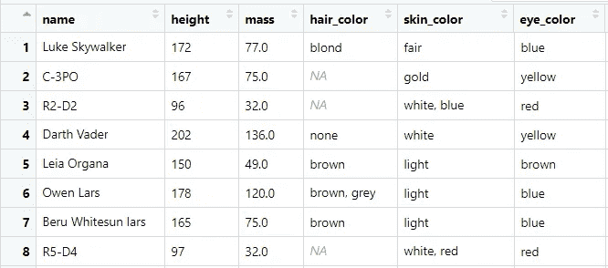
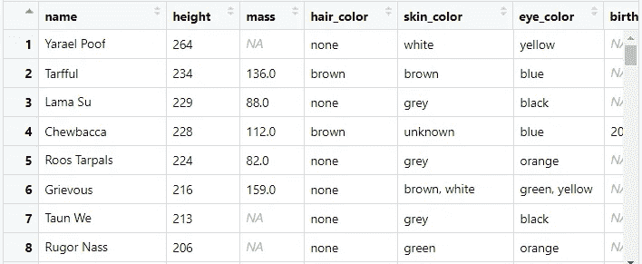
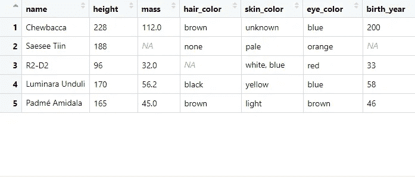
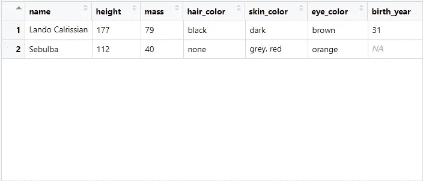
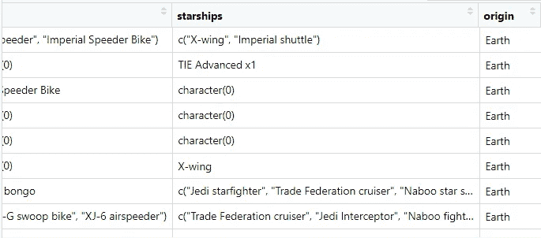
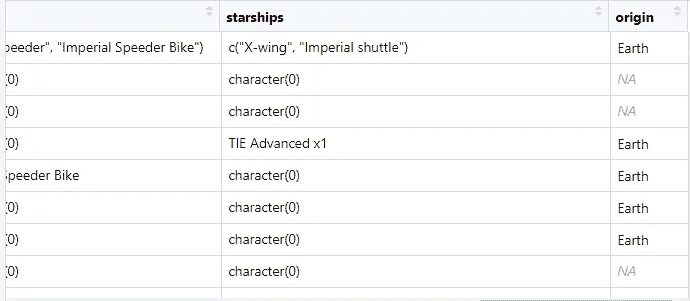

# 在 R 中学习 8 个很酷的 Dplyr 函数

> 原文：<https://towardsdatascience.com/8-cool-dplyr-function-to-learn-in-r-8736d7fa899c>

## 在本帖中，我们将检查一些最酷的 R 数据争论库中可用的重要函数——dplyr


图片来自[Ales Nesetril](https://unsplash.com/@alesnesetril)@ unsplash . com

D plyr 是一个非常方便的库，你可以在 R 中使用。[*DP lyr*](https://dplyr.tidyverse.org/)*是一个数据操作包，它是[*tidy verse*](https://www.tidyverse.org/)*universe 的一部分，universe 是一个库集合，目标是使 R 更快、更简单、更容易。**

**除了可以通过安装包来访问的很酷的功能之外， *Dplyr* 利用了管道(`%>%`)结构，这是[封装功能的更好方式](https://style.tidyverse.org/pipes.html)。可以说，管道使你的 R 代码更容易调试和理解——有时，以牺牲一些速度为代价。**

**该库有几十个函数可用于执行数据操作和争论——在本文中，我们将探讨以下几个:**

*   **`filter` —过滤行；**
*   **`arrange` —对数据帧进行排序；**
*   **`mutate` —创建新列；**
*   **`sample_n`—从数据帧中取样 *n* 行；**
*   **`sample_frac` —从数据帧中抽取一定百分比的行；**
*   **`summarize` —执行聚合功能；**
*   **`group_by` —按特定关键字对数据进行分组；**
*   **`inner, left and right_join`—通过键组合多个数据帧；**

**在这篇文章中，对于一些函数，我们还将比较如何使用 *R* 基本代码实现相同的目标——在大多数情况下，这将帮助我们理解在一些 R 操作中使用 *dplyr* 的好处。**

**我们将使用`starwars` dataframe 来执行我们的示例，这是一个内置的数据集，您可以在运行`library(dplyr)`后立即使用。**

**在我们开始之前，不要忘记在 R:**

```
**# Installing the dplyr Package
install.packages('dplyr')# Loading the library
library(dplyr)**
```

**预览我们的`starwars`数据帧:**

****

**星球大战数据帧预览——作者图片**

**该数据帧包含 87 行和 14 个与《星球大战》系列中不同角色相关的变量。这个数据帧是一个可以用来玩`dplyr`库的玩具数据帧——我们将使用它来理解我们的`dplyr`函数的行为，并用一些例子来玩。**

# **过滤器**

**我们将学习的第一个`dplyr`函数是`filter`。该函数广泛用于使用一个或多个条件从数据帧中过滤行。**

**Filter 是一个非常酷的功能，可以从数据帧中筛选出行——例如，让我们过滤掉所有在`starwars`表中属于`Droid`的物种:**

```
**filter_droids <- starwars %>%
  filter(species == 'Droid')**
```

**这段代码输出了星球大战系列数据中的 7 个字符:**

****

**从《星球大战》数据帧中过滤机器人——图片由作者提供**

**我们可以使用 base R 中的索引来实现完全相同的事情——有一个很大的警告:**

```
**starwars[starwars$species == ‘Droid’,]**
```

**上面的代码会产生一些`NA’s`——你必须添加一个额外的条件到`Droid`物种的 **only** 子集。这是使用`filter`功能的主要优势之一(自动删除 NA)——而不是通过`%>%`访问。**

**`filter`功能的另一个很酷的特性是我们可以灵活地添加更多的条件——例如，让我们只选择金色“皮肤”颜色的`Droids`:**

```
**filter_droids_gold <- starwars %>%
 filter(species == ‘Droid’, skin_color == ‘gold’)**
```

**这只输出一个 droid — C3PO！**

****

**从《星球大战》数据帧中过滤金色皮肤的机器人——图片由作者提供**

**通过给函数添加新的参数，我们提供了更多的条件。`filter`函数的这一特性使得您的代码更易于阅读和调试——尤其是当您有复杂的过滤器时。**

# **安排**

**`arrange`根据特定列对表格进行排序。例如，如果我们想按高度排序我们的`starwars`数据帧，我们只需键入:**

```
**sorted_height <- starwars %>%
 arrange(height)**
```

**表格输出:**

****

**按照人物高度对星球大战数据帧进行排序——图片由作者提供**

**我们按照高度列对表格进行排序，从最短的字符到最高的字符。**

**我们如何颠倒身高顺序？超级简单，我们只需要在列前加一个`-`:**

```
**reverse_sorted_height <- starwars %>%
 arrange(-height)**
```

****

**按人物高度降序排列《星球大战》数据帧——图片按作者排序**

**在这种情况下，我们获得降序排列的数据—在输出中，我们可以看到[亚雷尔·普夫](https://starwars.fandom.com/wiki/Yarael_Poof)是最高的一个，这是有意义的！**

**在 base R 中，您可以使用`order`和索引来模拟表排序:**

```
**starwars[order(starwars$height),]**
```

**使用 base R 的一个警告是，当我们想要按多列排序时，我们的代码会很快变得混乱。**

**在`dplyr`中，这很简单，你可能已经猜到了——我们只是给`arrange`函数添加了一个新的参数！**

```
**sorted_hair_height <- starwars %>%
 arrange(hair_color, height)**
```

****

**按多列排序星球大战数据帧——按作者排序图片**

**在这种情况下，我们按以下顺序输出字符:**

*   **首先，我们按字母顺序将角色按`hair_color`排序。**
*   **通过每个`hair_color`，排序由`height`应用。**

**很酷，因为我们可以用一个简单的函数方便地对表格进行排序。此外，我们可以通过简单地添加新的参数向排序顺序添加更多的列，这一事实使得`arrange`成为您想要执行排序操作时的首选函数。**

# **使突变**

**`mutate`是一个很酷的向表格添加新列的功能。**

**例如，假设我想在星球大战表中添加一个新列，其中包含两列的乘积——`height`和`mass`。让我们称这个列为`height_x_mass`:**

```
**starwars_df <- starwars %>%
  mutate(height_x_mass = height*mass)**
```

**在上面的例子中，我将结果写入一个新表`starwars_df`，因为现有的列保留在`mutate`函数中。`mutate`所做的只是向现有数据帧添加一个新列。**

**让我们看看上面代码的结果对象——滚动到 R 预览器的最后一列:**

****

**在《星球大战》数据帧上用 Mutate 创建的新列——图片由作者提供**

**如果您滚动到 R 数据帧预览器的末尾，您可以看到我们的新列已创建！**

**此栏是`height`乘以`mass`的计算结果。让我们检查一个例子，第一行包含关于特许经营主角的数据— `Luke Skywalker`。**

**卢克身高 172 厘米，体重 77 公斤:**

****

**卢克·天行者数据来自斯塔沃斯数据框架——图片由作者提供**

**我们期望`Luke`的`height_x_mass`是 **172*77，13.244。这是我们在第一行最后一列获得的值吗？让我们再检查一遍:****

****

**在《星球大战》数据帧上用 Mutate 创建的新列——图片由作者提供**

**确实是！**

**使用`mutate`,我们可以基于现有信息或全新的值创建新列。还有，你认为我们可以同时添加多个列吗？**

**让我们看看！**

```
**starwars_df <- starwars %>%
 mutate(height_x_mass = height*mass,
 franchise = ‘Star Wars’)**
```

****

**在星球大战数据帧上用 Mutate 创建的新列——图片由作者提供**

**不错！我们可以通过向函数添加一个新的参数来同时添加多个列——听起来很熟悉吧？这就是`dplyr`如此灵活的原因！**

**请注意，在上面的示例中，我们添加了两个新列:**

*   **正如我们已经讨论过的，带有`height_x_mass`的列。**
*   **名为`franchise`的新列包含所有行的字符串“星球大战”。**

# **样本 N 和样本分数**

**当您使用 R 执行一些数据科学、统计或分析项目时，您可能需要在整个管道中进行某种类型的采样。**

**使用 R base 时，必须处理索引，这有点容易出错。**

**幸运的是，`dplyr`有两个非常酷的函数来执行样本:**

*   **`sample_n`根据大量元素从数据帧中随机抽取行。**
*   **`sample_frac`根据数据帧原始行的百分比从数据帧中随机抽取行。**

**让我们看看！**

```
**starwars_sample_n <- starwars %>%
  sample_n(size=5)**
```

****

**《星球大战》数据帧中的 5 行样本——作者图片**

**注意，`sample_n`函数的输出给了我们 5 行——参数`size`的编号。使用`sample_frac`，我们不是检索“整数行”,而是检索原始行的百分比——例如，如果我们想获得 1%的行，我们可以提供:**

```
**starwars_sample_frac <- starwars %>%
 sample_frac(0.01)**
```

****

**《星球大战》数据帧中 1%的行样本——作者图片**

**为什么我们在输出中只看到一行？**

**原始的`starwars`数据帧包含 87 行。87 的 1%是多少？0.87.这个数字被向上取整，我们最终只从表中检索到 1 行。**

**如果我们给`sample_n`函数 0.02，你能猜出我们将检索多少行吗？**

```
**starwars_sample_frac <- starwars %>%
 sample_frac(0.02)**
```

****

**《星球大战》数据帧中 2%的行样本——作者图片**

**0.02 * 87 等于 1.74 **所以我们从表中抽取 2 行！****

**`sample_n`和`sample_frac`非常酷，因为只需修改一小部分代码，就可以在采样方法之间轻松切换。**

# **概括**

**`summarise`是一个非常方便的编写汇总函数的包装器。例如，假设我们想要获得`height`变量的平均值——使用基数 R，我们可以:**

```
**mean(starwars$height, na.rm=TRUE)**
```

**这在技术上是正确的——我们使用`na.rm`从列值中移除 NA，然后将平均值应用于向量。在`summarise`中，我们可以进行以下操作:**

```
**starwars %>%
 summarise(height_mean = mean(height, na.rm = TRUE))**
```

**这也输出大约 174，即`height`列的平均值。使用`summarise`相对于基数 R 有两个很酷的特性:**

*   ****的第一个特点是我们可以在不同的功能之间跳转:****

```
****starwars %>%
 summarise(height_max = max(height, na.rm = TRUE))****
```

****我修改了函数来计算列的`max`，而不是`mean`。你可以在这里查看[T4](https://www.rdocumentation.org/packages/dplyr/versions/0.7.8/topics/summarise)支持的一些内置功能****

*   ****第二个很酷的特性，可能也是最有用的，是你可以用`group_by`封装汇总函数来产生每组的值。例如，如果我想通过`Species`检查`mean`，我只需要:****

```
****mean_height_by_species <- starwars %>%
 group_by(species) %>%
 summarise(height_mean = mean(height, na.rm = TRUE))****
```

****酷！我可以在我的`summarise`之前执行一个`group_by`，输出每个`species`字符的平均高度。让我们看看输出数据帧:****

********

****通过小组示例进行总结—图片由作者提供****

****对于每个`species`，我们都有一个`height_mean`。这为我们提供了数据帧中每个特定`species`的所有字符的平均值`height`的概述。例如，从预告来看，[伊渥克](https://starwars.fandom.com/pt/wiki/Categoria:Ewoks)和[阿列纳斯](https://starwars.fandom.com/pt/wiki/Legends:Aleena)是平均身高最短的物种，这是有道理的！****

****在构建数据管道时，结合使用 summarise 和其他`dplyr`指令是很常见的。****

****如果你熟悉 SQL，在上面的例子中，我们用 3 行代码模拟了`GROUP BY`子句的行为。这是一个比基数 r 更容易使用的例子。****

# ****内部、左侧和右侧连接****

****说到`SQL` , `dplyr`有一些有趣的函数来执行数据帧连接。****

****假设我们有一个辅助数据框架，其中包含每个物种的虚拟起源，数据如下:****

********

****物种起源示例—作者图片****

****数据帧包含关于《星球大战》系列中一个物种的虚构起源的信息。我们可以使用连接将这个数据帧和`starwars`数据帧结合起来吗？****

****我们可以使用`dplyr`中的`join`功能来完成！先说一个`inner_join`:****

```
****starwars_inner <- starwars %>%
 inner_join(species_origin, on=’Species’)****
```

****`inner_join`函数在`%>%`之前的表和函数的第一个参数之间执行连接。在这种情况下，我们通过`Species`列连接`starwars`和`species_origin`数据帧。****

****该连接输出 36 个观察值和一个额外添加的列:****

********

****《星球大战》和《物种起源》数据框架内部连接的结果——图片由作者提供****

****注意，我们已经将`origin`列添加到了`starwars`数据帧中。自然，内连接只返回两个物种:`Human`和`Ewok`。由于我们正在执行一个`inner_join`，我们只返回键在两个数据帧中的行。****

****如果我们执行`left_join`，我们的数据帧的域会改变:****

```
****starwars_left <- starwars %>%
 left_join(species_origin, on=’Species’)****
```

****在这种情况下，返回的数据帧包含 87 行和附加列。当我们在`species_origin`中找不到该信息时,`origin`列会发生什么情况？让我们看看:****

********

****《星球大战》和《物种起源》数据帧左连接的结果——图片由作者提供****

****它被赋值给一个`NA`值！虽然我们从左边的表中取出所有的行(在`%>%`之前的数据帧)，但是在`species_origin`数据帧上没有匹配的`species`在`origin`上有一个`NA`值。****

****与`inner_join`和`left_join`类似，我们在`dplyr`中也有一个`right_join`:****

```
****starwars_right <- starwars %>%
 right_join(species_origin, on=’Species’)****
```

****在右连接中，主表是在函数的第一个参数中指定的表— `species_origin`。****

****对于 SQL 用户来说，这些`dplyr`函数将使他们向 R 的过渡更加容易，因为他们可以使用与大多数 SQL 实现相似的逻辑来执行连接。****

****我们完了！感谢你花时间阅读这篇文章，我希望你喜欢在`dplyr`世界中导航。可以说，在你的代码中使用`dplyr`会使你的代码更容易阅读和使用——这是在你的项目中消除代码债务的一个小小的推动。****

*******我在 Udemy 上建立了一个***[***R***](https://www.udemy.com/course/r-for-absolute-beginners/?referralCode=F839A741D06F0200F312)***入门和一个*** [***学习数据科学的训练营***](https://www.udemy.com/course/r-for-data-science-first-step-data-scientist/?referralCode=6D1757B5E619B89FA064) ***。这两个课程都是为初学者量身定做的，我希望你能在我身边！*******

********

****[数据科学训练营:你成为数据科学家的第一步](https://www.udemy.com/course/r-for-data-science-first-step-data-scientist/?referralCode=6D1757B5E619B89FA064) —图片由作者提供****

********

****绝对初学者的 R 编程 —图片作者****

****<https://ivopbernardo.medium.com/membership>  

下面是这篇文章中例子的一个小要点:****