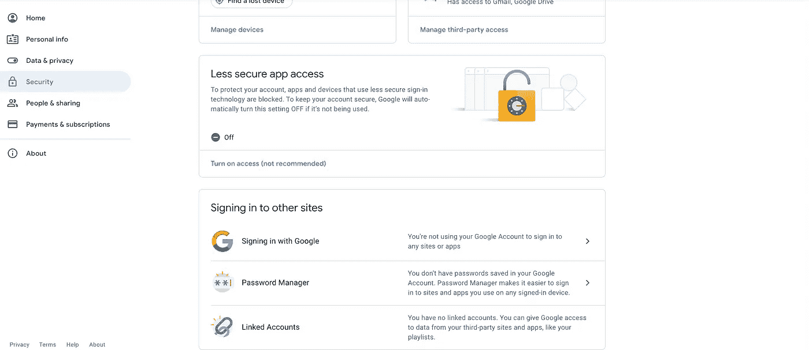

# 面向数据工程师和分析师的 8 种基本 Python 技术(带代码示例)

> 原文：<https://towardsdatascience.com/8-essential-python-techniques-for-data-engineers-and-analysts-with-code-samples-5915b31ce724>

## 这些是我重复使用最多的 Python 代码片段

即使是最有经验的程序员也要用谷歌搜索。

我重新搜索我一直使用的简单代码行，只是为了快速提醒语法。从这个意义上说，我真的是在为自己写这篇文章。这些是我作为数据通才反复使用的最常见的 Python 代码。

(以下所有示例都是使用 Python 3.6 或更高版本完成的)

## 将数据库中的数据查询成 Pandas 数据帧或 CSV 文件

[https://gist . github . com/camw 81/1 CCA 77 c 0878d 60 B2 C1 c 0d 839649 a 7a](https://gist.github.com/camw81/1cca77c0878ded60b2c1c0d839649a7a)

当 SQL 不足以进行分析或复杂的数据转换时，Python 可能是答案。但是在你争论任何数据之前，你必须把数据放到内存中，这样你就可以用它做一些事情。如果您的数据库在 MS SQL Server 上，使用 PYODBC 如果您在 Postgres 上，使用 PSYCOPG2，您可以使用 Python 轻松地编写查询和提取数据。从那以后，只需要将数据转换成易于使用的格式。为此，我喜欢熊猫。将查询数据放入 Pandas 非常简单，只需将列表转换成 CSV，然后使用 pandas *read_csv* 函数。或者，如果需要的话，您可以将 read_csv 构建到您的 *run_sql* 函数中。

## 发送带有完整错误代码输出的电子邮件警报

[https://gist . github . com/camw 81/c 791 a 3 直流 992462059 接入 0562225ffc](https://gist.github.com/camw81/c791a3dc992462059accce0562225ffc)

监控自动化作业(cron 或其他)中的错误对于运行数据管道或其他代码至关重要。我广泛使用电子邮件提醒，当我在自动节奏上运行的任何脚本中断时提醒我。

为了快速找到问题的根源，我也非常喜欢在我的电子邮件中收到 Python 的完整回溯错误消息，这样我就能确切地知道在我修复脚本时要寻找什么。traceback 包允许您使用 *traceback.format_exc()* 来获取这些信息，然后将其作为一个字符串放入您的电子邮件中。

使用代码片段的最佳方式实际上是将函数调用到另一个脚本中，在该脚本中有您想要监控的代码。将您的代码包装在一个 *try/except* 语句中，然后在出现异常时执行 *send_alert* 函数，将完整的错误报告发送到您的电子邮件中。

在使用此代码之前，您需要有一个虚拟的电子邮件帐户设置。Gmail 是最简单的。对于本例，请确保您打开了“不太安全的应用程序访问”(见下面的截图)。



## 将 CSV 文件写入数据库(Postgres 或 SQL Server)

[https://gist . github . com/camw 81/ff 53586 ad 228 F2 f 624522 ba 10 C9 e 5930](https://gist.github.com/camw81/ff53586ad228f2f624522ba10c9e5930)

这是很多代码——但它是我每天使用的最重要的技术之一，用于从任何来源获取数据并将其推入数据库。上面的例子最适合使用 MS SQL Server——特别是 Azure SQL 数据库和 Azure Blob 存储。我将[把链接放在这里](https://gist.github.com/camw81/6be60842c67d9ae3e4610781d82c91ac)到另一个你可以用于 POSTGRES 数据库的例子——这个例子稍微简单一点。

这里的基本思想是通过几个步骤将数据从 CSV 文件导入数据库:

1.  将 CSV 文件推入 blob 存储。
2.  通过在 SQL 数据库上创建外部数据源，将目标数据库表绑定到 blob 存储。
3.  创建一个临时表，您将在其中插入 CSV 文件。
4.  将 CSV 文件批量插入到临时表中
5.  最后，使用合并标准将临时表合并到最终表中。

有无数种方法可以让数据到达你想要的地方。这是我几乎每天都依赖的方法。


图片由[this isensegining](https://www.pexels.com/@thisisengineering?utm_content=attributionCopyText&utm_medium=referral&utm_source=pexels)来自[像素](https://www.pexels.com/photo/extreme-close-up-photo-of-codes-on-screen-3861976/?utm_content=attributionCopyText&utm_medium=referral&utm_source=pexels)

## 从 REST API 取回多页数据

[https://gist . github . com/camw 81/b5 c 723204 c 977 bb 5296 b 2393331301](https://gist.github.com/camw81/b5c7234204c977bb5296b23933321301)

每当我需要创建一个与 API 集成的 ETL 管道时，我会使用上面两段代码的一些迭代。许多 API 使用异步请求(您发出一个代码请求，然后在后台等待它完成)，我也将它包含在示例中。为了让代码工作，您需要为您正在使用的 API 交换端点 URL 和特定的分页键。如果 API 要求使用 client_id/client_secret 进行认证，那么您还需要遵循一个认证过程来获取访问令牌(我在[的另一篇文章](https://medium.com/me/stats/post/edcc8d6441b1)中有一个这样的例子)。一旦完成了这些，上面的代码示例将成为构建集成的良好起点。

## 为数据库插入清理和格式化 REST API JSON 结果

[https://gist . github . com/camw 81/b5 c 723204 c 977 bb 5296 b 2393331301](https://gist.github.com/camw81/eb92fc23b690967237059adff254f4df)

对于我编写的几乎所有 API 集成，我都使用上述代码片段的变体。这种方法假设数据将以 JSON 格式返回——这意味着它应该可以处理大约 75%的 API 数据请求。格式化后，这个脚本将把 JSON 数据结构组织成表格格式(列表的列表),然后可以很容易地插入到 CSV 中——准备好推送到 DB。可能有一个更简单的方法来做到这一点，但这是我多年来一直使用的方法，它还没有让我失望。

## 清理 CSV 文件以插入数据库

```
import pandas as pdwrite_file = '~/directory/filename.csv'df = pd.read_csv(write_file)df = df.replace({‘\$’:’’}, regex = True)
df = df.replace({‘%’:’’}, regex = True)
df = df.replace({‘\,’:’’}, regex = True)
df = df.replace({“‘“:’’}, regex = True)
df = df.replace({“nan”:’’}, regex = True)
```

这是一个简单的方法，但是它为我节省了无数时间来清理混乱的数据源——比如手动创建的 CSV 文件。你们中的许多人可能遇到过这样的情况，有人希望将 OneDrive 或 GDrive 文件夹中的 CSV 文件推送到数据库中。问题是，这些文件的格式通常会使数据库插入变得很麻烦。幸运的是，Pandas 内置了 *replace* 函数，只需一行代码就能清除特定字符。

如果您的文件包含带有$或%或其他符号的数字，并且您希望将它们作为数字类型推入数据库，那么这个代码片段非常有用。用 replace 函数和 chosen 符号清理数据将会清除所有这些数据，使您使用的任何数据库都可以轻松地将数据作为数字类型读取。

## 创建结束日期和开始日期

```
import datetime #### Set todays date ####
today = datetime.datetime.now().date()#### Create to_date by adding or subtracting dates from today's date
to_date = today-datetime.timedelta(1) #### Create your from date by subtracting the number of days back #### you want to start
from_date = today-datetime.timedelta(7)#### Create timestamp of today's date using desired format
todaysdate = datetime.datetime.strftime(datetime.datetime.now(),'%Y-%m-%d')
```

大多数 API 在请求数据时都需要日期参数。该示例使用 Python 的 datetime 包，通过。timedelta()函数。我一直使用它来根据脚本运行的日期/时间，在我的脚本中构建自动的到/从日期计算。

## 分块处理大的 Python 列表

```
def chunker(seq, size):
 return (seq[pos:pos + size] for pos in range(0, len(seq), size))for group in chunker(order_items,100):
      for item in group:
# Do something to each group
```

这是一个我经常使用的小函数，用来把非常大的列表分块。这对于清理和格式化 JSON 数据(如上所示)非常有用，因为有时您会从 API 中提取大量数据，并希望对其进行处理，然后以可管理的块的形式将其推送到 DB 中。 *chunker* 函数允许你选择一次要处理多大的块，然后在每个块上运行你的代码。这个例子使用了一个 100 个条目的块，但是您可以根据需要调整这个数字。

这就是我在日常数据工程和分析工作中一直使用的 8 种 Python 技术。希望其中一些能让您的数据生活更轻松。

如果你喜欢这篇文章，你可以在这里找到我的其他作品。你也可以在推特上关注我 [@camwarrenm](https://twitter.com/camwarrenm)