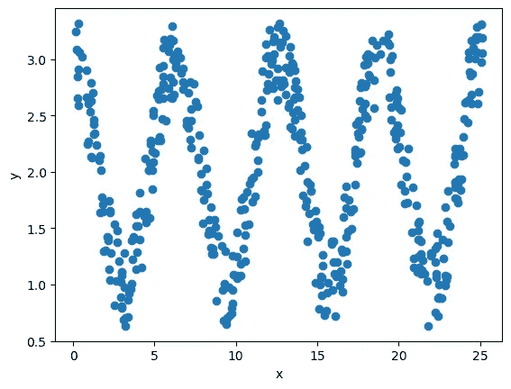
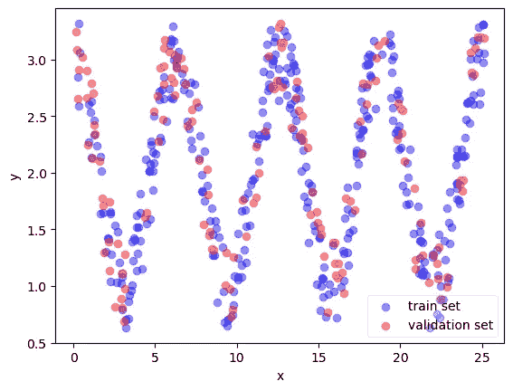
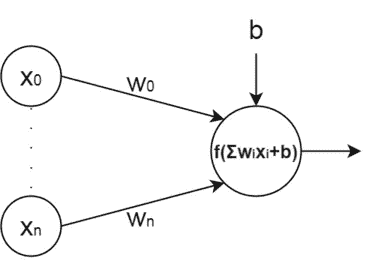
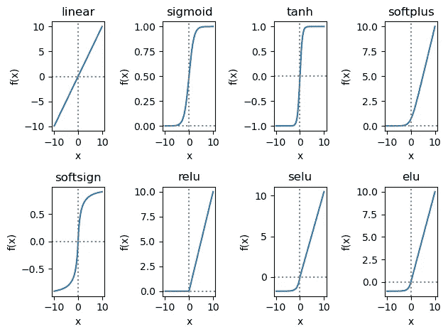
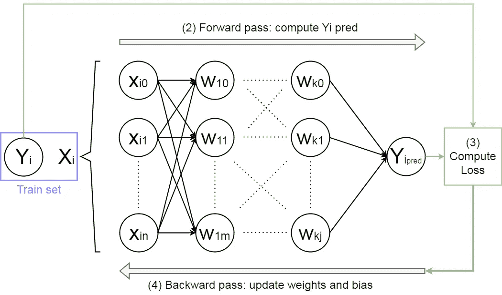

# 神经网络简介:一个回归问题

> 原文：<https://towardsdatascience.com/a-brief-introduction-to-neural-networks-a-regression-problem-c58c26e18008>

## Python 神经网络实用入门指南


照片由[细川玉子达摩](https://unsplash.com/@graciadharmaa?utm_source=medium&utm_medium=referral)在 [Unsplash](https://unsplash.com?utm_source=medium&utm_medium=referral)

想学机器学习又不知道从何入手？这个教程就是为你准备的！在本教程中，您将学习机器学习的基础知识:从模型概念开始到验证。

**目录**

[1。](#6dba)
简介 [2。库](#acd1)
[3。问题理解](#1c10)
[4。数据准备和预处理](#2338)
[5。模型构思](#5a23)
∘ [5.1 人工神经元模型](#28bc)
∘ [5.2 激活功能](#053a)
∘ [5.3 层](#8be9)
∘ [5.4 多层模型](#fac8)
[6 .训练](#2390)
[7。验证](#4744)
∘ [7.1 学习曲线](#96a8)
∘ [7.2 测试集评测](#fd4a)
∘ [7.3 评测指标](#47df)
∘ [7.4 显示所学函数](#7e36)
[8。结论](#5daf)

# 1.介绍

机器学习的目标是提出一个模型(一种方法)来预测输入实例的值、类或聚类。该模型是通过利用现有数据(数据集)构建的。为了实现这样的模型，考虑一组步骤，即:

*   问题理解。
*   数据准备和预处理。
*   模型构思。
*   训练模型。
*   模型评估和验证

# **2。库**

在本教程中，我们将使用:

*   **熊猫:**用于数据操作(导入和拆分数据)。
*   **keras:** 用于模型构思和训练。
*   **matplotlib:** 用于数据可视化。
*   **scikit-learn (sklearn):** 用于额外的指标计算。

我们还添加了以下代码行来重现每次执行的结果:

# 3.问题理解

理解问题是要考虑的第一步。它包括识别问题的性质:它是一个回归问题(预测一个真实值，如用户对不同产品的参与度)还是一个分类问题(预测一个输入实例的类别，如鸢尾花的分类或情感分析)。有时候回归会给出不好的结果，在这种情况下，你要考虑把它变成分类问题的可能性。比如:把预测用户参与度的问题转化为对他的参与度进行分类(0 参与度、低参与度、中参与度、高参与度)的问题。

例如，我创建了一个玩具数据集，你可以从我的 GitHub 库下载。数据集代表一个信号，本例的目的是学习信号函数，以便我们可以将其用于未来的预测。在下一节中，我们将通过代码来探索它。

# 4.数据准备和预处理

使用神经网络解决给定的问题意味着利用数据集。在此之前，需要对数据集进行预处理。数据预处理通常包括清理(替换缺失值和移除异常值)、离散化(将连续数据转换为数据损失最小的有限区间集)和归一化(如将值归一化为 0 到 1 之间)。这一步使用的技术取决于数据集的性质和/或随后使用的模型的性质。在数据预处理过程中，可视化数据以确保数据得到正确处理是非常重要的。在这一阶段结束时，数据集通常被分成 2 组:

*   **训练集:**用于设置神经网络中的权重、线性回归中的系数等模型参数。
*   **验证集:**用于评估模型在训练过程中针对新数据(不属于训练集)的行为。

在这篇文章中，我们的主要焦点是神经网络方面。因此，我们将使用不需要预处理的数据集。

让我们从导入数据集开始，打印前 5 行并绘制散点图:

```
There are 510 instances.
         x       y
0  10.5392  1.2058
1   5.1571  2.6770
2  12.6563  3.1471
3  11.7546  2.3668
4  10.9499  2.3400
```



初始数据集

数据集包括 510 行(实例)和两列:单个要素(x)和要学习的值，也称为目标(y)。这两个特征都是实数。

现在，我们将数据集随机分为两组:训练集和验证集。30%的数据将用于验证，70%用于培训:



将数据分成训练集和验证集

数据集现在可以用于下一步了。我们将不应用任何进一步的数据预处理。最重要的是没有丢失的值，因为神经网络不能处理丢失的值。我们将在接下来的教程中看到如何处理它们，以及如何应用进一步的数据预处理；同时你可以查看其他媒体文章。注意，我提供了另一个数据集‘test . CSV’作为测试集。这里，测试集是从原始数据集中随机选择的。它将用于测试训练后的模型。

# 5.模型概念

一旦理解了问题并准备好了数据，模型概念就产生了。设计一个神经网络模型包括:定义每层神经元的数量，定义层数，定义激活函数。在本节中，我们将探索 Keras 提供的不同类型的层。然后，给出了激活函数。最后，我们将创建我们的多层感知器神经网络。但首先，让我们了解一下单个神经元模型(也称为节点)。

## 5.1 人工神经元模型

下图描述了一个人工神经元模型:



人工神经元模型。

单个神经元模型表示为:

*   **权重(W0、..，Wn)。**权重定义了其相关输入对神经元输出的影响。权重在训练之前被初始化，并且在训练期间被更新。
*   **偏见(b)** 。偏差是一个与输入无关的常数。我们可以把它看作是用来抵消结果的截距。类似于权重，偏差在训练之前被初始化，并且在训练期间被更新。
*   **激活函数(f)。**激活函数根据加权和定义节点的输出。如果激活函数是线性的，则返回加权和。Keras 提供了几个激活函数，我们稍后会看到。

人工神经元的输入(x0，..xn)可以是输入数据集(特征)或其他人工神经元的输出。

## 5.2 激活功能

Keras 提供了一组丰富的激活函数，其中我们列举了:*线性*函数、 *sigmoid* 函数、 *tanh* 函数、 *softplus* 函数、 *softsign* 函数、 *ReLU (* 整流线性单元 *)* 函数、 *SELU (* 比例指数线性单元 *)* 函数这些功能如下图所示。我们在[-10，+10]中设置 x。



Keras 提供的常用激活功能。

了解函数的共域很重要，这样您就可以为模型输出定义适当的函数。我一般在选择输出激活功能的时候会参考上图。假设我们的模型要学习一个线性函数(一个来自ℝto ℝ的函数)，RELU 不能使用，因为它的余域是正实数的集合。我们将在后面看到激活函数对模型输出的影响。

对于分类问题，还有其他的激活函数。这些将不会在本教程中讨论，而是在下一个教程。但是，您可以在 [Keras 激活功能参考](https://keras.io/api/layers/activations/)中找到更多详细信息。

## 5.3 层

既然引入了单神经元模型，那么如果我们有多个神经元(节点)呢？具有相同输入的一组节点构建一个层(请参见下图)。同一层的节点通常具有相同的激活函数。


单层模型。

根据[文档](https://keras.io/api/layers/#core-layers)，Keras 提供多种类型的层。每一层都有自己的参数和功能。有通常用于 2D 和 3D 数据的卷积图层和汇集图层，有通常用于归一化和正则化图层输入的归一化图层和正则化图层，还有核心图层。在本教程中，我们只对作为核心层的输入层和密集层感兴趣。

输入层用于定义模型输入的特征数量(`shape`)。在 Keras 中，它主要被定义为:

```
keras.Input(
    shape=None,
    **kwargs
)
```

密集层是 Keras 中称为单元的一组节点。它主要被定义为:

```
keras.layers.Dense(
    units,
    activation=None,
    use_bias=True,
    kernel_initializer="glorot_uniform",
    bias_initializer="zeros",
    **kwargs
)
```

其中:

*   `units`是这一层的神经元数量。
*   `activation`是机组的激活功能。
*   `use_bias`是一个布尔值，用于指定是否使用偏差。默认情况下，它设置为 True。
*   `kernal_initializer`和`bias_initializer`分别定义如何初始化权重和偏差。默认情况下，它们分别被设置为`glorot_uniform`和`zeros`。

你可以在 [Keras layers API](https://keras.io/api/layers/) 中找到更多关于层的信息。

## 5.4 多层模型

一系列层定义了一个多层模型。通常，当前层的每个节点都连接到前一层/下一层的所有节点。这种类型的模型称为全连接网络。模型中有三种类型的层:

*   **输入层**是第一层，它的输入是实例特征:模型的输入。
*   **输出层**是最后一层，其输出是整个模型的输出。该层的激活函数必须根据所需的输出仔细选择。
*   **隐藏层**是输入层和输出层之间的层。

现在继续写一些代码，让我们创建我们的模型！该模型包括:定义要素数量的输入层、具有 200 个单元的三个隐藏层以及每个层的 sigmoid 激活函数，最后是具有单个单元和线性激活函数的输出层:

```
_________________________________________________________________
 Layer (type)                Output Shape              Param #   
=================================================================
 dense (Dense)               (None, 200)               400       

 dense_1 (Dense)             (None, 200)               40200     

 dense_2 (Dense)             (None, 200)               40200     

 dense_3 (Dense)             (None, 1)                 201
```

功能`model.summary()`显示模型架构。对于每个层，显示其类型、输出形状(单位数)和权重数。`dense_1`的权重的数量计算如下:作为先前密集层的单元的输入的数量是 200，并且每个单元连接到所有先前的单元，因此我们有`200 * 200 = 40000`权重。此外，每个单位都有偏差，那么我们总共有 200 个偏差。因此，参数总数为`40000 + 200 = 40200`。请问`dense`和`dense_3`的参数个数是怎么计算出来的？

我们的模型已经准备好接受训练了！

# 6.培养

那么什么是培训呢？训练是找到尽可能符合训练数据的权重。换句话说，它是更新权重的过程，以使预测值和地面真实值(也称为目标值)之间的差异非常小。当目标是找到最佳权重以最小化模型输出和目标之间的差异时，我们也可以将其视为优化问题。



前馈网络的训练算法

那么训练是如何进行的呢？为了回答这个问题，我们以简单的方式描述不同的步骤。

```
**1\. Initialize the weights and bias.****2\. Forward pass: compute the model output.****3\. Measure the error between the target and the output using the loss function.****4\. Backward pass: propagate the error and update the weights and bias using an optimizer.****5\. Repeat the steps 2 to 4 for every batch.****6\. Repeat the steps from 2 to 5 *epochs* times.**
```

我敢打赌，对于绝对初学者来说，有很多新单词。别急，我们来一一介绍一下:

*   **优化器**。它会更新可训练重量。Keras 提供了一套优化器，其中有 [SGD](https://keras.io/api/optimizers/sgd/) (随机梯度下降)和 [Adam](https://keras.io/api/optimizers/adam/) 。
*   **损失函数**。它衡量模型与训练集的拟合程度；换句话说，它测量训练期间预测和实际情况之间的差异。Keras 实现了不同类型的损失函数。在回归损失函数中，有 MSE(均方误差)和 MAE(平均绝对误差)。
*   **批次**。批次是用于更新重量的样本数量。在训练期间，数据被分成批次，并且根据每一批次更新权重。
*   **纪元**。一个时期是所有训练数据都被使用的时候。时期的数量定义了权重沿着所有训练数据更新的次数。是停止训练的条件之一。
*   **学习率**。学习率控制权重如何受到传播误差的影响；一般设置在[0，1]之间，训练时可以更新。例如，SGD 和 Adam 的默认学习率分别等于 0.01 和 0.001。

在 Keras 中，开始训练之前要做的第一件事是编译您的模型，这意味着通过传递一些参数来配置您的模型，如:损失函数、优化器和训练期间要跟踪的指标。在这里，我们指定了将作为字符串使用的优化器，这意味着将使用默认参数，包括学习率。为了训练模型，调用函数`[fit()](https://keras.io/api/models/model_training_apis/#fit-method)`。在这个例子中，我们传递了训练数据(`x_tain`和`y_train`)、历元数和批量大小作为参数。

当`verbose=1`、损失(`loss`、`val_loss`)和度量(`mae`、`val_mae`)值分别在训练和验证集的每个时期结束时打印时:

```
Epoch 1749/1750
6/6 [==============================] - 0s 9ms/step - loss: 0.0554 - mae: 0.1955 - val_loss: 0.0596 - val_mae: 0.2085
Epoch 1750/1750
6/6 [==============================] - 0s 6ms/step - loss: 0.0539 - mae: 0.1966 - val_loss: 0.0586 - val_mae: 0.2062
```

# 7.确认

显示的上一个时期的指标不足以断定模型是否已经从数据中学习。首先要观察的是学习曲线。然后，我们可以使用其他指标来评估我们的模型。如果可以的话，我们也可以在测试设备上测试它。

## 7.1 学习曲线

学习曲线是我在培训结束后观察到的第一个指标。它揭示了模型在训练期间对可见数据(训练集)和不可见数据(验证集)的性能。


学习曲线

## 7.2 测试集的评估

通常，测试集与数据集一起提供。它用于评估训练后的模型。有时，您需要自己将数据集分成训练集、验证集和测试集。但是，当数据集较小时，不考虑测试集。正如我前面提到的，在本教程中，测试集是随数据集一起提供的。

让我们在测试集上评估我们的模型，看看它是如何工作的。我们首先导入测试集，然后调用方法`[evaluate()](https://keras.io/api/models/model_training_apis/#evaluate-method)`,该方法返回训练期间使用的损失和度量:

```
Test set: - loss: 0.05698258429765701 - mae: 0.20276354253292084
```

## 7.3 评估指标

在培训过程中，使用了以下指标:

*   **被用作损失函数的均方差(MSE)** 。
*   **平均绝对误差(MAE)** 这是一个额外的指标。

我们可以使用其他指标来评估我们的模型，我选择了另外两个我感兴趣的指标:

*   **中值绝对误差(MedAE)** 对异常值稳健，因为它采用中值而不是目标和预测之间所有绝对差异的平均值。
*   **平均绝对百分比误差(MAPE)** 对相对误差敏感，不受目标变量全局缩放的影响:它计算误差百分比。

```
Displaying other metrics:
         MedAE   MAPE
Train:   0.173   0.112
Val  :   0.17    0.119
Test :   0.198   0.115
```

## 7.4 显示已学习的功能

即使计算出的指标显示模型很好地符合数据集，直观地看到它有多好也是很重要的。这里，我们用`x`来画学习过的函数:


已学习的功能。红色:用 x 表示的函数。蓝色:数据集。

该模型已经学习了类似余弦的函数。

# 8.结论

本文到此为止！在本文中，我们学习了如何创建神经网络，并针对回归问题对其进行训练和验证。我们将在接下来的教程中学习更难的例子。如果你问我这是不是这个问题有史以来最好的模型，我马上说:不是！你可以做得更好！您可以通过改变层数和单元数来开始玩模型架构。您还可以更改训练参数并比较结果。你可以在下面的评论里和我分享你的解决方案！

这是我在机器学习方面的第一篇文章，绝对不是最后一篇！我会写更多关于它的教程(机器学习的数据预处理，分类的神经网络，情感分析，等等)。)，敬请期待！

谢谢，我希望你喜欢读这篇文章。你可以在我的 GitHub 库中找到例子。如果你有任何问题或建议，欢迎在下面给我留言。

</a-brief-introduction-to-neural-networks-a-classification-problem-43e68c770081>  

# 图像制作者名单

除非另有说明，所有图片均为作者所有。