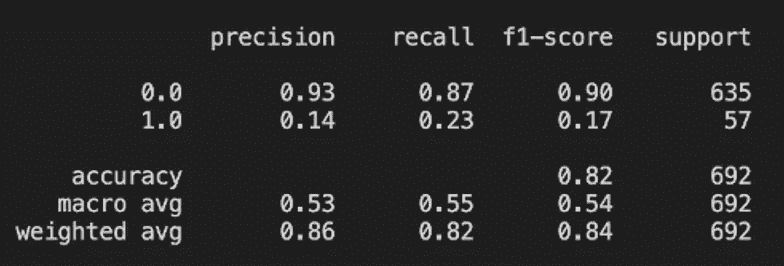
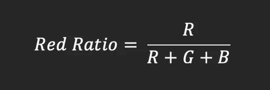

# 启发式案例:为什么简单的解决方案常常在数据科学中胜出

> 原文：<https://towardsdatascience.com/a-case-for-heuristics-why-simple-solutions-often-win-in-data-science-a31967766daa>

## 在为启发式辩护的过程中，我研究了在寻找数据科学产品时，简单的解决方案通常是最佳的停靠港

米奇·奥尼尔在 [Unsplash](https://unsplash.com?utm_source=medium&utm_medium=referral) 上的照片

2016 年，futurethink 的首席执行官兼谷歌活动的顶级演讲者 Lisa Bodell 提出[“简单正迅速成为我们这个时代的优势”](https://www.routledge.com/Why-Simple-Wins-Escape-the-Complexity-Trap-and-Get-to-Work-That-Matters/Bodell/p/book/9781629561295)。然而，在数据科学和机器学习领域，我们往往更喜欢更复杂的解决方案，虽然通常会导致难以置信的结果，但也可能导致挫折、失败和漫长的交付时间。

虽然这篇文章并不是号召放弃 Keras 并回归 Excel，*它是*一个温和的提醒，提醒你考虑利用简单的启发式方法来基线化你的解决方案，甚至让你考虑从*开始运送它们，然后*构建更高级的东西。

在本文中，我将从最近的一个研究项目中汲取经验，以及我如何在开发数据科学解决方案时使用这些发现来指导我的日常方法。我将深入探究启发式的定义，从 [Martin Zinkevich 的*机器学习规则*](https://developers.google.com/machine-learning/guides/rules-of-ml) 中学习，深入探究最近的一个项目，该项目旨在识别 gif 中危险的光敏癫痫序列，最后总结利用启发式的关键学习。

# 试探法的简明介绍

在*机器学习的规则*中，Zinkevich 提出启发式是“一个简单而快速实现的问题解决方案”。试探法通常被用作基于规则的算法或指标的总称，允许您对数据进行分类或推断，或做出关于数据的决策。启发式方法可用于解决各种问题，包括:

*   对垃圾邮件进行分类(例如使用基于规则的方法来检测某些单词)
*   向用户显示相关结果(例如他们所在国家或地区最受欢迎的结果)
*   识别应用或游戏中表现最好的用户(通过对行为或参与度进行排名)

虽然试探法被认为简单快捷，但它们可能并不总是数据科学家解决问题的首选。以我的经验来看，启发式方法可以被忽略，而优先考虑更复杂的解决方案，然后当更先进的解决方案失败时，简单性就会取而代之。在我自己的学术和职业生涯中，这是我亲身经历的一种情况。在这篇文章中，我想分享我比较启发式和深度学习解决方案的发现，以及为什么简单的启发式应该是你的第一个选择。

# 挑战

最近，我有机会进行研究，以了解是否有可能开发出检测视频和 g if 中光敏癫痫触发因素的解决方案。值得强调的是，**这项工作从未被指定用于生产**，而那些确实希望影响人们并做出决策的人工智能医疗解决方案[应该遵循世界卫生组织](https://www.who.int/news/item/28-06-2021-who-issues-first-global-report-on-ai-in-health-and-six-guiding-principles-for-its-design-and-use)和其他领先组织的研究人员制定的原则。然而，我的挑战是确定该领域内的可能性，并通过深度学习建立第一轮解决方案。

## 了解光敏性癫痫

光敏性癫痫属于反射性癫痫的更广泛类别，即该领域的两位主要研究人员 Okudan 和 zkara 指出，已知的“客观特异性”触发因素可能导致癫痫发作。近年来，不幸的是，不良演员在网上恶意针对光敏癫痫社区。例如，记者莉安娜·鲁珀特(Liana Ruppert)在撰写了视频游戏《T4》和《赛博朋克 2077》(T5)中的危险内容后，成为光敏性癫痫触发视频的目标。

《赛博朋克 2077 》,一款以发布时的危险场景为特色的视频游戏。照片由 Stefans02: [来源](https://www.flickr.com/photos/stefans02/51233501047)

South、Saffo 和 Borkin 在他们的论文*检测和防范社交*媒体中引发扣押的 gif，*中开发了一种消费者驱动的方法来检测危险的 gif，这种方法可以用来打击在线目标的增加。为了衡量他们工具的性能，他们还开发了一个危险和安全 gif 数据集。gif 分类如下:*

*   安全:不含光敏性癫痫触发器
*   闪烁:包含闪烁序列
*   红色:包含与饱和红色之间的转换
*   图案:包含重复的图案
*   危险:包含红色、图案或闪光

该数据集的开发为开发机器学习方法以应对在 gif 中识别光敏癫痫触发因素的挑战提供了机会，这也是 South、Saffo 和 Borkin 确定的未来研究方向。我的目标是开发一个相对简单的深度学习解决方案，使用 2D CNN 架构和转移学习，然后在 South、Saffo 和 Borkin 确定的不同危险类别上测量这种方法的性能。

## 深度学习方法

对于这个项目，我在方法上有完全的灵活性，一个很长的期限和理解的倾向；这可能吗？从我自己的经验来看，这三个因素的结合往往可以导致数据科学家选择更复杂的解决方案，而不是更简单的解决方案；后者可以保证在某个截止日期前交付。

我开发了一个卷积神经网络(使用 Xception 架构)，利用迁移学习将输入的 gif 序列分解为四个图像，然后合并在一起。

## 为什么选择 2D 卷积神经网络？

作为研究的一部分，我确定了各种 gif 和视频分类架构的优缺点，包括多流和 3D CNN 方法。对于第一遍，我决定将危险的 gif 序列转换成一个图像输入，将四帧 gif 合并成一个图像。CNN 的输入数据示例如下所示:

*训练用于检测危险序列的神经网络的输入示例。Gif 来自:* South，l . Borkin，m .&Saffo，D. (2022 年 5 月 9 日)。[检测和防御社交媒体中诱发癫痫发作的 GIFs】。作为项目的一部分创建的图像。](http://osf.io/5a3dy)

虽然为这个项目选择合适的架构超出了本文的范围，但我强烈推荐 [Rehman 和 Belhaouari 在 2021 年对视频分类深度学习的评论。](https://www.techrxiv.org/articles/preprint/Deep_Learning_for_Video_Classification_A_Review/15172920)

训练了四个模型，旨在检测光敏癫痫触发器(红色、图案、闪光和所有这些，分组在危险下)。虽然危险模型表现最好，但几乎所有模型都无法检测出危险的 gif。下面，为被训练来检测危险和饱和红色转变的模型提供分类报告:

## *危险车型性能*

“危险”模型的性能结果。作者创建的图像。

## *红色车型性能*

“红色”型号的性能结果。作者创建的图像。

虽然有了更大的数据集、采样技术的使用和不同的架构选择，这种性能无疑可以得到改善，而且正如大多数类的过度拟合和优化所发生的那样，我在这一点上的目标是简单地建立深度学习的可行性。将来，我会以这种简单的方法为基础(与启发式方法一起)开发不同的解决方案。

## 启发式方法

作为他们研究的一部分，South、Saffo 和 Borkin 开发了三种基于规则的算法来检测闪光、图案和红色饱和度。每个算法(或启发式算法)都是基于规则的，这使得它既可解释又相对容易实现。例如，为了检测包含红色转换的危险序列，使用以下等式:

计算帧的红色比率，来自 South、Saffo 和 Borkin (2021)的方程。[来源](https://dl.acm.org/doi/pdf/10.1145/3411764.3445510)

计算框架的纯红色，来自 South、Saffo 和 Borkin (2021)的方程。[来源](https://dl.acm.org/doi/pdf/10.1145/3411764.3445510)

利用他们的试探法，South、Saffo 和 Borkin 报告了强有力的结果，对于红色饱和度检测具有完美的准确度、召回率和精确度，其中**准确度为 100%，召回率为 100%，精确度为 67%。**

一旦我的深度学习模型被开发出来，我想看看即使是最基本的启发式方法是否也能胜过开发的深度学习模型。鉴于红色饱和度模型的较差性能，这是一个相当有偏见的练习，然而，开发一个简单的解决方案并检查其性能仍然很有趣。

对于我的启发，我利用 Numpy 和 Matplotlib 来读取为 CNN 创建的图像，然后使用 South、Saffo 和 Borkin 的 RedRatio 方程来计算图像的分数。由于训练和测试之间的数据分离，我开发了危险红色图像的训练数据的截止值，并将其应用于为神经网络方法开发的非常小的测试集。结果如下所示:

在预处理的 gif 上只使用红色比率规则可以提高性能。作者创建的图像。

即使在这个非常小的数据集上，简单的启发式方法也优于深度学习方法。此外，South、Saffo 和 Borkin 更先进的基于规则的启发式算法在识别危险内容方面也表现得非常好。

# 评估启发式

有了这些发现，一些清晰的思考和结论开始在启发法的力量上发展，以及何时超越它们。我在这一领域的三个主要收获如下。

## 首先用简单的解决方案进行基准测试

虽然 South、Saffo 和 Borkin 认为未来的研究方法可以结合机器学习，但这里有一个有趣的转折点。在机器学习的*规则*中，Zinkevich 提出:

> “如果你认为机器学习会给你 100%的提升，那么启发式学习会让你达到 50%。”

然而，有了 South、Saffo 和 Borkin 开发的数据集，他们已经能够通过基于规则的算法实现 100%的“既定目标”。在开发机器学习解决方案时，这是一个重要的学习过程:**首先学习用一个简单的启发式方法进行基准测试，并考虑这是否足以用于生产。**

## 仔细检查您是否有足够的数据来开发机器学习解决方案

正如津克维奇在*机器学习规则*中强调的:

> “机器学习很酷，但它需要数据。理论上，您可以从不同的问题中获取数据，然后为新产品调整模型，但这可能会落后于基本的 [**启发式算法**](https://developers.google.com/machine-learning/glossary#heuristic) 。

从红色模型的性能结果中，可以看到这一挑战在行动中。“红色”测试数据集中几乎没有任何数据，这意味着模型受到了难以置信的阻碍。当然，尝试过采样技术是可行的(作为这个项目的一部分，我还实施了 Tensorflow 的[类不平衡指导](https://www.tensorflow.org/tutorials/structured_data/imbalanced_data))。然而，仅仅克服一小部分少数民族的挑战是不够的。

在这方面，一个简单的胜利是**评估不同的班级规模，尤其是当同时开发多个机器学习模型时，不要害怕为一些问题提供启发式算法，在你有更多数据的地方和时间利用机器和深度学习方法。**

## 发展你的启发式，然后走得更远

查看 [South、Saffo 和 Borkin 数据集](https://vis.khoury.northeastern.edu/pubs/South2021DetectingDefendingSeizure/)中不同大小的安全和危险(危险、红色、闪光和图案)类别，某些类别的人数比其他类别多。如果您有“大量”数据(根据您的问题，这可能是一个相当模糊的概念)，那么超越简单的试探法可以提高您试图预测的结果的性能。

当我的项目专注于“这可能吗”*”时，完全的自由和很长的期限，在更复杂的解决方案中使用启发式有一个优势:*

*首先，试探法天生更容易解释。考虑用于识别红色跃迁序列的 South、Saffo 和 Borkin 方程。可解释性在医疗保健人工智能领域有明显的好处，虽然这里开发的模型从来不是为了生产或检查内容是否安全，但如果你正在开发医疗保健人工智能解决方案，可解释性应该是一个关键的焦点。*

*其次，启发式算法可以快速实现。这意味着，如果您能够识别出可以提高性能的新的规则添加或更改，您就可以相对较快地完成。当您接近严格的截止日期，并希望快速开发数据科学解决方案时，这有明显的好处。*

*最后，正如 Zinkevich 指出的那样，如果你只有很少的数据，或者没有数据，可以从以前的经验中开发启发式方法，比如来自不同主题领域的数据、用户研究甚至直觉(尽管最后一个值得单独写一篇文章，因为它可能会带来一些重大风险)。*

*在我们结束之前，值得一提的是，我的模型是基于对问题空间的探索，而不是过度关注优化或提升性能。如果是这样的话，我在这个领域还可以做更多的事情，包括收集更多的数据，使用采样技术，甚至检查所选的架构(例外)是否合适，当然还有处理过度拟合和关注多数类。然而，作为这个问题空间的深度学习可行性的基础，这种方法达到了它的目的。*

# *往前走，启发式？*

*在这篇文章中，我一直是启发式的明确支持者——当然还有津克维奇的机器学习的*规则*。然而，作为技术专家，我总是喜欢大胆的新解决方案，并尝试这些方案。Zinkevich 还假设，如果你正在开发复杂的启发式算法，那么它们可能会变得难以维护，这就是机器学习可以介入并执行的地方。*

*当考虑如何在你的下一个项目中实现启发式时，我强烈推荐使用它们来建立基线，如果最后期限很紧，它甚至可以成为你的解决方案。然而，在机器学习和深度学习解决方案中仍然有明显的价值。使用你的启发式方法建立一个**基线来击败**，可以为你更复杂的解决方案打下良好的基础。*

# *选题目录*

*奥库丹，z .和厄兹卡拉，C. (2018)“反射性癫痫:触发因素和管理策略”，神经精神疾病和治疗，第 14 卷，第 327-337 页。doi: 10.2147/ndt.s107669。*

*South，l .，Saffo，D. Borkin，D. (2021)检测和防御社交媒体中诱发癫痫发作的 gif。2021 年中国计算机学会计算系统中人的因素会议录。美国纽约州纽约市计算机械协会，第 273 条，1–17。DOI:https://DOI . org/10.1145/34135435546*

*为什么简单的胜利——丽莎·博德尔的书——未来思考(2022)。可在:[https://www.futurethink.com/why-simple-wins](https://www.futurethink.com/why-simple-wins)*

*Zinkevich，M. (2022)机器学习的规则:|谷歌开发者。可在:[https://developers . Google . com/machine-learning/guides/rules-of-ml](https://developers.google.com/machine-learning/guides/rules-of-ml)获得。*