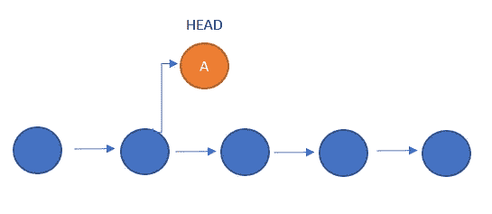
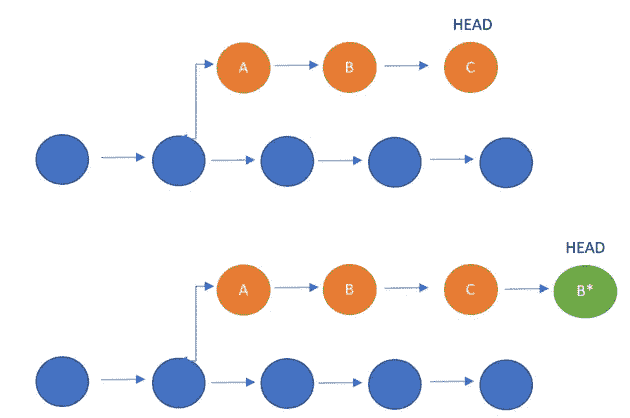

# 初学者 git 完全指南

> 原文：<https://towardsdatascience.com/a-complete-guide-to-git-for-beginners-a31cb1bf7cfc>

## 键盘命令、功能和用法


照片由 [Praveen Thirumurugan](https://unsplash.com/@praveentcom?utm_source=medium&utm_medium=referral) 在 [Unsplash](https://unsplash.com?utm_source=medium&utm_medium=referral) 上拍摄

Git 是所有数据科学家和软件工程师都应该知道如何使用的工具。无论您是单独从事一个项目，还是作为大型分布式团队的一部分，了解如何有效地使用 Git 都可以为您的项目节省大量时间。git 的好处是，它可以作为您工作的版本控制系统，这样您就可以放心地进行编辑、更改和添加新功能，因为您知道如果需要的话，您总是可以回到您工作的前一个版本。这让开发人员和数据科学家有信心继续开发他们的工作，并在现有项目和分析中引入新的系统、功能和工作流，同时能够确保始终有一个工作版本。

本文是对 git 初学者的介绍，涵盖了有效使用 git 所需的基本命令和功能。本文涵盖的主题包括:

1.  [**什么是饭桶？**](#e234)
2.  [**设置存储库**](#7477)
3.  [**进行修改**](#05bc)
4.  [**创建特征**](#2488)
5.  [**修复 bug 或错误**](#518d)
6.  [**附加功能**](#8cc5)
7.  [**结论**](#7745)

## Git 是什么？

首先，什么是 git？嗯，根据 [Git 网站](/ucl-data-science-society-introduction-to-numpy-7d962d63f47d):

> *Git 是一款* [*免费开源*](https://git-scm.com/about/free-and-open-source) *分布式版本控制系统，旨在快速高效地处理从小到大的各种项目。*

这意味着它是一个管理文件版本的软件系统，主要是代码文件，这样您就不必处理诸如“文件 v.2”、“文件 v.3”和“文件 final final”等版本问题。相反，使用 git 提交使得文件名保持不变，但是如果需要的话，您可以返回到文件的前一个版本，或者多个文件。这避免了相当混乱的工作目录。

## 设置存储库

git 使用存储库工作，存储库通常由一个单独的文件夹表示，如果需要，还可以有子文件夹。您与 git 的第一个交互将是将您的工作文件夹转换成 git 存储库，允许您利用 git 提供的所有功能。

我们可以通过创建一个新的空文件夹，然后设置一个本地存储库来展示这一点。这假设您已经在系统上安装了[git](https://git-scm.com/downloads)。为此，我们可以使用`mkdir`命令创建一个新文件夹，如下所示:

```
mkdir new_project
```

然后，我们可以使用命令行导航到该文件夹:

```
cd new_project
```

您的命令行现在应该显示您位于`new_project`目录中。一旦出现这种情况，我们就可以继续在文件夹中初始化一个新的 git 存储库。这个命令相对简单，用`init`命令如下:

```
git init
```

一旦你这样做了，一个`.git`文件夹应该出现在你的目录中(虽然现在看不到)。此外，根据您安装的 git 版本，`master`或`main`应该出现在命令行中您当前所在的目录之后。如果是这样，您现在应该有一个工作的 git 存储库，这样您就可以利用 git 的所有关键功能了！

## 做出改变

git 的主要好处是能够有效地管理您创建和编辑的文件的不同版本。Git 允许您跟踪所做的更改，同时如果需要的话，还可以返回并编辑或删除它们。这让开发人员有信心进行编辑和更改，而不用担心丢失以前的工作。

要做到这一点，您需要知道如何添加您创建的文件以及您对 git 所做的更改，然后将这些更改存储在系统中。这个过程的第一步是“暂存”文件，这样 git 知道您在特定文件中所做的更改将被记住(提交)。为此，您只需使用以下命令:

```
git add <filename>
```

这将“暂存”您在该文件中所做的任何更改，直到您使用该命令。这些变化将会出现在一个“暂存”区域，但是还不会发生任何变化。

为了让 git 区分您希望它记住的对文件的更改，您需要将这些更改“提交”到您的存储库中。“提交”可以清楚地区分你所做的改变，让你能够找到你感兴趣的具体改变。当您提交更改时，您有效地将这些更改保存到本地存储库中，并附带一条消息，说明这些更改意味着什么，无论是功能、代码结构的更改还是新特性的创建。用于此目的的命令是:

```
git commit -m "<insert clear message here">
```

这将提交您之前使用`add`命令进行的所有更改。

重要的是要确保每个提交都有一个明确的附加消息，以便您可以在必要时返回并找到它。虽然这对你来说似乎不那么重要(我当然记得那是什么变化！)如果你是团队的一员，有人可能会看到你所做的改变，这一点很重要。这意味着尽可能简洁明了地描述提交的目的通常是最佳实践。

此时，您在提交中所做的所有更改都将存储在您的本地 git 存储库中。这对于版本控制来说更好，但是如果您的笔记本电脑突然没电了，您想使用不同的笔记本电脑工作，或者您是团队的一员，这可能是一个问题。为此，您可能希望将您机器上的本地存储库链接到一个远程存储库，您或任何人只要有互联网连接就可以从任何地方访问它。

有一些服务可以用于远程存储库，但最常用的是 Github。为了能够将您的本地存储库连接到远程 github one，您需要一个 [GitHub 帐户](https://github.com/)，并且已经设置了一个远程存储库来链接您的本地存储库。一旦设置了远程存储库，您将需要找到远程存储库 URL，它看起来应该像这样:


作者图片

要简单地将本地存储库与远程存储库连接起来，可以使用以下命令添加链接:

```
git remote add origin <REMOTE URL>
```

为了验证已经建立了连接，使用`git remove -v`,它应该会打印出您指定的远程 URL。如果它显示正确的 URL，那么您现在连接到了一个远程存储库！

此时，当您连接到远程存储库时，到目前为止您提交的更改实际上还不会出现在那里。这是因为您必须告诉您的本地存储库，您想要将您的提交“推”到远程存储库。这仅仅需要使用`git push`命令:

```
git push
```

这应该会将您所做的所有提交推送到远程存储库，这意味着您可以从世界上的任何地方访问您所创建的代码！当然前提是你能上网。通过刷新您的远程存储库来确保这已经生效，并确保您所做的更改也出现在那里。

如果您以后想要获取您或者其他人在存储库中所做的任何更改，您可以简单地使用`git pull`命令。这意味着任何其他人都可以对您的代码做出贡献，并且您可以将这些更改带到您的本地存储库中！

## 创建特征

**特征分支**

作为任何项目的一部分，根据您正在开发的产品，将需要添加新的功能或分析。在某些情况下，您不希望在您的存储库的`main`分支上创建那个特性，因为您想先看看它是如何工作的以及它是否成功。那么最好的方法就是用 git 创建工作分支，将工作流相互分离，确保您的`main`分支保持“干净”和工作。

分支允许您对您的工作进行增量变更，而不需要对您的存储库的`main`分支进行变更。维护一个稳定和干净的`main`分支允许一个连续的稳定构建线，只有当新特性稳定并准备集成到产品中时，新特性才会被添加进去(至少在理论上是这样的！).

可以使用以下命令创建分支:

```
git branch <branch_name>
```

然后您可以使用`checkout`命令导航到其中:

```
git checkout <branch_name>
```

如果这样做了，现在应该显示`<branch name>`,而不是在命令行中显示`master`或`main`,表明您当前正在处理您的分支。这个新分支将把来自`main`分支的最后一次提交作为它的“根”,你在这个分支中所做的任何改变都将建立在这个原始点上。

这一切都很好，但是当您完成了新特性的创建之后呢？你是如何将这些令人惊奇的工作放回“主”分支的？嗯，主要有两种方法:**合并**和**重置**。

**合并**

将分支引入到`main`中最常用的方式，也是最先学会的方式是通过**合并**。本质上，这就像它所说的那样，将特性分支“合并”到一个现有的分支中，但是这将通过在您的存储库中创建一个新的提交来实现。这样做的好处是，它将维护您已经提交的历史和顺序，包括清楚地标识分支的根在哪里。

要合并一个分支，您需要**在您想要将提交引入**的分支中。这意味着如果你想将一个特性分支合并到`main`中，那么你需要检查`main`分支。然后，您可以使用该命令:

```
git merge <branch_name>
```

然后会要求您添加一条提交消息，因为合并过程将通过提交来完成。一个常见的基本提交消息通常是:“merge <branch_name>into main ”,它简单地说明了它做了什么。</branch_name>

如果您使用`gitk`查看 git 提交历史，您应该会看到类似这样的内容:


作者图片

在第二次提交后特性分支从`master`分支出来的地方，一个提交给主分支，两个提交给特性分支，并且它们与新提交的创建合并。

**重设基础**

在特性分支中进行合并的替代方法是改变提交的基础。这将从特性分支获取提交，并简单地将它们添加到主分支的顶部。与合并相比，这样做的好处是确保线性提交历史清晰易读。缺点是提交的历史变得不太清楚。

与合并不同的是，**重定基础是从你想要移动的分支执行的，**在这种情况下是特征分支。这意味着您需要确保已检出您创建的要素分支，并运行以下命令:

```
git rebase <main branch name>
```

其中

<main branch="" name="">可以是 master 或者 main，这取决于您正在使用的 git 版本，甚至是您想要添加提交的另一个分支。然后，您应该会看到这样的内容:</main>


作者图片

为了确保主分支与特性分支所做的更改保持一致，您需要使用以下命令将主分支指针向上拖动到`rebase_branch`的最新提交:

```
git branch -f master rebase_branch
```

此时，rebase_branch 和 master 分支应该指向同一个提交，并且您已经将 rebase_branch 中的所有提交都 rebase 到了 master 中。当您签出主分支时，不能运行此操作，否则强制将不起作用，因为您不能移动当前正在处理的分支。

## **修复 bug 或错误**

有时候在开发时，你会想要撤销你在之前的提交中所做的更改。这可能是由于引入了错误，您所做的更改是多余的，或者您只是想撤销以前所做的。有三个命令可以帮你做到这一点:`reset`、`revert`和`amend`。这些命令可以撤销代码或错误，并让开发人员有信心在第一时间提交代码，因为更改总是可以撤销的。

**Git 复位**

`git reset`是将分支的当前 tup 移回到先前提交的 tup 的一种方式。这样做可以从当前分支中删除不再需要的提交，或者撤销已经做出的任何更改。

要运行这个，你只需使用`git reset`和你想重置回。一个例子是将当前分支从分支的当前`HEAD`向后移动两次提交，使用:

```
git reset HEAD~2
```

这将更改提交历史记录:


作者图片

收件人:



作者图片

其中提交 B 和 C 基本上已经从该历史中移除。但是，这对存储库本身的影响将取决于该命令使用的标志:

*   `--soft`将重置提交，但会将这些提交的更改保存在目录中，并保存这些更改以备重新提交。
*   `--mixed`(默认)将重置提交，并将提交的更改保存在目录中，但不会将更改存放到提交中。
*   `--hard`将从目录中完全删除提交中所做的所有更改，就好像它们从未发生过一样，这是最极端的重置。

重要的是`git reset`改变了提交历史，当提交已经公开时，应该很少使用它。

**Git 回复**

有时，您已经提交了想要更改的提交。在这种情况下，应该使用`git revert`。这是因为`git reset`通过创建一个新的提交来撤销提交的更改，从而保留了之前的提交历史。当提交已经被推送时会更好。

由于`git revert`没有改变历史，您需要指定您想要撤销的提交。为此，您需要找到想要撤销的提交的提交引用。这可以使用`git log`或`git reflog`找到。一旦你有了那个参考，你简单的使用:

```
git revert <commit reference>
```

撤消提交中所做的更改。例如，如果我们想要从下面的提交`B`中恢复更改，对存储库的影响看起来会像这样:



作者图片

其中进行新的提交，撤销 b 中的所有改变。这不改变任何先前的提交，并且保持干净的提交历史。

**Git 修正**

在某些情况下，您只想更改属于先前提交的代码。在这种情况下，使用`git reset`或`git revert`似乎有点愚蠢。相反，您可以利用`git amend`，它允许您对之前的提交进行更改。

使用它的一个简单方法是更改提交消息，如果你输入错误或者不够清楚的话。为此，您只需使用:

```
git commit --amend -m "<new commit message>"
```

这将用新的提交消息替换旧的提交消息。

然而，在其他情况下，您希望更改上次提交的部分代码，例如删除代码或添加更多代码。添加新文件很简单，一旦修改已经完成，就可以使用`git commit --amend`来完成。这将把更改添加到以前的提交中，而不是创建一个新的。这方面的工作流示例如下所示:

```
git add some_amazing_python.py
git commit -m "Some amazing work"#edit the files to remove an unecessary import
#and make it cleanergit add some_amazing_python.py
git commit --amend --no-edit
```

这里添加了`--no-edit`标志，因为我们不想改变提交消息，只改变文件。

## 附加功能

git 具有广泛的功能，超出了像本文这样的小文章所能涵盖的范围。然而，另外两个有用的附加功能是`git cherry-pick`和`git stash`，因为它们经常在许多 git 工作流中使用。

**精挑细选**

`git cherry-pick`是一个有用的工具，它允许您从存储库中的任何地方复制单个提交的更改，并将其放在当前分支的开头。这可能是有用的，例如当您在不同的分支上共同处理类似的功能时，以减少生产中的错误数量，或者从代码库中的其他地方引入额外的功能。

要使用`git cherry-pick`，您需要知道您感兴趣的变更的提交引用，然后使用:

```
git cherry-pick <commit reference>
```

这将把在指定提交中所做的更改放在当前分支的顶部。

**Git stash**

在其他情况下，你可能正在做一些代码，但是你不得不中途停下来做其他的事情。这可能是因为你的同事在一个 bug 上需要帮助，你有其他任务要完成，或者你想暂时做点别的事情。您所做的更改可能还没有准备好提交，但是您可能不想丢失您所做的更改。为此，可以使用`git stash`来保存未提交的更改，您稍后可以访问这些更改，而无需进行新的提交。

要想藏起来，你只需打电话:

```
git stash
```

这将从您对暂存和跟踪文件所做的所有更改中创建一个存储库。这将把它们从当前工作目录中删除，并恢复到上次提交时的状态。

一旦您创建了存储并想要返回工作，您可以使用两个不同的命令来取回更改:

*   `git stash apply`——它将获取您存储在存储库中的更改，将它们应用到当前分支上的当前工作目录中，但会保持存储库完整，以备将来使用。
*   `git stash pop` —它还会将您存储在存储库中的更改应用到正确分支上的当前工作目录中，但在应用更改后会删除存储库。

虽然这很有用，但不应该经常使用，因为存储不像实际提交那样容易维护。

## **结论**

Git 是一个非常有用的工具，所有数据科学家和软件工程师都应该知道如何有效地使用它。这至少应该包括知道如何建立一个存储库，将它连接到一个远程数据源，创建和管理特性分支，以及能够在必要时撤销任何以前的提交。了解所有这些应该会给你信心去创建代码，并成为团队中一个有效的成员。

这是一篇高度概括的文章，总结了在《走向数据科学》中已经发表的其他几篇文章。有关这些主题的详细解释，请访问以下链接:

</mastering-git-merge-and-rebase-f2a7c5c348a9>  </mastering-git-reset-v-revert-12701108a451>  </mastering-git-git-cherry-pick-fbeb23eea04d>  </mastering-git-amending-commits-f46c2afc9508>  </mastering-git-git-stash-cf4042dca068> 