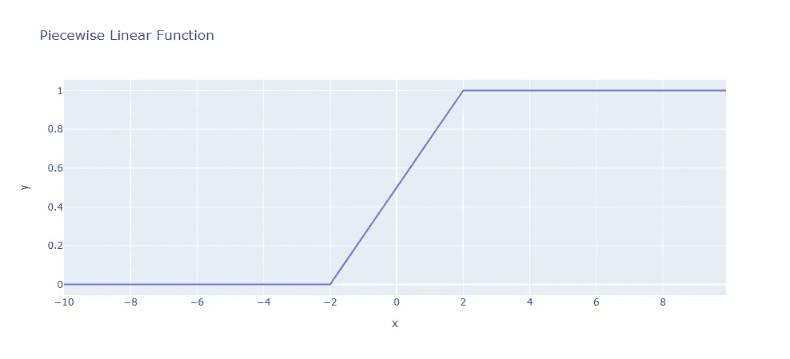
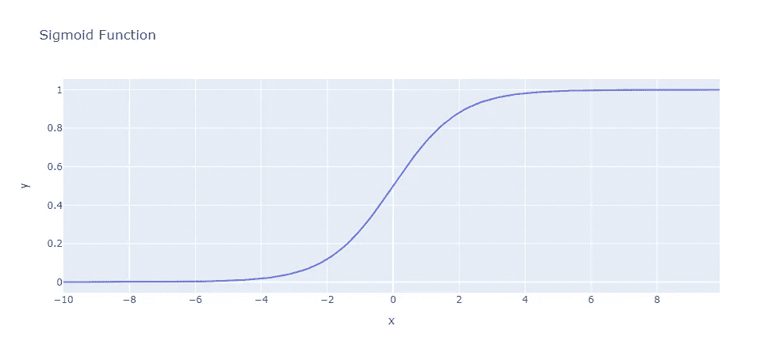
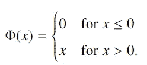
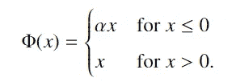
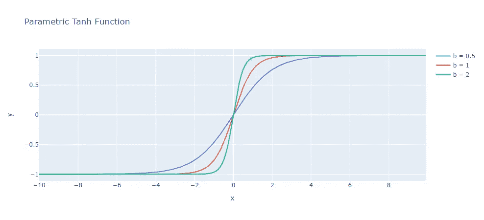
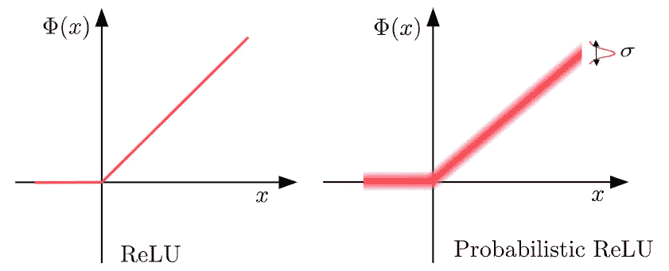

# 神经网络激活功能综合指南:如何，何时，为什么？

> 原文：<https://towardsdatascience.com/a-comprehensive-guide-of-neural-networks-activation-functions-how-when-and-why-54d13506e4b8>

使用标题作为提示从稳定扩散生成的图片

在人工神经网络(ANN)中，这些单元被设计成大脑中生物神经元的松散副本。第一个人工神经元是由麦卡洛克和皮茨在 1943 年设计的[1]，由一个线性阈值单元组成。这是为了模仿人工神经元不仅仅输出它们接收到的原始输入，而是输出激活功能的结果。这种行为是受生物神经元的启发，其中神经元会根据它接收的输入而触发或不触发。从感知机模型到更现代的深度学习架构，已经使用了各种激活函数，研究人员一直在寻找完美的激活函数。在这篇文章中，我将描述激活函数的经典属性以及何时使用它们。在第二部分中，我将介绍更高级的激活函数，如自适应函数，以及如何获得最佳激活函数。

# 激活功能特征概述

当你为你的神经网络寻找一个激活函数时，有几个属性必须被考虑进去。

*   **非线性**:想到的主要性质就是非线性。众所周知，与线性函数相比，非线性改善了人工神经网络的训练。这主要是由于非线性激活函数允许人工神经网络分离高维非线性数据，而不是局限于线性空间。
*   **计算成本**:在模拟过程中的每一个时间步都使用激活函数，特别是在训练过程中的反向传播。因此，必须确保激活函数在计算方面是可跟踪的。
*   **梯度**:训练 ANN 时，梯度可能会出现消失或爆炸梯度问题。这是由于激活函数在每一步之后收缩变量的方式，例如，逻辑函数向[0，1]收缩。这可能导致网络在几次迭代后没有梯度可以传播回来。对此的解决方案是使用不饱和激活函数。
*   **可微性**:训练算法是反向传播算法，需要保证激活函数的可微性，以保证算法正常工作。

# 经典激活函数

本节将描述人工神经网络遇到的一些最常见的激活函数，它们的属性以及它们在常见机器学习任务中的性能。

# 分段线性函数

该功能包括一个最简单的(如果不是最简单的)激活功能。它的活性范围是[0，1]，然而，导数在 b 中没有定义。

b=2 的分段线性函数(我)

一般来说，这个激活函数只用作回归问题的输出。

# Sigmoid 函数

sigmoid 函数是 20 世纪 90 年代早期最流行的函数选择之一。Hinton 等人[2]曾将其用于自动语音识别。该函数定义为:

这个函数是可微分的，这使得它非常适合于反向传播算法。

Sigmoid 函数(由我提供)

如图所示，sigmoid 函数是有界的，这是它受欢迎的原因。然而，它受制于一个消失梯度问题，并且已经表明[3]神经网络越深，用 sigmoid 作为激活函数对其进行训练的效果就越差。

# 双曲正切函数

在 21 世纪初，双曲正切函数取代了 sigmoid 函数。该函数定义为:

它的范围是[-1，1]，由于以零为中心的特性，这使它适合于回归问题。

双曲正切函数(由我)

这个函数的主要缺点是饱和。事实上，双曲正切饱和得非常快(比 sigmoid 快)，这使得人工神经网络很难在训练期间相应地修改权重。然而，值得注意的是，该函数通常用作递归神经网络中隐藏层单元的激活函数。

# 整流线性单元

校正线性单元或 ReLU 用于克服消失梯度问题。它被定义为

值得注意的是，与 sigmoid 和双曲正切函数相反，ReLU 的导数是单调的。

ReLU 功能(由我提供)

ReLU 函数通常用于分类任务，并且由于其无界的性质而克服了消失梯度问题。此外，由于没有指数函数，计算成本比 sigmoid 更便宜。这个函数用在几乎所有神经网络结构的隐藏层中，但不如输出函数那样常见。主要缺点是该函数对于负值有饱和问题。为了克服这个问题，已经提出使用泄漏 ReLU [4]:

所有这些功能都可以在两个标准分类任务上进行比较: **MNIST** 和 **CIFAR-10** 。MNIST 数据库包含手写数字，CIFAR-10 包含来自 10 个类别的对象。我在这里总结了文献中每个激活函数的最佳性能，与架构无关(关于更多激活函数性能的伟大总结，请参见[5])。

# 设计最佳激活函数

前一节强调了激活函数的选择取决于网络必须解决的任务及其在网络中的位置，例如隐藏层或输出层。因此，与其试图找到最佳的激活函数，不如尝试击败已经存在的函数，因为我们知道何时使用它们。这就是引入自适应激活功能的原因。

# 参数激活函数

我想讨论的第一种自适应函数是参数激活函数。例如，可以使用参数双曲正切函数[7]:

参数双曲正切函数示例(由我提供)

参数 **a** 和 **b** 适用于每个神经元。然后，使用经典的反向传播算法，参数将在训练期间变化。

参数激活函数的优势在于，通过添加参数，几乎可以以这种方式修改任何标准激活函数。当然，增加的参数增加了计算的复杂性，但它导致了更好的性能，并且它们被用于最先进的深度学习架构中。

# 随机自适应激活函数

引入自适应函数的另一种方法是使用随机方法。首先由 Gulcehre 等人[6]提出，它包括使用结构化和有界噪声，以允许更快的学习。换句话说，在将确定性函数应用于输入之后，会添加一个具有特定偏差和方差的随机噪声。这对于饱和的激活函数特别有用。随机自适应函数的一个例子如下:

随机自适应 ReLU(来自 CC-BY 许可证下的[5])

这种类型的噪声激活函数对于饱和度是有用的，因为噪声是在阈值之后应用的，所以它允许函数高于阈值。与参数激活函数的情况一样，在大多数机器学习任务中，这些函数的表现优于固定激活函数。

下面是几个自适应函数在经典的 MNIST 和 CIFAR-10 任务上的性能的**总结:**

自适应函数确实比它们的对应物具有更好的性能。

# 结论

近年来，神经架构变得越来越大，参数数十亿。因此，主要挑战之一是获得训练算法的快速收敛。这可以使用自适应函数来实现，尽管它们的计算成本很高。在分类和回归机器学习任务中都观察到了它们的较高性能。然而，仍然没有找到最佳激活函数的证据是，研究人员现在正在研究**量化的自适应激活函数**，以便在保持自适应函数快速收敛的同时降低计算成本。

在 [LinkedIn](https://www.linkedin.com/in/kevinberlemont/) 上与我联系。

# 参考

[1]麦卡洛克，沃伦和沃尔特皮茨。"对神经活动中固有思想的逻辑演算."*数学生物学通报*52.1(1990):99–115。

[2] Hinton，Geoffrey 等人，“用于语音识别声学建模的深度神经网络:四个研究小组的共同观点” *IEEE 信号处理杂志*29.6(2012):82–97。

3 奈尔、维诺德和杰弗里·e·辛顿。"校正的线性单位改进了受限的玻尔兹曼机器." *Icml* 。2010.

[4]马斯、安德鲁·l、奥尼·汉南和安德鲁·吴。"整流器非线性改进神经网络声学模型." *Proc。icml* 。第 30 卷。№1.2013.

[5] Jagtap，Ameya D .，和 George Em Karniadakis。“激活函数在回归和分类中有多重要？调查、性能比较和未来方向。” *arXiv 预印本 arXiv:2209.02681* (2022)。

[6]古尔西雷，卡格拉尔等，“嘈杂的激活函数。”*机器学习国际会议*。PMLR，2016。

[7]陈、蔡子聪、张伟德。"一种具有函数形状自动调整的前馈神经网络."神经网络 9.4(1996):627–641。