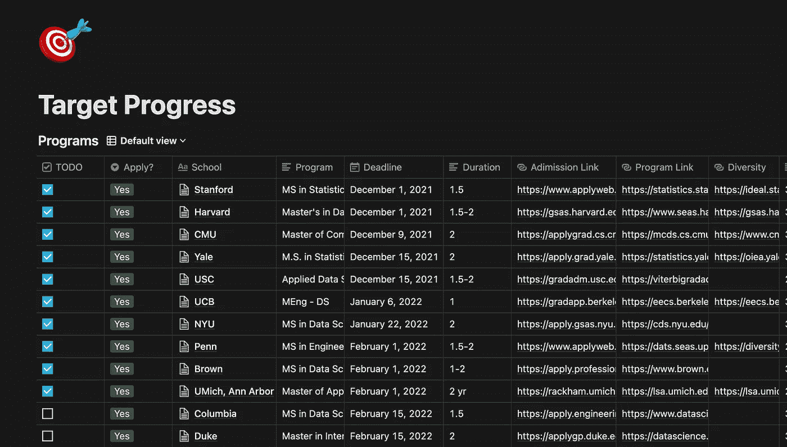

# 数据科学硕士应用综合指南

> 原文：<https://towardsdatascience.com/a-comprehensive-guide-to-data-science-masters-application-c9fbefe41825>

## 数据科学本科生之旅第 4 部分

瑞安·霍夫曼在 [Unsplash](https://unsplash.com?utm_source=medium&utm_medium=referral) 上的照片

## 目录

[行动时间表](#f884)
∘ [早点拿定主意](#023f)
∘ [知道有哪些项目适合你](#d2b8)
∘ [早点拿到 GRE、TOEFL、简历和 lor](#5ed1)
∘[磨砺目的陈述/个人陈述](#bf34)
∘ [明智地选择你的目标项目](#d48b)
∘ [申请？！！！](#1d0c)
∘ [总结算法](#d84e)
[申请手册](#a659)
∘ [第一章— SOP/PS](#d0cb)
∘ [第二章—多样性声明](#d036)
∘ [第三章— LOR](#5df9)
∘ [第四章—简历/CV](#5a1c)
∘ [第五章— GPA、GRE &托福](#1c28)

我希望当我申请数据科学硕士项目时，有人能写一篇这样的博客。作为一名数据科学本科生，我知道我想去读研究生，并继续在 DS 中学习很长一段时间，但实际应用可能会很复杂。从去年十二月到今年二月，我终于完成了所有的申请工作，并被我梦想中的项目录取了！

申请研究生院是一次情感的自省之旅。现在是 2022 年 3 月，所以当我的记忆仍然清晰，斗争仍然感觉真实的时候，我正在写下一切。我希望这篇文章内容丰富，实用，但也是个人的。

在我们开始之前，先简单介绍一下我的背景。

> 我是一名本科生。我是一名来自上海的留学生。
> 我计划在美国申请 12 个 DS 硕士项目，但实际上只申请了 10 个，因为我在最后 2 个项目的截止日期前收到了我梦寐以求的录取通知书。
> 统计:GPA 3.9+，GRE 325+，托福 110+。

# 行动时间表

## 早点下定决心

去读研是一个重大的人生决定。我在大学期间已经思考这个问题 4 年了。我应该去读研还是直接去工作？在中型 DS 社区呆了很长时间，看了这么多自学成才的数据科学家的鼓舞人心的故事，我知道接受正规教育并不是打入 DS 领域的唯一途径。但我热爱学术界，在我的本科学习期间，我遇到了许多伟大的研究人员和学者。因此，我选择拒绝一些非常棒的全职工作，转而去读研。

早点下定决心意味着你有更多的时间积累经验，为申请研究生做准备。以下是一些实际的好处:

*   **早点考 GRE(和托福)**
    你不能在申请截止日期的前一天参加这些考试，所以最好有充足的时间准备，给 ETS 足够的时间发送你的考试成绩。
*   保持高平均成绩更容易如果我说平均成绩不重要，那我是在撒谎。如果你申请的是竞争性项目，这一点尤为重要。保持高 GPA 需要多年的持续努力。当你一开始只有 2.0 分时，不可能在一个学期内把你的平均成绩提高到 3.8 分。
*   有更多的时间与潜在的推荐人建立关系网
    我讨厌听起来这么功利，但让我们面对现实吧，申请研究生院需要至少两封推荐信(LOR ),没有什么比回想一下并意识到你从未与愿意做你推荐人的 DS 专家建立关系更糟糕的了。举例来说，我在学术界有一些了不起的教授，在行业中有一些导师，他们了解我的能力和职业规划，与我讨论读研的事情，帮助我确定读研是正确的选择。我和他们走得很近，熟悉了他们的工作，这一切都激励我进入学术界，成为一名数据科学家。当我需要 lor 的时候，他们很乐意帮忙。然而，保持一种真正的、互惠的、有助于你成长的导师-学员关系需要时间和努力。

大致的时间线是，大二的时候我就知道我要读研了。当然，尽早做好准备更好，但是如果你觉得时间不多了，不要惊慌失措。

## 知道有什么项目适合你

既然你已经确定参加数据科学硕士课程是正确的选择，那么关注相关信息就很重要了。也许你正在寻找在线课程或兼职课程，或者可能是全职课程(像我一样)。你首先需要知道有哪些选择。例如，我即将成为母校的 NYU 大学有一个特别的 DS 硕士项目，所以我早就知道了。

对我来说，一个大致的时间表是，在我大三的时候，我从高年级学生那里收集了各种关于他们申请并被录取的项目的信息。我很清楚我应该关注哪些项目。我保留了一份谷歌节目单，与同样申请 DS Masters 的朋友们分享。

## 早点完成 GRE，托福，简历和 LORs

我从来都不喜欢准备 GRE 考试，但是申请的时候需要 GRE 成绩。作为一名国际学生，我不能总是放弃托福，所以我也必须参加。考试需要时间和精力来准备。大三寒假考 GRE(准备了 1 周)，大四前一年暑假考托福(前一天准备)。我每门考试只考了一次。也许我可以做得更好，但我想花时间去做生活中更令人兴奋的事情，你知道。我确实有一些朋友，他们纯粹的意志力帮助他们在一年内通过了 4 门 GRE 考试。我绝对敬畏。最终一个满意的分数是否值得所有的麻烦取决于你的期望水平。我建议早点考 GRE 和托福，因为到你申请的时候就不需要担心这些考试了。

我准备了一份 2 页的学术简历，是为 DS 申请量身定做的。它比任何求职申请的简历都要长，而且有更多的细节。这个我以后再讲。

另一方面，LOR 要棘手得多。出于礼貌，询问你的推荐人，确认他们是否愿意尽早给你写信。站在他们的立场上，你会理解他们非常忙，可能有很多其他学生问他们同样的问题。不要等到最后一刻才去问你的教授或导师！！这会降低你获得 LOR 的机会。我在 9 月底(大四秋季学期)问了我所有的推荐人。当然，一个例外是，如果你在高三秋季学期遇到了一个很棒的推荐人。期中考试之后，也就是你被评估的时候，你的教授可能会对你的能力和目标有更好的了解。期中考试后向他们要一个学习成绩仍然不算太晚。

对我来说，一个粗略的时间表是，我在高年级秋季学期开始时完成了这 4 项。

## 目标陈述/个人陈述

我花了很多个深夜来写我的目标陈述，或者个人陈述，因为它既垃圾又漂亮。是的，我对我的 SOP/PS 又爱又恨。我觉得 SOP 和 PS 没有太大区别。除非学校特别列出了他们论文的要求，否则我使用了同样的 1000 字版本，结合了我的 DS 经验和个人愿望。

大致的时间线是，我开始反思自己过去的经历，思考在大四之前的那个暑假，我要怎么写 SOP。这就是我开始写博客的原因！它帮助我理清思路，组织我的职业经历，写了关于我的大学旅程的前几篇博客。与此同时，我在大学期间一直在积极研究关于 DS 职业的一切，我不断思考为什么我喜欢 DS，为什么 DS 适合我的职业生涯，并反复检查这一匹配对我来说是真正最佳的。我知道很多人从 DS 毕业，从事软件工程师的工作。我真的需要理清为什么 DS 正是我想要的，然后把我的想法写在一篇文章里。

但我实际上并没有打开一个新的 Word 文件，直到高三秋季学期开始才开始写作。我希望写 SOP 像写博客一样简单，但事实并非如此。SOP 需要信息丰富、有趣、简洁。信息丰富，因为你需要回顾 3 年的 DS 经验；娱乐性，因为你不希望你的文章平淡无奇，令人昏昏欲睡；简洁，因为你需要使用正式的英语来讲述你的故事，用 1000 个单词。要产生一个令人满意的 SOP 确实需要大量的修改。

## 明智地选择你的目标项目

还记得你列出的所有可用程序吗？是时候缩小范围，选择你的目标项目了。这一切都归结为一个匹配的游戏。你在为自己寻找合适的项目，研究生院也在为他们寻找合适的候选人。

**了解你的目标项目** 研究生院通常会有一个专门的网页，详细介绍他们的 DS 项目。你可以通过阅读网上的信息获得很多信息。在这里，我列出了一些你在选择程序时可能会考虑的方面:

*   课程
*   群组规模
*   学校位置
*   课程长度
    美国大部分全日制 DS 课程为 1 至 2 年，极少数例外可延长至 3 年。
*   学费
*   该项目是以研究为导向还是以职业为导向？如果你想在未来攻读博士学位，以研究为导向的项目可能会适合你。否则，以职业为导向的项目很棒，因为它们经常为学生提供实习机会。
*   教员研究兴趣
*   获得签证和 OPT/CPT 容易吗？如果你想作为国际学生在美国工作，获得 OPT 和 CPT 是至关重要的。
*   这个项目需要 GRE 吗？
*   机构声誉
*   你对这所大学和这个项目有感觉吗？
    我觉得这个问题是最重要的一个。离线学习和在大学校园里度过一年多的时间可以塑造新的视角，改变一个人。你同意这所大学的价值观和倡议吗？

检查项目网站已经是大量的工作了，但是如果你真的对某个项目感兴趣，你可以去他们的 zoom info 会议或者和他们的项目学生大使谈谈。

**了解自己** 这一部分要复杂得多，因为了解自己是一生的努力，但至少你知道最基本的东西。你有学校强加给你的衡量标准，即 GPA、GRE 等。一些大学会在他们的网站上告诉你他们的平均和中等 GPA 和 GRE。你可以快速检查你是否像一个有竞争力的候选人。

现在你已经做了一些研究，你可以再列一个你的安全、匹配和到达学校的清单。我迁移到观念来跟踪一切。还有 20 个标有“不适用”的没有出现在截图上。

作者图片

这是我的目标学校列表，其中有两所是我最喜欢的。经过仔细考虑，我选择了每一个。因为我很在意自己是否与这所学校产生共鸣，所以我与所有这些学校或它们所在的城市都有某种私人联系。我的朋友来自这里列出的 12 所大学中的 10 所，许多我亲近的教授都毕业于这些学校。我个人只去过其中的三所学校，但是我很清楚他们的氛围，我知道我想成为我尊敬的朋友和教授。

## 申请？！！！

没那么快。当你开始申请的时候，这个列表一定会经历如此之多的更新，以至于你可以称之为你的动态数组。当你在写你的 SOP 时，你会发现自己一遍又一遍地回到项目网站上，仔细检查所有的小细节。

但是你可以从申请过程开始，首先创建一个帐户，并填写基本信息，如姓名和教育背景。我的建议是快速浏览每个申请页面上每个部分的所有内容。如果在某些情况下，您无法在填写当前页面之前转到下一页，只需在输入框中键入一些内容或上传一个空白的 PDF 文件，以迫使系统继续前进。您通常可以在以后更改这些信息，但一定要仔细检查。

全面了解对您的要求有助于您:

*   进入推荐页面，尽快给你的推荐人发送电子邮件
*   进入你的考试成绩页面，查看学校是否收到了你的 ETS 官方成绩
*   找出那些你不能马上填写的棘手的页面，如 SOP、多样性、教员兴趣等，并写下说明。

现在你对正在发生的事情有了一些想法，你可以回去对程序进行研究并润色你的 SOP。我将在本博客的下一部分详细讨论这一点。

## 汇总算法

这里有一个算法来总结到目前为止的一切，因为我最近为我的顶点研究读了很多论文。我能想到的只有算法。

作者图片

# 应用手册

## 第 1 章— SOP/PS

我在一开始就说过，申请是一次自我反省的旅程，而 SOP 应该是你全身心地投入的地方。

*   SOP vs PS
    我个人并不认为 SOP 和 PS 在我的申请中有什么不同，因为我从未被要求同时提交它们。但是从我搜索的结果来看，它们应该是不同的。SOP，或(学术)目的声明，纯粹是关于学术背景、技术能力、研究兴趣和职业规划等事实。PS，个人陈述，是讲述你的人生故事，确定困难，解释弱点(例如，为什么成绩单上有一个 C)。然而，由于没有程序要求我同时提交 SOP 和 PS，我只写了一篇 1000 字左右的 2 页短文，并将两者合并为一篇。
*   **SOP/PS
    的要求** 1。描述你过去和现在与这个项目相关的工作
    2。是什么让你有资格参加这个节目
    3。你为什么有兴趣申请这个项目？职业/研究计划。为什么，这个项目将如何帮助你实现你的目标
*   **阅读别人的 SOP 以供参考** 如果你不确定如何开始写自己的，你可以很容易地在网上找到别人的 DS SOP。我认为在你开始写作之前阅读一些是没问题的，但最终，你的 SOP 需要是你的，并且只为你量身定制。
*   **引言** 基于我上面解释的原因，SOP 不仅仅是罗列你的 DS 经历。相反，它讲述了一个关于你是谁，你有什么能力，你想成为谁的故事。你需要一个强有力的第一段作为扣人心弦的介绍，强调你需要以某种方式连接到 DS 的生命中的一个关键时刻。这可能是你学习的一个转折点，你意识到你原来的专业已经不够用了，你想转而追求 DS。这可能是你 DS 之旅中最大的成就，坚定了你的决心。也可能是非常私人的。可能你想学 DS 的原因是因为你的家庭或者某种人生经历。第一段就像一部好电影的开头。它介绍了主角，你，给观众留下了深刻的印象。
*   然后，你可以用一种合乎逻辑的方式展示你的经历。所谓逻辑，我的意思是主体段落不需要按时间顺序排列。他们只需要理解并展示你的进步。但如果你所拥有的只是在未来学习中茁壮成长的学术能力，这不会让你在成千上万的申请者中脱颖而出。你需要深入挖掘你的核心，无论是你的特点还是你的信仰。为什么 DS 是你想学习的一个领域？也许是因为你好奇的天性。一定有更深层的东西驱使你走向 DS。考虑到这种联系，很有可能你将来也会坚持使用 DS。
*   **职业/研究计划** 我想只有我们几个人知道自己未来到底想做什么，但是在 SOP 里，你的职业或研究计划还是详细一点比较好。所以，写这个 SOP，是一个很好的时间去思考自己这辈子想完成什么。你可以在倒数第二段写下你的答案，但是需要和你之前的经历有一些联系。不然感觉怪怪的，编出来的。残酷的事实是，这个世界倾向于奖励那些对自己的生活有明确想法的人。
*   在最后一段，你可以确定适合你的研究兴趣的具体课程、你想合作的教授、你想加入的俱乐部，以及任何你认为合适的事情。因为我申请了多个项目，所以除了最后一段专门介绍每个项目之外，其他都保持不变。
*   SOP 的脊柱我认为写 SOP 就像为电影中的主角创作剧本，所以我打算用行话“脊柱”来指代英雄故事的核心(我对电影制作也很感兴趣)。同样，一份强有力的 SOP 展示了申请人的一个或两个关键的可取特征。雄心勃勃、好奇、坚定、积极主动、有组织、勤奋、热情等等，这些都是积极的特征，但你不能在标准操作程序中大声说出来。你需要通过描述与这些形容词相对应的你过去的行为来展示你的“脊梁骨”。否则，你的“电影”可能不够吸引人，“台词”可能听起来像是说教。
*   你可以请你大学的写作机构或者你的朋友帮忙校对你的 SOP。我觉得有一个专业完全非技术的校对很重要。他们也许能发现一些用其他方法无法发现的东西。例如，他们可能会发现你写的东西太专业，他们根本无法理解。如果是这样，稍微低调一点可能是个好主意。肯定有一些方法可以用更少的技术术语来描述一个项目。虽然招生委员会的每个人都可能来自 STEM 背景，但确保你的 SOP 的可读性仍然很重要。

## 第 2 章——多元化声明

多元化声明通常是可选的，但我见过学校要求个人声明，而事实上，它要求多元化声明。

通常，你会谈到作为一个多元化的个体，你如何为大学的多元化做出贡献。多样性存在于性别、种族、性取向、宗教、国籍、社会经济地位、生活经历、家庭条件等等。你能写的东西有很大的灵活性。例如，我认为将我的多元化背景与我的专业联系起来会很好，所以我写了关于多元化对消除人工智能偏见如何重要的文章。

## 第三章——LOR

lor 来自你的教授或实习/工作主管。他们的专业领域与 DS 越相关越好，因为他们能更好地证明你的技术能力。我听人说，一个人可能更喜欢有更大头衔的人来写你的 LOR，但我不认为头衔是一个人应该太在意的东西。相反，我相信你应该找到真正了解你，理解你的职业或研究目标的推荐人。他们对你的熟悉可以很自然的呈现在 lor 里，录取委员会也会感觉到。

*   **LOR 内容** LOR 需要表现出候选人有很强的量化技能，扎实的软技能，以及任何让你的推荐者眼前一亮的东西。
*   是什么造就了强大的 LOR？
    你的推荐人可能之前写了那么多 lor，都已经有模板了。然而，模板对我们学生来说是不好的，因为模板不会让你比别人更有竞争力。因此，这就是为什么找到熟悉你的推荐人会有帮助。真正了解你的人，很可能会写一个量身定制的 LOR，而不是用模板。
*   我应该放弃访问 lor 的权利吗？
    一般来说，放弃自己的权利会让 LOR 更可信。我有教授专门让我放弃权利，我就全部放弃了。

## 第 4 章——简历

求职面试的简历通常只有一页，而学术简历可以有两页甚至更多。但是第三页以后可能不会得到太多的关注。所以一个经验法则是先写重要的东西，最好在前两页。

*   **板块** 我的简历有 7 个板块:教育、工作经历、研究&发表、奖学金&荣誉、活动、数据科学竞赛&项目和技能。您当然可以根据需要添加更多的部分或删除一些部分。我把这些部分安排成整整两页。
*   **给你的项目添加链接** 我唯一想强调的是在你的每个项目和研究旁边添加你的 GitHub 或网站或论文的链接。这表明你确实为项目做出了很大贡献，也给了录取委员会一个进一步评估你技术能力的方法。如果你有可视化项目成果的网站，那是最好的。

## 第五章——GPA、GRE 和托福

这些数据很重要，但没那么重要。如果他们中的一些人没有你想要的那么高，不要太沮丧。只要学会了 DS 必备的技能，GPA 和 GRE 就仅仅是数字了。从长远来看，他们不会阻碍你成为数据科学家的梦想。然而，获得一个像样的分数确实需要大量的时间和精力，所以还是那句话，最好在实际申请之前就做好一切。

## 第 6 章—面试

我个人没有申请任何需要面试的项目。但是从我从朋友那里了解到的信息来看，录取面试更多的是行为面试，而不是技术面试。你需要准备在简历中谈论一些项目细节，并回答一些一般性的问题，例如，你是如何克服团队工作中的挑战的，或者你最大的弱点是什么。获得面试是一个积极的信号，表明你离录取更近了一步，所以要自信，准备好聊天。招生和教授也是人。

## 第 7 章—杂项

*   投资组合网站
    如果还有什么能让一个应用程序变得更强大，那就是拥有一个 DS 投资组合网站。如果你能建立自己的网站，这也是展示一些软件工程技能的好方法。一个简单又省钱的方法是在 GitHub 上托管你的投资组合网站。
*   **清理 GitHub 页面
    但是我敢打赌大部分正在申请 DS 程序的人都有一个 GitHub 页面，所以你可以通过清理你的 GitHub 页面来脱颖而出:
    1。添加个人资料页面/关于我页面
    2。为每个项目添加一个合适的 README.md**
*   研究生招生主任
    的提问:我迄今为止写的大部分文章都是从申请人的角度出发的(希望你能理解)，所以看看招生人员在寻找什么是非常有帮助的。在[这个 Reddit Q & A](https://www.reddit.com/r/gradadmissions/comments/rv9242/grad_admissions_director_here_what_burning/) 中，一位研究生招生主任非常慷慨地抽出时间，回答了学生们的许多好问题。主任的建议一般适用于 STEM，但也适用于 DS。

## 第 8 章——心态

等待申请结果是最糟糕的。每个节目都像是一张一百美元的彩票。我一直在想我是否有资格参加这些项目，并一直在想也许可以申请更多的项目以确保万无一失。我认为有焦虑是完全正常的，但请确保与某人交谈，并以健康的方式处理这些感觉。然后有一天，你会得到你的第一份工作，一切都会变得不同，但是是好的方面。

# 最后的话

尽管我很想给你展示一些关于 DS Masters 申请的建议(希望是有帮助的)，但申请仍然是你自己的自我反思和自我发现之旅。申请过程是你在大学期间停下来思考未来的绝佳机会。我想用这个博客鼓励申请人真正多思考。请不要仅仅因为这个领域看起来很热，就去做自己不喜欢的事情。

对我来说，工作，也就是我所做的，对我的身份和幸福极其重要。我为自己的工作感到自豪，并享受出色完成简单任务的乐趣。因此，我喜欢思考整个申请过程以及与 DS 相关的任何事情。你应该从我写中型博客的事实中了解到这一点。所以，我的主要挑战是我的 SOP 中不包括什么，因为我有一百万件事情要写。

我的应用程序的最新更新:

> 到今天为止，我已经收到了 6 所学校的回复。我得到了 5 个广告和 1 个拒绝(嘿，人无完人)。我很兴奋能去我梦想中的学校，但真的，我会很高兴得到任何邀请继续我的 DS 之旅。我不打算在这个博客中提到大学的名字，因为重要的是找到适合你所热爱的东西。(如果你真的读到这一部分，感谢你的好奇心，但我相信如果你真的想知道，你可以找到答案。毕竟我们都是科研人员:) )

如果我在这个博客中有什么未能涵盖的，请留下评论或直接联系我。我想尽力帮忙。

感谢您的阅读！希望这对你有帮助。