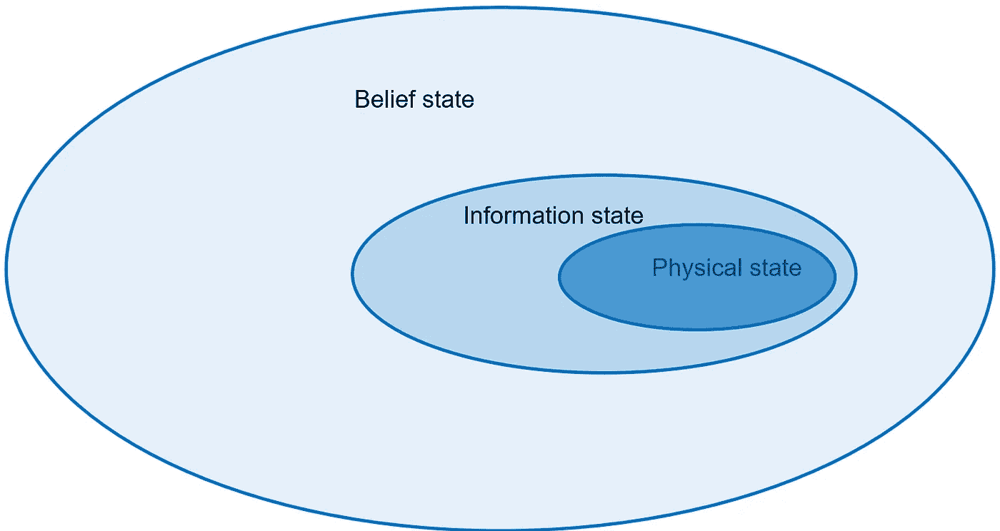

# 对问题状态的深入探究

> 原文：<https://towardsdatascience.com/a-deep-dive-into-problem-states-498ad0746c98>

## 为你的马尔可夫决策过程定义适当的问题状态。了解高阶 MDP 和信念状态变量，帮助您做出决策。

摄于 [Unsplash](https://unsplash.com?utm_source=medium&utm_medium=referral)

如果你曾经试图建立一个马尔可夫决策过程(MDP)模型，第一步可能是定义**状态变量** *s* 。毕竟，状态是用来描述系统，决定[可行的行动](/using-linear-programming-to-boost-your-reinforcement-learning-algorithms-994977665902)，计算奖励，管理[时间](/what-are-post-decision-states-and-what-do-they-want-from-us-9e02105b7f40) [转换](/about-post-decision-states-again-5725e5c15d90)。没有国家，你做不了多少事。

鉴于国家在市场发展计划中的关键作用，令人惊讶的是教科书的定义往往相当含蓄。这篇文章将深入定义好的问题状态的属性，使你能够为你的模型和算法定义有目的的状态。

# MDP 国家介绍

出发前:本文在很大程度上依赖沃伦·鲍威尔(普林斯顿大学名誉教授)的观点。为了更详细地评估这里讨论的主题，我建议看一看本文末尾列出的学术著作。

让我们考虑一些常见的定义(就提供的明确定义而言):

> *维基百科(未注明)——*“状态变量是用来描述动力系统的数学‘状态’的一组变量之一”。
> 
> *贝尔曼(1957)——*“…我们有一个物理系统，在任何阶段都由一小组参数，即状态变量来表征。”
> 
> *普特曼(2014)*——“在每个决策时期，系统占据一个状态。”
> 
> *萨顿&巴尔托(2018)——*“…代表做出选择的基础的信号(状态)”
> 
> *Bertsekas(2018)*——“…是系统的状态，某个空间的元素。[……]控制理论中的许多经典问题涉及一种属于欧几里得空间的状态，即实变量的 n 维向量空间，其中 n 是某个正整数。”

在抽象的层面上，很明显，状态提供了系统在给定时间点的**数字表示。此外，我们可以推断状态是**与决策过程**相联系的。然而，很明显，许多开创性的著作——尽管它们很有价值——并没有对“国家”的概念提供一个过于彻底的定义。**

鲍威尔对国家的定义如下:

> *Powell(2022)*——状态变量包含了我们所知道的一切，并且仅仅是我们需要知道的，以做出决定并对我们的问题进行建模。状态变量包括物理状态变量 R_t(无人机的位置、库存、股票投资)、关于我们完全了解的参数和数量的其他信息 I_t(如当前价格和天气)，以及概率分布形式的信念 B_t，描述我们不完全了解的参数和数量(这可以是对药物将降低新患者血糖多少的估计，或者市场将如何对价格做出反应)。

他认为问题状态有三个目的:

*   **决定行动。**因此，状态应该包含智能决策所需的所有信息。
*   **计算转移函数。**结合所选动作和外部环境信息，状态定义应足以计算下一个状态。
*   **计算奖励函数。**连同所选的动作，状态信息必须足以计算对应于状态-动作对的直接奖励。

一个正确定义的状态应该准确地包含上述目的所需的信息——不多也不少。更少的信息，国家不足以实现其目标。更多的信息，你只需跟踪多余的信息。

## 信息分类

确定了问题状态的目的后，下一个问题是**包含什么信息**。

许多建模者限制自己只包括系统的物理属性:持有的现金数量、卡车的当前位置、商店中的存货……正如我们将很快看到的，这样的定义可能过于严格，忽略了考虑到问题状态的目的的关键元素。

Powell 认为状态变量可以分为三类:(i) **信念** , (ii) **信息**,( iii)**物理**属性或资源。更准确地说，信念是无所不包的类，其他两个类是受约束的子类。为了便于讨论，可以将它们视为三个独立的类别。

*   **物理**:系统可直接观察到的属性，如资源。“身体的”这个术语在这里可以被认为是有点不严格的。
*   **信息**:非有形的确定性信息。可以直接观察到，但不一定是系统的物理组件。
*   **信念**:非有形的概率知识。具体地，信念可以由分布的参数来表示。

将状态变量分类为信念(概率)、信息(确定性)和物理属性(资源)[图片由作者提供，改编自 Powell (2014)]

一些例子将很快出现，但首先我们需要讨论另一个属性——高阶 MDPs。

## 高阶 MDP

根据定义，任何 MDP 都满足**马尔可夫性质**，也就是*无记忆*性质。这个属性表明决策不依赖于过去的状态，而只依赖于当前的状态。如果问题可以用这种方式表述，我们就可以把极其复杂的决策问题分解成一系列更容易处理的子问题，独立解决。

很自然地将马尔可夫属性解释为*‘不利用来自过去的任何信息’*。然而，不使用来自过去的*状态*和来自过去的*信息*是有区别的。事实上，鲍威尔认为，过去的信息可以完美地包含在当前状态中。

从决策的角度来看，这是有道理的。假设销售额以每年 5%的速度稳步增长。仅有一个**单一数据点**(最近的销售)无法揭示这一趋势，从而无法采取预期行动。相比之下，合并该州过去的销售数据会显示出明显的上升趋势。

注意，我们不需要参考过去的*状态*——这确实会违反马尔可夫属性——而只需在当前状态中包含过去的*信息*。我们将记忆封装在状态中。

在数学术语中，包含历史信息的状态在**高阶 MDP**中使用。这种模型提供了比一阶 MDPs 允许的更丰富的系统表示(实际上只包括当前信息)。在极端情况下，一个状态甚至可以包含所有的历史信息。

**TL；博士**:你*可以*在你的问题状态中包含过去的信息，而且*通常会*帮助你做出更好的决定！

# 例子

杰里米·贝赞格在 [Unsplash](https://unsplash.com?utm_source=medium&utm_medium=referral) 上的照片

现在我们已经有了定义状态的所有必要因素，让我们提供一些简单的例子吧！

**例 1:能源管理**

*   *物理*:当前电池电量
*   *信息*:电价、风速
*   *信念*:预测的能量需求分布，剩余电池寿命

**示例 2 —仓库管理**

*   *实物*:库存实物
*   *信息*:已预订(未发货)产品，已订购补货
*   *信念*:每个产品的销售预测情景

**示例 3——投资组合管理**

*   *实物*:现金持有量、每股持有量
*   *信息*:过去和现在的股票价格
*   信念:未来价格变动的概率模型

虽然根据物理、信息和信念变量进行分类不是必要的，但它有助于阐述做出正确决策所需的有用信息，从而提供对该问题的更广阔的视角。

# 结束语

国家是市场发展计划的关键要素。不幸的是，许多建模者对这个概念的看法过于狭隘，忽略了有价值的历史数据、无形的信息或概率信息。

以下几点可能有助于设计利用决策的更丰富的状态:

*   一个状态不仅需要包含系统的物理上可观测的属性，还可以包含无形的信息。
*   **过去的信息**可以并入状态，只要基于当前状态做出决策。换句话说，状态可以展示记忆。
*   即使没有完美的信息(例如，概率知识)，我们也可以**将信念**结合到我们的状态中来帮助行动选择。

对马尔可夫决策过程的其他模型组件也感兴趣吗？看看下面这篇文章:

</the-five-building-blocks-of-markov-decision-processes-997dc1ab48a7>  

# 参考

贝尔曼河(1957 年)。马尔可夫决策过程。*数学与力学杂志*，679–684。

贝特塞卡斯博士(2019)。*强化学习和最优控制*。雅典娜科技公司。

Salnikov，v .，Schaub，M. T .，& Lambiotte，R. (2016 年)。使用高阶马尔可夫模型揭示网络中基于流的社区。*科学报告*， *6* (1)，1–13。

鲍威尔(2014 年)。清除随机优化的丛林。在*桥接数据和决策*(第 109–137 页)。告知。

鲍威尔，W. B .，&梅塞尔，S. (2015 年)。能源中的随机优化教程——第二部分:能量存储图解。 *IEEE 电力系统汇刊*， *31* (2)，1468–1475。

鲍威尔 W. B. (2022)。*强化学习和随机优化:顺序决策的统一框架*。约翰·威利的儿子们。

鲍威尔(未注明日期)。建模。[https://castlelab.princeton.edu/modeling/](https://castlelab.princeton.edu/modeling/)

普特曼博士(2014 年)。*马尔可夫决策过程:离散随机动态规划*。约翰·威利&的儿子们。

萨顿和巴尔托(2018 年)。*强化学习:简介*。麻省理工出版社。

维基百科(未注明)状态变量。[https://en.wikipedia.org/wiki/State_variable](https://en.wikipedia.org/wiki/State_variable)