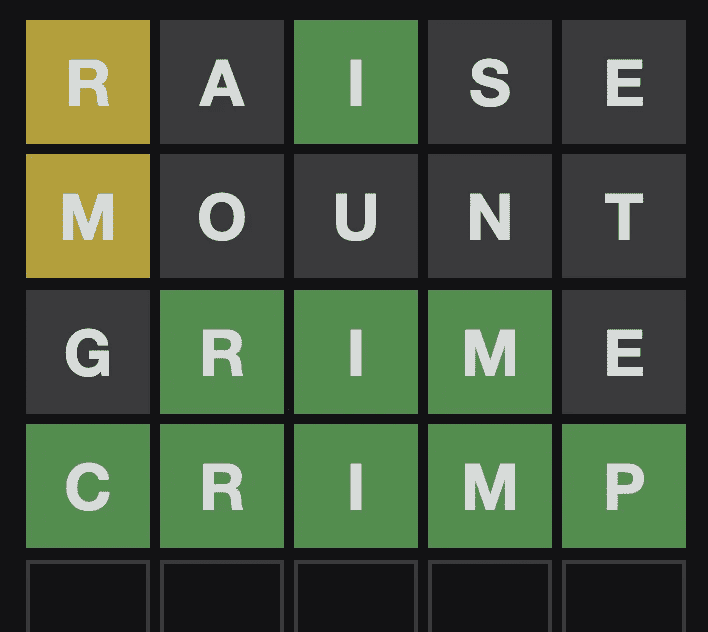
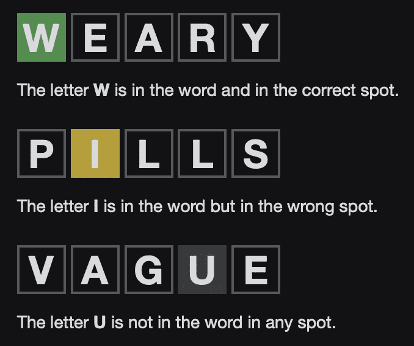
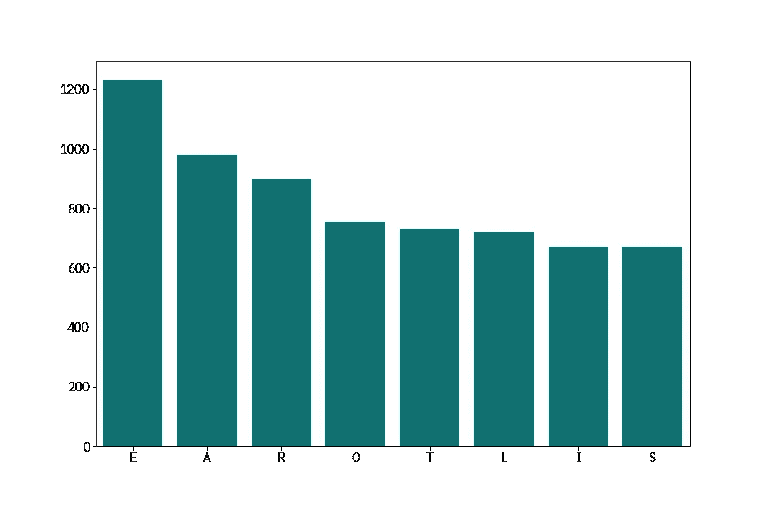
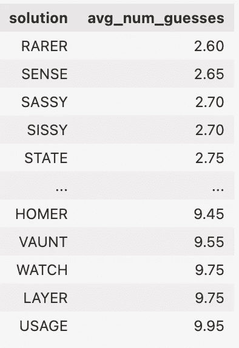
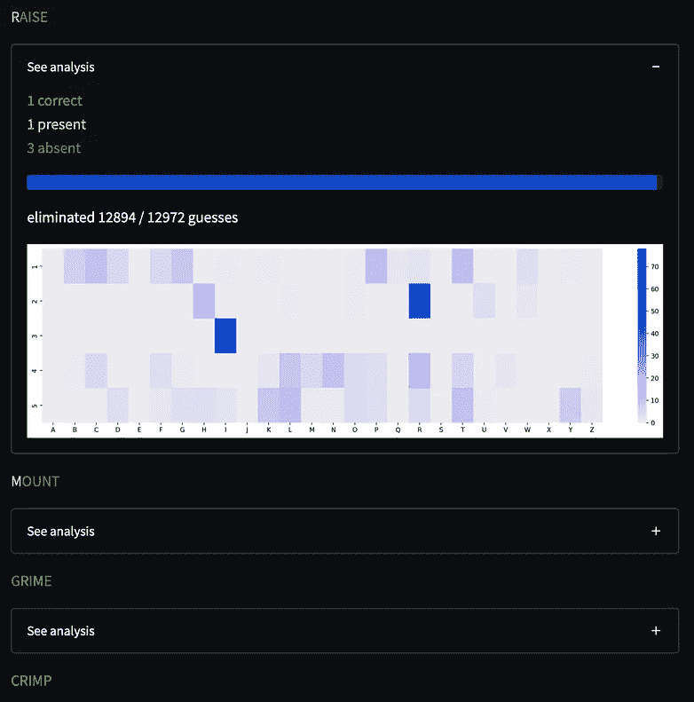
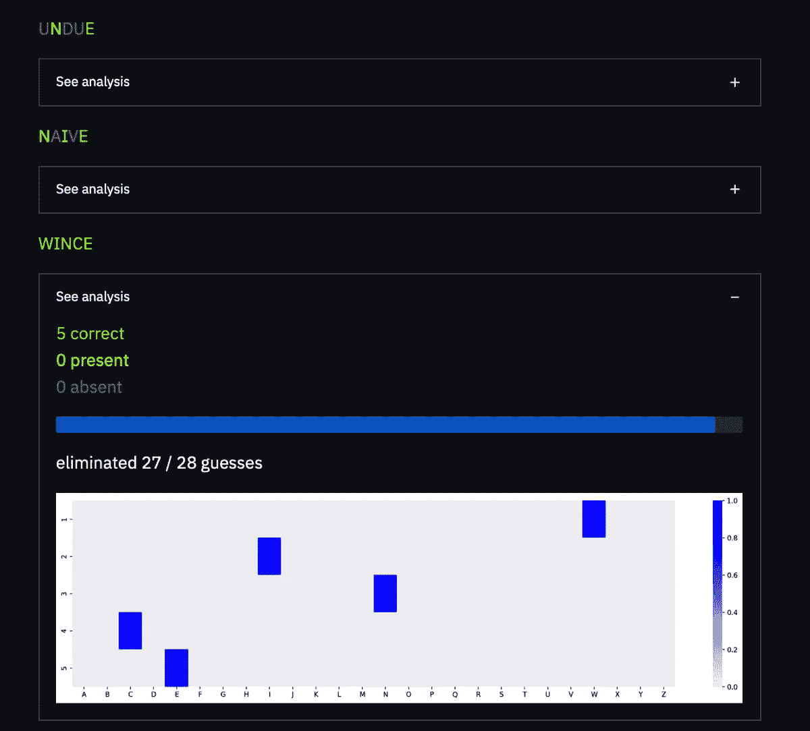

# 深入了解新疫情的字谜热

> 原文：<https://towardsdatascience.com/a-deep-dive-into-wordle-the-new-pandemic-puzzle-craze-9732d97bf723>

## 评估不同的试探法以确定最有效的解决策略，并构建一个人工智能辅助工具来帮助您获胜

自从 2022 年 1 月获得病毒般的地位以来，Wordle 重新点燃了群聊，激发了每个人的竞争精神，并使 Twitter 充满了神秘的表情网格。在内容创作者 Emily Coleman 发布的一条推文中，它被比作从新冠肺炎·疫情开始就渗透到许多人厨房的烘焙痴迷物:酸面团发酵剂。

纽约喜剧演员姜戈·戈尔德(Django Gold)也表达了类似的观点，他在推特上说，在午夜做这个谜题是他日常存在恐惧的一个重要方面，这在某种程度上并不奇怪，在 24000 多名推特用户中引起了共鸣。

现在，在我带你开始令人难以置信的书呆子之旅之前，让我们回答那些不熟悉的人的百万美元问题:到底什么是单词？



*截图 via* [*Wordle*](https://www.powerlanguage.co.uk/wordle/)

Wordle 是一款简单易用的猜字游戏，由布鲁克林的软件工程师 Josh Wardle 开发。他为喜欢玩文字游戏的伴侣设计了这款手机。游戏规则很简单。玩家总共有 6 次机会通过在方框中输入字符来猜测一个五个字母的单词。然后，游戏使用颜色编码来指示玩家他们选择的字母是否在`correct`点(绿色)，在单词中的`present`但在错误的位置(黄色)，或者整个单词中的`absent`(灰色)。这种反馈系统的一些例子如下:



来源:[如何在 Wordle 网站上播放页面](https://www.powerlanguage.co.uk/wordle/)

如果你想知道为什么这个游戏的前提对你来说如此熟悉，你可能会想到游戏策划，它与 Wordle 有着相同的目标，只是游戏令牌是彩色的珠子而不是字母。我认为 Wordle 比 [Mastermind](https://en.wikipedia.org/wiki/Mastermind_(board_game)) 更难，因为有一个额外的限制，即单词必须是有效的英语单词，所以有一个类似拼字游戏的元素与游戏的逻辑难题本质交织在一起。Wordle 非常简单，但奇怪的是会让人上瘾。虽然对于任何人来说，创造一个国际互联网轰动最终都令人印象深刻，但最令人着迷的是它背后的“ *why* ”是什么让它成为如此大的轰动。

[](https://www.nytimes.com/2022/01/03/technology/wordle-word-game-creator.html?referringSource=articleShare) [## 《沃尔多》是一个爱情故事

### 文字游戏几个月就从几十人到几十万人。它是由一个软件创建的…

www.nytimes.com](https://www.nytimes.com/2022/01/03/technology/wordle-word-game-creator.html?referringSource=articleShare) 

在上面链接的《纽约时报》文章中，你可以读到更多关于沃德尔本人和游戏起源的故事。在阅读这篇文章时，一个问题出现在我脑海中:为什么这个已经以各种形式存在了几十年的游戏会在短短几周内变得比新冠肺炎病毒传播得更快(好吧……不好的比较，对不起)？

答案是:稀缺性和可共享性！沃德尔破解了如何让益智游戏在注意力经济中茁壮成长的密码。他让人们体验到一种令人上瘾的游戏关系，但他发现，当想到令人上瘾的游戏化模式时，简单地剥夺用户上瘾的动力，会让他们保持参与。《纽约时报》的拼字游戏很早就展示了这个商业、技术和游戏结合的案例研究。我想，稀缺模式还有一个额外的好处，那就是*而不是*利用用户与技术已经不健康的关系。

鉴于上瘾倾向并不能证明用户跳上 Wordle 平台的指数曲线是合理的，那么下一个候选人就变成了游戏的可分享性，Wardle 也在 NYT 的文章中对此进行了评论。正如你在上面的例子中所看到的，在一行文字和一个简单的总共 30 个表情符号的 5x6 网格中，Wardle 创造了一种简单而令人满意的方式，在那些已经将益智游戏作为日常习惯的用户之间建立联系。

不管怎样，关于 Wordle 作为一个概念已经说得够多了，现在让我们来看看如何策略性地破解这个游戏吧！

如果你想跳过我将要深入的所有乏味的分析，只玩我构建的 web 应用程序，你可以在这里[玩它](https://share.streamlit.io/sejaldua/wordle-analysis/main/app.py)。(完整链接:[https://share . streamlit . io/sejaldua/wordle-analysis/main/app . py](https://share.streamlit.io/sejaldua/wordle-analysis/main/app.py))

# 探索性数据分析

对于我们这些文字游戏爱好者来说，我们都很熟悉幸运之轮有奖游戏，在这个游戏中，控制幸运之轮的参赛者最后一次旋转幸运之轮，猜 3 个辅音和一个元音……也就是说，除了英语中最常见的 6 个字母:R、S、T、L、N、e 之外，我想我们可以从验证这些字母是否是最常见的字母开始。当我们把范围限制在只有 *5 个字母*的英语单词时，命运之轮的数据驱动研究是否成立？



五个字母的英语单词中最常见的八个字母，忽略字母位置(图片由作者提供)

事实证明，在看 5 个字母的单词时，古老的“R，S，T，L，N，E”并不成立。实际上更像是“E，A，R，O，T，L”。当我第一次发现这一点时，我过于简化的外卖是… *嗯，也许我明天应该以“ORATE”作为我的第一个猜测？*经过进一步的挖掘，我了解到这样的策略并不是最理想的，因为在单词游戏中位置*关系到*。


最常用字母的热图，根据 5 个字母单词的位置进行细分(图片由作者提供)

上面的热图旨在从上到下阅读，注意每一行中最暗的部分，以了解字母在 5 个字母的单词中的位置分布情况。一个有趣的发现是，尽管“X”不是大多数 5 个字母单词中的一个字母，但它实际上是最常见的最后一个字母之一。至于一个可能有助于我们制定游戏策略的更可行的见解，如果我们直观地遍历这张热图，猜测会产生最多`correct`(绿色)瓷砖的是类似“SAAEE”的东西……但这显然不是很有用，因为它既不是一个单词，也没有给我们五条独特的信息。是时候通过运行一些模拟来提升这种分析了！

# 首次猜测策略

最理想的第一猜测是大多数作家激烈争论的话题。为了给它适当的尽职调查，我对密友和 Reddit-ers 做了一个小调查，请他们分享一些他们的首选猜测。我收到的一些答案如下:起航、航线、起航、欺骗、蒸汽、出租、住所、告别、平衡、生物群落、饲养、年、噪音。

观察那些提供评论以配合他们的答案的人的策略:

*   **元音元音元音:**再见，路线，出现，住所，风度，噪音
*   **常见辅音:**租金(显然来自幸运之轮风扇)、欺骗、牛排、蒸汽
*   **无重复字母:**以上所有……从一开始就获取尽可能多的信息很重要。例如，如果我们要猜测“STRUT”，并且我们在两个“T”上都收到了一个黄色块(即，字母“T”出现在单词中，但是在错误的位置)，这就是浪费了一个字母，否则我们可以从这个字母中学到更多。

从上面的热图来看，我们应该记住牛排与木桩、住所与土坯、崛起与崛起都是独特的策略，因此必须进行相应的评估。虽然理论上每个变位词对测试的是同一组字母，但位置很重要。希望这篇文章(以及我稍后将讨论的网络工具)能帮助你批判性地思考一个给定单词与其变位词的战略功效。

《fivethirtyeight》的作者 Zach Wissner-Gross 收集了以下数据。他访问并按字母顺序列出了“Wordle's library of [的 2315 个神秘单词](https://docs.google.com/spreadsheets/d/1-M0RIVVZqbeh0mZacdAsJyBrLuEmhKUhNaVAI-7pr2Y/edit#gid=0)以及所有允许你猜的 12972 个单词[所以让我们通过编程来确定最佳的初始猜测，好吗？](https://docs.google.com/spreadsheets/d/1KR5lsyI60J1Ek6YgJRU2hKsk4iAOWvlPLUWjAZ6m8sg/edit#gid=0)

## 简单试探法:优化图块分数

对于在所有 2，315 个单词解决方案中，哪一个 5 个字母的单词平均产生最多绿色和黄色的基本分析，让我们编写一些代码来获得绿色(`correct`)、黄色(`present`)和灰色(`absent`)评分试探法。

当在每个解决方案上尝试每个猜测时，获得平均得分启发的代码

下面列出了前五个最佳的第一次猜测策略，优化了你进行猜测时可能获得的绿色瓷砖的平均数量。


前 5 名最佳第一次猜测，按最高平均正确分数(绿色方块的数量)排序

你可能在想，*我从来没有在*或*之前的对话中使用过这些词，我不知道这些词是什么意思！*然而，参考早期的热图，几乎所有这些单词都遵循以“S”开头，然后是“A”或“O”，然后以“E”结尾的模式，这肯定是有道理的。这是一个很好的方法，可以最大限度地覆盖 5 个字母的单词，并快速获得有价值的信息。面临的挑战是，这些单词中有许多是由重复的字母组成的，正如我们之前讨论的那样，这些字母不能传递最大量的信息。因此，我想我会想试试“SOARE”这个词，意思是“一只年轻的鹰”，如果你好奇的话。


前 5 个最佳的第一次猜测，按最高加权平均牌分数排序(绿色和黄色)

当按平均正确瓦片和平均当前瓦片的加权平均值排序时，我们看到，有趣的是，所有五个最高的初始猜测都由以下字母集合组成:`{‘S’, ‘E’, ‘A’, ‘R’}`。仅仅通过看这个列表，我就能想起许多使用这些字母的 5 个字母的单词，但是，再一次，我们想避免使用有重复的单词，所以让我们把它们过滤掉。书呆子注意:这只用 3 行 Python 代码就可以完成！

```
duplicates = [guess for guess in guesses if len(set(guess)) != 5]
df.sort_values(by='avg_tile_score', ascending=False, inplace=True)
df.query("guess not in @duplicates")
```


前 5 名最佳第一次猜测，按最高加权平均平铺分数排序，*排除具有重复字母的单词*

这还差不多。这些都是下次你解决日常工作时可以尝试的好方法！

## 更复杂的方法

公平的警告:如果你不是书呆子，跳过这一部分。我将进入一些技术上更抽象的术语，并列出一些策略。阅读时，你的任务是考虑这些优化技术，在我不给你任何数据的情况下，你自己想想你可能更喜欢哪一种。

*   **最大尺寸优先排序(“为最坏的情况做准备”):**即使你选择一个产生所有灰色瓦片的单词(即，在解决单词中没有字母)，哪个单词通过穷尽最常见的字母来帮助我们缩短剩余的可能猜测列表？
*   **最大熵优先化(“结果的一致传播”):**在不试图给出一个关于[熵](https://en.wikipedia.org/wiki/Entropy_(information_theory))或什么是[概率质量函数(PMF)](https://en.wikipedia.org/wiki/Probability_mass_function) 的速成班的情况下，让我们在 Wordle 的上下文中用简单的英语来解开这个问题。使用这个策略，我们想要挑选出产生最大剩余[不确定性](https://www.statisticshowto.com/uncertainty-in-statistics/)的单词。这意味着，无论我们得到的是一堆绿色和黄色的瓷砖还是全灰色的瓷砖，我们都将确保所有可能的结果都是相似的，并且没有一个是太差的。这不一定是一种进攻或防守策略，而是，不管单词有多难，它在数学上是最可靠的。
*   **最大分割优先级(“高风险，高回报”):**如果我们想获得最大的回报，如果你愿意，我们应该最大化我们可能获得的唯一可能结果的*数量*。这种方法不是最一致的，但是如果你碰巧猜对了一个单词，得到了一组非常有用的彩色方块，这有助于快速排除选项，潜在地降低了解决这个单词所需的平均猜测次数。

根据我的发现(注:我将把实验分析记录在 Jupyter 笔记本上，供所有书呆子参考)，我花了 16 个小时进行模拟，每个策略的最佳猜测如下:

> **最大大小优先:**提高
> **最大熵优先** : SOARE
> **最大分裂优先** : TRACE

## 我的两分钱

我在加注、SOARE 和 ADIEU 之间交替，并在这些首选猜测中取得了一些成功(* =不败)。但我真正的秘密实际上是一种不那么数据驱动的方法，我喜欢称之为“1-2 拳”:

**第一步**:使用一个有策略的、统计上成功的第一次猜测，这个猜测包含了元音和常见的辅音。

即使你产生了一些绿色和黄色的瓷砖，忽略它们。想一个有 5 个全新字母的单词。理想情况下，用完所有剩余的元音和其他常见的辅音。

举个例子:我最初可能会猜“RAISE”，然后是“MOUNT”。这通常有助于我穷尽所有的元音，并从这两次猜测中获取尽可能多的信息。这样，我就可以通过回忆那些符合我刚刚获得的逻辑难题的 10+标准的单词来继续前进。

这只是我个人的策略！我很想听听你的。如果你愿意分享，请在文章末尾留下评论！

# 最容易和最难猜的单词

我进一步进行了这种分析，以更好地理解是什么使一个词相对更容易或更难猜测，通过应用前 20 个独特的最佳猜测，由“最大大小”、“最大熵”和“最大分裂”策略计算，并计算得出正确答案平均需要多少次猜测。我们看到，前五个最容易的猜测花费不到 3 次猜测，并且以具有重复字母为特征，其中大多数字母通常是英语中常见的字母。



最难猜的是“用法”、“图层”、“手表”、“吹嘘”和“荷马”。即使使用基于人工智能的策略，上述三种算法也要进行近 10 次猜测才能得出正确答案。我推测其原因是因为这些单词往往有许多“相似”的单词，或者所有字母都相同，但有一个字母被替换的单词。例如，“手表”与“女巫”、“闩锁”、“SATCH”、“批处理”、“CATCH”等非常相似。在游戏的后期阶段，人工智能将无法优先猜测下一个，因为它们中的每一个本质上都提供了相同数量的信息。然而，如果我们扩充数据，根据英语中的使用频率，通过某种流行度分数对每个潜在的猜测进行排序，我们可能会看到这些更严格的 Wordle 字符串的后期效率更高。

# Wordle Wizard:一个简化的 Web 应用程序

只是为了好玩，我用[我最喜欢的 Python 包](https://streamlit.io)做了一个 web 应用。我想让 Wordle 最上瘾的成员做更多的事情，而不仅仅是与他们的朋友分享他们的表情符号格式的结果。如果你能分析你的猜测有多有效呢？有了这个工具，完全可以做到！



或者更好的情况是，如果您第一次猜“加注”,并且在游戏板上获得了彩色的牌，但是您不知道下一次该猜什么呢？我刚才向您介绍的分析应该能够为您提供一些有用的信息，帮助您做出第二个决定。请允许我向你展示…


在“Wordle Assist”模式下，如果你想在一个测试例子中掌握你的策略，你也可以试着从档案、随机 Wordle、甚至手动 Wordle 中找到一个过去的 Wordle。


# 结论

说到底，我不会说这个游戏可以或者应该用代码破解——那只会让游戏失去乐趣。但我确实很享受学习新的 5 个字母单词的经历，以及学习如何想出一个更聪明的策略，以便从我的猜测序列中获得最有价值的信息。希望这个项目只是增加游戏的乐趣！我真的相信这个游戏没有客观的“最优”策略——这是让用户着迷的原因，对于像我们这样的数据人来说，这是让这个问题变得如此有趣的原因。



我妈，炫耀

为所有为你赢得财富的随机猜测而祝贺自己也是一件有趣的事情。前几天，我妈妈“畏缩”地猜出了 Wordle 的解决方案，似乎毫无根据，仍然有 28 个可行的猜测。

> “没有什么人工智能能比得上成为一名球员”
> ——我的妈妈

## 链接

**Web 应用**:[https://share . streamlit . io/sejaldua/wordle-analysis/main/app . py](https://share.streamlit.io/sejaldua/wordle-analysis/main/app.py)

**代码库**:

[](https://github.com/sejaldua/wordle-analysis) [## GitHub-sejaldua/wordle-analysis:分析 Wordle 上最具战略意义的单词，基于…

### 此时您不能执行该操作。您已使用另一个标签页或窗口登录。您已在另一个选项卡中注销，或者…

github.com](https://github.com/sejaldua/wordle-analysis) 

如果你喜欢这篇文章，请随时查看我的其他[作品集](https://sejaldua.com)作品和/或在 [LinkedIn](https://github.com/sejaldua/wordle-analysis) 上与我联系！