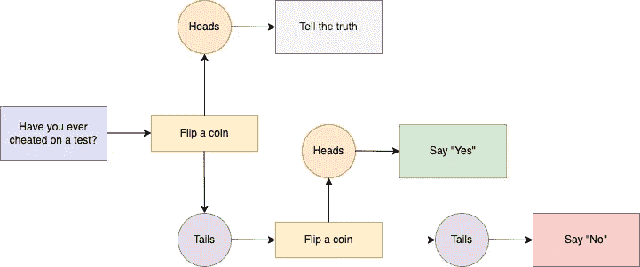
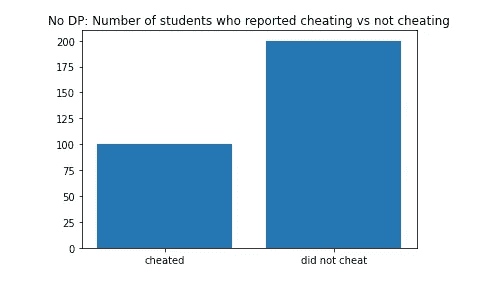
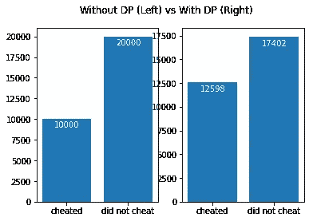
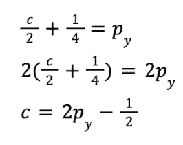

# 初学者的差分隐私示例

> 原文：<https://towardsdatascience.com/a-differential-privacy-example-for-beginners-ef3c23f69401>

## 通过抛硬币来保护隐私

[图片来源:马頔·安德烈](https://www.flickr.com/photos/wiser-007/3376883528)

差分隐私(DP)是一种保护数据集中个人隐私的方法，同时保护这种数据集的整体有用性。理想情况下，人们不应该能够区分一个数据集和删除了一个点的平行数据集。为了做到这一点，随机算法被用来给数据添加噪声。

举个简单的例子，想象一下:你在一所学生总数为 300 人的学校里。你们每个人都会被问到:“你们曾经在考试中作弊吗？”

明白这是一个多么敏感的问题了吧？也许那些作弊的人不愿意回答“是”，因为害怕潜在的影响。那么…我们如何解决这个问题呢？这就是 DP 派上用场的地方。

每个学生掷一枚硬币。如果他们正面着地，他们会说实话。如果它们正面着地，它们会再掷一枚硬币；如果他们正面着地，回答是；反面，没有。

一张图来说明硬币翻转

这样，即使你的调查结果被公开，也有*可信的否认*来证明你的回答的准确性。同时，随着人数的增加，学校仍然可以利用这些数据；它不会变得完全无用。

我们将看看这个用 Python 代码实现的掷硬币的例子。

# 骗子与非骗子的硬币游戏

Matplotlib 将用于绘制数据，以便于可视化。需要 Random 来实现随机抛硬币。

## 第 1 部分:不带 DP

首先，我们将看看没有差分隐私的模拟数据是什么样的。我们的“原始数据”用 0 和 1 表示，其中 0 表示“没有作弊”，1 表示“作弊”。每个二进制数代表不同的学生，他们真实的“作弊状态”是这里唯一衡量的指标。

上面单元格的输出示例

如你所见，100 名学生报告作弊，200 名学生报告没有作弊。

让我们向数据中添加一个新学生。假设他们真的作弊了。现在，运行输出，看看它们的数据点如何影响图形。

因为很难看出如此小的差异，所以使用 matplotlib 注释工具向条形添加数值。

上面单元格的输出示例

在这个传统的调查中，当我们添加一个学生时，很容易看出两个结果之间的差异。如果“作弊”的数量上升，学生作弊。如果“没有作弊”的数量上升，那么他们没有作弊。因为作弊一栏现在是 101 而不是 100，这意味着 301 号学生作弊了。

## 第 2 部分:使用 DP

为了实现 DP，每个学生掷一枚硬币。如果它落在头上，他们会如实回答。如果是反面着地，他们再掷一枚硬币。如果它落在正面，他们回答说他们没有作弊，如果它落在反面，他们回答说他们作弊了。

如果您多次运行该代码，您会注意到图形每次都是如何变化的。这是因为 DP 算法注入了随机性，就像我们在抛硬币时所做的那样。

上面单元格的输出示例

现在，我们可以说明差分隐私的一个主要目的:*不可能从一个数据集与一个平行数据集的结果中看出不同。*

让我们向数据中添加另一个新学生。假设他们真的作弊了。

现在，运行输出，看看它们的数据点如何影响图形。如果你这样做多次，图形每次都会改变。

上面单元格的输出示例

正如你所看到的，我们真的不能判断学生#302 是否作弊，因为输出结果包含一定程度的随机性。

由于算法的随机性，这就是拥有更大的数据集派上用场的地方。现在假设我们有 30，000 名学生，而不是 300 名。运行下面的代码。如果您多次运行它，您将观察到 DP 图没有显著变化，因为值遵循计算的概率。

上面单元格的输出示例

因此，通过使用 DP，我们保护了隐私，因为有人无法知道一个人是否在数据库中。

## **这些结果有多好？**

如上所述，数据集越大，结果就越准确，因为随机性被设定的概率抵消了。在掷硬币的情况下，随机性相当高，大约 25%的数据是错误的。然而，知道了这一点，骗子与非骗子的实际分布也同样可以计算出来。

说 *c* 是作弊学生的真实比例；那么，1- *c* 就是没有作弊的学生的真实比例。说 *p_y* 是学生举报作弊的比例。

*p_y* 是通过将 3/4 的作弊比例与 1/4 的非作弊比例相加得到的，因为我们假设每个回答中有 1/4 是错误的。

这简化为:

因此 *c* 估计是回答“是”的比例的两倍，减去 1/2，这表明我们如何估计在运行 DP 后知道结果的骗子的真实比例。请注意抛硬币的随机性是如何被简化为概率的，这表明需要一个大型数据集来保持准确性。

我们的结果显示，大约 125/300(所以 5/12)的人报告作弊——这是 *p_y* 。然后，计算出的 *c* 值为 1/3，与真实比例值相同。

## 结论

这个抛硬币的例子是如何使用 DP 来保护隐私的一个非常简化的版本。通过抛硬币，回答是匿名的，因为每个回答中都有“似是而非的否认”，但它仍然允许大约 75%的回答是真实的。我们能够“反向”计算，以找到每个响应的真实比例的良好估计值——这个数字在足够大的数据集下变得非常准确。

这个例子强调的最大优势是个人隐私——使用 DP，一个用户不可能区分两个不同的数据集，这在个人层面上保证了隐私。

*你可以在这里* *访问原脚本* [*自己来贯穿一切。此外，学生版(完成脚本并编写部分代码)以及说明可在此处获得*](https://github.com/liatzheng/DifferentialPrivacy/blob/main/differentialPrivacyExamples.ipynb) [*。*](https://github.com/liatzheng/DifferentialPrivacy/blob/main/differentialPrivacyExamplesStudentVers.ipynb) *它们都包含了一个额外的例子，改编自 OpenMinded 的 PyDP 库。*

*除特别注明外，所有图片均为作者所有。*

*参考文献:*

[1] P. Ippolito， [AI 差分隐私和联邦学习](/ai-differential-privacy-and-federated-learning-523146d46b85) (2019)

[2] S. Madhusudhan，[(通过抛硬币)如何保护你的数据](/how-your-data-is-secured-by-a-coin-toss-c933f9e13d4a) (2020 年)

[3]麻省理工学院 ETI，[什么是差别隐私？](http://eti.mit.edu/what-is-differential-privacy/) (2021)