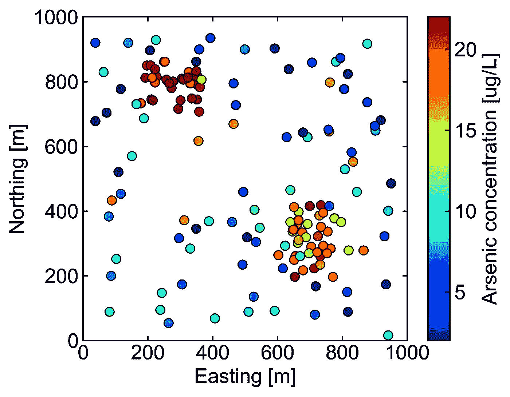
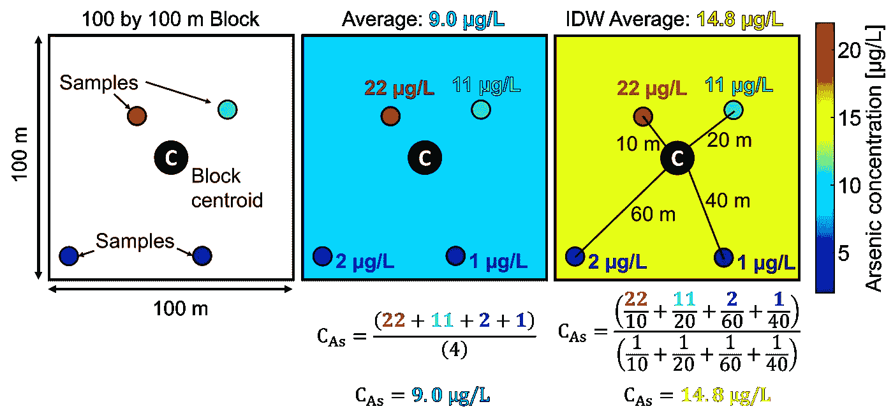
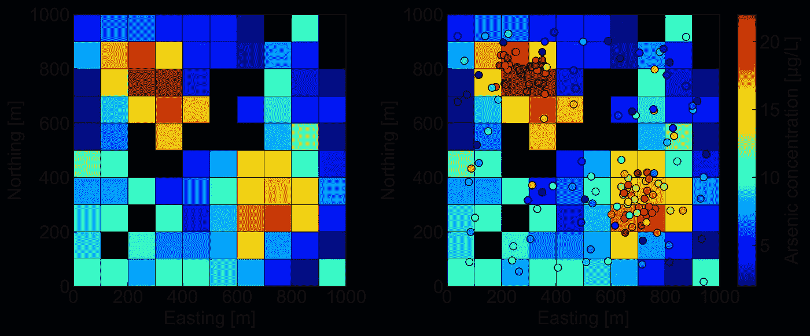
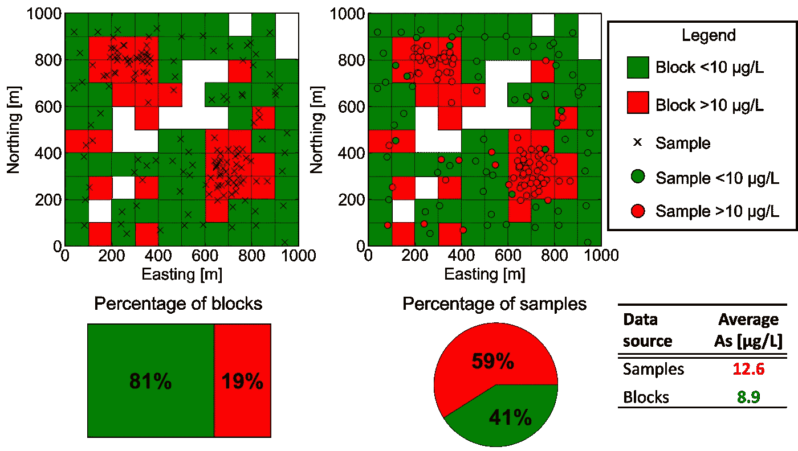

# 对地理空间数据进行网格化和重采样的几个原因

> 原文：<https://towardsdatascience.com/a-few-reasons-to-grid-and-resample-your-geospatial-data-193105ab7936>

## 一个快速的 5 分钟 Python 教程，展示了一个真实的环境应用

作者图片

# 介绍

优先采样的地理空间数据的最大问题之一是每个点所代表的不同区域或体积。我以前写过处理优先采样的地理空间数据时的一些挑战，以及如何通过去聚类来克服这些挑战，如果您感兴趣，可以查看下面的文章:

  

实施去聚类之类的地统计方法可能有些繁琐，因此在本文中，我们将重点关注一种更快、更简单的解决优先采样地理空间的方法。在这里，我们将通过将数据重采样到规则间隔的网格中来解决有偏采样。下面的示意图说明了这种方法，并展示了网格如何帮助我们克服聚类数据。

图解说明了对数据进行网格化和重采样的一般方法，以便网格中的每个块代表相同的区域

虽然规则间距数据解决了优先采样问题，但引入空间格网也带来了许多问题，例如格网间距、块大小和插值方法，这些问题可以基于操作约束进行定义，也可以使用标准地统计方法进行优化求解。

下面是一个环境应用的例子。合成数据集由分散在 2D 空间的 153 个砷污染地下水样品组成，测量单位为微克/升。世界卫生组织(世卫组织)[指南](https://www.who.int/news-room/fact-sheets/detail/arsenic)规定饮用水的砷浓度不应超过 10 μg/L，因此我们将分析数据集，并验证平均砷浓度低于健康限值，以便安全饮用。我们将使用的所有代码和合成砷数据集都可以在 [github](https://github.com/13ff6/GridData) 上获得。

# 首先浏览数据并建立网格

我们可以从使用`pandas`加载数据和使用`matplotlib`可视化数据开始。数据集非常简单，只有三列:东坐标(米)、北坐标(米)和砷浓度(μg/L)。我们可以快速可视化数据，以确认我们进行了优先采样。正如我们在下图中看到的，高砷浓度在西北和东南方向存在明显的高采样偏差。

显示西北和东南高砷浓度区域优先采样数据的两个清晰聚类的数据空间图

接下来，我们需要定义一个网格，网格的一个简单实用的块大小可以是 100 x 100m，这足够小，可以保留数据中更好的细节，并突出显示感兴趣的区域以供进一步研究。将块大小增加太多会导致很大程度的平滑，并且很难在每个大块中精确定位感兴趣的区域。太小，例如 10×10 米的区块，会使网格难以操作，并且不会为使用原始数据提供任何显著的好处。

使用`numpy`，我们能够很容易地在我们的站点上生成一个网格，如我们在 github 上的[代码所示。我们可以用`matplotlib`做一个快速的视觉检查，以确保网格的行为符合我们的预期:](https://github.com/13ff6/GridData)

数据的空间图，规则的块网格重叠绘制

接下来，我们需要决定如何对网格中的每个区块进行插值并分配砷浓度。

# 反距离加权插值法

插值空间数据的一种非常简单而实用的方法是对指定半径内的所有样本进行反距离加权。顾名思义，这只是对定义的半径内到估计点的所有样本进行距离加权平均。在这种情况下，我们的估计点将是块的质心，即块的中心。反距离加权公式如下所示:

反距离加权公式

一种诱人的方法可能是简单地取每个块中所有样本的平均值，但是这仍然会受到优先采样的影响，因为没有考虑数据的空间分布。下面的示意图比较了一个 100 x 100m 的块和四个不同浓度的砷样品以及到块中心的距离。平坦平均值低于 10 μg/L 砷浓度限值，而反距离加权平均值高于限值，这凸显了正确内插空间数据的重要性，因为危险区块可能会被遗漏，或者安全区块会被错误地标记为危险区块。

比较同一 100×100m 区块内四个砷样品的空间平均值，取区块内样品的平平均值和反距离加权(IDW)平均值，

我们可以很容易地使用样本数据和块坐标进行反距离加权。我们将使用 80 米的半径，这样我们可以获取块中的每个样本，并在多个块之间的边界共享样本。我们可以用`scipy.spatial's` `cKDTree`和一个简单的`for loop`给每个块的质心。

最后，我们可以可视化我们的网格，并产生有价值的见解，为进一步的行动提供信息。

# 使用网格数据通知进一步的行动

让我们从绘制网格开始，并将其与重叠的样本进行比较。下图显示了对格网进行空间插值是如何平滑数据的，但现在高砷和低砷区域在整个站点区域中的分布更加均匀。注意，有 14 个区块没有指定砷浓度，因为在 80 米搜索半径内没有样本。

有和没有样品覆盖的网格砷浓度区块的空间图

通过简单地过滤高于和低于 10 g/L 砷浓度的块，我们可以突出关注区域和安全区域。只绘制样本位置也很方便，因为我们可以看到所有样本是从哪里采集的。下图比较了网格块数据和原始样本数据的简单分析。当我们只分析高于安全限制的数据百分比时，我们会立即看到差异，因为只有 19%的数据块高于限制，而 59%的样本高于限制。获取块的全球平均砷浓度(8.9 微克/升)也将更加可靠，因为每个块代表相同的物理空间量，而样本(12.6 微克/升)给出有偏差的结果。

显示高于和低于砷浓度限值的块(左上)和样品(右上)的图。下面是超出或低于限制的块(左下)和样本(右下)的百分比汇总。红色代表数据超出限值，绿色代表数据低于限值。

另一个潜在有用的检查是多少点被分配给每个块。在 80 米搜索半径内具有更多样本的块比具有较少样本的块更不容易出错。将这一点可视化可以为未来在没有样本但邻近砷浓度高得惊人的地区进行采样提供信息。下图显示了在缺少数据但受西北和东南两个高砷浓度集群限制的区域中部进行额外采样的最大益处。

密度图显示每个区块中的样本数量，并突出显示没有任何样本的区域

# 摘要

地理空间数据只是空间中的点，用于测量任何种类的变量。通常不规则间隔的点分散在表示面积或体积的物理空间中，因此需要仔细处理和分析它们。考虑数据的空间分布是至关重要的，特别是如果有任何优先采样会导致任何统计测量中的偏差。

最终，有许多方法来处理优先采样的地理空间数据。创建规则格网并将样本空间插值到块质心是生成更能代表研究区域的块的一种快速简便的方法。

只需几行额外的代码，就可以对分散在 3D 空间中的样本执行相同的网格化和可视化方法。使用 3D 网格更加有趣，因为有很多方法可以将数据可视化，从而向最终用户传达可操作的信息。这个故事我们改天再说。