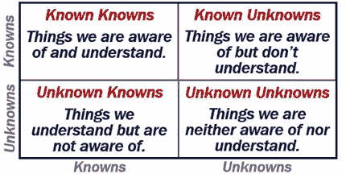
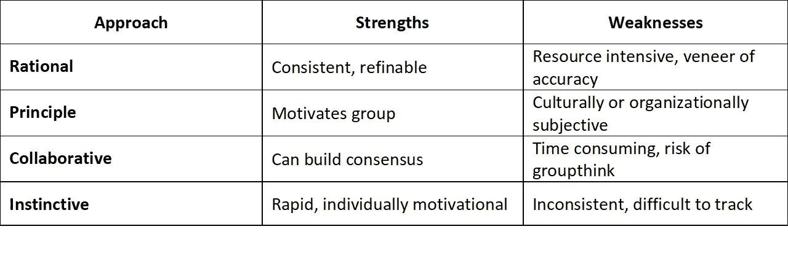

# 将决策智能嵌入组织的框架

> 原文：<https://towardsdatascience.com/a-framework-for-embedding-decision-intelligence-into-your-organization-f104947651ae>

## 如何实现决策智能

[JESHOOTS.COM](https://unsplash.com/@jeshoots?utm_source=medium&utm_medium=referral)在 [Unsplash](https://unsplash.com?utm_source=medium&utm_medium=referral) 上拍照

# 为什么是“决策智能”？

一段时间以来，人们对决策智能(DI)的兴趣越来越大，提出的采用规则多种多样——从原则性和利他性的驱动因素[1],到通过大规模自动化行动到结果的过程[2]实现技术支持的迫切需要的方法，以及介于两者之间的一切。

在我看来，探索这个领域有一系列原因:认识到投资数据以“做出更好的决策”过于模糊；希望改善决策文化，减轻主要基于启发式的非结构化或*临时*决策中固有的风险；希望将决策智能(DI)视为一个统一的学科，将各种社会科学、定量方法和商业概念的急需影响力结合在一起。显然，采用的驱动因素多种多样，大概取决于您的个人或组织环境。

虽然对于我们这些在分析和商业战略交叉领域工作的人来说，这可能并不奇怪，但也有一系列听起来非常商业的原因。虽然我打算在未来的文章中对这些驱动因素进行深入分析，但从较高的层面来看，它们通常分为以下几类:

数据和分析投资优化

数据、分析、决策产品和工件的优化设计和重用

推动决策支持活动的重点，以实现业务战略和监督

不管你是如何走到这一步的(这些都是令人信服的论点)，如果你和我一样，你会问自己“好吧…但是现在呢？”

# 不同的观点

先说 DI 巩固不足。有多少理由在你自己的业务中采用这个领域，就有多少定义。然而，这一领域的一些思想领袖已经开始围绕至少三种不同的 DI 观点出现，这些观点拥有许多共同的要素:

## Lorien Pratt 博士的链接本和 CDD

我热切地等待着 Lorien 在 2019 年的书[1]，并希望它将把所有松散收集的 DI 概念、描述和解释集中到一个地方。十多年来，Lorien 一直在倡导 DI，并且已经成为该领域的主要支持者之一。我强烈建议你看看 Lorien 的一些文章、博客、播客和视频，了解一下她对 DI 的看法。

她的书以叙述为基础，总结了人工授精的主要驱动力和原因，并提出了一些核心概念。最值得注意的是，洛里安提倡使用“因果决策图”，或“CDD”。

CDD 是一个有价值的简化工具，它允许用户通过识别三个主要决策组成部分(行动、因果关系、结果)及其对预期结果的累积影响来“设计”决策。*链接*通过几个例子，甚至介绍了 CDD 设计的方法，强调了 CDD 作为插入数据、信息、分析或 AI/ML 模型的脚手架的效用。

## 谷歌的 Cassie Kozyrkov 博士，以及她作为“首席决策科学家”的角色

这个领域的另一个主要声音是谷歌的首席决策科学家——凯西·科济尔科夫博士。除了令人印象深刻的简历和背景，Cassie 还是一位非常有天赋的演讲者和口语作家，她积极参与更广泛的数据科学和商业社区，经常利用幽默轶事或互联网模因将她的信息带入生活。和 Lorien 一样，我鼓励你去看看 Cassie 的一些文章和视频。

据我所知，Cassie 对 DI 最全面的概念化描述已经在[这篇](/introduction-to-decision-intelligence-5d147ddab767)文章【3】中进行了概述，并提出了行为经济学和心理学、数据科学、统计学和决策科学的巧妙融合。我很欣赏这种关注的广度，以及她如何同时呈现统计严谨性所要求的条件，同时也概述了在不确定性下影响决策的硬因素和软因素的作用。我认为 Cassie 对 DI 的跨学科观点引发了关于偏见、启发和决策文化在现代数据和决策分析应用中的作用的讨论。

## Gartner 研究中提到的“工程决策智能”模型

对于那些关注 DI 的人来说，您可能已经注意到该领域出现在“*2022 年数据和分析顶级趋势*”[4]，以及他们的“*Gartner Hype Cycle 2021 年分析和商业智能*”[5]。

因此，我认为这显然是他们所关注的，他们也为 DI 制定了自己的定义和框架。我还应该指出，去年 5 月，DI 参加了他们的虚拟数据和分析峰会。

Gartner 将决策智能定义为:

> *“通过明确理解和设计如何制定决策、如何评估结果、如何通过反馈管理和改进结果，来改进决策制定的实用规程。”[6]*

要了解更多信息，您可以阅读 Gartner 研究报告(只对 Gartner 订户开放)

# 遗漏了什么？

尽管如此，对于我们这些希望在业务中嵌入 DI 的人来说，很难找到一个公开可用的指导来源。虽然我们知道组织内部正在利用 DI，但目前还没有这样做的指南。这一领域的大多数出版材料要么过于理论化，要么与专有服务或框架联系过于紧密，通常缺乏“起步”的循序渐进的方法。

本文不会完全解决这个问题，但是它迈出了重要的第一步，提出了一个开源框架，描述了 DI 过程的主要分组，可以作为将 DI 嵌入到所有类型的组织中的线框。

Pierre Bamin 在 [Unsplash](https://unsplash.com?utm_source=medium&utm_medium=referral) 上拍摄的照片

# 嵌入决策智能的集成过程框架

我在这里提出了一个框架，描述了整体决策智能操作模型的主要活动和使能因素。下面介绍的这个模型将来自几个不同的 DI 定义和决策科学的概念联系在一起，并作为在组织内实施 DI 功能的指南:

作者创作的原始图像

该框架围绕两个主要方面构建:

**核心活动**，包括决策设计、决策支持、决策优化和决策评审子分组，概述了组织内建立的阿迪运营模式的主要活动；

**使能因素**(组织能力和决策文化)描述了加强或使能**核心活动**的组织的组成部分。

*以下章节从较高层面描述了这些维度，并为该领域的其他人在此框架上构建提供了基础。*

# 核心活动—决策前

## 优选设计

*第一组核心活动发生在* ***预决策*** *，并描述了“设计”决策的过程——也就是说，采取第一个关键步骤为决策提供结构，这将使所有后续的下游步骤能够建立决策基础。*

## 决策框架

非常著名的心理学家 Kahneman 和 Tversky 将决策框架定义如下:

> “…决策者对与特定选择相关的行为、结果和偶发事件的概念。” *【七】*

我们可以从这个定义中看到，它有效地设定了决策的边界——我的行动(杠杆)、结果(期望的或其他的)和意外情况(风险和外部性)是什么？他们进一步表明，决策偏好高度依赖于框架——即使预期结果是相同的。

显然，恰当地制定决策的过程不仅是定义恰当的决策范围的关键，也是确保已经建立了期望的决策过程的关键。因此，该框架至少应解决以下问题:

我想要的结果是什么？

为了获得这些结果，我愿意投资多少？

我的风险是什么？他们可以忍受吗？

的确，在查看任何数据之前，您应该知道这些问题的答案，因为它们可能会因为您对数据的检查而无效，即使您并不希望如此！[8]

将决策框架定义为决策前更广泛的核心活动的一部分的系统方法是锚定下游决策流程的关键组成部分。

## 决策映射

Lorien Pratt 博士在她的书《链接》和相关文章(如上所述)中出色地向我们介绍了 CDD 的效用。这种方法对于以简单的图形格式捕捉行动、因果联系和结果非常有用，这种格式可以引起讨论、包容、透明和结构化。

存在类似的框架(例如加拿大政府的[逻辑模型](https://www.canada.ca/en/treasury-board-secretariat/services/audit-evaluation/centre-excellence-evaluation/guide-developing-performance-measurement-strategies.html)方法【9】，卡普兰和诺顿的平衡计分卡的一些解释【10】等。)，但是这些通常与计划/项目级别的活动相关联，而与决策过程中的行动无关(例如，输入= >活动= >输出)。

决策映射的主要优势有[1]:

它通过图形化地表示行动、中介和期望结果之间的因果关系，减少了您必须“记住”的复杂性

它提供了一个机会，通过“聚集”在 CDD 周围，让更多的人参与决策过程

它提供了因果联系，作为数据和分析产品、指标、信息、预测模型等的集成点。并以这种方式将多个输入组织成单个决策

它为决策后审查提供了重新访问整个决策过程的机会，并提供了决策工件的重用

*促进决策规划工作的流程对于通过 CDD 或相关决策流程采用结构化决策至关重要。*

## 决策增强

*聚集在“决策支持”下的活动通过评估设计的决策，并清楚地识别数据和/或分析的集成点，来构建“决策设计”步骤。同样，它要求对决策的设计进行分析，以便清楚地识别可能解决或可能不解决的不确定领域。*

## 数据和分析集成

一个设计好的决策——例如，一个呈现一系列行动到结果路径的决策——提供了一个机会来清楚地确定数据或分析在哪里以及如何支持下游的预决策过程(例如，建模),或者如何确定一个行动是否会产生预期的结果。

基本原理很简单:如果你有一个行动——因果联系——结果路径，你真正看到的是一个数学函数。例如，如果我的行动是增加广告支出，而我的结果或中介是销售额的增加，那么就有一个数学函数来描述广告支出和销售额之间的关系。

*这样，为了在上述框架内完成决策，我们可以将决策的子组件附加到具体的数据、指标、分析、预测模型等。同样，我们可以考虑子组件的块(例如，动作-链接-结果或类似的集群),已知这些子组件具有由描述动作和结果的单个聚集关系控制的关系。Lorien Pratt 的书 Link 很好地展示了 CDD 作为整合数据和分析的脚手架。*

## 识别不确定性

所有的决策都是在一定程度的不确定性下做出的——尤其是在现代商业环境中，在“VUCA”世界中更是如此[11]。无论这些不确定性来源是来自组织的外部、内部，还是由数据质量的内在问题所驱动，它们都对决策者提出了挑战。在不确定性下做出决策有多种方法和“最佳实践”——从业务流程角度[12]到基于预期效用的统计驱动方法[13]。

从决策智能集成的角度来看，我认为流程的这一部分是关于查看一个设计好的决策(即，一个框架和映射的决策)，并评估不确定区域的决策。具体来说，虽然这是在一个有些争议的背景下出现的，但使用已经在其他科学领域找到支持者的*拉姆斯菲尔德*方法来评估不确定性是有用的[14]:

*转载自* [*安德烈亚·曼托瓦尼关于领导力的文章*](https://medium.com/@andreamantovani/known-knowns-known-unknowns-unknown-unknowns-leadership-367f346b0953)*【15】*

*框架决策提供了一个机会，可以在高层次上回顾决策环境，并确定我们已知的已知内容、已知的未知内容等。同样，CDD 为我们提供了一个机会，让我们坐下来看看每一个因果联系，并从拉姆斯菲尔德的角度(如上)来识别不确定性，但也从统计学的角度(在数据和分析被整合的地方)来识别不确定性——错误是什么？数据的质量如何？等等。*

**由于与此流程框架相关，通过主动识别不确定性领域，我们正在准备承认我们决策流程的局限性，并给自己一个机会来系统地识别无法解决的不确定性，或者我们可以降低决策中不确定性水平的领域。**

## *决策优化*

**经过设计和改进的决策为我们提供了一个机会，让我们考虑是否有机会通过建模来观察行动优化，和/或同意最适合决策环境和设计的决策方法。这一系列过程提供了一个机会，在作出决定之前解决最后的步骤。**

## *建模*

*这个*量化的*步骤是可能的，其中良好构造和映射的决策提供了在 CDD(或逻辑模型，或类似模型)内对聚集的行动-结果链接建模的机会。这可能允许评估行动对决策结果(有意或无意)的总体影响。如果数据(或分析)不允许开发一个完全细致入微的模型，那么行动对特定结果或中间结果的总体影响的知识(例如，该行动将导致 *x* 结果的“更多”或“更少”)仍然可以阐明一系列行动的所有结果的总体影响。*

*很明显，这是一个复杂的过程，需要投入大量的时间和资源，并且可能适合也可能不适合决策环境。然而，这是一个潜在的有价值的步骤，因为它允许决策*优化*，其中可以开发一个量化的决策模型，允许针对目标业务结果进行行动优化。*

*更广泛地说，我们也可以将决策自动化视为一系列活动的潜在目标，这些活动旨在优化行动与结果之间的联系。O'Reilly 详细描述了人工智能编排在决策自动化中的作用，并继续解释人工智能编排的目标应该是决策智能[2]！*

**无论您是否选择对决策进行建模，都应该清楚，希望对决策进行建模和优化的组织将需要利用内部量化专家(包括数据科学家)和/或聘请外部服务提供商来支持该流程。**

## *方法*

*虽然有很多“数据驱动”的决策制定方法，但现实是，在许多情况下，它根本不是最佳的，甚至是不可取的。在最近的 Gartner [数据和分析峰会](https://www.gartner.com/en/conferences/na/data-analytics-us)上，Gartner 召开了几次专注于决策的会议。*

*具体来说，Gartner 分析师 [Gareth Herschel](https://www.gartner.com/analyst/7427/Gareth-Herschel) 提出“*最佳决策是混合的”，*和*“任何方法都有优点和缺点”* [16]:*

**

*逐字转载自 Gartner，经许可使用[16]*

*我将扩展这一概念，意思是决策*要素*(例如 CDD 中的行动到结果的联系)也可以被评估为最适合该特定要素的方法。例如，评估一项行动是否会影响结果的本能(即启发式)方法可能适用于对该行动的结果敏感度较低的情况，或者数据收集成本过高的情况。这也是*为决策过程中的参与者定制*方法的好方法(见上文)。*

*通过评估一个决策(或决策的组成部分)的最佳方法，我们也邀请讨论 [*偏见*在决策制定中的作用](https://hbr.org/2015/05/outsmart-your-own-biases)【17】。虽然不是本文的主题，但它是组织决策文化和过程中的主要力量，在这方面有许多深入的参考资料可供评估。*

**就本框架而言，重要的是要认识到有一系列的方法，并且您的决策过程的一部分应考虑特定决策环境下最合适的方法组合。**

**

*由 [Victor Rodriguez](https://unsplash.com/@vimarovi?utm_source=medium&utm_medium=referral) 在 [Unsplash](https://unsplash.com?utm_source=medium&utm_medium=referral) 上拍摄*

# *核心流程—决策后*

## *决策审查*

*所以——你已经采取了所有你能采取的步骤来设计、增强和优化一个决定——现在你已经做出了这个决定。 **即使我们认为我们可能完成了，我们仍然可以利用决策智能为决策制定带来的结构，通过回顾我们的决策和保留决策工件来创造额外的价值。***

## *决策回顾*

*有一种公认的行为偏好，即通过结果的质量来评估决策的质量。这被称为*结果偏差*，是我们大多数人都容易犯的代价高昂的错误【18】。事实上，尤其是在资源稀缺且有快速前进的诱惑的组织环境中，结果偏差显然会掩盖关于决策*过程*的重要事实，这些事实会告知我们如何做出决策。*

> **“即使是最好的决策也有很大概率是错误的。即使是最有效的方法最终也会过时”**
> 
> *彼得·德鲁克*【19】**

*因此，如果我们承认彼得·德鲁克是正确的，即使是最好的决定也可能是错误的，那么我们必须承认好的决定可能会有坏的结果。换句话说，决策的质量应该根据决策过程的优劣来评估。*

**决策回顾是一个机会，可以询问决策过程是否合理，如果结果不好，可以确定我们是否还可以做些别的事情。请注意，即使有好的结果，决策过程也可能是糟糕的。决策回顾为我们提供了一个将持续改进引入决策框架的机会。**

## *决策工件的保留*

*记录良好的决策—包括清晰的框架、清晰的设计、潜在的决策图以及数据和分析、经验教训等的链接。—为将来的决策保留和重用所有这些决策构件提供了丰富的机会。类似地，子组件(例如，通过行动-因果关系-结果链接假设和测试的任何信息)可以作为未来决策图的子组件重用。*

*虽然不是所有的决策都有助于这种类型的知识保留，但是对于那些这样做的人来说，有机会减少创建类似结构的决策所需的未来工作量。*

**决策工件的保留——在可能的情况下——提供了重用的机会，这可以显著提高将 DI 应用于未来决策的效率。**

**

*安德里克·朗菲尔德在 [Unsplash](https://unsplash.com?utm_source=medium&utm_medium=referral) 上拍摄的照片*

# *有利因素*

*虽然上面的章节描述了可以针对决策智能实施进行定制的*流程*，但是如果没有一个支持将决策智能技术应用到企业环境中的企业环境，这些流程就不太可能成功。*

## *决策文化*

*决策权对于各组织内部的问责授权至关重要，并通过支持健全的、往往是参与性的决策过程的文化得到加强。这种文化直接与一个组织的领导能力和建立这种文化的意愿联系在一起[20]。事实上，它可以成为一项竞争优势:*

> *制定和执行决策的领导者几乎总能比他们的竞争对手带来更好的财务结果。[……]以决策为中心的公司的一个关键属性是在整个组织中培养伟大的决策和执行的文化，这是最难发展的，但也是持久成功的最重要因素。”*【21】**
> 
> *贝恩公司*

*不言而喻，一个组织的决策*文化*(价值观、对决策透明的渴望、持续改进的文化等。)是支持阿迪决策方法的关键促成因素。*

*来自麦肯锡的一些(相对)最近的[研究强调了决策相关问题的普遍性，并进一步提出了一种使决策实践适应所考虑的决策类型的方法【22】。这是一个关于寻求强调决策过程而不仅仅是结果的决策文化的很好的例子。](https://www.mckinsey.com/business-functions/people-and-organizational-performance/our-insights/three-keys-to-faster-better-decisions)*

## *组织能力*

*最后，我们可以考虑组织的能力，以及它们在支持利用 DI 原则的健壮的决策方法中的作用。这里，我们讨论的是“经典的”三个组织维度——人员、流程和技术。*

*首先，也是最重要的，基于数据或证据的决策方法要求劳动力技能与这一目标相匹配。因此，除了开展核心工作所需的技能之外，一个有利组织的技能清单还将包括以数据为中心的角色(分析、数据科学、信息管理等)。)，以及支持支持数据工作的技术基础架构所需的技能。*

*第二，组织过程可以支持对结构化决策和评审的偏好。特别是，治理、风险管理和计划/项目管理为将支持决策的实践构建到企业流程中提供了一个工具。例如，计划相关工作的福利证明的一部分可以包括决策回顾和分析。类似地，对运营或战略风险的缓解可以包括倡导与阿迪相关的战略决策方法。虽然这个领域是特定于组织的，但它提供了将 DI 或结构化决策过程“硬连线”到组织工作中的方法。*

*最后，组织的技术能力和基础设施对于确保数据资产能够被存储、转换、可视化和分析等至关重要。类似地，这些功能支持存储/检索决策资产，并提供协作功能和工具，这些功能和工具对于举行对决策智能至关重要的引导式讨论至关重要。*

# *裁剪:如何使用这个框架*

*所有框架流程的应用都需要大量的时间和资源投入。因此，这个框架的更合适的应用将涉及到根据手头的决策来定制框架。*

**这是项目管理的核心概念，它提供了一个类似的场景，促进所有可用过程、方法等子集的适当选择。*【23】*

**这个概念很简单:并非所有的决策都需要所有的流程，简单或影响较低的决策需要更小的子集，而更复杂的决策可能需要更多。**

# *接下来是什么？*

*这篇文章涉及的领域太多，深度太浅。然而，希望它能在一个简单的框架内提供一组连锁的过程，帮助将一些核心的 DI 概念嵌入到企业环境中。我真诚地希望，其他希望将这些想法整合成一个统一的、巩固的 DI 领域的人可以从这篇文章中得到启发，帮助他们思考——即使这个框架被抛弃/塑造/改编。就我个人而言，我将密切关注这一领域，看看我们如何将 DI 成熟为“生产就绪”的实践，以应对我们共同未来的挑战。*

# *承认*

*我要感谢许多不可思议的聪明人，他们正积极努力为这个领域做出贡献，并围绕决策智能作为一门学科建立一个社区。特别是，我要感谢 Lorien Pratt 博士和 Cassie Kozyrkov 博士的贡献，前者在尝试捕捉 DI 的范围和应用方面取得了巨大进步，后者利用其在技术领域的权威地位显著提升了这一新兴领域的形象。*

## *注意:这里所有的观点都是我自己的*

# **关于作者:**

*Erik 是产品开发和分析领域的领导者，在加拿大公共部门拥有超过 15 年的经验。他对将数字和科学原理应用于组织面临的日常挑战很感兴趣。*

*可以在 LinkedIn 上的 *这里找到 *Erik，或者直接联系*[*erik.balodis@gmail.com*](mailto:erik.balodis@gmail.com)**

# *参考*

*[1] L. Pratt，Link:决策智能如何为更美好的世界连接数据、行动和结果，Emerald Group Pub Ltd .，2019 年。*

*[2] O'Reilly Media，“AI 编排实现决策智能”，Medium，2021 年 1 月 19 日。【在线】。可用:[https://medium . com/oreillymedia/ai-orchestration-enables-decision-intelligence-2 a88d 8306 AC 9。](https://medium.com/oreillymedia/ai-orchestration-enables-decision-intelligence-2a88d8306ac9.)【2021 年 9 月 26 日访问】。*

*[3] C. Kozyrkov，“决策智能导论”，走向数据科学，2019 年 8 月 2 日。【在线】。可用:[https://towardsdatascience . com/introduction-to-decision-intelligence-5d 147 ddab 767。](/introduction-to-decision-intelligence-5d147ddab767.)【2021 年 9 月 26 日访问】。*

*[4] Gartner，“2022 年数据和分析的主要趋势”，Rita Sallam，2022 年 3 月 11 日。Gartner 是 GARTNER，Inc .和/或其附属公司在美国和国际上的注册商标和服务标志，经许可在此使用。保留所有权利。*

*[5] Gartner，“2021 年分析和商业智能的炒作周期”，Austin Kronz，Peter Krensky，2021 年 7 月 29 日。Gartner 和 HYPE CYCLE 是 GARTNER，Inc .和/或其附属公司在美国和国际上的注册商标和服务标志，经许可在此使用*

*[6] Gartner，“决策——由您做出决定”, G. Herschel，Gartner 数据和分析峰会，虚拟，2021 年。*

*[7] A. Tversky 和 D. Kahneman，“决策的框架和选择的心理学”，*《科学》，*第 211 卷，第 30 期，第 453-458 页，1981 年。*

*[8] C .科济尔科夫，“伟大决策者做的第一件事”，《哈佛商业评论》，2019 年 6 月 25 日。【在线】。可用:[https://HBR . org/2019/06/the-first-thing-great-decisions-do。](https://hbr.org/2019/06/the-first-thing-great-decision-makers-do.)【2021 年 9 月 26 日访问】。*

*[9]加拿大政府，“支持有效的评价:制定绩效衡量战略指南”，[在线]。可用:[https://www . Canada . ca/en/treasury-board-secretariat/services/audit-evaluation/centre-Excellence-evaluation/guide-developing-performance-measurement-strategies . html # logic model。](https://www.canada.ca/en/treasury-board-secretariat/services/audit-evaluation/centre-excellence-evaluation/guide-developing-performance-measurement-strategies.html#LogicModel.)【2021 年 9 月 26 日访问】。*

*[10] R. S. Kaplan 和 D. P. Norton，“平衡计分卡——推动绩效的措施”，*《哈佛商业评论》，*，1992 年 1 月-2 月。*

*[11]n·贝内特和 g·j·莱莫因，《VUCA 对你真正意味着什么》，*《哈佛商业评论》，【2014 年 1-2 月。**

*[12] A .亚历山大、a .德斯梅特和 l .韦斯，“不确定时期的决策”，麦肯锡公司，2020 年 3 月 24 日。【在线】。可用:[https://www . McKinsey . com/business-functions/organization/our-insights/decision-making-in-uncertain-times。](https://www.mckinsey.com/business-functions/organization/our-insights/decision-making-in-uncertain-times.)【2021 年 9 月 26 日进入】。*

*[13] J. Chen，“预期效用”，Investopedia，2021 年 5 月 7 日。【在线】。可用:[https://www.investopedia.com/terms/e/expectedutility.asp.](https://www.investopedia.com/terms/e/expectedutility.asp.)【2021 年 8 月 26 日获取】。*

*[14] M .谢默，“拉姆斯菲尔德的智慧”，《科学美国人》，2005 年 9 月 1 日。【在线】。可用:[https://www . scientific American . com/article/rumsfelds-wisdom/。](https://www.scientificamerican.com/article/rumsfelds-wisdom/.)【2021 年 8 月 26 日获取】。*

*[15] A. Mantovani，“已知的已知、已知的未知、未知的未知和领导力”，媒体，2020 年 4 月 28 日。【在线】。可用:[https://medium . com/@ andreamantovani/known-knowns-knowns-unknowns-unknowns-unknowns-leadership-367 f 346 b 0953。](https://medium.com/@andreamantovani/known-knowns-known-unknowns-unknown-unknowns-leadership-367f346b0953.)【2021 年 8 月 26 日获取】。*

*[16] Gartner，“决策——它们是您做出的决策”，G. Herschel，Gartner 数据和分析峰会，虚拟，2021 年。Gartner 是 GARTNER，Inc .和/或其附属公司在美国和国际上的注册商标和服务标志，经许可在此使用。保留所有权利。*

*[17] J. B. Soll，K. L. Milkman 和 J. W. Payne，“智取你自己的偏见”，*《哈佛商业评论》，*第 64–71 页，2015 年 5 月。*

*[18] G. Francesca，“当我们以结果来判断一个决定时，我们错过了什么”，《哈佛商业评论》，2016 年 9 月 2 日。【在线】。可用:[https://HBR . org/2016/09/what-we-miss-when-we-judge-a-decision-by-outcome。](https://hbr.org/2016/09/what-we-miss-when-we-judge-a-decision-by-the-outcome.)【访问 2021】。*

*[19] P. F .德鲁克，“有效决策”，*《哈佛商业评论》，* 1967 年。*

*[20] D. Waller，“创建数据驱动文化的 10 个步骤”，《哈佛商业评论》，2020 年 2 月 6 日。【在线】。可用:[https://HBR . org/2020/02/10-创建数据驱动文化的步骤。](https://hbr.org/2020/02/10-steps-to-creating-a-data-driven-culture.)*

*[21] M.W. Blenko、P. Rogers 和 P. Meehan，“创造以决策为中心的文化”，贝恩公司，2011 年 4 月 15 日。【在线】。可用:[https://www . bain . com/insights/decision-insights-7-create-a-decision-focused-culture/。](https://www.bain.com/insights/decision-insights-7-create-a-decision-focused-culture/.)*

*[22] A .德斯梅特、g .约斯特和 l .韦斯，“更快、更好决策的三个关键”，2019 年 5 月 1 日。【在线】。可用:[https://www . McKinsey . com/business-functions/people-and-organization-performance/our-insights/three-keys-to-fast-better-decisions。](https://www.mckinsey.com/business-functions/people-and-organizational-performance/our-insights/three-keys-to-faster-better-decisions)*

*[23] S. Whitaker，“剪裁的好处:使项目管理方法适合”，PMI 白皮书，2014 年 9 月。【在线】。可用:[https://www . PMI . org/learning/library/tailoring-benefits-project-management-methodology-11133。](https://www.pmi.org/learning/library/tailoring-benefits-project-management-methodology-11133.)*