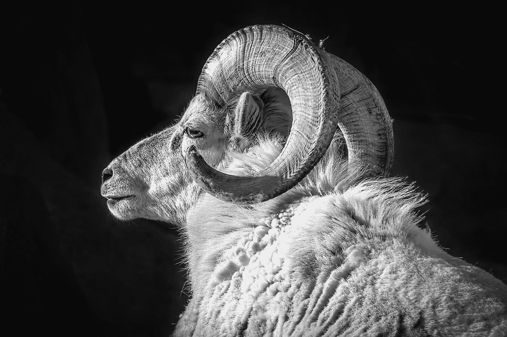
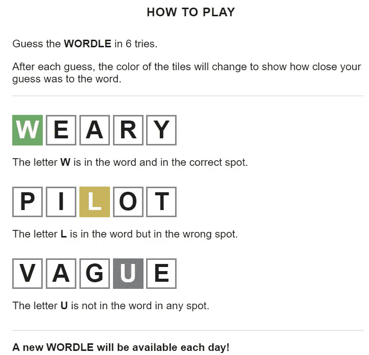
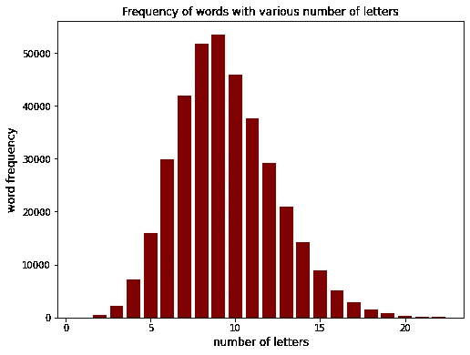
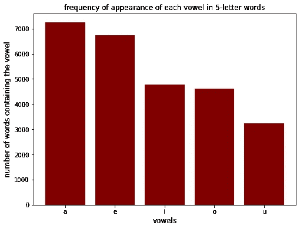
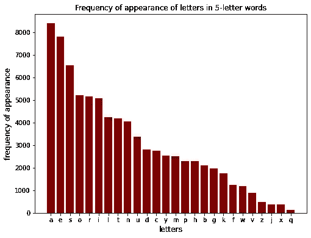
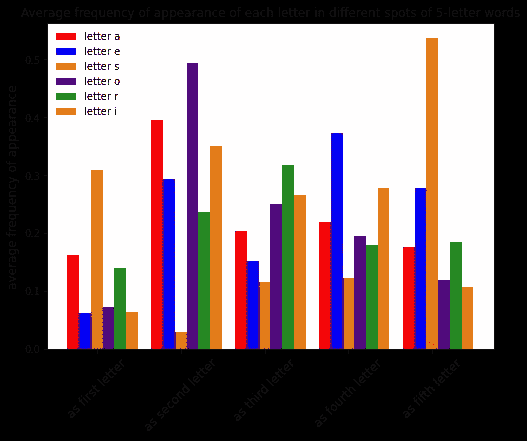
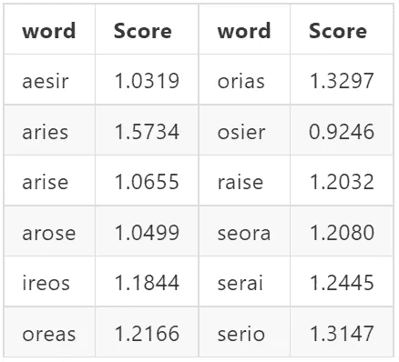
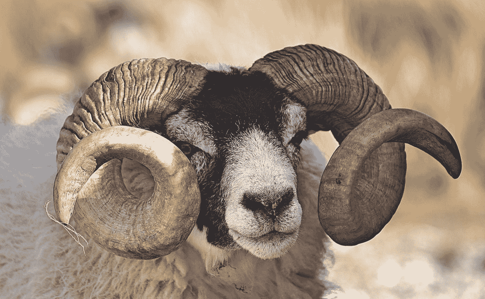

# 沃尔多的一句话

> 原文：<https://towardsdatascience.com/a-frequency-analysis-on-wordle-9c5778283363>

# 沃尔多的一句话

克劳德·里士满在 [Unsplash](https://unsplash.com?utm_source=medium&utm_medium=referral) 上的照片

在过去的几周里，这个游戏赢得了社交媒体的青睐。Wordle 基本上是一个单词游戏，玩家尝试在 6 次猜测中猜出一个 5 个字母的单词，玩家逐渐获得更多关于目标单词的信息。这款游戏由艺术家兼工程师[乔希·沃德尔](https://www.powerlanguage.co.uk/)创作。当玩家提交第一个 5 个字母的单词时，Wordle 开始。每次提交单词时，都会对提交单词的每个字母提供反馈，指示该字母是否存在于目标单词中，以及该点是否与目标单词中的相匹配。下面是说明截图。

Wordle 的规则(作者截图)

# **一个好策略**

有没有玩游戏的好策略？显然，在输入第一个单词之前，玩家没有关于该单词的信息，它可能是大约 15000 个 5 字母英语单词中的一个。然而，一旦第一个单词被提交，玩家将获得更多关于目标单词中涉及的字母的信息，这取决于输入的单词。一旦玩家开始收到反馈，有没有好的策略？也许有一个。在提供了对第一个单词的反馈后，成功将取决于许多因素，包括玩家的词汇量以及他们如何根据反馈缩小下一个猜测的范围。然而，第一个词的选择与玩家的词汇或语言技能无关。这就是为什么，我们也许可以谈论在第一个单词被提交后提供最佳反馈(尽可能多的信息)的策略。基本上，对于第一个输入的单词，一个好的策略是尽可能多地删除剩余的字母。更好的是，对于第一个输入的单词，一个好的策略是能够确定目标单词的尽可能多的字母，并且这些字母的位置尽可能正确。在这个分析中，我试图找到一个策略，或者更确切地说，一个词，可以服务于这个目的。

# 仔细看看上面的字

基于[维基百科](https://en.wikipedia.org/)上的[这篇文章](https://en.wikipedia.org/wiki/List_of_dictionaries_by_number_of_words),**韦氏第三版新国际英语词典**包含 47 万个词条。但是，这些单词中的一部分已经过时，或者可能不属于只包含字母(没有数字或符号)的有效单词类别。我在 [Github](https://github.com/) 上的[这个库](https://github.com/dwyl/english-words)里找到了一个这样的词的数据集。该文件包含 370，103 个英语单词，这些单词是单个的，并且只包含字母。从这个列表中只提取了 5 个字母的单词后，我剩下了一个 15，918 个单词的列表。我将研究这个列表，希望能对输入到 [Wordle](https://www.powerlanguage.co.uk/wordle/) 中的第一个单词有更好的策略。也许与这个小项目无关，但我很好奇，想找到基于字母数量的词频分布，结果如下。显然，频率是单峰的，峰值出现在 9 个字母的单词上。5 个字母的单词仅占该列表中所有单词的大约 4.3%。

词频(图片由作者提供)

接下来，我将回顾两种不同的策略，元音策略和频率策略。我将证明频率策略是一个更好的策略，我们将根据频率策略选择最佳的词。

# 元音策略

当试图提出一种策略来消除每一轮中的大量单词时，元音起着重要的作用。这是因为这个单词的每个音节中至少有一个元音。元音共有 5 个: *A* 、 *E* 、 *I* 、 *O* 和 *U* 。尽管字母 *Y* 在一些单词中可以充当元音，但我不认为它是元音。从元音开始搜索可能是一个好主意，因为英语中的每个字母都必须至少有一个元音(这并不是 100%正确，稍后我们会发现，我们将能够找到 8 个没有任何元音的单词，尽管这种策略的优点并不存在问题)。

我开始在 5 个字母的单词列表中搜索，找到有一个、两个、三个、四个和五个独特元音的单词的数量。例如，单词 *asana* 只有一个独特的元音，单词 *alibi* 有两个。结果是，分别有 6223、8568、1055、18 和 0 个单词有 1、2、3、4 和 5 个独特的元音。例如， *adieu* 和 *auloi* (古希腊管乐器 [Aulos](https://en.wikipedia.org/wiki/Aulos) 的复数)、 *Aequi* (古代意大利部落)和 *uraei* (埃及眼镜蛇的直立形态的复数)都有 4 个独特的元音。不用说，没有只由元音组成的 5 个字母的单词。

还有 46 个 5 个字母的单词，其中字母 *Y* 充当元音，例如，在单词 *ghyll* ( [英国北部的深谷或狭窄的山谷](https://en.wikipedia.org/wiki/Gill_(ravine))或 *Scyld* (一个[传说中的丹麦国王](https://en.wikipedia.org/wiki/Skj%C3%B6ldr))中。还有 8 个单词**没有任何元音，如 *crwth* ，这是一种弦乐器。**

考虑到元音在英语中的重要性，基于元音的策略是使用包含尽可能多的独特元音的第一个单词。这将帮助我们确定目标单词中是否存在尽可能多的元音。如上所述，没有只由元音组成的 5 个字母的单词。然而，有 18 个单词由 4 个独特的元音组成。这些词包括: *adieu* ， *aequi* ， *aoife* ，*aue to*， *aueto* ， *auloi* ， *aurei* ， *avoue* ， *heiau* ， *kioea* ， *louie* ，

有人可能会说，这 18 个单词中的任何一个都是 Wordle 的良好开端。然而，让我们看看这 5 个元音中的任何一个在 5 个字母的单词中是否出现得更多/更少。下面显示了 5 个元音在 5 个字母单词中的出现频率(不包括唯一的出现，即字母 *A* ，单词 *asana* 计为 1)。

元音频率(图片由作者提供)

上图显示元音 *U* 是 5 个元音中出现频率最低的一个。从包含 4 个独特元音的 5 个字母单词列表中过滤掉包含 *U* 作为元音的单词，我们只剩下两个单词列表， *Aoife* ( [一个爱尔兰女性名](https://en.wikipedia.org/wiki/Aoife)和 *Kioea* ( [一种在 19 世纪灭绝的夏威夷鸟](https://en.wikipedia.org/wiki/Kioea))。快速搜索列表显示，辅音 *K* 出现在 1663 个 5 个字母的单词中，而辅音 *F* 出现在 1115 个单词中。因此，这种策略会让人联想到“T21”这个词。值得一提的是，这种策略完全忽略了单词中元音的位置，只决定了目标单词中元音的有无。我们将在下一节看到，频率策略如何优于元音策略。

# 频率策略

之前的策略只关注元音。然而，这个策略将集中在所有的字母上。我们将评估字母表中最常用的字母，还将确定 5 个字母单词中最常用字母的最常见位置。基于这些，我们将决定最好的单词首先进入游戏。

我在数据集中的 5 个字母的单词中找到了字母表中每个字母的出现频率，并将它们从最大到最小排序。下图显示了频率。

信件频率(图片由作者提供)

在上图中，一个单词中出现一个字母计为 1。所以我决定看看每个单词字母的平均频率，看看它是否与上面的有什么不同。查看 5 个字母单词中字母的平均出现频率，我没有看到字母顺序有任何差异，从最常见到最不常见排序(见下文)。

信件的平均频率(图片由作者提供)

这意味着五个字母单词中最常用的字母(就总频率和平均频率而言)是字母 *A* 、 *E* 、 *S* 、 *O* 、 *R* 、 *I* 、 *L* 、 *T* 等。我决定关注前六个字母，因为在第六个字母之后，平均频率显著下降。有 96 个单词仅由这些字母组成(允许重复)。然而，如果我们同意第一个字母的目的是消除尽可能多的剩余字母(或确定目标单词中尽可能多的字母)，也许我们应该限制字母的重复。如果我们不允许重复，这个列表将减少到只有 12 个单词。这些词是:aesir，aries，rise，rise，ireos，oreas，orias，osier，raise，seora，serai 和 serio。这 12 个单词中哪一个是 Wordle 中最好的第一个单词？

为了回答这个问题，我决定看看前六个字母在 5 个字母单词(第一个字母，第二个字母，等等)的每个位置出现的频率。).结果如下所示。

每个位置的字母频率(图片由作者提供)

我还计算了 5 个字母单词中前 6 个字母的平均频率，看它是否与绝对频率有显著差异，但结果并没有不同。平均频率是通过将绝对频率除以 5 个字母的单词的数量来计算的，其中特定的字母出现在特定的位置。平均频率图如下所示。

每个位置的平均字母频率(图片由作者提供)

这表明，例如，字母 *S* 经常作为第五个字母出现在 5 个字母的单词中，但它几乎从不作为第三个字母出现。在此基础上，我使用了一个简单的评分系统来给每个单词打分，它基本上由基于上述结果的字母的平均频率之和组成。该评分系统将假设 6 个字母的价值相等，并将只关注每个点的频率。例如，字母 aesir 的分数将被计算为大约 0.1619+0.2928+0.1162+0.2771+0.1840 = 1.032，因为字母 A 在第一点的平均频率是 0.1619，字母 E 在第二点的平均频率是 0.2928，等等。下表和下图显示了列表中所有 12 个单词的计算得分。

热门词汇得分(作者图片)

基于这种分析，单词 [*白羊座*](https://en.wikipedia.org/wiki/Aries_(astrology)) (拉丁语为 ram) 具有最高的计算得分。研究表明，如果将单词 *Aries* 作为输入到 Wordle 的第一个单词，平均来看，可以确定目标单词中的最大字母数。

白羊座是*拉丁语中公羊的意思。*照片由[上的](https://unsplash.com?utm_source=medium&utm_medium=referral)[车轮](https://unsplash.com/@livin4wheel?utm_source=medium&utm_medium=referral)带动

# 测试

为了测试 *Aries* 识别目标单词中字母的有效性，我从 5 个字母的单词列表中随机选择了 5000 个单词，并计算了当单词 *Aries* 被用作 Wordle 上的第一个单词时，平均会显示多少个字母。这个过程我重复了 10 次。下面示出了在将*白羊座*用作第一单词之后识别的目标单词中存在的字母(每个单词)的平均数量在 2.055 和 2.1 之间。请注意，下面的结果不会区分字母，哪些点被正确识别，哪些没有被正确识别。它仅仅包括在目标单词中识别的所有字母。换句话说，输入单词后所有变成金色和绿色的字母。

当 Aries 用作第一个单词时识别的平均字母数的模拟结果

我对 Kioea 这个词进行了同样的分析(这是我们元音策略建议的)，结果平均只有 1.79 个字母被识别出来。这表明频率策略在指示目标单词中的字母方面优于元音策略。

接下来，我计算了平均字母数(每个单词)，其在目标单词中的实际位置被单词 *Aries* 正确识别。这意味着，不仅字母被识别，而且它在目标单词中的位置也被正确识别。换句话说，这是输入单词后变成绿色的字母的平均数量。为了进行模拟，我再次使用了 10 个重复，每个重复中随机选择了 5000 个单词。下面显示了白羊座*的结果。*

当 Aries 用作第一个单词时，正确识别的字母的实际点的平均数量的模拟结果

我对热门词汇列表中的所有 12 个单词进行了同样的分析，看看它们中是否有任何一个能击败白羊座。正如所料，单词 *Aries* 显示了平均字母数(每个目标单词)的最高值，其斑点被正确识别。对于这一分析，我也使用了 10 次重复和每次重复中随机选择的 5000 个单词，并报告了所有 10 次重复的平均值。

对于顶部单词列表中的所有单词正确识别的字母的实际点的平均数量的模拟结果

正确识别的字母位置的平均数量(作者图片)

基于该研究的结果，如果用作第一个单词，单词 *Aries* 平均可以正确识别大约 2.07 个字母的存在，并且平均大约 0.6 个字母的正确点将被正确识别。

# 结论和说明

一个旅舍。mostafa meraji 在 [Unsplash](https://unsplash.com?utm_source=medium&utm_medium=referral) 上拍摄的照片

我后来意识到，不幸的是，*白羊座*不在 Wordle 的可接受单词列表中，也不是列表中的下一个最佳单词[欧里亚斯](https://en.wikipedia.org/wiki/Orias)和[塞里奥](https://en.wikipedia.org/wiki/Serio_(river))(基于上面确定的单词分数)。榜单上第二好的单词是 serai，这是商队旅馆的另一种说法，确实在 Wordle 的被接受单词列表中。名字的由来是波斯语和土耳其语，读音略有不同( *saray* 或 *sarāī，亦见*[*caravan serai*](https://en.wikipedia.org/wiki/Caravanserai)*)*)。在我们的测试模型中识别的字母和字母点的平均频率方面， *serai* 和 *Aries* 在正确识别的目标单词中具有相同的字母平均频率(平均大约 2.07 个字母)。然而，单词 *serai* 被正确识别的字母点的平均频率略低(大约为 0.47，相比之下 *Aries* 为 0.58)。在下面，你会看到 serai 被用作 1 月 16 日单词的第一个单词，识别出 3 个字母的存在，其中两个字母的位置被正确识别。

1 月 16 日，serai 被用作 Wordle 上的第一个单词(图片由作者提供)

总之，我不确定 Wordle 的选词是否是一个完全随机的过程。你可能会争辩说，有些单词可能与日常全球事件有某种关联(参见[此处](https://screenrant.com/wordle-answers-updated-word-puzzle-guide/)2022 年过去的单词列表)。毕竟，基于分析或策略的游戏可能并不有趣。

祝大家 Wordling 快乐(虽然 Wordling 可能不在 Wordle 的可接受单词列表中)！