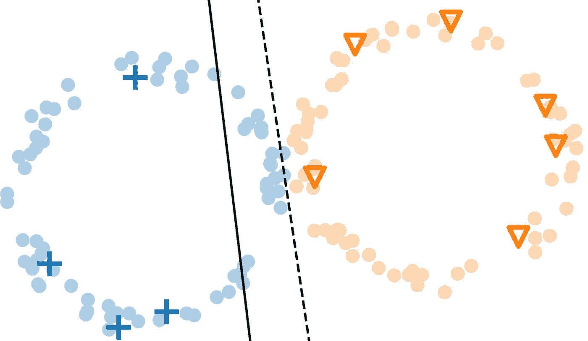

# 半监督学习的友好介绍

> 原文：<https://towardsdatascience.com/a-friendly-intro-to-semi-supervised-learning-3783c0146744>

## 如何在深度学习管道中额外使用未标记的数据来提高模型的性能

在 [Unsplash](https://unsplash.com/t/nature?utm_source=unsplash&utm_medium=referral&utm_content=creditCopyText) 上由 [Bernd Dittrich](https://unsplash.com/@hdbernd?utm_source=unsplash&utm_medium=referral&utm_content=creditCopyText) 拍摄的照片

在大多数学术或业余爱好深度学习挑战中，你最有可能面临的是众所周知的、已经标记的数据集，这些数据集可以直接输入到你自己的模型中。为了让事情变得更简单，研究人员通常依赖标准数据集，如 *CIFAR-10、SVHN、ImageNet、*和许多其他数据集来评估他们的架构。这样做的好处是，昂贵的数据收集和标记工作已经由他人完成，因此您不必担心。

然而，在实际用例中，当您需要收集自己的数据时，事情可能会变得更加麻烦。数据收集过程通常是深度学习项目中最耗时和最关键的部分之一。你可能听过这句话

> “垃圾进，垃圾出。”

之前，对于神经网络来说尤其如此。错误标记的数据点或训练数据中的偏差会大大降低模型的预测能力，并使整个管道变得无用。因此，通常很难在合理的成本和时间内获得足够多的高质量样本来训练神经网络。

如果仔细观察获取训练数据的过程，就会很快意识到，并非所有部分都同样适用。在许多情况下，记录成千上万个样本是很容易的。只有下面的标记过程使得获得许多样品的成本如此之高。因此，在实践中，只有一小部分可用数据实际上用于训练神经网络，有效地丢弃所有未标记的样本。这种培训通常被称为**监督学习**。相反，仅使用没有任何标签的数据点(例如用于聚类)被称为**无监督学习**。

随着模型变得越来越大，需要大量的数据才能收敛，问题不可避免地出现了，这些未标记的样本是否可以在训练过程中得到利用。

> 这种训练计划被称为**半监督学习**，因为它结合了监督和非监督学习的核心概念。

本文将提供半监督学习的友好介绍，并解释其核心概念。我们开始吧！

# 基础知识

半监督学习在实践中。粗线表示通过监督学习获得的决策边界。虚线显示了半监督情况的边界。圆点是未标记的数据点，三角形/加号是标记的数据点。图取自 van Engelen 等人(2018 年)

上图显示了所有三种学习方案的实施情况。圆圈代表两个类别的未标记数据点。圆形和三角形对应于标记的样本。为了让未标记的样本有用，我们必须假设它们仍然包含对我们有用的信息。更精确地说:

> 潜在的边际分布 *p(x)* 应该提供关于后验 *p(y|x)的有用信息。*

为了使半监督训练起作用，我们必须依赖三个主要假设:

**平滑度假设**

它指出，如果两个样本 *x1* 和 *x2* 在输入空间中接近，则它们应该共享相同的标签。例如，假设有一个描述汽车重量和油耗的数据集。这两个特征的值较小的样本很可能代表紧凑型车，而值较大的样本往往对应于 SUV。当我们也考虑未标记的数据时，这个假设很方便，因为我们希望它们共享其最近的标记邻居的标记。

**低密度假设**

从光滑性假设可以直接推导出另一个前提。类别之间的判定边界应该位于输入空间的低密度区域。这意味着它应该位于一个有少量标记和未标记样品的区域。如果它位于具有高密度的区域中，则将违反平滑度假设，因为在输入空间中接近的样本将不再共享相同的标注。

**流形假设**

机器学习任务的数据通常是高维的。但是，并非所有特征都显示相同的方差水平，这使得它们对模型不太有用。因此，高维数据往往位于一个低得多的维流形上。该信息可用于推断未标记样本的类别。

这三个假设建立了几乎所有半监督学习算法的基础。

# 它实际上是如何工作的

最近的半监督学习算法的一个特点是，它们都基于两个范例中的一个(有时甚至两个都是)。

第一种范式被称为**伪标记，**，它使用网络本身来为未标记的数据生成基础事实标签。要做到这一点，模型通常要用需要获得的全标记子集进行预处理。然后将未标记的样本输入网络，并记录它们的分类预测。如果样本的最大类别概率超过设定的阈值，则相应的类别被用作基本事实。然后，这些样本可用于以受监督的方式训练模型。随着模型的性能变得越来越好，人工获得的标签可以使用完全相同的技术迭代地改进。

第二种范式被称为**一致性正则化**，训练模型在输入同一幅图像的两个略有不同的版本时输出类似的预测。在许多情况下，原始图像的这些扰动版本通常是使用数据增强方法获得的，例如旋转、移位、对比度改变或许多其他技术。这种训练允许模型更好地概括并且更健壮。因为我们只是简单地实施相似的预测，所以在这种情况下不需要类标签。因此，未标记的数据可以照原样使用。

# 摘要

半监督学习可用于数据容易获得但难以标记的应用中。它利用标记和未标记的数据来生成一个模型，该模型通常比以标准监督方式训练的模型更强大。这些算法通常基于伪标记和/或一致性正则化。

不过，有一个免责声明:即使半监督训练经常比标准监督训练有所改进，也不能保证您自己的应用程序也是如此。研究表明，在某些有限的情况下，它甚至可能导致性能下降。

如果你想了解更多关于半监督学习算法的实际实现，比如 *FixMatch* ，请关注我未来的文章！