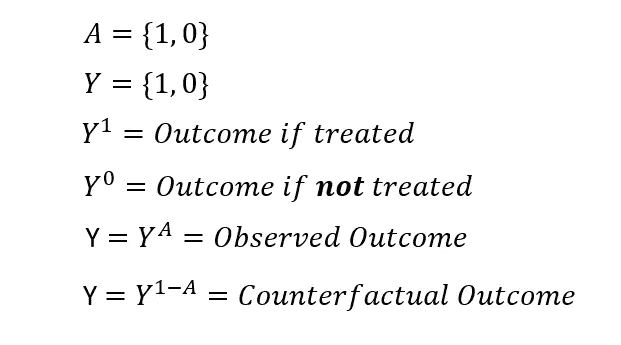
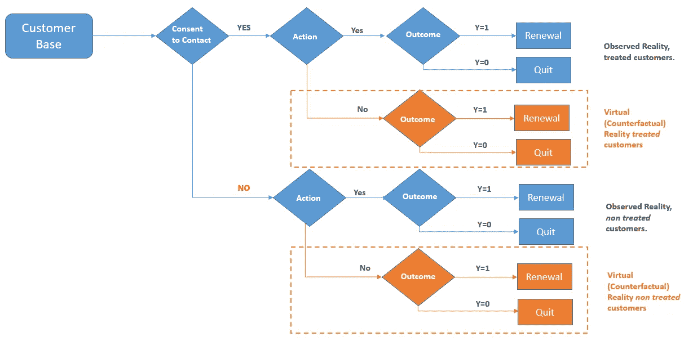
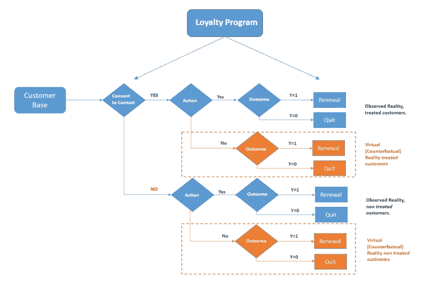
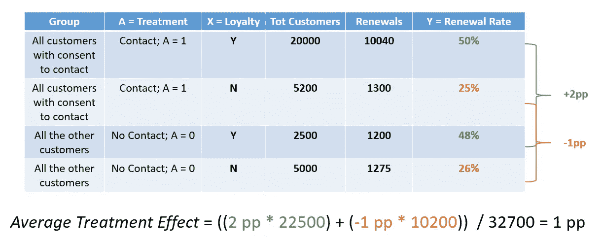

# 对商业环境中因果关系的温和介绍

> 原文：<https://towardsdatascience.com/a-gentle-intro-to-causality-in-a-business-setting-4285aee4b83>

## 理解相关性不会帮助你在商业环境中进行决策和计划评估。你需要的是对因果关系的深刻理解。

埃文·丹尼斯在 [Unsplash](https://unsplash.com?utm_source=medium&utm_medium=referral) 上的照片

无论你是处理决策科学、市场营销、客户科学或有效 A/B 测试的数据科学家，因果推理都是你职业生涯中应该掌握的顶级技能。理清因果关系在商业中通常被忽视，并且很少被理解。许多关键决策都是基于医学证据做出的，许多错误的结论都是由**虚假相关性**得出的。这可以是无缘无故地向客户发送垃圾邮件，也可以是由于不正确的计划而造成的灾难性的金钱浪费。

事实是，在处理人类行为或社会经济系统——根据定义是混乱和多元的系统——时，掌握因果关系是非常困难的。然而，能够以一种因果的方式框定问题，极大地有助于让混乱变得有序。

## 让我们从一个用例开始

一个非常常见的用例将有助于将事情弄清楚:

你的媒体公司有一个基于订阅的收入流。你提供每月和每年的计划，通常的东西。问题是，在过去的几个月里，您的续订量大幅下降。每个人对此都很狂热，所以你的营销经理急于为你的客户提供 20%的折扣，以便更新给整个客户群，*而没有选择对照组*(所以没有随机对照试验)。

活动结束后，你看着一个随机的顾客，猜猜看，他们在接受折扣后又续约了。但问题来了，你怎么知道他们更新了**作为你活动的效果**？*如果您随机选择的客户不考虑折扣而续订了他们的订阅，会怎么样？你当然可以去问，但这通常是不可能的。同样不可能的是**确定你的单个随机客户的** **反事实现实**，也就是观察**如果你没有给他们折扣**他们的计划会发生什么。*

> 你面对的是**因果推断**的根本问题，那就是你每次只能观察到每个人的一个结果。

每当我们进行没有决定性结果的干预时，我们都会面临这个问题。干预是我们可以操纵的东西，试图得到一个不同的因果结果。例如，决定提供折扣是一种干预，因为我们也可以做出相反的决定。另一方面，性别或种族可能是因果关系，但并不构成干预，因为我们无法改变某人的性别。

在下图中，我们用图形表示了这种情况。在蓝色轮廓中我们可以观察到。您向我们所有的客户提供了折扣，因此您可以观察到两种可能的结果:Y=1 或 Y=0。橙色区域是反事实世界，如果你不提供折扣会发生什么。这是一个虚拟的世界，你无法直接观察，但你可以根据它进行推断。

图 1 —观察与虚拟现实。作者创造的形象

在这一点上，我们可以添加一点符号，这将有助于进一步深入:

图 2 —基本符号。作者创造的形象

从现在开始我们称之为处理的动作可以取两个可能的值，结果也是如此。我们在治疗后观察结果，反事实是我们没有治疗时观察到的结果。因此，我们只有在下列情况下才有因果关系:

图 3——一种治疗是偶然的，只有当你服用后得到的结果不同于不服用时的结果。作者创造的形象

很明显，如果你的随机顾客在观察世界和虚拟世界都更新了他们的会员资格，折扣不一定是导致更新的原因(效果)。

## 估计因果效应

估计因果关系是审查**不可观察的平行现实**的工作。或者至少对那里发生的事情做一个有根据的估计。它可以被框定为寻找两个期望值之间的差:

图 4 —平均因果效应。作者创造的形象

这是我们所有客户在现实世界中的平均结果与虚拟世界中的平均结果之间的差异，在虚拟世界中，没有人因为续订而获得折扣。只有通过估算 Y⁰，你才有机会正确衡量这场运动的影响。

## 因果关系 vs 制约，永无止境的困惑…

在这一点上，你可能会开始想为什么我们对所有这些因果哲学的东西太多了。经过一番挖掘，你发现并不是所有的客户都有折扣，只有那些明确同意*联系*的客户才有折扣。毕竟，你可能有一个控制小组来衡量活动的效果，这让你的财务经理非常高兴。

图 5 —参加活动的客户与未参加活动的客户**的续订率**。作者创造的形象

结果如图 5 所示。非常令人鼓舞的是，这一运动获得了成功，两组之间相差 13 个百分点。然而，你的财务经理仍然觉得有些可疑。事实上，我们需要估计一个群体在一个平行的维度上，如果与现实中发生的情况有所不同，会做些什么，我们并不试图比较接受治疗的顾客亚群体与未接受治疗的顾客亚群体。用数学符号表示:

图 6——因果效应不同于两个亚群结果的观察差异。作者创造的形象

平均治疗效果不同于接受治疗的亚群与未接受治疗的亚群之间的结果差异。

本质上，如图 7 所示。我们感兴趣的是推断在虚拟现实中会发生什么。我们需要估计:

*   如果没有联系到已联系的客户，他们的可能结果是什么。这是我们上面定义的被治疗的 (ATT)的**平均治疗效果。**
*   未联系的客户**的可能结果是**联系了他们。

图 7——有两个小组，治疗组和对照组，现在我们有两个虚拟现实要考虑。作者创造的形象

总的来说，比较这两个亚群是正确的。如果我们从初始人群中创建一个随机对照试验，并在两组之间进行完全随机的分割，那就好了。但在这种情况下，谁得到治疗(行动)取决于提供同意接触。但是谁同意为商业活动进行联系呢？大概是不在乎隐私的人？或者打算更多地参与你的产品或网站的人？

**打破不可忽视的假设**

进一步分析后，你会发现加入**忠诚度计划**的人更有可能同意联系并参与更新活动。但你猜怎么着，这些人也更有可能自发更新，不管你的活动。

图 8——一个混淆者溜了进来，忠诚计划的订阅可能会导致大多数续订，而不是活动。作者创造的形象

同意联系会让您的客户加入活动，这反过来会**影响**续订概率。忠诚计划订阅会影响同意和续订。在这一点上，我们不能忽视每个客户是如何在活动中结束的，因此我们不能假设治疗分配在某种程度上独立于潜在的结果。

因此，忠诚度计划是一个**混杂因素**，这是一个变量，使你无法弄清楚观察到的结果是由于你的营销能力还是忠诚度计划的一些后门效应。为了消除混淆，您需要通过对该变量进行分层来控制混杂因素。

让我们通过为忠诚度计划订阅添加变量 X 来扩展活动结果。当我们将协变量添加到组中时，情况开始改变。

图 9-地层中的制动处理和控制组，改变了初始图像。这场运动远不如最初预期的成功。作者创造的形象

我们可以通过比较不同阶层的目标和对照组来估计运动的因果效应。对于那些加入忠诚度计划的人来说，该活动只是稍微有效，对于其他人来说，该活动没有影响或稍微有害。在这一点上，我们可以通过对每一层观察到的效果进行加权平均来测量该活动的**平均治疗效果**，如图 9 所示

识别和控制正确的混杂因素是向反事实的虚拟现实迈进了一步。在这个例子中，你不知道如果没有这个活动，你的活动的客户会有什么样的行为，但是你可以通过观察没有参加这个活动的客户**和他们**的相似情况，做出一个有根据的猜测。在这种情况下，忠诚度计划的用户没有同意联系(即使在现实中，你可能想分层，为更多的可能混淆)。

结果是，你的活动没有最初预期的成功，甚至可能在赠品折扣上产生比收益更多的成本。最好不要告诉你的财务经理。

## 参考资料:

1.  我从杰森·罗伊:[https://www.coursera.org/learn/crash-course-in-causality](https://www.coursera.org/learn/crash-course-in-causality)的《因果关系的精彩课程》中学到了大部分观点和符号
2.  另一个基本的参考点是**Judea Pearl 和 Dana MacKenzie 的《为什么:因果的新科学》**，企鹅出版社，2019 年。