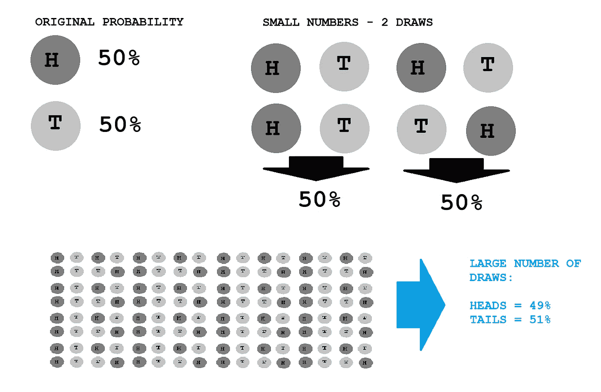
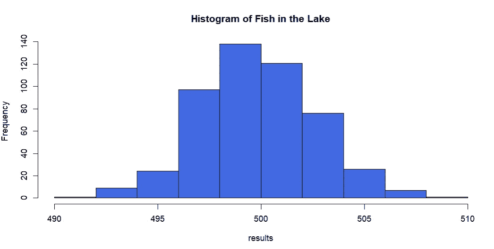
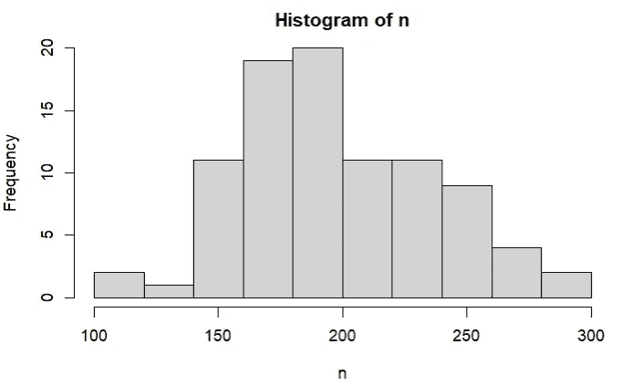
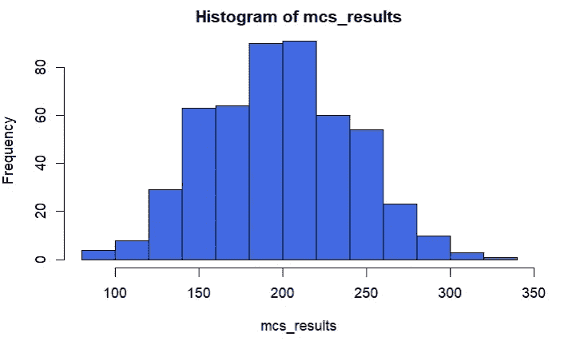
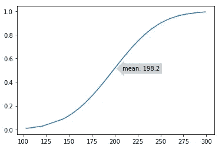
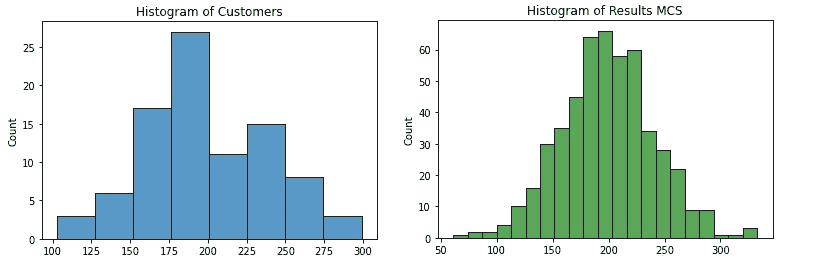

# 蒙特卡洛模拟的简明介绍

> 原文：<https://towardsdatascience.com/a-gentle-introduction-to-the-monte-carlo-simulation-a3e5518a4aa7>

## 了解如何使用 R 和 Python 创建这个著名的模拟


安德鲁·西曼在 [Unsplash](https://unsplash.com/s/photos/repeat?utm_source=unsplash&utm_medium=referral&utm_content=creditCopyText) 上拍摄的照片

## 什么是蒙特卡洛模拟？

蒙特卡罗模拟(*以下简称 MCS*)——也称为多概率模拟——是一种估计不确定事件结果概率的方法。

在数学家 Stanislaw Ulam 在建造原子弹的项目中考虑了这一方法之后，这一方法变得很有名。除了使 MCS 出名的令人讨厌的目的之外，仅仅通过一遍又一遍地模拟问题来获得一些问题的近似结果实际上是非常有用的。随着计算机处理速度的提高，MCS 成为您工具箱中的另一个好资源。

> 蒙特卡罗模拟可以理解为将同一个实验重复 n 次的过程，使用随机生成的遵循我们数据相同分布的数字来模拟问题的一个变量。

## 蒙特卡罗模拟和 LLN

支持 MCS 的一个概念是大数定律。这条著名的定律表明，当我们增加一个给定实验的重复次数时，结果的平均值会越来越接近那些事件发生的概率的真实值。



增加重复次数，你更接近真实概率。图片由作者提供。

我们都知道，掷硬币时，正面或反面各有 50%的机会。但是如果你连续两次抛硬币，你可以得到正面(H-H)，反面(T-T)或 H-T 或 T-H。嗯，一半的机会是你只会得到正面(100% | 0%)或反面(0% | 100%)，这与真实概率相差甚远。现在，如果你把同一个硬币抛几百次，你就知道了。你肯定会看到 50/50 分布的一些东西。

这就是为什么 MCS 多次运行相同的实验。

## 鱼类问题

想象一个湖。我们想知道里面有多少鱼。一个经典的 MCS 问题解决了这个问题，它说我们最初可以钓 100 条鱼并给它们做标记。现在我们知道有 100 种鱼被标记，但我们不知道它在总数中所占的比例。

因此，我们重复这个过程，再钓 100 条鱼几次，检查有标记和没有标记的鱼的百分比。如果我们知道被标记的鱼的大概百分比，我们需要做的就是计算总数(例如，MCS 给我们 20%被标记的鱼，这意味着在那个湖中被标记的鱼的数量(100)代表总数的 20%)。因此，总数将是 500。)

让我们看看代码。

```
# Creating the Lake with 100 marked fish and 400 not marked
fishes <- data.frame(num = seq(1:500),
                     marked = rep(c(1,1,0,0,0,0,0,0,0,0), times=50)
                     )# Confirming 100 marked fishes
marked_fish_total <- sum(fishes[fishes$marked==1,2])
print( paste("Marked Fish in the lake:", marked_fish_total) )### Monte Carlo Simulation ###*monte_carlo <- function (reps, dataset){
  "Run the same experiment for n reps and return the average proportion
  * reps: [int] How many repetitions of the same experiment
  * dataset: [data.frame] it is the dataframe with the fish data
  "

# Creating a vector to collect the marked fishes proportion
marked_prop <- c()**#Let's simulate a fishing of 100 fishes, repeated 1,000 times
  for (experiment in seq(1,reps)) {

    # Shuffle the dataset
    shuffled <- sample(nrow(dataset))
    dataset <- dataset[shuffled, ]

    # Create a random index before catching the fish
    index <- sample(1:500, size=100)
    fishing <- dataset[index,]
    # Calculate the proportion
    p <- mean(fishing$marked)

    # Store result in the vector
    marked_prop <- c(marked_prop, p)

  } # close for Loop**# Calculate and return the mean proportion after n repetitions
  return (mean(marked_prop))**} #close the function* # Running the Monte Carlo Simulation
marked_fish_proportion <- monte_carlo(1000, fishes)"If we know the percentage of marked fish and we know that the total 
of marked fish in that lake is 100, then we can calculate the 100%
using this formula:
Marked Fish Total / Marked Fish Proportion "# Total Fish in the lake
marked_fish_total / marked_fish_proportion
```

将上面的整个代码运行 500 次后，下面是结果的直方图。



看到我们能够在大多数情况下击中 500 条鱼的正确结果，或者非常接近它。图片由作者提供。

嗯，这是维基百科中 MCS 定义的[葡萄牙语版本中共享的一个示例问题，但我可能会说这更像是一个自助问题，而不是蒙特卡洛问题，尽管它不是。](https://pt.wikipedia.org/wiki/M%C3%A9todo_de_Monte_Carlo)

## MCS 和自举有什么不同？

这两种技术密切相关，因为它们都是基于大数定律和中心极限定理，通过重复来得到估计的数字。

然而，它们之间的最大区别是，Bootstrap 技术将对您已经拥有的数据进行采样，并从中获得估计的统计数据，就像一个奇特的平均计算一样。

现在，MCS 技术将使用与您的真实数据相同的分布创建新的随机数，因此它模拟了一个新的数据集，并帮助您回答这个*如果*问题:“如果新数据在相同的条件下不断出现，我试图预测的统计数据/数字会发生什么情况？”

## 使用 R 理解 MCS 逻辑

要应用蒙特卡罗方法，记住以下主要步骤很重要:

*1。定义您的输入。你试图预测/估计什么，你的解释变量是什么。*

现在，我们受雇于一家餐馆，该餐馆想知道一个月内来就餐的平均顾客人数。业主给我们 90 天的出勤率:平均每晚 193 人。250 或更多的人发生了几次。在最平静的夜晚，他们看到大约 150 人来吃饭。

```
# Creating a Normal Distribution
n <- rnorm(90, mean=200, sd=40)
n <- as.integer(n)[day1] 171 163 170 153 247 251 213 163 233 277 197 175 165 200 155 238 260 183 253 199 299 236 207 147 219 238 234
256 177 160 143 188 241 230 234 143 152 201 241 180 153 144 163 196 103 177 209 254 240 203 191 105 178 219
263 241 183 176 161 167 291 179 273 186 239 192 199 192 121 270 182 196 162 187 177 168 201 143 185 228 217
149 238 177 201 220 182 190 193 186 [day90]
```



每晚平均顾客人数。图片由作者提供。

*2。定义解释变量的分布(如正态分布、连续均匀分布、指数分布)。*

在这种情况下，我创建了一个正态分布，但我们也可以将平均数视为正态分布，因为它依赖于中心极限定理，样本的平均值将收敛到一条近似正态的曲线。

*3。我们的下一步是为我们的模拟创建一个分布。因此，我们必须计算累积分布函数，或 CDF，它将告诉我们一个数在给定区间内的概率是多少。*

为了使上面的陈述更清楚，让我们画出 CDF。

```
# Plot the CDF
plot( x= n, 
      xlab= 'Customers',
      y= pnorm(n, mean=193, sd=40),
      ylab= 'Probability',
      col='red', 
      main='CDF for Customers')
```


累积分布函数。图片由作者提供。

请注意，对于 X 中的每个客户数量，都有一个与 y 相关联的概率。因此，如果您想知道有 50%可能性发生的客户数量，您将看到平均值 193。

*4。有了这个分布，现在你可以生成 0 到 1 之间的 N 个随机数。这些数字将代表您可以与步骤 3 中的分布相关联的百分比，从而生成一个模拟的餐厅出席人数。*

```
# Simulated attendance
mcs_customers <- function(simulations){
  "This function takes an integer number and generates that amount of repetitions of the simulation"

  # Create a list to store the results
  mcs_results <- c()

  # Loop
  for (n in 1:simulations){
    # Generate a random number
    r <- runif(1)
    # Use our CDF to capture the simulated quantity of customers
    simulated <- qnorm(r, mean=customer_avg, sd= customer_std)
    # Take the lowest integer rounded
    simulated <- floor(simulated)

    #Store result
    mcs_results <- c(mcs_results, simulated)

  } #end loop

  # Plot histogram
  hist(mcs_results, col='royalblue')

  # Return vector
  return(mcs_results)

}# end function
```

并且应用上面的函数，就是这个结果。

```
mcs <- mcs_customers(500)
```



每晚模拟的平均客户数量。图片由作者提供。

比较两个结果，看看它们有多相似。我们真的可以说，在保持其他变量不变的情况下，每晚的平均顾客数量将在 200 人左右浮动。有了这个数字，你就可以计划人员配备、桌子数量、估计收入和进行其他战略分析。


对比:真实分布|每晚客户的模拟分布。图片由作者提供。

## 在 Python 中应用 MC 仿真

同样的练习可以用 Python 来完成。我个人认为，R 更适合创建快速 MCS，因为它已经内置了所需的统计工具——比如那些用于计算随机数、CDF 和分布的逆值的工具。

在 Python 中，`scipy`是和`numpy`一起做这些事情的最好的库。

```
#Imports
import matplotlib.pyplot as plt
import seaborn as sns
import numpy as np
import scipy.stats as scs# 90 Days of Clients
customers = [171, 163, 170, 153, 247, 251, 213, 163, 233, 277, 197, 175, 165, 200, 155, 238, 260, 183, 253, 199, 299, 236, 207, 147 ,219, 238, 234, 256, 177, 160, 143, 188, 241, 230, 234, 143, 152,201, 241, 180, 153, 144, 163, 196, 103, 177, 209, 254, 240, 203, 191, 105, 178, 219,263, 241, 183, 176, 161, 167, 291, 179, 273, 186, 239, 192, 199 ,192, 121, 270, 182, 196, 162,187, 177,168, 201, 143, 185, 228, 217, 149, 238, 177, 201, 220, 182, 190, 193, 186]# Histogram of customers
sns.histplot(customers)
plt.title('Histogram of Customers');# Calculating Mean and Std of customers
cust_avg = np.mean(customers)
cust_std = np.std(customers)# Calculating CDF from the distribution
cdf = scs.norm.cdf(customers, loc=cust_avg, scale=cust_std)#Plot CDF
sns.lineplot(x=customers, y=cdf)
plt.annotate(f'mean: {round(cust_avg,1)}', xy=(cust_avg+10, 0.5),
             bbox=dict(boxstyle="larrow, pad=0.4", fc="lightgray", ec="r", lw=0));
```



客户的累积分布频率(CDF):这是模拟的来源。作者图片

```
# Function to perform simulations
def mcs(simulations):
 * "Provide integer with number of simulations and the function returns an array and histogram with the results"*
  # List to store results
  results = []
  # Loop
  for n in range(simulations):
    # Generate random number as a probability
    r = np.random.uniform()
    # Calculate the number
    sim_cust = scs.norm.ppf(r, loc=cust_avg, scale=cust_std)
    # Math floor of the number
    sim_cust = int(sim_cust)#Store result
    results.append(sim_cust)# Plot Histogram
  sns.histplot(results)
  plt.title('Histogram of Results MCS')#Return array
  return results# Apply mcs function
r = mcs(500)
```



原始数字与模拟数字。图片由作者提供。

我们可以看到，这些数字与实际情况非常接近。就像硬币的例子一样，我们模拟得越多，它就越接近真实的概率。

考虑到第 1 天是星期一，我们来看看按工作日划分的模拟客户。


按工作日模拟平均值。图片由作者提供。

看起来我们在周二和周末需要更多的人员(《Fri 太阳报》)。


按工作日模拟。图片由作者提供。

这是非常强大的。

## 在你走之前

在你走之前，我想把逻辑打印出来，这样你可以练习并发展它来解决更复杂的问题。

我一直在研究蒙特卡洛模拟，我知道还可以做得更多。

1.  确定你的问题。知道自己要模拟什么。
2.  找出原始数据的分布(正态分布，均匀分布)。
3.  计算累积分布频率(CDF)
4.  生成一个介于 0 和 1 之间的随机数作为你的随机概率。
5.  使用您的 CDF，该数字将被转换为模拟数字。
6.  根据需要重复多次，计算出您想要的结果。

如果你喜欢这个内容，你可以使用[这个推荐代码](https://gustavorsantos.medium.com/membership)订阅 Medium。

你也可以关注我的博客了解更多内容。

[](https://gustavorsantos.medium.com/) [## 古斯塔沃·桑托斯-中等

### 阅读古斯塔夫·桑托斯在媒介上的作品。数据科学家。我从数据中提取见解，以帮助个人和公司…

gustavorsantos.medium.com](https://gustavorsantos.medium.com/) 

## 参考

[](https://en.wikipedia.org/wiki/Law_of_large_numbers) [## 大数定律-维基百科

### 在概率论中，大数定律(LLN)是一个描述执行相同操作的结果的定理

en.wikipedia.org](https://en.wikipedia.org/wiki/Law_of_large_numbers) 

蒙特卡洛模拟的定义:[https://tinyurl.com/3nkxpe4p](https://tinyurl.com/3nkxpe4p)

[](https://en.wikipedia.org/wiki/Monte_Carlo_method) [## 蒙特卡罗方法-维基百科

### 蒙特卡罗方法，或蒙特卡罗实验，是一大类计算算法，依赖于重复的…

en.wikipedia.org](https://en.wikipedia.org/wiki/Monte_Carlo_method) [](https://www.ibm.com/cloud/learn/monte-carlo-simulation) [## 蒙特卡洛模拟是什么？

### 了解一切你需要知道的蒙特卡罗模拟，一种计算算法，使用重复…

www.ibm.com](https://www.ibm.com/cloud/learn/monte-carlo-simulation)  [## 使用 Engage 或 Workspace 创建蒙特卡洛模拟的 4 个简单步骤

### 蒙特卡洛模拟自 20 世纪 40 年代首次应用以来已经走过了漫长的道路，当时科学家们正在研究…

blog.minitab.com](https://blog.minitab.com/en/the-4-simple-steps-for-creating-a-monte-carlo-simulation-with-engage-or-workspace)