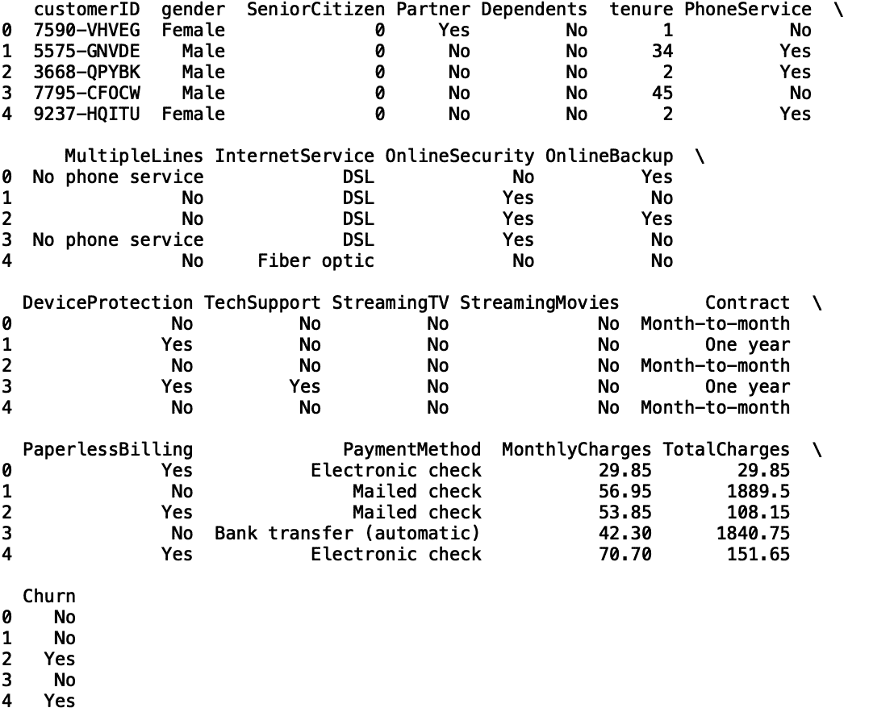
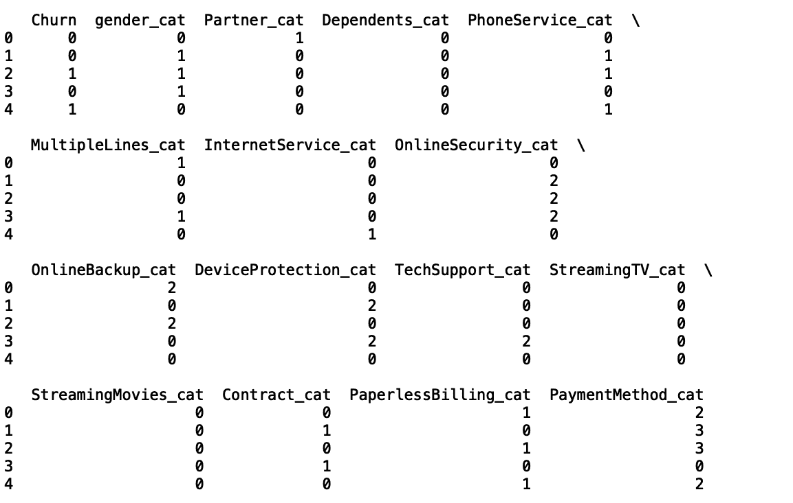
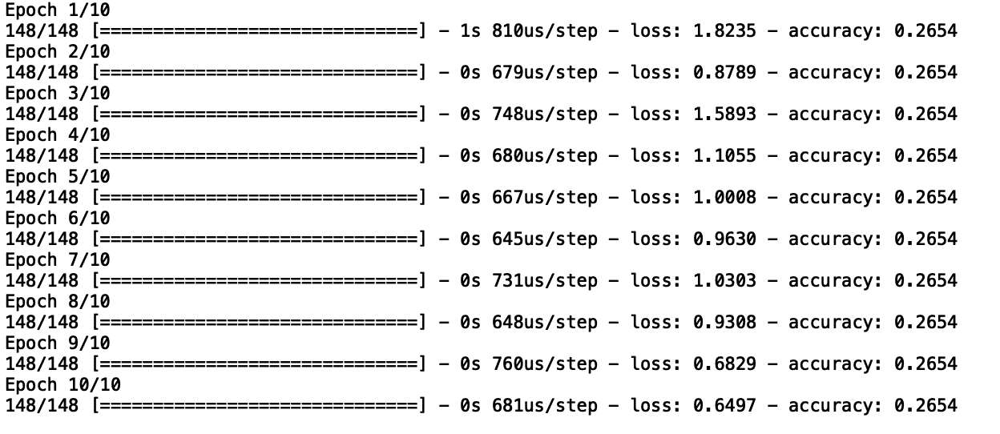
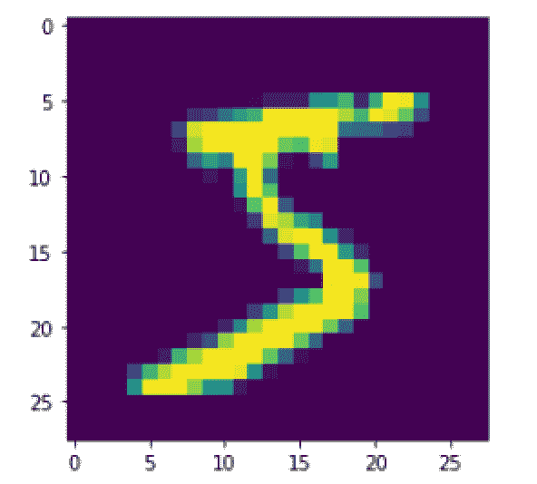
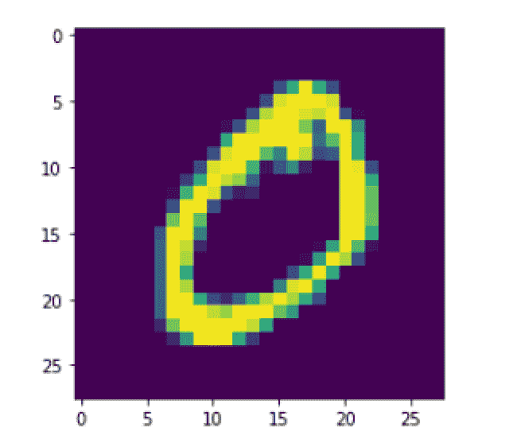
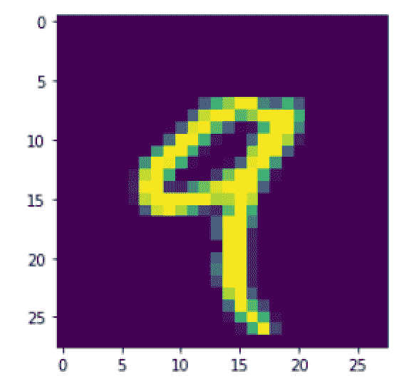

# Python 中深度学习分类的损失函数指南

> 原文：<https://towardsdatascience.com/a-guide-to-loss-functions-for-deep-learning-classification-in-python-e22b37e3d6f6>

# Python 中深度学习分类的损失函数指南

## 多类多标签分类的损失函数


图片由[马库斯·斯皮斯克](https://www.pexels.com/@markusspiske)在[像素](https://www.pexels.com/photo/one-black-chess-piece-separated-from-red-pawn-chess-pieces-1679618/)上拍摄

深度学习模型是人脑中神经元网络的数学表示。这些模型在医疗保健、机器人、流媒体服务等领域有着广泛的应用。例如，深度学习可以解决医疗保健中的问题，如预测患者再次入院。此外，特斯拉的自动驾驶汽车采用深度学习模型进行图像识别。最后，像网飞这样的流媒体服务使用这些模型来分析用户数据，向观众推荐新的相关内容。在所有这些情况下，深度学习模型都属于机器学习模型的一个类别，称为分类。

机器学习分类是根据数据组的特征将离散标签分配给该组的过程。对于流媒体服务平台，这可能意味着将观众分为“喜欢喜剧系列”或“喜欢浪漫电影”等类别。这个过程的一个重要部分是最大限度地减少项目被错误分类和放入错误组的次数。在网飞的例子中，这样的错误分类会使系统错误地向喜剧电影爱好者建议恐怖内容。因此，为了让机器学习模型在最小化错误分类方面做得很好，数据科学家需要为他们试图解决的问题选择正确的损失函数。

“损失函数”是一个奇特的数学术语，用来衡量一个模型做出错误预测的频率。在分类的背景下，他们测量模型错误分类不同组成员的频率。深度学习分类模型最流行的损失函数是二元交叉熵和稀疏分类交叉熵。

二元交叉熵对于二元和多标记分类问题是有用的。例如，预测运动物体是人还是车是一个二元分类问题，因为有两种可能的结果。添加选择并预测对象是人、汽车还是建筑物是一个多标签分类问题。

稀疏分类交叉熵对于多类分类问题是有用的。这通常被框定为一对其余的问题，其中为每个类训练二进制分类器。例如，该模型应该能够预测图像中汽车的存在，以及预测人、建筑物和公园的图像是否不是汽车。还构建了附加的二元分类器来检测人、建筑物和公园。对于第一个分类器，这里的预测标签对应于“汽车”和“非汽车”对于第二分类器，标签是“人”和“不是人”等等。这可用于预测不同的标签(人、汽车、建筑物、公园)，在这些标签中，我们使用模型预测的概率最高。如果我们只对区分一个类和所有其他类感兴趣，而不在乎区分其他类，也可以使用它。后者是我们将如何应用这种类型的模型。

这不同于多标记分类，多标记分类可以预测图像是否是汽车，然后进一步区分不是汽车的图像。鉴于选择正确的损失函数取决于手头的问题，对这些函数有一个基本的了解并知道何时使用它们对于任何数据科学家来说都是至关重要的。

Python 中的 Keras 库是一个易于使用的 API，用于构建可扩展的深度学习模型。在模型中定义损失函数很简单，因为它涉及在一个模型函数调用中定义单个参数值。

在这里，我们将看看如何应用不同的损失函数的二进制和多类分类问题。

对于我们的二元分类模型，我们将预测客户流失，这种情况发生在客户取消订阅或不再购买某家公司的产品时。我们将使用虚构的[电信客户流失数据集](https://www.kaggle.com/blastchar/telco-customer-churn)。该数据集受知识共享许可协议约束，可用于数据共享。

对于我们的多类分类问题，我们将建立一个预测手写数字的模型。我们将使用公开可用的 [MNIST 数据集](https://keras.io/examples/vision/mnist_convnet/)，它在 [Keras](https://keras.io/) 库中可用，用于我们的多类预测模型。

**读入电信客户流失数据**

首先，让我们导入 Pandas 库，我们将使用它来读取我们的数据。让我们使用 Pandas head()显示前五行数据:

```
import pandas as pddf = pd.read_csv('telco_churn.csv')print(df.head())
```



作者图片

我们将建立一个深度学习模型，预测客户是否会流失。为此，我们需要将 churn 列的值转换成机器可读的标签。无论流失列中的值是“否”，我们都将分配一个整数标签“0”，流失值“是”将有一个整数标签“1”

让我们导入 numpy 包并使用 where()方法来标记我们的数据:

```
import numpy as npdf['Churn'] = np.where(df['Churn'] == 'Yes', 1, 0)
```

在我们的深度学习模型中，我们希望同时使用分类和数字特征。与标签类似，我们需要将分类值转换成机器可读的数字，以便用来训练我们的模型。让我们定义一个执行此任务的简单函数:

```
def convert_categories(cat_list): for col in cat_list: df[col] = df[col].astype('category')
        df[f'{col}_cat'] = df[f'{col}'].cat.codes
```

接下来，我们将指定分类列的列表，使用该列表调用函数，并显示数据框:

```
category_list = ['gender', 'Partner', 'Dependents', 'PhoneService', 'MultipleLines', 'InternetService',
                  'OnlineSecurity', 'OnlineBackup', 'DeviceProtection', 'TechSupport', 'StreamingTV',
                  'StreamingMovies', 'Contract', 'PaperlessBilling', 'PaymentMethod']convert_categories(category_list)print(df.head())
```



作者图片

我们可以看到，我们的数据框现在包含每个分类列的分类代码。

我们需要做的下一件事是强制 TotalCharges 列成为一个 float，因为在这个列中有一些非数字的，也就是坏的值。非数字值被转换为“非数字”值(NaN ),我们将 NaN 值替换为 0:

```
df['TotalCharges'] = pd.to_numeric(df['TotalCharges'], errors='coerce')
df['TotalCharges'].fillna(0, inplace=True)
```

接下来，让我们定义我们的输入和输出:

```
cols = ['gender_cat', 'Partner_cat', 'Dependents_cat', 'PhoneService_cat', 'MultipleLines_cat', 'InternetService_cat',
                  'OnlineSecurity_cat', 'OnlineBackup_cat', 'DeviceProtection_cat', 'TechSupport_cat', 'StreamingTV_cat',
                  'StreamingMovies_cat', 'Contract_cat', 'PaperlessBilling_cat', 'PaymentMethod_cat','MonthlyCharges',
                  'TotalCharges', 'SeniorCitizen']X = df[cols]y= df['Churn']
```

接下来，让我们为 Scikit-learn 中的模型选择模块导入训练/测试分割方法。让我们也为训练和测试拆分我们的数据

```
from sklearn.model_selection import train_test_splitX_train, X_test_hold_out, y_train, y_test_hold_out = train_test_split(X, y, test_size=0.33)
```

**用于分类的深度神经网络损失函数**

*二元交叉熵*

为了开始构建网络分类模型，我们将从 Keras 的图层模块中导入密集图层类开始:

```
from tensorflow.keras.layers import Dense
```

让我们也从度量模块中导入顺序类和准确性方法:

```
from tensorflow.keras.models import Sequentialfrom sklearn.metrics import accuracy_score
```

现在，让我们建立一个具有三个隐藏层和 32 个神经元的神经网络。我们还将使用 20 个历元，这对应于通过训练数据的次数:

我们将首先定义一个名为 model_bce 的变量，它是 sequential 类的一个实例:

```
model_bce = Sequential()
```

接下来，我们将在顺序类实例上使用 add()方法来添加密集层。这将是我们的神经网络的输入层，其中我们指定输入的数量，我们如何初始化权重，以及激活函数:

```
model_bce.add(Dense(len(cols),input_shape=(len(cols),), kernel_initializer='normal', activation='relu'))
```

接下来，我们将使用 add 方法添加三个隐藏层。这些层将具有 32 个神经元，并且还使用 ReLu 激活功能:

```
model_bce.add(Dense(32, activation='relu'))
model_bce.add(Dense(32, activation='relu'))
model_bce.add(Dense(32, activation='relu'))
```

然后我们需要添加输出层，它将有一个神经元和一个 softmax 激活函数。这将允许我们的模型输出类别概率，以预测客户是否会流失:

```
model_bce.add(Dense(1, activation='softmax'))
```

最后，我们将在我们的模型实例上使用 compile 方法来指定我们将使用的损失函数。首先，我们将指定二元交叉熵损失函数，它最适合我们在这里工作的机器学习问题的类型。

我们在编译层使用 loss 参数指定二进制交叉熵损失函数。我们简单地将“loss”参数设置为字符串“binary_crossentropy”:

```
model_bce.compile(optimizer = 'adam',loss='binary_crossentropy', metrics =['accuracy'])
```

最后，我们可以使我们的模型适合训练数据:

```
model_bce.fit(X_train, y_train,epochs =20)
```



作者图片

我们看到，对于 10 个时期中的每一个，我们都有一个损失函数值。我们看到，随着每个时期，我们的损失减少，这意味着我们的模型在训练过程中得到改善。

二元交叉熵对二元分类问题最有用。在我们的客户流失示例中，我们预测了两种结果之一:要么客户会流失，要么不会。但是，如果您正在处理有两个以上预测结果的分类问题，稀疏分类交叉熵是更合适的损失函数。

*稀疏* *分类交叉熵*

为了将分类交叉熵损失函数应用于合适的用例，我们需要使用包含两个以上标签的数据集。这里，我们将使用 MNIST 数据集，它包含 0 到 9 之间的手写数字的图像。让我们从导入数据开始:

```
from tensorflow.keras.datasets import mnist
```

接下来，让我们存储输入和输出:

```
(X_train_mnist, y_train_mnist), (X_test_mnist, y_test_mnist) = mnist.load_data()
```

我们可以使用 matplotlib 轻松地将数据中的一些数字可视化:

此图像包含五个:

```
plt.imshow(X_train_mnist[0])plt.show()
```



作者图片

此图像包含一个零:

```
plt.imshow(X_train_mnist[1])plt.show()
```



作者图片

此图像包含一个九:

```
plt.imshow(X_train_mnist[4])plt.show()
```



作者图片

让我们重新格式化数据，以便我们可以使用它来训练我们的模型:

```
X_train_mnist = X_train_mnist.reshape((X_train_mnist.shape[0], 28, 28, 1))X_test_mnist = X_test_mnist.reshape((X_test_mnist.shape[0], 28, 28, 1))
```

接下来，我们需要从我们的类中生成二进制标签。让我们建立一个模型来预测一个图像是否包含数字 9。我们将为数字为 9 的图像分配一个标签“1”。任何其他不是 9 的数字都将被标记为“0”这种类型的问题不同于多标签分类，在多标签分类中，我们将有 9 个标签对应于 9 个数字中的每一个。

让我们生成二进制标签:

```
y_train_mnist = np.where(y_train_mnist == 9, 1, 0)y_test_mnist = np.where(y_test_mnist == 9, 1, 0)
```

接下来，我们将建立一个卷积神经网络，这是图像分类的典型架构。首先，让我们导入层:

```
from tensorflow.keras.layers import Conv2D, MaxPooling2D, Flatten
```

接下来，让我们初始化模型并添加我们的层:

```
model_cce = Sequential()
model_cce.add(Conv2D(16, (3, 3), activation='relu', kernel_initializer='normal', input_shape=(28, 28, 1)))
model_cce.add(MaxPooling2D((2, 2)))
model_cce.add(Flatten())
model_cce.add(Dense(16, activation='relu', kernel_initializer='normal'))
model_cce.add(Dense(2, activation='softmax'))
```

在我们的编译层，我们将指定稀疏分类交叉熵损失函数:

```
model_cce.compile(optimizer = 'SGD',loss='sparse_categorical_crossentropy', metrics =['accuracy'])
```

符合我们的模型:

```
model_cce.fit(X_train_mnist, y_train_mnist, epochs =5)
```


作者图片

这篇文章中的代码可以在 [GitHub](https://github.com/spierre91/builtiin/blob/main/classification_loss_functions.py) 上找到。

在我们的图像分类示例中，我们预测标签“包含 9”和“不包含 9”“不包含九”标签由九个不同的类别组成。这与流失预测模型中的反面例子形成对比，其中“不流失”标签正好对应于单个类别。在客户流失的情况下，预测结果是二元的。客户要么搅动要么不搅动，其中“不搅动”标签仅由单个类别组成。

**结论**

知道对不同类型的分类问题使用哪种损失函数是每个数据科学家的一项重要技能。理解分类类型之间的差异为神经网络模型的损失函数的选择以及机器学习问题如何构建提供了信息。数据科学团队如何构建机器学习问题，会对公司的附加值产生重大影响。考虑具有 3 类流失概率的流失示例:低、中和高。一家公司可能对开发针对每个不同群体的广告活动感兴趣，这需要多标签分类模型。

另一家公司可能只对高流失率的目标客户感兴趣，而不关心区分低流失率和中流失率。这将需要一个多类分类模型。这两种类型的分类问题以不同的方式增加价值，哪种方式最合适取决于业务用例。出于这个原因，了解这些类型的预测问题之间的差异以及哪种损失函数适合每种问题是非常重要的。

如果你有兴趣学习 python 编程的基础知识、Pandas 的数据操作以及 python 中的机器学习，请查看[*Python for Data Science and Machine Learning:Python 编程、Pandas 和 sci kit-初学者学习教程*](https://www.amazon.com/dp/B08N38XW2Q/ref=sr_1_1?dchild=1&keywords=sadrach+python&qid=1604966500&s=books&sr=1-1) *。我希望你觉得这篇文章有用/有趣。*

***本帖原载于*** [***内置博客***](https://builtin.com/data-science) ***。原片可以在这里找到***[](https://builtin.com/data-science/loss-functions-deep-learning-python)****。****