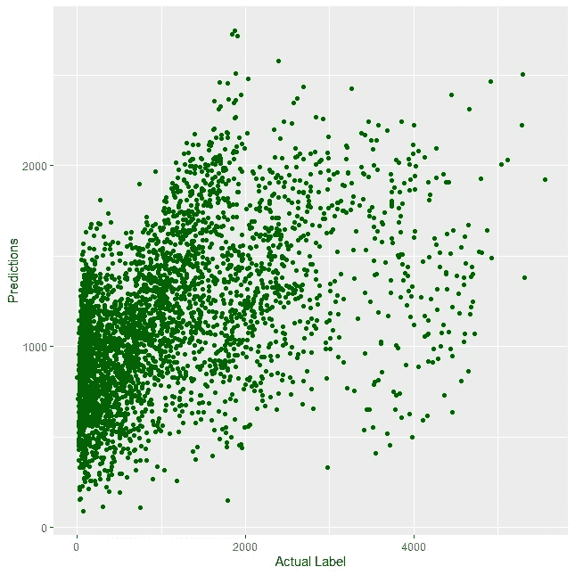
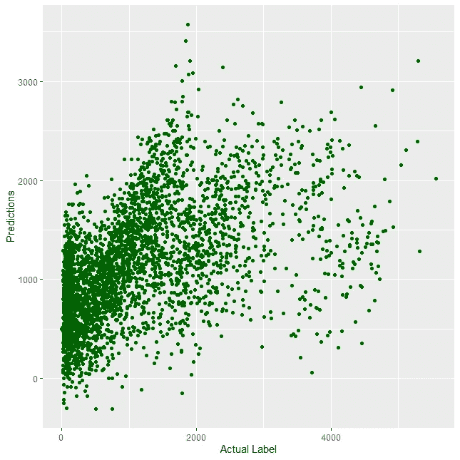
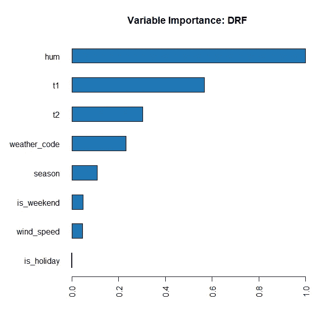
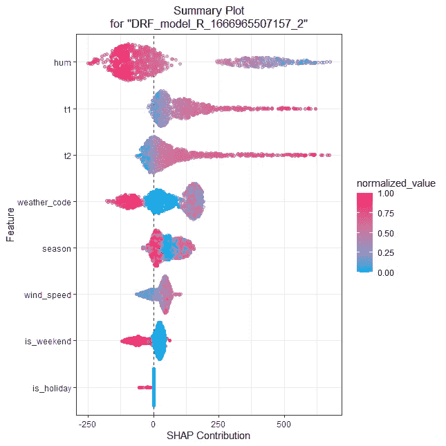

# R 中使用 h20.ai 的指南

> 原文：<https://towardsdatascience.com/a-guide-to-using-h2o-ai-in-r-99cf6265bc05>

## 学习如何使用 R 语言处理 h20 库


图片由[pawel _ czerwinsk](https://unsplash.com/@pawel_czerwinski)@ unsplash . com 提供

*【免责声明:此帖子包含一些我的 Udemy 课程的附属链接】*

R 有许多机器学习库，可以用来训练模型。从 *caret* 到独立的库，如 *randomForest* 、 *rpart* 或 *glm* ，当您想要执行一些数据科学任务时，R 提供了广泛的选项。

一个你可能从未听说过的好奇库是 *h2o* 。作为一个用于分布式和可扩展机器学习的内存平台， *h2o* 可以在您需要增强计算能力时在强大的集群上运行。关于它的另一个有趣的地方是，它不是 R 独有的库——例如，你也可以通过使用 [Python](https://docs.h2o.ai/h2o/latest-stable/h2o-py/docs/intro.html) 来使用相同的 *API* 。

此外， *h2o* 是一个非常有趣和多样化的库。它包含了如此多不同的特性(从训练模型到 automl 功能),以至于在使用它的时候很容易迷失方向，特别是由于这个包可以使用大量的方法和函数。特性的多样性是我写这篇博客的主要原因——我想帮助你浏览 h2o 界面！

在这篇博文中，我们将介绍一些 *h2o* 的例子(带代码)，即:

*   训练几个机器学习模型；
*   做一些超参数调优；
*   执行 *automl* 程序；
*   浏览一下可解释性模块；

开始吧！

# 加载数据

在这篇博文中，我们将使用[伦敦自行车共享数据集](https://www.kaggle.com/hmavrodiev/london-bike-sharing-dataset) —该数据集包含伦敦自行车共享计划的自行车需求信息。如果您想了解更多信息，请访问 [Kaggle](https://www.kaggle.com/datasets/hmavrodiev/london-bike-sharing-dataset) 链接，查看对这些列的描述以及这些数据是如何生成的。

在大多数情况下，这是一个监督学习问题，我们希望根据特定时间内关于日期和天气的几个特征来预测每小时新骑自行车的次数。

我们可以使用 R 的`read.csv`来加载数据集:

```
london_bike <- read.csv(‘./london_merged.csv’)
```

加载完数据后，让我们对数据类型做一个小小的检查。如果我们在`london_bike`上调用`str`命令，我们会看到:

```
'data.frame': 17414 obs. of  10 variables:
 $ timestamp   : chr  "2015-01-04 00:00:00" "2015-01-04 01:00:00" "2015-01-04 02:00:00" "2015-01-04 03:00:00" ...
 $ cnt         : int  182 138 134 72 47 46 51 75 131 301 ...
 $ t1          : num  3 3 2.5 2 2 2 1 1 1.5 2 ...
 $ t2          : num  2 2.5 2.5 2 0 2 -1 -1 -1 -0.5 ...
 $ hum         : num  93 93 96.5 100 93 93 100 100 96.5 100 ...
 $ wind_speed  : num  6 5 0 0 6.5 4 7 7 8 9 ...
 $ weather_code: num  3 1 1 1 1 1 4 4 4 3 ...
 $ is_holiday  : num  0 0 0 0 0 0 0 0 0 0 ...
 $ is_weekend  : num  1 1 1 1 1 1 1 1 1 1 ...
 $ season      : num  3 3 3 3 3 3 3 3 3 3 ...
```

我们的数据帧只包含数字列(除了我们不会使用的时间戳)，因为我们希望算法将`weather_code`和`season`视为分类变量(至少在第一个实验中)，所以让我们将它们转换为因子:

```
london_bike$weather_code <- as.factor(london_bike$weather_code)
london_bike$season <- as.factor(london_bike$season)
```

将数据集加载到 R 中后，让我们通过创建一个训练和测试帧将数据一分为二。

# 列车测试分离

*h2o* 具有执行列车测试分割的便利功能。为了让`h2o`运行起来，我们需要加载并初始化我们的库:

```
library(h2o)
h2o.init()
```

当我们键入`h2o.init()`时，我们正在建立一个本地 *h2o* 集群。默认情况下， *h2o* 将旋转所有可用的 CPU，但是您可以使用`nthread`指定特定数量的 CPU 进行初始化。

这是 R 中其他机器学习库的主要区别之一——为了使用`h2o`，我们总是需要启动一个 *h2o* 集群。这样做的好处是，如果您有一个运行在服务器上的 *h2o* 实例，您可以连接到那台机器并使用那些计算资源，而不需要过多地修改代码(您只需要将您的`init`指向另一台机器)。

使用`h2o.splitFrame`，我们可以方便地创建我们数据的随机训练测试分割，但在此之前，我们需要将我们的数据帧转换成一个特殊的对象，以便 *h2o* 能够识别:

```
london_bike.h2o <- as.h2o(london_bike)
```

第一次学习: *h2o* 不能处理普通的 R 数据帧，只能处理特殊类型的对象`h2OFrame`，所以使用`as.h2o`转换数据帧的步骤是强制性的。

我们现在已经准备好使用新的`london_bike.h2o`对象进行训练测试分割:

```
london_bike_split **<-** h2o.splitFrame(data **=** london_bike.h2o, ratios **=** 0.8, seed **=** 1234)training_data <- london_bike_split[[1]]
test_data <- london_bike_split[[2]]
```

使用`h2o.splitFrame`，我们可以立即将数据集分成两个不同的`h2o`帧— `ratios`定义我们希望分配给训练数据的百分比，在上面的函数中，我们将数据集的 80%用于训练目的，剩下 20%作为维持集。

随着我们的数据在测试和训练之间以 *h2o* 格式分割，我们已经准备好训练我们的第一个 *h2o* 模型了！

# 训练模型

由于其简单性，我们要训练的第一个模型将是线性回归。这个模型可以用`h2o.glm`函数训练，首先，我们需要定义目标和特征变量:

```
predictors <- c("t1", "t2", "hum", "wind_speed", "weather_code",      
                "is_holiday","is_weekend", "season")response <- "cnt"
```

因为列`cnt`包含每小时使用的自行车数量，所以这是我们的响应/目标列。

要训练模型，我们可以执行以下操作:

```
london_bike_model <- h2o.glm(x = predictors,
                      y = response,
                      training_frame = training_data)
```

和..就是这样！只有三个参数，我们可以训练我们的模型:

*   `x`定义我们将用作特性的列的名称。
*   `y`定义目标列
*   在`training_frame`参数中，我们传递训练数据集。

我们已经准备好模型了！让我们将我们的预测与测试集上的真实值进行比较——我们可以方便地使用`h2o.predict`函数从我们的模型中获得预测:

```
test_predict <- h2o.predict(object = london_bike_model, 
                            newdata = test_data)
```

*   `object`接收我们想要应用于数据的模型。
*   `newdata`接收我们将应用模型的数据。

然后，我们可以用测试集中的`cnt`来`cbind`我们的预测:

```
predictions_x_real <- cbind(
  as.data.frame(test_data$cnt),
  as.data.frame(test_predict)
)
```

我们可以快速地将我们的预测与目标进行比较:



线性回归模型实际值与预测值-作者图片

显然，我们的模型有点超出了我们的目标——让我们使用`alpha` 参数在`h2o.train`中应用一些正则化:

```
london_bike_model_regularized <- h2o.glm(x = predictors,
                             y = response,
                             training_frame = training_data,
                             alpha = 1)
```



正则化模型-预测与实际-作者提供的图像

在`h2o.glm`中，`alpha=1`代表套索回归。我们的模型似乎没有改善太多，我们可能需要做更多的功能工程或尝试线性回归的其他论点(尽管这不太可能使我们的模型改善太多)。

在[库的文档](https://docs.h2o.ai/h2o/latest-stable/h2o-docs/data-science/glm.html)中，你会发现这个广义线性模型函数中有大量的参数需要调整。**从第一次训练过程中得到的一个重要收获是 *h2o 的*训练实现包含许多我们可以实验和测试的可调整参数。**

当评估我们的模型时，我们只是通过绘制我们对真实目标的预测来进行视觉“测试”。当然，如果我们想做更科学的评估，我们在 *h2o* 框架中有所有著名的回归和分类指标可用！

让我们看看，下一个。

# 评估我们的模型

我们可以用 h20 做的一件很酷的事情是将测试集直接传递到我们的模型中，并使用它来提取验证指标。例如，如果我们想要从一个测试集中检索度量，我们可以直接将它插入到任何`h2o`训练模型的`validation_frame`参数中:

```
london_bike_model <- h2o.glm(x = predictors,
                             y = response,
                             training_frame = training_data,
                             validation_frame = test_data)
```

通过这个新的`validation_frame`参数将使我们能够非常快速地提取两个数据帧的指标——例如，让我们为我们的模型获得训练和测试的均方误差(这里称为`valid`):

```
h2o.rmse(london_bike_model, train=TRUE, valid=TRUE)train    valid 
936.5602 927.4826
```

假设我们的目标变量的平均值是每小时 1143 辆自行车，我们的模型表现得并不好。我们还看到，过度拟合的证据似乎很少，因为训练集和测试集似乎都很相似。

我们怎样才能改变我们想看的指标呢？我们只是调整了`h2o`功能！例如，如果我们想查看 r 平方，我们只需使用`h2o.r2`:

```
h2o.r2(london_bike_model, train=TRUE, valid=TRUE)train     valid 
0.2606183 0.2456557
```

超级简单！好处是你不必担心如何自己实现这些指标的所有细节。

在这个例子中，我正在跟踪一个回归问题，但是，当然，您也有可用的分类模型和度量。对于`h2o`中可用的所有指标，检查以下[链接](https://docs.h2o.ai/h2o/latest-stable/h2o-docs/performance-and-prediction.html#mse-mean-squared-error)。

我们的线性回归表现不佳，这有点出乎意料——我们没有执行任何功能工程，我们可能违反了太多的线性回归假设。但是，如果我们可以训练简单的线性回归，我们可能可以在`h2o`中训练其他类型的模型，对吗？没错！让我们在下一节看到这一点。

# 更多模型示例

正如你可能已经猜到的，如果我们改变与训练过程相关的`h2o`功能，我们将适合其他类型的模型。让我们通过调用`h2o.randomForest`来训练一个随机森林:

```
london_bike_rf <- h2o.randomForest(x = predictors,
                             y = response,
                             ntrees = 25,
                             max_depth = 5,
                             training_frame = training_data,
                             validation_frame = test_data)
```

我在函数调用中为我的随机森林设置了两个超参数:

*   `ntrees`设定森林中的树木数量。
*   `maxdepth`设置每棵树的最大深度。

如果需要，您可以通过调用 R 控制台上的`help(h2o.randomForest)`找到所有可调整的参数。

很酷的一点是，我们现在可以在这个新模型上使用我们所了解的模型度量，只需将我们提供的模型切换到度量函数中即可——例如，为了获得这个模型的`rmse`,我们将第一个参数切换到`london_bike_rf`:

```
h2o.rmse(london_bike_rf, train=TRUE, valid=TRUE)train    valid 
909.1772 900.5366
```

并且获得了`r2`:

```
h2o.r2(london_bike_rf, train=TRUE, valid=TRUE)
train     valid 
0.3032222 0.2888506
```

请注意，我们的代码实际上没有改变。唯一被修改的是我们输入第一个论点的模型。这使得这些度量函数高度适应新模型，只要它们在 *h2o* 框架内被训练。

如果你跟随这个[链接](https://docs.h2o.ai/h2o/latest-stable/h2o-docs/data-science.html#supervised)，你会发现你可以用库训练的其他模型。从这个列表中，让我们安装一个神经网络，使用`h2o.deeplearning`:

```
nn_model <- h2o.deeplearning(x = predictors,
                       y = response,
                       hidden = c(6,6,4,7),
                       epochs = 1000,
                       train_samples_per_iteration = -1,
                       reproducible = TRUE,
                       activation = "Rectifier",
                       seed = 23123,
                       training_frame = training_data,
                       validation_frame = test_data)
```

`hidden`是`h2o.deeplearning`函数中非常重要的一个参数。它需要一个向量来表示我们将在神经网络中使用的隐藏层和神经元的数量。在我们的例子中，我们使用的是`c(6,6,4,7)`，4 个隐藏层，每个层有 6、6、4 和 7 个节点。

我们的`h2o.r2`函数会和神经网络一样工作吗？让我们测试一下:

```
h2o.r2(nn_model, train=TRUE, valid=TRUE)
    train     valid 
0.3453560 0.3206021
```

有用！

底线是:我们在 *h2o* 框架中使用的大多数函数对于其他模型是可调整的。这是一个非常好的特性，因为它使得用更少的代码在模型之间切换变得容易，避免了过于复杂或者容易出错的开发。

h2o 的另一个很酷的特性是，我们可以非常平滑地进行超参数调谐——接下来让我们看看如何进行。

# 超参数调谐

在`h2o`中，执行超参数搜索也非常简单——您只需要知道:

*   您要在其中执行搜索的模型。
*   每个模型可用的参数名称。
*   要测试哪些参数的值。

记住，在我们上面训练的随机森林中，我们已经手动设置了`ntrees`和`maxdepth`。

在网格示例中，我们将对两个参数加上`min_rows`进行搜索。我们可以通过使用`h2o.grid`功能来实现:

```
# Grid Search 
rf_params <- list(ntrees = c(2, 5, 10, 15),
                    max_depth = c(3, 5, 9),
                    min_rows = c(5, 10, 100))# Train and validate a grid of randomForests
rf_grid <- h2o.grid("randomForest", 
                      x = predictors, 
                      y = response,
                      grid_id = "rf_grid",
                      training_frame = training_data,
                      validation_frame = test_data,
                      seed = 1,
                      hyper_params = rf_params)
```

我们首先声明包含我们将在网格搜索中使用的值列表的`rf_params`，然后，我们将该网格传递给`h2o.grid`中的`hyper_params`参数。`h2o`要做的是训练和评估每一个可用的超参数组合。

查看我们的搜索结果非常简单:

```
h2o.getGrid(grid_id = "rf_grid",
            sort_by = "r2",
            decreasing = TRUE)
```

`h2o.getGrid`函数根据一个特定的度量为我们提供了最佳超参数的汇总。在这种情况下，我们选择了`r2`，但是其他指标，比如`RMSE`或者`MSE`也可以。让我们看看网格搜索的前 5 个结果:

```
Hyper-Parameter Search Summary: ordered by decreasing r2
  max_depth min_rows   ntrees        model_ids      r2
1   9.00000  5.00000 15.00000 rf_grid_model_30 0.33030
2   9.00000  5.00000 10.00000 rf_grid_model_21 0.32924
3   9.00000  5.00000  5.00000 rf_grid_model_12 0.32573
4   9.00000 10.00000 15.00000 rf_grid_model_33 0.32244
5   9.00000 10.00000 10.00000 rf_grid_model_24 0.31996
```

我们最好的模型是`max_depth`为 9、`min_rows`为 5 和`ntrees`为 15 的那个——这个模型的 r2 达到了 *0.3303* 。

酷的部分？您可以将该网格扩展到`?h2o.randomForest`中可用的任何超参数，或者扩展到`h2o`的[文档](https://docs.h2o.ai/h2o/latest-stable/h2o-docs/data-science.html#supervised)中可用的任何模型，从而为相同的功能带来无限的可能性。

# AutoML 功能

如果您需要一种快速和原始的方式来查看不同模型在您的数据集上的执行方式，`h2o`还有一个有趣的`automl`例程:

```
aml <- h2o.automl(x = predictors, 
                  y = response,
                  training_frame = training_data,
                  validation_frame = test_data,
                  max_models = 15,
                  seed = 1)
```

`max_models`参数指定在特定`automl`集合上测试的模型的最大数量。请记住，`automl`例程可能需要一段时间运行，这取决于您的资源。

我们可以通过检查`aml@leaderboard`来访问我们例程的顶级模型:

```
aml@leaderboard
```


Automl 顶级车型—图片由作者提供

通过上表，我们可以看到一款*堆叠套装*型号胜出(至少就`rmse`而言)。我们还可以通过拨打以下电话了解最佳型号的更多信息:

```
**h2o.get_best_model**(aml)Model Details:
==============H2ORegressionModel: stackedensemble
Model ID:  StackedEnsemble_AllModels_1_AutoML_1_20221027_95503 
Number of Base Models: 15Base Models (count by algorithm type):deeplearning          drf          gbm          glm 
           4            2            8            1
```

`h2o.get_best_model(aml)`的结果返回关于在我们的`automl`例程中获得最佳分数的模型的更多信息。通过上面的片段，我们知道我们的集合集合了以下结果:

*   4 深度学习模型；
*   2 .森林植被；
*   8 个梯度助推模型；
*   1 广义线性模型；

根据您的用例，`automl`例程可能是一种快速、肮脏的方式，用来理解集合和单个模型如何对您的数据起作用，给你下一步该去哪里的提示。例如，帮助您决定是否需要更复杂的模型，或者您是否可能需要获取更多的训练数据/特征。

# 可解释性

最后，让我们来看看一些 *h2o* 的可解释模块。在本例中，我们将使用上面训练的随机森林模型:

```
london_bike_rf <- h2o.randomForest(x = predictors,
                             y = response,
                             ntrees = 25,
                             max_depth = 5,
                             training_frame = training_data,
                             validation_frame = test_data)
```

就像大多数机器学习库一样，我们可以用`h2o`接口直接抓取变量重要性图:

```
h2o.varimp_plot(london_bike_rf)
```



随机森林变量重要性-作者图片

通过重要性图，我们注意到*湿度(* `hum`)和*温度(* `*t1, t2*`)是我们训练的随机森林最重要的变量。调用`varimp_plot`会立即显示特定模型的重要性图，而不需要配置其他任何东西。

在`h2o`中，单个变量的重要性并不是唯一可用的解释模型——我们还可以快速检查`shap`的值:

```
h2o.shap_summary_plot(london_bike_rf, test_data)
```



形状摘要图—作者提供的图像

瞧啊。通过`shap_summary_plot`，我们了解了我们的特征和目标之间的关系方向。例如:

*   更高的温度解释了更多的自行车使用。
*   较低的湿度也解释了更多的自行车使用。

在上面的例子中，我们已经为我们的`test_data`询问了`shap`的一般解释，但是我们也可以使用`h2o`来检查单个行的可解释性——例如，让我们看看测试集的第 4 行:


测试集的第 4 行—作者提供的图片

基本上，这是一月份非常寒冷的一天，这个因素可能影响了伦敦的自行车使用，从而影响了我们模型的预测——让我们将这一行传递给 shap 解释器:

```
h2o.shap_explain_row_plot(london_bike_rf, test_data, row_index = 4)
```


Shap 解说 2015 年 1 月 4 日下午 5 点—图片由作者提供

有意思！几个特征使得对自行车使用量的预测下降。例如:

*   高湿度值(93)对预测有负面影响。
*   事实上，这一天是一个周末意味着更少的通勤，有助于我们的预测。

让我们来看看一个夏天，一周一天的行程:


Shap 解释者 2015 年 6 月 30 日下午 1 点—图片由作者提供

在这种情况下，我们有相反的。温度和湿度变量对自行车使用率的高值有积极作用(预测值约为 2617)。

此外，通过分析行，您可能会注意到小时将是一个非常重要的特性——您能添加这个特性并在`h2o`框架中训练更多的模型吗？自己试试，在你的曲目中加入一些`h2o`的练习！

感谢你花时间阅读这篇文章！我希望这个指南能帮助你开始使用`h2o`，并且你现在可以测试这个库是否适合你的数据科学管道。虽然其他库，如 *caret、*更有名，但 *h2o* 不应该作为执行机器学习任务的竞争者而被丢弃。`h2o`的主要优点是:

*   有趣的`automl`和可解释的特点。
*   通过本地环境在远程服务器上运行`h2o`任务的能力。
*   大量不同的模型可以使用和应用。
*   简单的即插即用功能，可执行超参数搜索或模型评估。

随意查看我在 R 库上写的其他指南，比如 [*脱字符号*](/a-guide-to-using-caret-in-r-71dec0bda208) *，* [*ggplot2*](/introduction-to-ggplot2-in-r-73242b99889) 或者 [*dplyr*](/8-cool-dplyr-function-to-learn-in-r-8736d7fa899c) *。*

*如果你想参加我的 R 课程，请随时加入这里(* [*绝对初学者 R 编程*](https://www.udemy.com/course/r-for-absolute-beginners/?couponCode=MEDIUMREADERSSEP) *)或这里(* [*数据科学训练营*](https://www.udemy.com/course/r-for-data-science-first-step-data-scientist/?couponCode=MEDIUMOCTOBER) *)。我的 R 课程适合初学者/中级开发人员，我希望有你在身边！*


[数据科学训练营课程](https://www.udemy.com/course/r-for-data-science-first-step-data-scientist/?couponCode=MEDIUMOCTOBER) —图片由作者提供

<https://medium.com/membership/@ivopbernardo>  

下面是这篇文章中使用的代码的要点:

*本文中使用的数据集受开放政府许可条款和条件约束，可从*[*https://www . ka ggle . com/hmavrodiev/London-bike-sharing-dataset*](https://www.kaggle.com/hmavrodiev/london-bike-sharing-dataset)获得