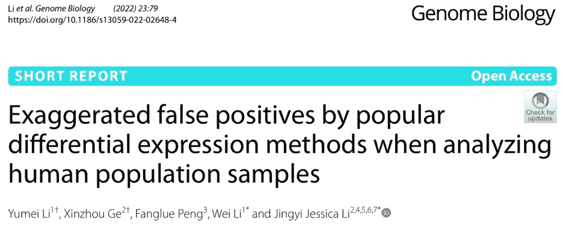

# 是不是大样本危机？流行的差异表达方法对人类群体 RNA-seq 样品的夸大假阳性

> 原文：<https://towardsdatascience.com/a-large-sample-crisis-or-not-640224020757>

## **应对大样本进行排列完整性检查**

作者:李玉妹博士(加州大学欧文分校)和李静怡杰西卡(加州大学洛杉矶分校)

图片来自 https://unsplash.com/photos/I23WeOTsA8M

在生物学研究中，识别在不同实验条件或疾病状态下显著不同的生物学特征对于理解表型背后的生物学机制是重要的。在这些特征中，基因表达是最常被研究的一个。RNA-seq 技术的发展使得在全基因组水平上识别差异表达基因(deg)变得更加容易和快速。然而，RNA-seq 数据的样本量通常较小(通常每个条件下只有 2-4 个生物重复),这使得准确鉴定 DEGs 变得困难。以前的研究人员开发了基于参数分布假设和经验贝叶斯方法的统计方法，以提高小样本的统计功效，如两种流行的方法 DESeq2 [1]和 edgeR [2]。随着测序成本的下降，RNA-seq 数据的样本量逐渐增加，在一些群体水平的研究中达到数百甚至数千。这提出了一个自然的问题，即像 DESeq2 和 edgeR 这样为小样本数据设计的方法是否仍然适用于群体水平的 RNA-seq 数据集。

为了回答这个问题，最近，来自加州大学洛杉矶分校和 UCI 的研究人员在*基因组生物学*上发表了一篇题为“在分析人类群体样本时，流行的差异表达方法夸大了假阳性”的论文。通过排列分析，研究人员发现 DESeq2 和 edgeR 具有极高的错误发现率(FDR)，远远超过目标 FDR 阈值。通过进一步评估多种 DEG 分析方法，包括另一种流行的方法 limma-voom，GTEx 财团采用的非参数方法 NOISeq，最近的非参数方法 dearseq，以及经典的非参数 Wilcoxon 秩和检验(也称为 Mann-Whitney 检验)，他们发现只有 Wilcoxon 秩和检验才能控制 FDR 并获得良好的功效。因此，对于群体水平的 RNA-seq 研究，研究人员推荐 Wilcoxon 秩和检验。

图片来自[https://genomebiology . biomed central . com/articles/10.1186/s 13059-022-02648-4](https://genomebiology.biomedcentral.com/articles/10.1186/s13059-022-02648-4)

在这项研究中，研究人员首先通过随机置换所有样本的双条件标签来生成阴性对照数据集，并发现 DESeq2 和 edgeR 具有出乎意料的高 FDR。令人惊讶的是，当分析来自免疫治疗研究的 RNA-seq 数据集[3]时，他们发现 DESeq2 和 edgeR 甚至从置换数据中识别出了比原始数据更多的 deg。特别是一些基因在多个置换数据集中被错误地识别为 deg，并在免疫相关的生物途径中被富集，这很容易误导研究人员。此外，研究人员通过半合成数据分析，在更多数据集(GTEx [4]和 TCGA [5])上对 DESeq2 和 edgeR 以及其他四种 DEG 识别方法进行了基准测试。结果显示经典的非参数 Wilcoxon 秩和检验始终控制着 FDR。

**基于免疫治疗研究的 RNA-seq 数据的排列分析结果。**图片来自**[https://genomebiology . biomed central . com/articles/10.1186/s 13059-022-02648-4](https://genomebiology.biomedcentral.com/articles/10.1186/s13059-022-02648-4)**

**通过更深入的分析，作者发现基于参数分布假设的方法(例如，DESeq2 和 edgeR)不能控制 FDR 的一个原因是这些方法违反了所假设的参数分布。当样本量足够大时，参数假设就不再必要了。这就是为什么非参数 Wilcoxon 秩和检验在评估中表现最好。因此，研究人员得出结论，对于大样本人群水平的研究，经典的非参数统计方法应被视为数据分析和新方法基准的基线。**

**加州大学洛杉矶分校统计系的 Jingyi Jessica Li 教授和 UCI 生物化学系的教授是本文的通讯作者。这项工作主要由博士(来自实验室的博士后)和葛新洲博士(来自 Jingyi Jessica Li 实验室的博士后)完成。**

**原文链接:[https://doi.org/10.1186/s13059-022-02648-4](https://doi.org/10.1186/s13059-022-02648-4)**

**对于小样本数据，如果用户希望有效的 FDR 控制，但发现很难获得高分辨率的 p 值，Jingyi Jessica Li 的实验室开发了统计方法 **Clipper** [6】，新洲葛博士也是该方法的主要作者:【https://www . physical sciences . UCLA . edu/new-statistical-framework-to-increase-of-data-driven-biomedical-research-on-biomolecules/**

****参考文献****

**1.Love MI，Huber W，Anders S: **使用 DESeq2 对 RNA-seq 数据的倍数变化和离散度进行适度估计。** *Genome Biol* 2014， **15:** 550。**

**2.Robinson MD，McCarthy DJ，Smyth GK: **edgeR:一个用于数字基因表达数据差异表达分析的生物导体包。** *生物信息学* 2010，**26:**139–140。**

**3.里亚兹·N、哈维尔·JJ、马卡罗夫·V、德斯里查德·A、乌尔巴·WJ、西姆斯·JS、霍迪·FS、马丁-阿尔加拉·S、曼达尔·R、沙夫曼·WH 等人:**使用尼伐单抗进行免疫治疗期间的肿瘤和微环境演变。** *单元格* 2017，**171:**934–949 e916。**

**4.跨人类组织遗传调控效应 GTEx 联盟图谱。 *理科* 2020，**369:**1318–1330。**

**5.癌症基因组图谱研究 N，Weinstein JN，Collisson EA，Mills GB，Shaw KR，Ozenberger BA，Ellrott K，Shmulevich I，Sander C，Stuart JM: **癌症基因组图谱泛癌分析项目。** *Nat Genet* 2013，**45:**1113–1120。**

**6.葛 X，，宋 D，McDermott M，Woyshner K，Manousopoulou A，王 N，李 W，王 LD，李: **Clipper:两种情况下对高通量数据的无 p 值 FDR 控制。** *基因组生物学* 2021， **22:** 288。**