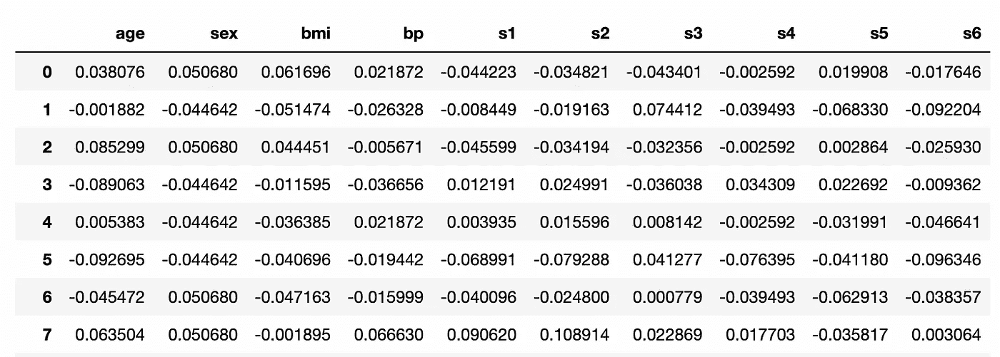
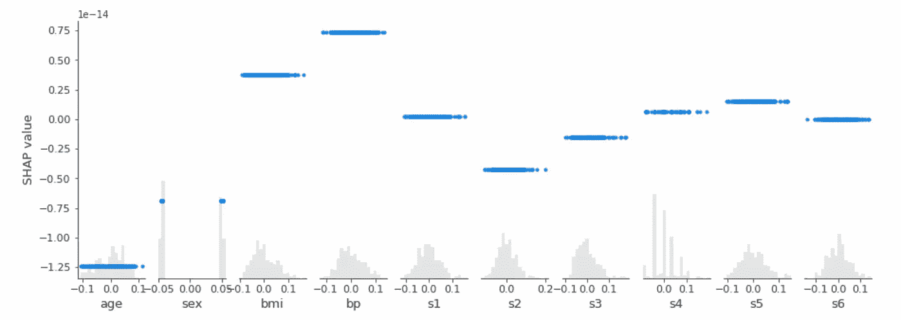
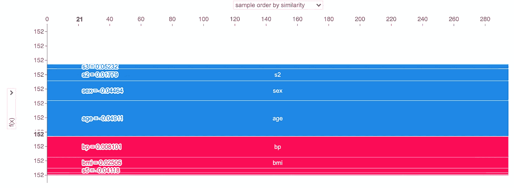
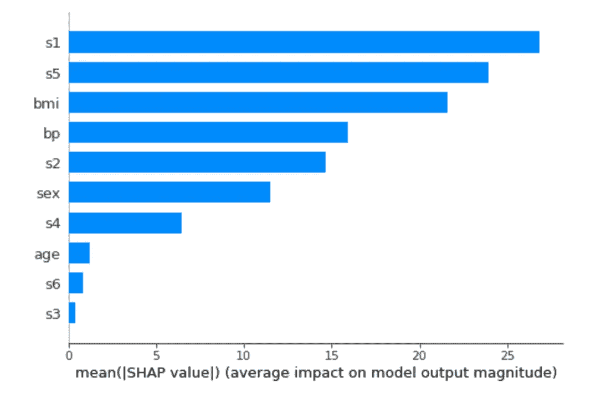
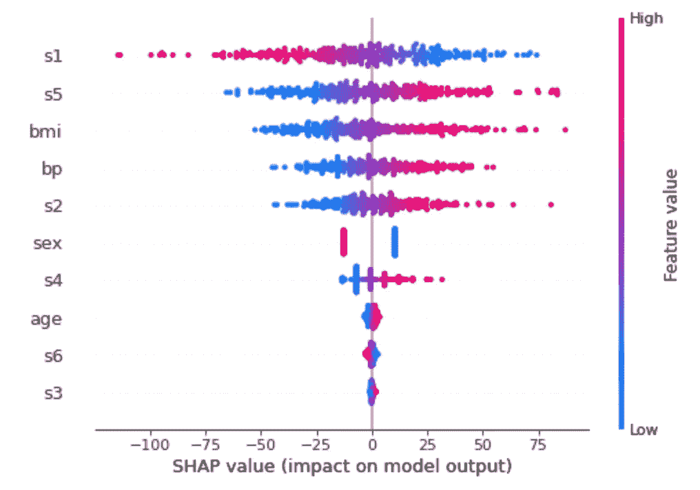
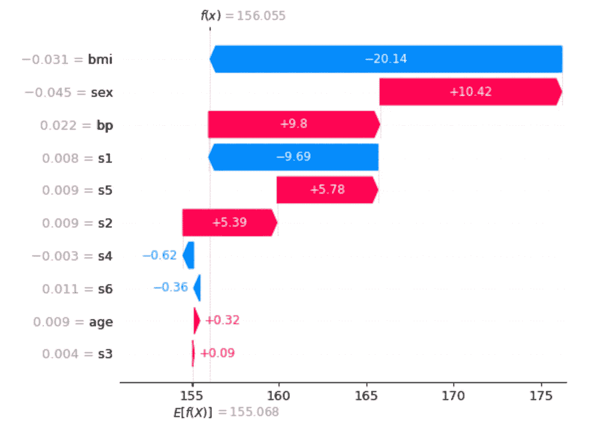
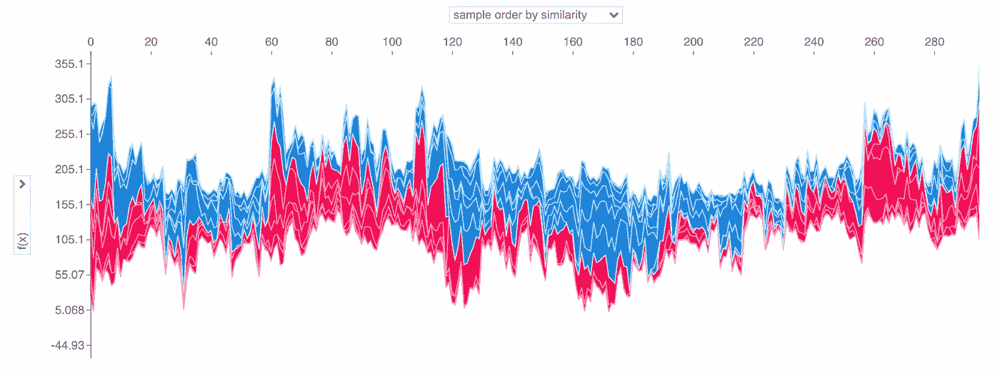
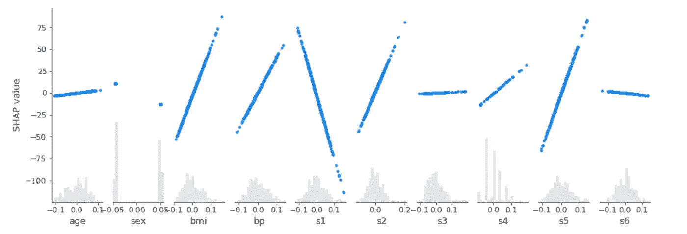
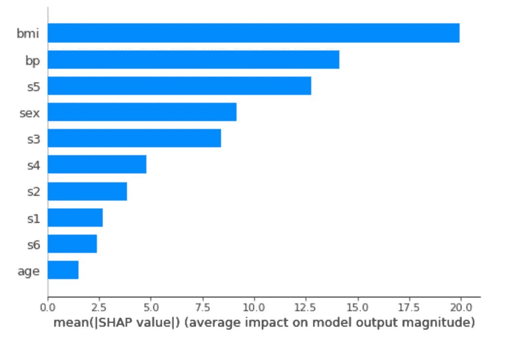

# 多亏了 SHAP，机器学习模型不再是黑匣子

> 原文：<https://towardsdatascience.com/a-machine-learning-model-is-no-longer-a-black-box-thanks-to-shap-9f6ae3adaedc>

## 机器学习

# 多亏了 SHAP，机器学习模型不再是黑匣子

## Python 中的一步一步教程，揭示了机器学习模型的内部工作原理


萨姆·穆卡达姆在 [Unsplash](https://unsplash.com?utm_source=medium&utm_medium=referral) 上拍摄的照片

数据科学家在构建表示数据的模型时可能犯的第一个错误是将算法视为黑盒。在实践中，数据科学家可以更多地关注数据清理，然后尝试一种或多种机器学习算法，而无需了解该算法到底做什么。

事实上，在选择这个或那个机器学习模型之前，数据科学家应该问自己的第一个问题是**问是否真的有必要使用机器学习**。

因此，我的建议是，机器学习是最后的手段，如果没有替代解决方案，就使用它。

一旦你确定机器学习是必要的，重要的是**打开黑盒**了解算法做什么，如何工作。

有各种各样的技术来解释模型，并使没有机器学习专业知识的人更容易理解为什么模型做出某些预测。

在本文中，我将介绍 SHAP 值，这是最流行的模型解释技术之一。我还将通过一个例子来展示如何使用 SHAP 价值观来获得洞察力。

文章组织如下:

*   SHAP 概况
*   Python 中的一个实际例子

# 1 SHAP 概述

*SHAP 代表“沙普利附加解释”。*“沙普利值是合作博弈理论中一种广泛使用的方法。

在机器学习中，**Shapley 值分别测量所有输入特征中每个特征对结果的贡献**。实际上，Shapely 值有助于理解如何根据输入要素构建预测值。

2017 年，Lundberg 和 Lee 在一篇题为[解读模型预测的统一方法](https://arxiv.org/abs/1705.07874)的文章中首次发表了 SHAP 算法(鉴于其重要性，该文章有近 5500 条引用)。

关于 SHAP 价值如何运作的更多细节，你可以阅读萨缪尔·马赞蒂的两篇有趣的文章，标题分别是:SHAP 价值准确地解释了你希望别人如何向你解释；黑箱模型实际上比逻辑回归更容易解释。

要在 Python 中处理 SHAP 值，可以安装`shap`包:

```
pip3 install shap
```

可以为各种 Python 库计算 SHAP 值，包括 Scikit-learn、XGBoost、LightGBM、CatBoost 和 Pyspark。`shap`包的完整文档可在[此链接](https://github.com/slundberg/shap)获得。

# 2 Python 中的一个实际例子

作为一个实际的例子，我利用了由`scikit-learn`软件包提供的著名的糖尿病数据集。数据集的描述可在[此链接](https://scikit-learn.org/stable/datasets/toy_dataset.html#diabetes-dataset)获得。我测试了以下算法:

*   `DummyRegressor`
*   `LinearRegressor`
*   `SGDRegressor`。

对于每个测试过的模型，我创建模型，训练它，并预测由测试集给出的新值。然后，我计算均方差(MSE)来检查它的性能。最后，我计算并绘制 SHAP 值。

## 2.1 加载数据集

首先，我加载糖尿病数据集:

```
from sklearn.datasets import load_diabetesdata = **load_diabetes**(as_frame=True)
X = data.data
y = data.target
```



作者图片

我把它分成训练集和测试集:

```
from sklearn.model_selection import train_test_splitX_train, X_test, y_train, y_test = **train_test_split**(X, y, test_size=0.33, random_state=42)
```

此场景的目标是根据一些输入特征计算血糖值(y 值)，包括体重指数(身体质量指数)、体压(bp)和其他类似参数。输入要素已经被规范化。这是典型的回归问题。

## 2.2 虚拟回归量

在应用真实的机器学习模型之前，我建立了一个基线模型，即虚拟回归器，它将输出值计算为训练集中输出的平均值。

虚拟回归器可用于比较，即检查机器学习模型是否相对于它提高了性能。

```
from sklearn.dummy import DummyRegressor
model = **DummyRegressor**()
model.fit(X_train, y_train)
```

我计算了模型的 MSE:

```
y_pred = model.predict(X_test)
print("Mean squared error: %.2f" % mean_squared_error(y_test, y_pred))
```

输出为 5755.47。

现在，我可以计算这个基本模型的 SHAP 值。我用模型和训练集构建了一个通用的`Explainer`，然后计算数据集上的 SHAP 值，这个数据集可能与训练集不同。在我的例子中，我计算了训练集的 SHAP 值。

```
import shapexplainer = shap.**Explainer**(model.predict, X_train)
shap_values = explainer(X_train)
```

注意`Explainer`可能接收模型本身或`model.predict`函数作为输入，这取决于模型类型。

`shap`库提供不同的函数来绘制 SHAP 值，包括以下几个:

*   `summary_plot()` —显示每个特征对 SHAP 值的贡献；
*   `scatter()` —显示 SHAP 值与每个输入特征的散点图；
*   `plots.force()` —所有数据集的交互式绘图；
*   `plots.waterfall()` —显示如何为单个数据构建 SHAP 值。

在调用前面的函数之前，必须运行以下命令:

```
shap.initjs()
```

首先，我画了散点图:

```
shap.plots.scatter(shap_values, color=shap_values)
```



作者图片

上图显示了预期的情况:在虚拟模型中，每个特征对 SHAP 值的贡献是恒定的。

现在，我画总结图:

```
shap.summary_plot(shap_values, X_train, plot_type='bar')
```


作者图片

有趣的是，在一个虚拟模型中，最有影响的因素是年龄。

最后，我画出了`force()`图。下图是静态的，但如果您在笔记本中绘图，它是交互式的:



作者图片

显然，对于数据集中的每个样本(x 轴)，每个特征对预测值(y 轴)的贡献是相同的。

## 2.3 线性回归器

虚拟回归似乎不是最好的模型，因为它达到了 MSE = 5755.47。我尝试线性回归，希望它能取得更好的表现。

```
from sklearn.linear_model import LinearRegression
model = **LinearRegression**()model.fit(X_train, y_train)
y_pred = model.predict(X_test)
print("Mean squared error: %.2f" % mean_squared_error(y_test, y_pred))
```

线性回归器的 MSE = 2817.80，优于虚拟模型。

我构建了`Explainer`，它接收模型作为输入:

```
import shap
explainer = shap.**Explainer**(model, X_train)
shap_values = explainer(X_train)
```

现在，我绘制总结图:

```
shap.summary_plot(shap_values, X_train, plot_type='bar')
```



作者图片

在这种情况下，最有影响的特征是 s1(在虚拟模型中，最有影响的特征是年龄)。不指定`plot_type`参数也可以绘制汇总图:

```
shap.summary_plot(shap_values, X_train)
```



作者图片

上图显示了每个输入要素对 SHAP 值的贡献。注意，小于-75 的 SHAP 值仅由 s1 决定。

我为训练集中的样本 0 绘制了瀑布图:

```
shap.plots.waterfall(shap_values[2])
```



作者图片

上图显示了如何从基线值`E[f(x)]`建立最终预测`f(x)`。红色条表示正贡献，蓝色条表示负贡献。

我可以通过`force()`图表显示所有样本的先前图表:



作者图片

对于为虚拟回归元(即平面回归元)构建的同一图表，对于线性回归元，每个特征对最终结果的贡献取决于单个样本。

最后，我绘制了散点图:

```
shap.plots.scatter(shap_values, color=shap_values)
```



作者图片

## 2.4 新币回归元

最后，我实现了随机梯度下降回归器。我利用交叉验证网格搜索来调整模型:

```
from sklearn.model_selection import GridSearchCV
parameters = {
    'penalty' : ('l2', 'l1', 'elasticnet')
}
model = SGDRegressor(max_iter=100000)
clf = GridSearchCV(model, parameters)
clf.fit(X_train, y_train)
```

我计算 MSE:

```
model = clf.best_estimator_y_pred = model.predict(X_test)
print("Mean squared error: %.2f" % mean_squared_error(y_test, y_pred))
```

该模型达到了一个 MSE = 2784.27，优于以前的模型。

下图显示了汇总图:



作者图片

上图显示 bmi 特征是 SGD 分类器最有影响力的参数。

# 摘要

恭喜你！您刚刚学习了如何通过 SHAP 值来反转机器学习模型！SHAP 值指定了每个要素对最终预测值的影响。

如果你已经走了这么远来阅读，对我来说今天已经很多了。谢谢！你可以在[这篇文章](https://alod83.medium.com/which-topics-would-you-like-to-read-c68314dc6813)里读到更多关于我的内容。

# 参考

*   [https://coderzcolumn . com/tutorials/machine-learning/shap-explain-machine-learning-model-predictions-using-game-theory-approach](https://coderzcolumn.com/tutorials/machine-learning/shap-explain-machine-learning-model-predictions-using-game-theoretic-approach)
*   [https://m . mage . ai/how-to-interpret-and-explain-your-machine-learning-models-using-shap-values-471 c 2635 b78e](https://m.mage.ai/how-to-interpret-and-explain-your-machine-learning-models-using-shap-values-471c2635b78e)
*   [https://www . ka ggle . com/dans Becker/advanced-uses-of-shap-values](https://www.kaggle.com/dansbecker/advanced-uses-of-shap-values)
*   [https://shap . readthedocs . io/en/latest/example _ notebooks/overviews/An % 20 introduction % 20 to % 20 explained % 20 ai % 20 with % 20 Shapley % 20 values . html](https://shap.readthedocs.io/en/latest/example_notebooks/overviews/An%20introduction%20to%20explainable%20AI%20with%20Shapley%20values.html)

# 相关文章

[](/a-complete-data-analysis-workflow-in-python-pycaret-9a13c0fa51d4)  [](/automl-in-python-a-comparison-between-hyperopt-sklearn-and-tpot-8c12aaf7e829)  [](/4-different-approaches-for-time-series-analysis-7e2364fadcb9) [## 4 种不同的时间序列分析方法

towardsdatascience.com](/4-different-approaches-for-time-series-analysis-7e2364fadcb9)