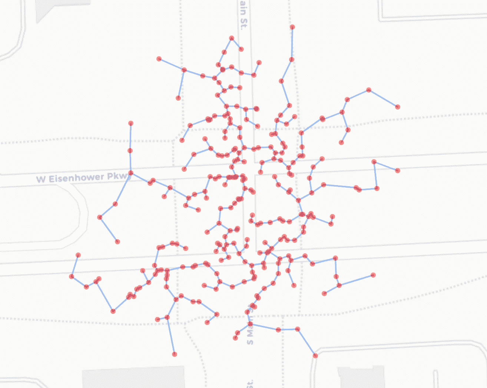
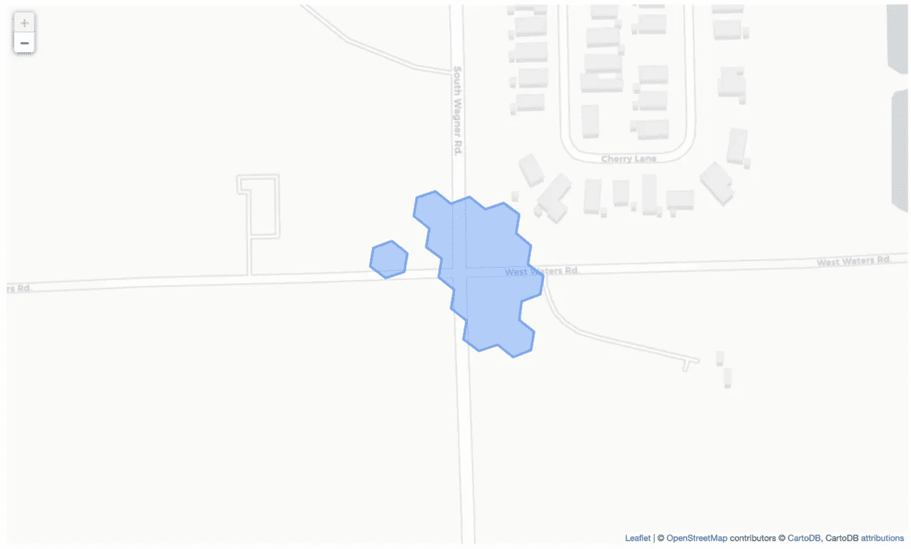
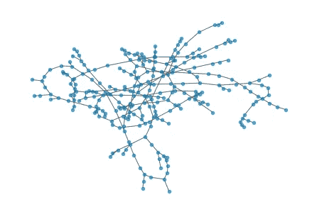
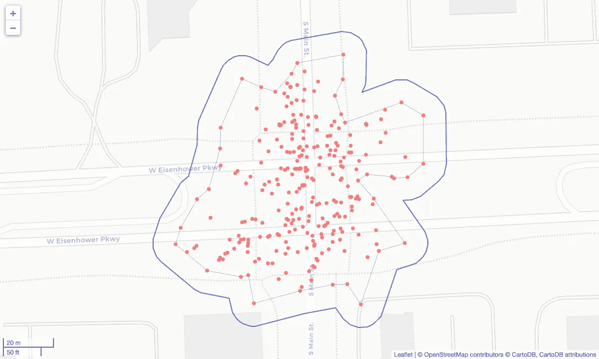
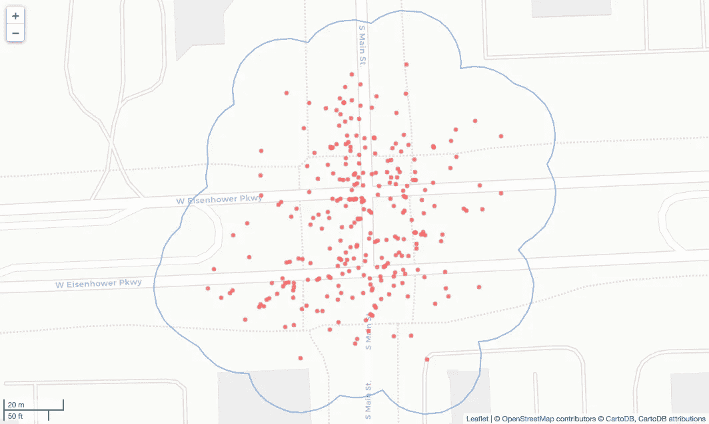
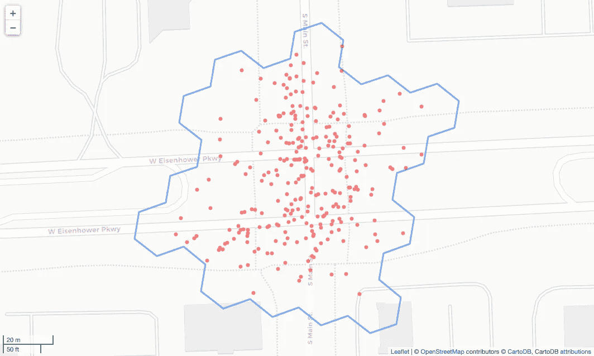
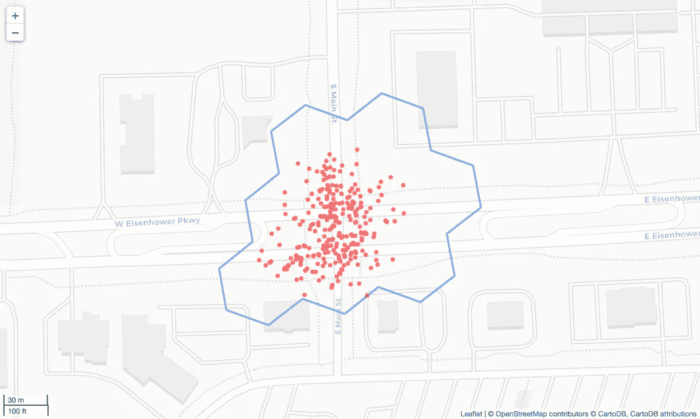

# HDBSCAN 生成的集群的度量

> 原文：<https://towardsdatascience.com/a-metric-for-hdbscan-generated-clusters-dd8d1da7ed62>

## 如何确定 HDBSCAN 生成的团簇的等效 DBSCAN ε参数？

上图描绘了 HDBSCAN 生成的集群中的最小距离生成树。图片由作者用[叶子](http://python-visualization.github.io/folium/)包和 [OpenStreetMap](https://www.openstreetmap.org/) 图像制作。

[HDBSCAN](https://hdbscan.readthedocs.io/en/latest/index.html) 是一种基于密度的分层聚类算法，在简单的假设下工作。至少，它只需要聚类的数据点和每个聚类的最小数量的观察值。如果数据具有不明显的关联距离度量，则该算法接受距离矩阵。

和它的前身 [DBSCAN](https://en.wikipedia.org/wiki/DBSCAN) 一样，它会自动检测星团的数量和周围的噪音。与 DBSCAN 不同，生成的聚类可能包含异常值，需要在后处理过程中进行特殊处理。此外，HDBSCAN 不需要ε参数，对于 DBSCAN，它是点之间最大的 [*密度可达*距离](https://www.geeksforgeeks.org/ml-dbscan-reachability-and-connectivity/)。

如果没有这样一个参数，HDBSCAN 可以自由地增加或减少集群的密度可达距离，因此它具有层次性。这个特性对用户来说很方便，因为它将用户从看似随意的参数值选择中解放出来。另一方面，知道使用什么距离有时有利于后期处理。

</understanding-hdbscan-and-density-based-clustering-121dbee1320e>  

一个这样的实例是为地理空间应用在检测到的聚类周围生成地理围栏。在计算出哪些点属于一个聚类之后，我们可能需要设计一种方法来用图形表示聚类的边界，或者推断新获取的位置是否属于这个聚类。通常，我们需要这两者，而 HDBSCAN 算法只提供第二种情况的近似值。对每个输入位置重新运行该算法通常是不可行的。

将识别的聚类点转换为地理空间形状有许多选项，因此让我们描述几个。

## 凹形船体

凹壳算法允许我们选择一组点，并以尊重其感知形状的方式在它们周围绘制一条拟合线。

</the-concave-hull-c649795c0f0f>  

一旦算法运行，我们得到一个与最外面的聚类点相交的多边形包络，紧密地拟合形状。如果我们想用这个多边形作为地理围栏，我们会遇到一个概念性的问题:我们是否应该在其周围添加一个缓冲区？我在上面的文章中阐述了这个问题。在面周围添加缓冲区有助于反映位置测量和内在聚类维度的不确定性。但是这些维度是什么呢？用 DBSCAN 工作的时候，我们可以用 **ε** ，但是用 h DBSCAN 可以用什么呢？

## 起泡点

很久以前我使用了起泡点技术来生成一个地理围栏的形状。这个想法很简单，因为它涉及到用一个圆代替每个点，然后将它们全部合并，同时保留外部的多边形。下图说明了这个过程。

冒泡过程从单个聚类点开始，并在每个聚类点周围放置一个圆圈。然后，该方法合并圆并产生最终形状。(图片来源:作者)

在使用 DBSCAN 的时候，我们可以用 **ε** 来推导圆半径，但是在使用 HDBSCAN 的时候应该怎么做呢？

## H3 六边形

如[其他文章](/geographic-clustering-with-hdbscan-ef8cb0ed6051)所示，我们可以使用优步的 H3 六边形从一组聚类点生成地理围栏。选择[六边形尺寸](https://h3geo.org/docs/core-library/restable/)是一项要求，因为我们需要确定一个合理的详细程度，以覆盖所有位置而不留间隙。下图显示了这样一种情况，其中有一个断开的六边形。

上图显示了 H3 生成的带有间隙的聚类地理围栏。图片由作者用[叶子](http://python-visualization.github.io/folium/)包和 [OpenStreetMap](https://www.openstreetmap.org/) 图片制作。

同样，我们可以使用 DBSCAN 的 **ε** 来获得适当的分辨率，但 HDBSCAN 则不然。

# 问题定式化

我们可以从 HDBSCAN 生成的集群中提取什么指标来帮助我们完成这些工作？我们希望基于适合基于外壳的地理围栏上的缓冲半径的簇形状、基于气泡的圆的合理半径或单个 H3 六边形的适当边长来计算测量值。

可惜这个问题提法有点模糊。没有明确的线索，我们应该在哪里寻找适当的措施。然而，我们可以说这个度量*不是*。我们不寻求聚类点之间的最大距离，也不希望最短距离。如果我们想在集群点周围创建一个缓冲区，这些不是要使用的度量。第一项措施对于这个目的来说太大了，而第二项措施可能小到几乎为零。

# 问题解决方案

我在这里提出的解决方案包括计算从任何一个给定的集群位置到所有其他集群位置的最短距离，并从中得出一个度量。虽然有人可能会认为等价的 **ε** 应该是这些最小距离中的最大值，这是一个合理的论点，但我在这里提出的解决方案使用统计数据来推导度量。我将在下面解释原因。

然后，我们探索这些距离如何表现，以确定适当的度量。更具体地说，我们将确定这些最小距离的统计分布，作为我们决策的基础。

在这篇文章中，我使用了[汽车能源数据集](https://arxiv.org/abs/1905.02081v1)我已经[探索](/geographic-clustering-with-hdbscan-ef8cb0ed6051)很长一段时间的数据。可以在 [GitHub 库](https://github.com/joaofig/ved-explore)上跟随文章的代码，重点关注笔记本 [**11**](https://github.com/joaofig/ved-explore/blob/master/11-hdbscan-metric.ipynb) 和 [**12**](https://github.com/joaofig/ved-explore/blob/master/12-hdbscan-cluster-distributions.ipynb) 。

## 最小距离分布

我们从研究每个节点的最小距离分布开始。这种计算意味着循环遍历所有位置，并计算到群集中所有其他位置的距离。考虑到对称距离，我们可以避免冗余计算并提高计算性能。请注意，如果我们使用道路距离，我们将不得不使用更复杂的方法，因为它们缺乏对称性。由于最终的道路限制，从 A 点到 B 点的道路距离不一定与从 B 点到 A 点的距离相同。

有两种略有不同的方法来计算最小距离。第一种方法仅使用平方逐点距离矩阵，而第二种方法使用网络理论。这些方法在大多数情况下是一致的，但在某些情况下会呈现不同的结果。虽然矩阵方法更直接、更快速，但它可能会考虑重复距离，而网络理论方法则不会。当这些方法呈现不同的结果时，前者将小于后者。

## 距离矩阵方法

我们可以使用对称距离矩阵轻松计算最小距离向量。计算完矩阵后，我们只需要找到最小的列值，忽略对角线，对角线为零。

下面的函数使用两个数组作为输入来计算距离的对称方阵，一个用于纬度，另一个用于经度。注意它是如何通过沿对角线填充矩阵来避免冗余计算的。每一步都需要较小的距离向量，从而提高性能。

上述函数为所提供的位置生成对称的平方距离矩阵。(图片来源:作者)

上面的函数使用了矢量化版本的[哈弗辛](https://en.wikipedia.org/wiki/Haversine_formula)距离计算，如下所示。

这个函数计算成对的哈弗线距离。平方函数生成器将初始位置广播到具有目标位置的精确尺寸的向量。(图片来源:作者)

一旦我们有了方阵，就很容易得到最小值列表。下面的两个函数说明了这个过程。

为了计算所需的度量，我们必须首先计算距离矩阵。接下来，我们检索列最小值列表(不包括对角线上的零)。输入是一个包含所有集群位置的 Nx2 矩阵，第一列是纬度，第二列是经度。(图片来源:作者)

这个函数的优点是速度快，但是既不能帮助我们直观，也不能排除重复。我们可以使用网络理论的替代解决方案来更好地了解幕后发生的事情，并获得唯一的距离。

## 网络理论方法

我们可以将平方距离矩阵计算视为所有聚类位置之间距离的网络表示。每个节点是一个位置，而它们之间的边以对称距离作为它们的权重。

现在，我们为每个节点选择最短的边，并删除所有其他的边(简单地说)。由此产生的网络是一棵树，因为它连接所有的节点，没有循环。如果边的权重(位置之间的地理距离)最短，我们称之为[最小生成树](https://en.wikipedia.org/wiki/Minimum_spanning_tree)。

上图代表了由 NetworkX 包绘制的最小生成树。(图片来源:作者)

我们可以通过使用 [NetworkX](https://networkx.org/) 包来计算这棵树。下面的代码演示了计算过程。

上面的函数通过计算与距离网络相关联的最小生成树来计算最小距离。(图片来源:作者)

不幸的是，这种方法比基于矩阵的方法慢一个数量级，但排除了重复距离，并提供了最小生成树的图形表示。我们可以将树覆盖在地图上，并连接点，如本文的主图所示。

## 什么分布？

我们现在有两种方法来计算最小距离列表。接下来的讨论使用最小生成树方法。

为了推断距离的典型分布，我们使用了[钳工](https://fitter.readthedocs.io/en/latest/)包，如笔记本 [**12**](https://github.com/joaofig/ved-explore/blob/master/12-hdbscan-cluster-distributions.ipynb) 所示。在本笔记本中，我们遍历所有集群，计算它们的最小生成树距离，并确定最可能的分布。下表显示了我们的数据集的结果。

上表显示了集群距离网络的最小生成树距离的最可能统计分布的频率。最常见的分布是对数正态分布。(图片来源:作者)

如上表所示，大多数集群遵循[对数正态](https://en.wikipedia.org/wiki/Log-normal_distribution)分布。第二常见的分布是与对数正态分布相似的[伽马分布](https://en.wikipedia.org/wiki/Gamma_distribution)、[。](https://stats.stackexchange.com/questions/72381/gamma-vs-lognormal-distributions#:~:text=The%20log%20of%20a%20gamma,quite%20skew%20or%20nearly%20symmetric.&text=This%20difference%20implies%20that%20the,and%20its%20left%20tail%20lighter.)

## 提议的衡量标准

利用这些发现，我决定将度量基于对数正态参数: *m* 和 *s* (根据 [Brilliant 公布的公式](https://brilliant.org/wiki/log-normal-distribution/)计算)。

上面的公式定义了对数正态分布的平均值。(图片来源:作者)

以上是对数正态分布的标准差公式。(图片来源:作者)

我们计算𝝁和 **𝜎** 的值作为采样数据的平均值和标准偏差。作为度量，我决定使用以下数量。

HDBSCAN 的ε参数的 DBSCAN 当量估计值类似于正态分布的公式，对应于大约 97%的数据。(图片来源:作者)

从最小距离列表中计算集群度量的函数非常简单。

假设对数正态分布，上面的函数根据最小距离计算集群度量。(图片来源:作者)

我们现在可以通过在地图上绘制使用该度量和聚类位置创建的地理围栏来测试这种方法。

# 解决方案验证

现在我们来看看在绘制 HDBSCAN 生成的集群边界时，这一指标是如何表现的。我们从下图中膨胀的凹形船体开始。

上图显示了计算集群的凹面外壳形状，然后使用集群度量对其进行膨胀的结果。您可以看到红色的簇位置，凹形的外壳形状是一条细的蓝线，而膨胀的形状是一条粗线。外部多边形包含 194 个点。(图片来源:作者)

气泡形地理围栏使用相同的聚类度量作为合并圆的半径，以每个聚类位置为中心。如下图所示，生成的形状夸大了点周围的缓冲区。请注意，这源自方法，而非指标。

上图显示了合并所有半径等于计算的聚类度量的以点为中心的圆的结果。多边形包含 279 个点。(图片来源:作者)

最后，我们测试了基于 H3 的方法，使用聚类度量来导出六边形细节层次。由于 H3 六边形的固定地理空间性质，缓冲区可能不会按预期工作，因此您可能需要使用乘法因子来调整计算。下面的地理围栏使用的乘法因子为 2。

上图显示了 H3 生成的使用紧配合的地理围栏。有 29 个六边形，多边形只包含 45 个点。(图片来源:作者)

下图显示了使用较大乘数(本例中为 3)计算的具有较大 geofence 的同一个聚类。

上图显示了一个 H3 生成的地理围栏，使用的是松配合。有八个六边形，多边形只包含 21 个点。(图片来源:作者)

# 结论

在本文中，我试图推导一个度量来模拟 DBSCAN 的 **ε** 参数对 HDBSCAN 生成的集群的影响。我对此指标的建议是推断集群集的最小生成树距离的典型统计分布，然后使用平均值和标准偏差的简单函数。我打算找到一个稳健的度量标准，应用于我过去在 DBSCAN 中成功使用的一些地理围栏生成算法。缺少预先为 DBSCAN 定义的 **ε** 参数意味着没有对度量的明显支持。该解决方案既不是唯一的，也不一定是最好的，但似乎适合手头的任务，特别是当使用膨胀凹面船体和 H3 方法。

# 参考

【github.com 

[hdb scan 集群库— hdbscan 0.8.1 文档](https://hdbscan.readthedocs.io/en/latest/index.html)

[H3:优步的六边形层次空间索引|优步博客](https://www.uber.com/en-PT/blog/h3/)

[网络 X —网络 x 文档](https://networkx.org/)

[钳工文档—钳工 1.4.1 文档](https://fitter.readthedocs.io/en/latest/)

joo Paulo Figueira 在葡萄牙里斯本的[TB . LX by Daimler Trucks and bus](https://tblx.io/)担任数据科学家。