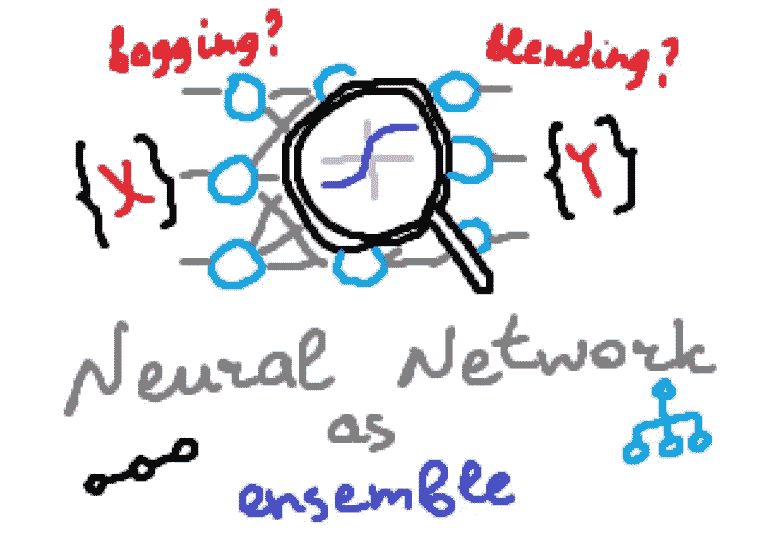
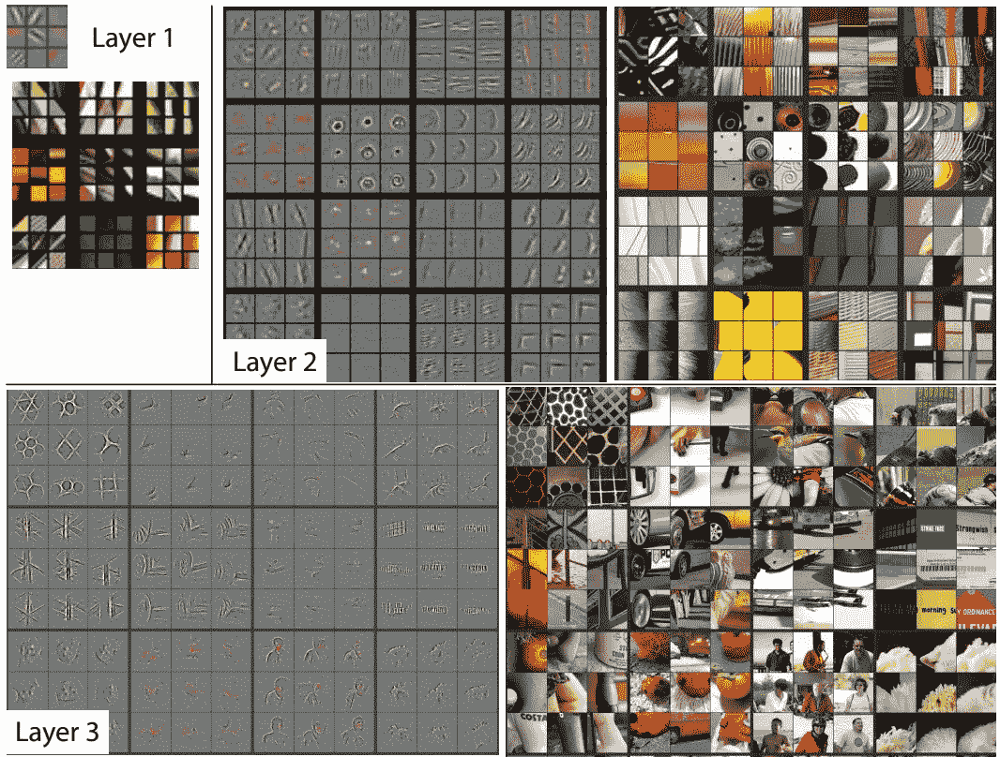
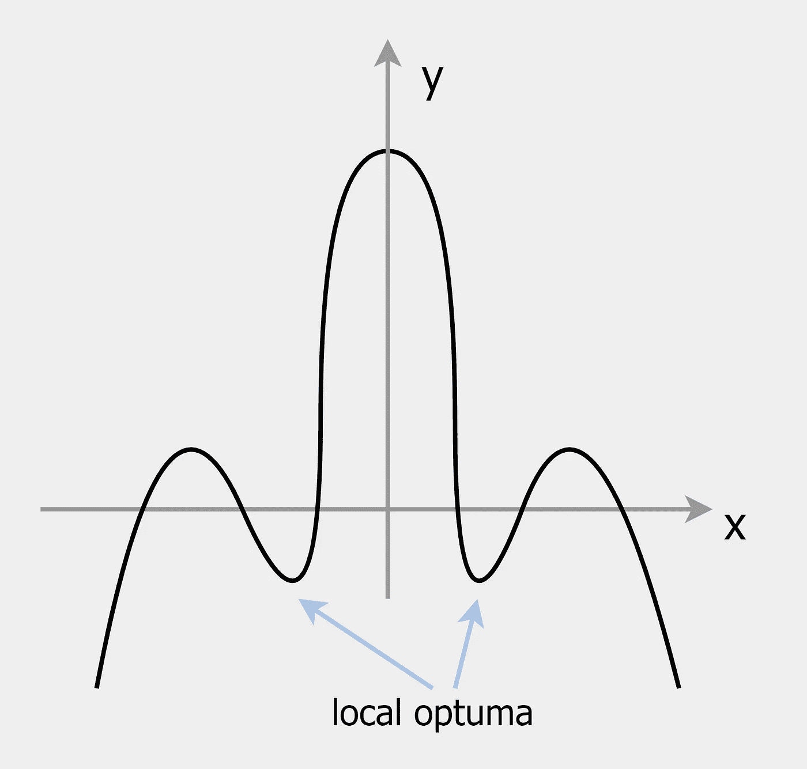

# 作为简单模型集合的神经网络

> 原文：<https://towardsdatascience.com/a-neural-network-as-an-ensemble-of-simple-models-1f2b01a0616b>

# **作为简单模型集合的神经网络**

## **以及为什么神经网络代价函数是非凸的直观解释**

预览。作者图片

机器学习的“大爆炸”发生在几年前。然后，在很多人工智能任务中，机器学习模型开始击败人类的表现。

这主要得益于深度学习。因此，深度神经网络的不同架构是许多问题的最新解决方案，如语音识别、对象检测、机器翻译等。

神经网络的蓬勃发展在该领域产生了巨大的兴趣，将神经网络从普通的机器学习算法变成了一个独立的知识领域。这反过来进一步激发了人们对神经网络的兴趣，并创造了大量的在线课程和培训材料。

尽管在线教育的便利性不可否认，但这类课程往往会跳过几乎所有关于经典机器学习的内容，直接进入神经网络和深度学习。在本文中，我想展示如何从经典机器学习的角度考虑神经网络——作为一个集成模型。一路走来，我们也会明白为什么一个神经网络的代价函数不是凸的。

## **符号**

在我们开始深入之前，让我们记住标准全连接神经网络的 *l* ᵗʰ *层值*是如何计算的。
这是来自神经元的*状态的*激活函数*的值。
反过来，神经元*的*状态等于*权重矩阵*与前一层*中的*激活向量加上*偏置向量*的乘积。*

默认神经网络表示法。作者图片

这是一个标准的符号，你可以在大多数课程、书籍和视频教程中找到(但是，注意矩阵/向量的维数可能不同)。

# **你能想象到的最简单的神经网络根本不是神经网络**

首先，让我们想象一下世界上最简单的神经网络。假设我们只有一个输入特征(`x`)和一个输出标签(`y`)。具有一层和一个神经元的最简单的神经网络将只有两个参数——一个权重和一个偏差。

具有一个神经元和一个输入特征的一层神经网络。作者图片

这样一个网络的输出值会一步计算出来(因为只有一层)，甚至不需要线性代数的帮助(所有的`W`、`b`、`x`、`y`的值都有一个 1x1 维)。然而，这种模型能够理想地解决线性数据的回归问题和线性可分数据的二元分类问题。但是这个神经网络到底是什么？让我们至少把这个例子复杂化一点:取等于`m`的特征数而不是 1。

具有一个神经元和 m 个输入特征的一层神经网络。作者图片

如果我们解决回归任务，我们选择一个线性函数(或恒等函数)作为激活函数。然后，通过将`W`的矩阵乘法扩展为`x`，我们得到以下值。

单神经元神经网络的回归。作者图片

哇，这简直就是*线性回归*方程！

通过选择 sigmoid 作为激活函数，对于二元分类可以显示同样的情况。然后这个神经网络就变成了一个*逻辑回归*模型。

单神经元神经网络的分类。作者图片

当然，上面展示的内容对任何人来说都不是秘密。神经网络的强大之处恰恰在于它是一个*网络*，其中有许多简单的单元(*神经元*)。但是进一步阅读推理，请记住下面的短语。

> 神经网络的一个神经元是一个简单的模型，它接收前一层的输出作为输入。
> 
> 对于第一层，这些输入是输入要素。对于其他图层，这些输入是由先前图层转换的输入要素。

在我们继续之前，让我们记住什么是集成学习。

# **集成学习的一次短暂旅行**

如果你打开一本机器学习的书，其中谈到监督学习的部分，你很可能会看到大约以下内容:线性回归，逻辑回归，kNN，决策树，SVM，装袋，助推。

这种顺序非常合乎逻辑。首先，它向您解释了基本算法是如何工作的，之后，它显示了这些算法的组合工作得更好。例如，很难举出一个随机森林比单个决策树质量差的例子。

让我们回忆一下什么是装袋。

装袋。作者图片

Bagging 是一组(*集合*)弱模型，每一个模型都在其自己的数据子样本上被独立训练。在 bagging 预测过程中，所有模型的预测被聚合，答案要么是平均值(用于回归)，要么是投票结果(用于分类)。

为什么集合模型比单一模型更好的详细解释超出了本文的范围。为了更全面地了解其他集成学习算法，你可以阅读我的[监督学习算法备忘单](/supervised-learning-algorithms-cheat-sheet-40009e7f29f5)或一些更严肃的材料。

> 不能说神经网络是线性回归的多层包装，尽管这个短语很大程度上反映了本文的本质。

这个短语中至少有两个错误，如果你能找到它们，对你有好处:

*   首先，没有非线性激活函数，任何深度的网络都没有意义。那是因为*线性运算的序列也是线性的*。
*   第二，在相同的数据集上训练神经网络的神经元。虽然，我们可以通过从输入层或其他层删除神经元来增加一些随机性。等等，看起来像是*辍学者* …

# **神经网络作为自动特征工程工具**

因此，我们发现网络中的每个神经元都是一个弱模型，但它们一起显示出良好的结果。为什么会这样？好像是上一层的神经元发现了*一些模式*并传递给了下一层的神经元。

如果我们想象一个两层的神经网络，它的第一层(一般来说，除了最后一层以外的所有层)将扮演所谓的*特征提取器*的角色——它的值将是输入数据的线性(或非线性)组合。如果我们想象我们以同样的方式转换数据集，但手动进行，然后以相同的权重将其馈送到单层神经网络的输入，结果将完全相同。

除了最后一层，所有层都是特征提取器。作者图片

这解释了为什么*特征工程*在深度学习时代失去了意义。以前，人们必须设计对简单模型有很大帮助的复杂功能，但现在添加几个补充层就足够了。同时，如果网络实际上不需要这些特征，添加跳过连接将允许网络容易地学习身份功能。

网络的最后一层仍然是一个弱模型——线性分类器。但是因为它的数据是由前面的层准备好的，所以它更好地解决了这个任务。网络的层数越多，它能检测到的复杂模式就越多。第一层(接近输入)找到非常简单的模式。下面几层将它们结合起来，创建了更复杂的依赖关系。因此，向网络的更深处移动，模式变得越来越复杂，直到它们到达最终结果。

这在卷积神经网络(CNN)的例子中非常明显。第一层检测水平线和垂直线；接下来的人用它们构造简单的形状，等等。已经在第三层，网络能够区分类似于人的东西。

CNN 滤波器的可视化。图像由[可视化和理解卷积网络论文](https://arxiv.org/pdf/1311.2901.pdf)

因此，可以表明，特定层中的神经元(或在 CNN 的情况下的过滤器)的数量是先前层可以检测的模式的最大数量。如果这些模式非常少，网络将无法很好地压缩信息，但如果有很多，网络可以在数据中找到并不存在的模式(这是*过拟合*)。

关于理解 CNN 过滤器和寻找模式的过程的最有趣的项目之一是麻省理工学院的的[搜索网。你可以选择 5 层 CNN 中的任何单元(过滤器),并查看图像的哪些部分导致它的最大激活，以及它的上一层和下一层的哪些神经元交互最活跃。](http://people.csail.mit.edu/torralba/research/drawCNN/drawNet.html)

例如，第三层的这个神经元已经学会区分类似“网格”图案的东西及其后的神经元——更复杂的网格图像——电影院的座位、公寓楼的窗户等。

搜索网。一个[公共网页的截图](http://people.csail.mit.edu/torralba/research/drawCNN/drawNet.html)

这里值得一提的是，为什么网络的不同上层部分可以解决完全不同的任务。想象一种情况——你面临的是图像分类任务，但是除了预测一个类别(比如猫/不是猫)，你还想检测一只猫的鼻子。你不会为了这个任务训练两个不同的网络吧？当然不是。如果正确选择激活和丢失功能，同一个网络将完美地处理这两个任务。整个网络的主体会为你准备好输入图像的*嵌入*，输出层会想出如何处理它。

还可以看出，这样的网络等价于共享部分中具有相同权重的几个网络。

一个网络相当于几个网络。由[塞德里克 VT](https://unsplash.com/@cedric_photography?utm_source=unsplash&utm_medium=referral&utm_content=creditCopyText) 在 [Unsplash](https://unsplash.com/s/photos/cat?utm_source=unsplash&utm_medium=referral&utm_content=creditCopyText) 拍摄的猫咪照片。作者图片

将神经网络作为集成模型进行推理也导致了对其成本函数的思考。让我们看看它们，完成这篇文章。

# 为什么神经网络代价函数是非凸的

神经网络成本函数的分析是相当复杂的任务，需要单独考虑。但鉴于以上情况，我还是说几句吧。

从很多课程和书籍中，你可能知道一个神经网络的代价函数不是凸的。如果是凸的，训练神经网络就容易多了(因为凸函数只有一个全局最小值，见[凸优化](https://en.wikipedia.org/wiki/Convex_optimization))。神经网络成本函数具有非常复杂的形状，具有大量的局部最小值。好像没吓到谁，所有地方的解决方案都差不多。这是为什么呢？

对于没有隐藏层的浅层神经网络的情况，如上所述，其是线性或逻辑回归模型，成本函数是凸的(这是常规的 MSE 或二进制交叉熵),并且可以使用例如[正规方程](https://www.geeksforgeeks.org/ml-normal-equation-in-linear-regression/)解析地找到全局最优参数。

但是通过一层又一层地添加，成本函数变得依赖于越来越多的参数，采取越来越复杂的形式。这种形式无法以任何方式观察到，因为这个函数位于非常高维的空间中——现代网络有数百万和数十亿个参数。每一层都有一个非线性激活函数，使其远离凸起的形状，在其中创造更多的山丘、高原和凹槽。

可以显示的是，某些数据点的某些局部极小值是等价的。考虑下图。通过交换第一层中的上层和下层神经元(以及它们各自的权重)，我们在多维空间中获得了不同的点，但是输出的值以及成本函数值保持不变。注意，无符号权重等于 1。

“镜像”网络的输出值相同。作者图片

直观地，这表明成本函数可以具有许多大致相同的局部最小值，这导致不同的权重组合。

将函数投影到一维空间可能看起来像这样。

成本函数的相似局部极小值。作者图片

但这些都是直觉的和未经证实的论点，可能会被我所不知道的证据所反驳。

我希望这些考虑对您来说是有趣和有用的。也许，他们会鼓励你学习一些关于神经网络的新东西，也许——关于经典的机器学习，两者都是好的。在这个令人惊叹的人工智能世界中潜水，永远不要忘记参考基础和经典。

# 感谢您的阅读！

*   我希望这些材料对你有用。[在 Medium](https://medium.com/@andimid) 上关注我，获取更多类似的文章。
*   如果您有任何问题或意见，我将很高兴得到任何反馈。在评论中问我，或者通过 [LinkedIn](https://www.linkedin.com/in/andimid/) 或 [Twitter](https://twitter.com/dimid_ml) 联系我。
*   为了支持我作为一名作家，并获得数以千计的其他媒体文章，使用[我的推荐链接](https://medium.com/@andimid/membership)获得媒体会员资格(不收取额外费用)。

# 参考

 [## 可视化和理解卷积网络

### 大型卷积网络模型最近在 ImageNet 上展示了令人印象深刻的分类性能…

arxiv.org](https://arxiv.org/abs/1311.2901)  [## 拖网

### 每个单元对应一个卷积单元。单击一个设备以显示最强的连接…

people.csail.mit.edu](http://people.csail.mit.edu/torralba/research/drawCNN/drawNet.html)