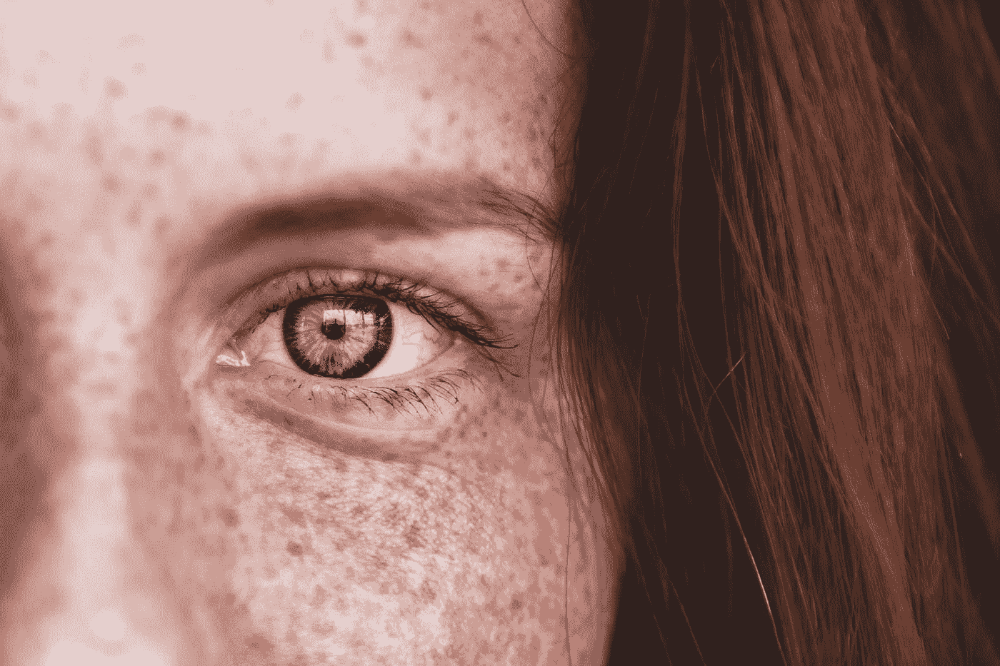
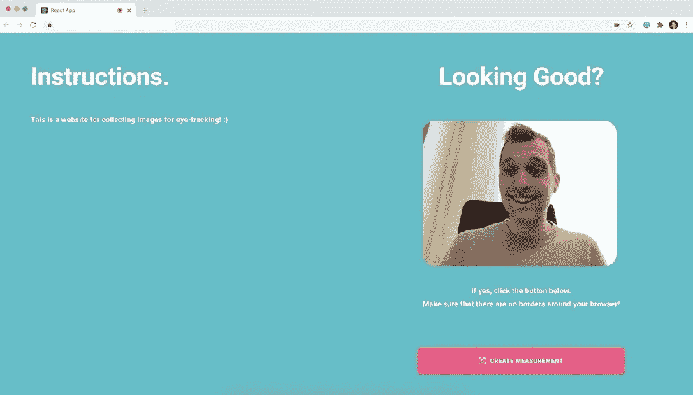

# 一种使用批处理规范化的新方法

> 原文：<https://towardsdatascience.com/a-novel-way-to-use-batch-normalization-837176d53525>

## 在推断过程中，我如何使用批量标准化来提高我的眼球跟踪器 20%的性能

迭戈·PH 在 [Unsplash](https://unsplash.com?utm_source=medium&utm_medium=referral) 上的照片

批量归一化对于每一个现代深度学习算法都是必不可少的。在将输出特征传递到下一层之前对其进行标准化，可以稳定大型神经网络的训练。当然，这对任何对深度学习感兴趣的人来说都不是新闻。但是您知道吗，对于某些用例，批处理规范化也显著地改进了测试和推理。

在这篇文章中，我想介绍一个成功的实验，这是我在建立眼睛跟踪的深度学习算法时尝试的。也许这是一个众所周知的技术，但我自己没有在任何地方看到过。如果你有一些例子，请随意提供。

当使用`model.train()`而不是`model.eval()`进行评估时，我在测试数据集上的分数提高了 20%。我的同事在进行类似的实验时得到了同样的结果。但是为了让这个有意义，让我解释一下我想要构建什么。

**警告:**我的用例分析人的面部和眼睛。我收集了 30 个人的数据，所以它不能代表每个人。因此，对于不同肤色或眼睛颜色的人，我的表现会更差。由于这只是我娱乐的一个实验，我没有解决与有偏见的数据集相关的挑战。然而，如果我想更进一步，包容将是我的首要考虑。这意味着既要收集代表尽可能多的数据，又要在采样训练数据时考虑这些信息(如有必要)。

# 解释使用案例

照片由[埃里克·麦克莱恩](https://unsplash.com/@introspectivedsgn?utm_source=medium&utm_medium=referral)在 [Unsplash](https://unsplash.com?utm_source=medium&utm_medium=referral) 上拍摄

我的目标是创建一个基于网络摄像头的眼球追踪算法。换句话说，我想用网络摄像头拍照，并预测用户在屏幕上的关注点。已经有开源的替代方案，但我想看看深度学习是否可以消除当前解决方案的一些问题:

*   **校准—** 我测试过的解决方案需要校准才能正常工作。你必须看着屏幕，跟随一个移动的物体，通常不移动你的头。
*   **固定眼睛位置—** 校准后，请务必不要移动眼睛的位置。如果你参加一些需要观看较长视频的调查，这是一个挑战。
*   敏感——除了眼睛的位置，它们还容易受到其他变化的影响。一些例子是照明和到显示器的距离。

这个想法是，深度学习算法可以学习更复杂的模式，对头部运动和网络摄像头图像中的其他变化不太敏感。如何消除校准不太明显，但我有一些想法。

## 深度学习的挑战

许多眼球跟踪器必须实时工作，并且在本地运行。这很难用深度学习来实现，因为这些算法比传统方法需要更多的计算。

# 收集培训数据

我和我的 react 应用程序的照片

为了训练眼睛跟踪的深度学习算法，我需要收集训练数据。这就是为什么我的第一步是构建一个 react 应用程序，并请我的朋友们做出贡献。

## 衡量

当有人登录到我的应用程序时，我要求那个人创建一个我称之为“度量”的东西。这是一个简单的过程，如下所示:

1.  首先，我确保应用程序处于全屏模式，并要求用户确保浏览器周围没有边框。
2.  接下来，我在屏幕上的随机位置生成一个点。
3.  用户看着点，点击空格。
4.  我用网络摄像头拍了一张照片，并把它和点的坐标保存在一起。我用坐标除以屏幕的大小。
5.  我重复步骤 2-5 一百次。

因此，一个度量包含 100 张由用户的网络摄像头拍摄的照片以及相关的点坐标。在测量过程中，这些点有不同的颜色和大小，但我不知道这是否重要。大概不会。

## 附加说明

我指示参与者像他们通常坐在电脑前时那样表现。我不想让他们完全坐着不动，鼓励他们移动头部和眼睛以及面部表情。这样我就可以训练一个对运动不太敏感的算法。

作者:来自同一尺寸的三张我的照片

此外，我希望人们从一种测量到另一种测量做出更大的改变。比如换位置，换衣服，加配饰等。就像我在下面的图片中做的那样！

作者:三种不同尺寸的我的照片

大多数眼球跟踪器只看眼睛，但我想让我的算法分析整个图像。当然有很多不必要的信息，但这很容易被算法自己发现。

## 数据量和变化

总的来说，我从 30 个人那里收集了 2-5 个测量数据。总共大约有 12，000 张图片。对于深度学习算法来说不是很多，但足以开始实验。

## 留出数据进行验证

新手机器学习工程师的一个常见错误是以不代表现实的方式分割数据集。一种糟糕的方法是将 12，000 幅图像随机分成训练、验证和测试。它在纸面上产生了奇妙的结果，但在生产中却产生了可怕的结果。

相反，我将数据集按人划分，以了解当陌生人出现时，该算法的工作效果如何。我还留出了一些来自培训人员的测量数据，用来测量熟悉的人的表现。

## 图像预处理

在训练期间，我对输入图像所做的唯一改变是通过裁剪掉边上的一些信息，将它们变成正方形。算法很容易知道背景是不相关的，因为它在测量过程中变化不大。

# 关于批处理规范化

照片由 [Siora 摄影](https://unsplash.com/@siora18?utm_source=medium&utm_medium=referral)在 [Unsplash](https://unsplash.com?utm_source=medium&utm_medium=referral) 上拍摄

大多数人都知道关于批处理规范化的一切，但是我将提供一个简短的上下文解释。如果不需要，可以跳过这一部分。

## 批量标准化的目的

当你训练一个深度学习算法时，你给它“批量”的数据点。对于我的眼球跟踪器来说，这意味着几个人看着他们的屏幕的图像以及相关点的坐标。

批量规范化从算法中的一层获取输出，并在将输出传递到下一层之前对其进行规范化。它导致更稳定的训练。如果您想了解更多关于批处理规范化的知识，这里有一篇关于数据科学的精彩文章:

  

## 培训与验证

这里需要理解的重要一点是，在训练过程中，每个批次归一化图层都会计算每批数据点的平均值和方差。

每个批次归一化图层也有两个参数，用于存储均值和方差的移动平均值。然后，到了验证的时候，我们使用存储的值，而不是执行计算。

在 PyTorch 中，`model.eval()`和`model.train()`改变层的行为，如批处理规范化和删除。

# 新奇时刻到了！

[Mulyadi](https://unsplash.com/@mullyadii?utm_source=medium&utm_medium=referral) 在 [Unsplash](https://unsplash.com?utm_source=medium&utm_medium=referral) 上拍摄的照片

对于每个实验，我使用一个简单的`U-net`架构和一个`Efficientnet`主干。对于像 [segmentation_models](https://github.com/qubvel/segmentation_models.pytorch) 这样的流行库，这只是一行代码。我从基线改变的唯一一件事和我最成功的解决方案是训练过程。

## 关于基线

每当你在处理机器学习用例时，你都需要一个基线算法来进行比较。我尽可能用最简单的方式训练我的标准`U-Net`。对于每一批，我从随机测量中选择了 32 个随机图像。该算法不会通过这种方法学习任何类似校准的东西，但这是一个合理的开始。

训练后，基线表现出奇的好。它的平均误差为 9.5%，与我之前尝试的开源替代方案相似。误差是预测和正确坐标之间的距离，以屏幕大小的百分比表示。

## 不起作用的方法

接下来，我开始思考如何将校准纳入算法。这里有两种方法对我来说不太管用:

*   通过在通道维度上堆叠它们，从一次测量中一次给出算法几个图像。
*   训练递归算法，该算法查看图像序列并考虑来自测量的先前信息。

我没有花那么多精力和时间在他们任何一个人身上。也许，他们中的一个会更加努力地工作。但是我的下一个实验更简单。

## 批量标准化的时间

我不想用额外的信息构建数据点，而是想使用批量标准化作为一种机制，从相同的测量中捕捉图像之间的关系。为了测试我的想法，我改变了两件事:

*   **训练批次—** 对于每个训练批次，我只添加了单次测量的图像。每次测量有 100 张图片，我随机选择了其中的 32 张。
*   **评估—** 在评估期间，我将算法保持在训练模式，这意味着批处理标准化继续计算平均值和方差，而不是使用存储的平均值。

这个想法是，如果每一批只包含来自一个测量和个人的图像，批标准化可以作为一种校准的形式。将各层之间的特征标准化应该有助于算法提取诸如眼睛位置、头部运动等信息。

如果我运行`model.eval()`并在我的测试数据上测量算法，它根本不起作用。然而，如果保持在训练模式，我的距离误差对于不熟悉的人的测试集是惊人的 7.2%，对于不熟悉的测量是 6.0%。基线的结果是 9.5%和 8.4%。

## 如果你只有一张图片呢

如果您在推断过程中只有一幅图像，则它不起作用，因为批量归一化不能计算平均值和方差。然而，一种方法是除了剩余的权重之外，还存储特定用户的移动平均值。有时，你可以保存一个摄像头记录，并在所有帧上运行该算法。

## 更多训练数据

改进解决方案的最佳方法是添加更多的训练数据。我只有 30 个人的测量数据，但收集更多数据很容易。

# 摘要

我使用批处理规范化作为一种机制来捕获来自相同域的图像之间的关系——在训练和验证期间都是如此。

如果你有相同方法可以工作的其他用例的想法，请留下评论。

感谢阅读！:)