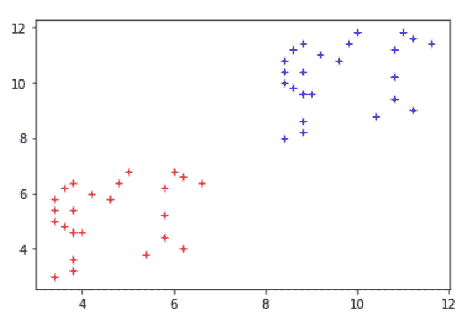
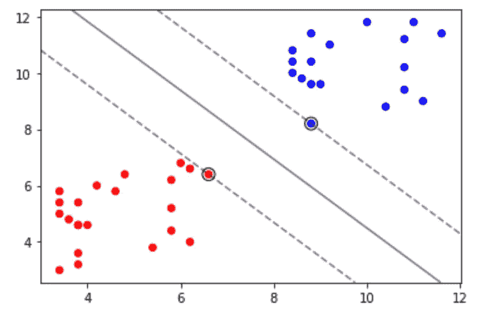
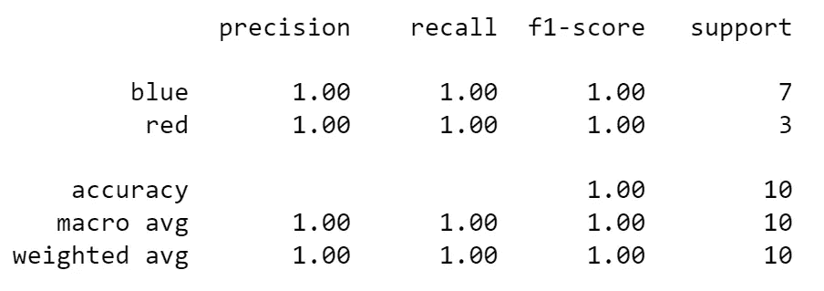

# 来自 scikit-learn 的支持向量机实用介绍

> 原文：<https://towardsdatascience.com/a-practical-introduction-to-support-vector-machines-from-scikit-learn-6e678cf1f228>

## UCL 数据科学学会研讨会 15:什么是支持向量机，如何实现它们，以及如何评估它们


由 [Unsplash](https://unsplash.com?utm_source=medium&utm_medium=referral) 上的 [Pietro Jeng](https://unsplash.com/@pietrozj?utm_source=medium&utm_medium=referral) 拍摄

UCL 数据科学系列的第十五个研讨会是 Python 数据科学研讨会系列的一部分，涵盖了使用 Scikit-learn 进行分类的支持向量机。在本次研讨会中，我们将讨论什么是支持向量机，如何实现它们，以及如何评估它们。一如既往，这篇博客文章是整个研讨会的总结，可在[这里](https://github.com/UCL-DSS/svm-workshop)找到，它更详细地涵盖了这些主题，还涵盖了多类分类和非线性决策边界。

## 什么是支持向量机？

支持向量机是一种算法，通常用于对数据进行分类，因此与决策树或随机森林算法属于同一类别和用例。这意味着它是受监督的机器学习算法组的一部分，借此我们有了一个可以瞄准的明确目标。

支持向量机算法的具体工作原理是试图找到一个界限，将您试图找到的两个或更多不同的类分开。在这样做时，该模型可用于预测，通过找到点可能位于边界的哪一侧，从而找到该点可能属于哪个组。

使用该算法的优点包括:

*   它在高维空间中是有效的
*   当维数超过样本数时，它仍然可以使用
*   它是通用的，因为可以为决策函数指定不同的核函数(组织决策边界的方式),包括您自己的核函数

## 支持向量机实现

我们将用来训练和测试算法的数据集是基于一个人造的红点和蓝点数据集，可以在下面看到。

```
# Splits rows based on the colour in the "Colour" column
red = df.loc[df["Colour"] == "red"]
blue =  df.loc[df["Colour"] == "blue"]# Plots the red data and the blue data
plt.plot(red["x"],red["y"],"r+")
plt.plot(blue["x"],blue["y"],"b+")
```



作者图片

我们在这里可以看到两组明显不同的红点和蓝点，它们在理论上可以代表各种不同的群体，例如不同的血型，项目是否成功，不同的消费群体。

虽然对于这些数据点，我们可以通过肉眼指定一个新的数据点，但是对于更高维度的数据、大量的点或者即使我们有更多的组，这也会变得更加困难。在这种程度上，我们可以实现支持向量机算法，看看它在这样一个简单的数据集上如何表现，以便我们可以在更复杂的情况下理解和实现它。

对于这一点，就像大多数数据科学项目一样，我们可以将数据分成测试和训练数据集，以便我们可以看到模型如何对我们知道结果的看不见的数据进行操作。这可以通过以下方式实现:

```
from sklearn.model_selection import train_test_split# Independent variables
X = df.drop("Colour", axis=1)# Dependent variable 
y = df["Colour"]# Allocates 80% of the data for training and 20% for testing
X_train, X_test, y_train, y_test = train_test_split(X,y, test_size=0.2)
```

然后，我们可以考虑在训练数据集上训练模型，然后使用该模型来查看它在测试数据集上的表现。为此，我们使用`scikit-learn`库定义创建算法，其中我们将分类器`clf`定义为`clf = svm.SVC(kernel = “linear")`，其中`SVC`代表支持向量分类器。在这里，`kernel="linear"`参数指定我们想要一个线性的决策边界。训练该算法包括如下确定两个组之间的分离边界:

```
from sklearn import svm# Chooses the support vector machine algorithm for our classifier
clf = svm.SVC(kernel = "linear")# Training the classifier
clf_trained = clf.fit(X_train,y_train)# Scoring the classifier
clf_trained.score(X_train,y_train)#out:
1.0
```

我们可以看到，在训练数据集上，我们有完美的准确性。

## 支持向量机评估

但是这种模式是如何运作的呢？我们可以尝试通过从模型中提取决策边界并将其与训练数据一起绘制来了解该模型是如何工作的，如下所示:

```
plt.scatter(X_train["x"], 
            X_train["y"], 
            c=y_train, s=30, cmap=plt.cm.Paired)# plot the decision function
ax = plt.gca()
xlim = ax.get_xlim()
ylim = ax.get_ylim()# create grid to evaluate model
xx = np.linspace(xlim[0], xlim[1], 30)
yy = np.linspace(ylim[0], ylim[1], 30)
YY, XX = np.meshgrid(yy, xx)
xy = np.vstack([XX.ravel(), YY.ravel()]).T
Z = clf.decision_function(xy).reshape(XX.shape)# plot decision boundary and margins
ax.contour(
    XX, YY, Z, colors="k", levels=[-1, 0, 1], alpha=0.5, linestyles=["--", "-", "--"]
)
# plot support vectors
ax.scatter(
    clf.support_vectors_[:, 0],
    clf.support_vectors_[:, 1],
    s=100,
    linewidth=1,
    facecolors="none",
    edgecolors="k",
)
plt.show()
```



作者图片

从图中我们可以看到，决策边界沿着上图中的实线，虚线代表模型中的边界。

然后，我们可以使用来自`scikit-learn`的分类报告在决策树和随机森林研讨会中评估模型。这可以通过以下方式实现:

```
#import the necessary functions
from sklearn import metrics#extract the predictions of the model
test_pred_svm = clf_trained.predict(X_test)#print the classification report
print (metrics.classification_report(y_test, test_pred_svm))
```



作者图片

正如我们所看到的，由于我们有一个相对简单的数据集，边界清晰，我们可以看到，该模型在预测未知数据集方面是完美的，正如我们所预期的那样。

因此，您可以相对容易地在二维上实现具有线性决策边界的支持向量机。当然，现实永远不会那么简单，因此在研讨会中，我们还将讨论如何对目标群体以外的数据进行分类，以及如何实施不同的内核来表示不同的决策界限。您可以在我们的 GitHub 资源库中找到它和问题表:

[](https://github.com/UCL-DSS/svm-workshop) [## GitHub-UCL-DSS/SVM-研讨会

### 欢迎参加我们的第七届 Python 系列数据科学研讨会！作者:塔尼亚·图尔迪安，科学执行官，UCL 数据…

github.com](https://github.com/UCL-DSS/svm-workshop) 

如果您错过了之前的任何一场研讨会，可以在这里找到后三场研讨会:

[](/how-to-implement-and-evaluate-decision-tree-classifiers-from-scikit-learn-36ef7f037a78) [## 如何实现和评估来自 scikit-learn 的决策树分类器

### UCL 数据科学学会研讨会 13:什么是决策树，决策树的实现，可视化和…

towardsdatascience.com](/how-to-implement-and-evaluate-decision-tree-classifiers-from-scikit-learn-36ef7f037a78) [](/non-linear-regression-with-decision-trees-and-random-forest-afae406df27d) [## 决策树和随机森林的非线性回归

### UCL 数据科学协会研讨会 12b:决策树和随机森林在 Python 中的实现及性能…

towardsdatascience.com](/non-linear-regression-with-decision-trees-and-random-forest-afae406df27d) [](/an-introduction-lasso-and-ridge-regression-using-scitkit-learn-d3427700679c) [## 使用 scitkit-learn 介绍套索和岭回归

### UCL 数据科学学会 12a 研讨会:偏差-方差权衡，套索实施，山脊实施，及其…

towardsdatascience.com](/an-introduction-lasso-and-ridge-regression-using-scitkit-learn-d3427700679c) 

如果你想了解 UCL 数据科学协会和其他优秀作者的最新信息，请使用我下面的推荐代码注册 medium。

[](https://philip-wilkinson.medium.com/membership) [## 通过我的推荐链接加入媒体-菲利普·威尔金森

### 作为一个媒体会员，你的会员费的一部分会给你阅读的作家，你可以完全接触到每一个故事…

philip-wilkinson.medium.com](https://philip-wilkinson.medium.com/membership)