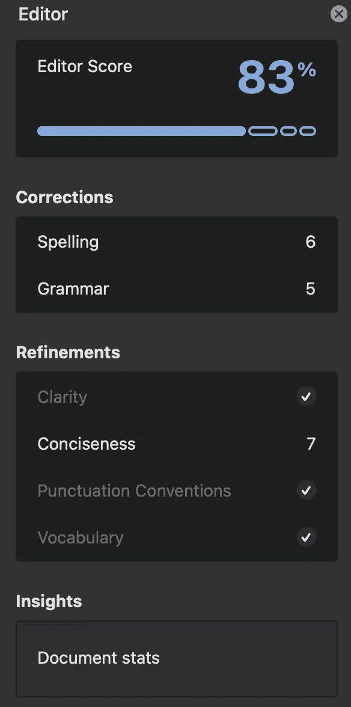

# 提高数据素养的实用步骤

> 原文：<https://towardsdatascience.com/a-practical-step-for-improving-data-literacy-ae9517d749f5>

## 让我们让数据科学写作更具可读性

埃利奥特·雷纳在 [Unsplash](https://unsplash.com?utm_source=medium&utm_medium=referral) 上的照片

我最近了解到一个评估写作可读性的指标:Flesch 阅读容易度评分。它是在 20 世纪 40 年代开发的，但对我来说是新的。作为一名从数据从业者转为作家的人，我喜欢有一个具体的公式来评估一篇文章的可读性。

Flesch 轻松阅读的公式如下:

> RE = 206.835 — (1.015 *总字数/总句子数)— (84.6 *总音节数/总字数)[ [1](https://readable.com/readability/flesch-reading-ease-flesch-kincaid-grade-level/#:~:text=The%20Flesch%2DKincaid%20Grade%20Level%20is%20equivalent%20to%20the%20US,schooling%20age%2013%20to%2014.) ]

分数范围从 0 到 100，0 最不可读，100 最可读。我发现了这个指标，因为现在在微软 Word 的编辑器部分，你可以点击文档统计。它会显示你文章的各种统计数据，包括阅读容易度。

Mac 上的 Microsoft Word 编辑器面板(作者截图)

带着公式、计算器和强烈的使命感，我开始评估自己作品的可读性。

## 我的最新文章怎么样？

我从分析我最新的技术文章开始， [*你怎么知道你的分析是“正确的？”*T9*。*我在 Medium 上的目标之一是拥有一个面向初学者的数据科学博客。然而，我发现我的文章可读性分数为 51.9——大约是 11 年级的阅读水平。我发现对于大多数读者来说，你的写作的推荐目标分数是 70-80。所以我的文章…不可怕，但不是最容易理解的。(Word 女士还推荐了 7 处提高简洁性的编辑——哎哟。)](/how-do-you-know-your-analysis-is-right-3399f7c48971)

记录“你如何知道你的分析是正确的？”(作者截图)

如果你感到好奇，以下是可读性分数大致对应的等级:

*   **90–100:**五年级阅读水平
*   **80–90:**六年级阅读水平
*   **70–80:**七年级阅读水平
*   **60–70:**八年级和九年级阅读水平
*   **50–60:**高中阅读水平
*   **30–50:**大学生阅读水平
*   **10–30:**大学毕业生阅读水平
*   **10 或更低:**具有高等大学学位的专业人士或读者[ [2](https://nira.com/flesch-reading-ease/)

虽然你可能有一个大学学位，但你不希望总是在大学水平上阅读。《杀死一只知更鸟》的阅读成绩水平为 4.7(介于 4-5 年级之间)，《了不起的盖茨比》的阅读成绩水平为 5.5 [ [3](https://readable.com/blog/popular-fiction-and-readability/#:~:text=According%20to%20George%20Klare%2C%20a,reads%20at%20around%20grade%209.) ]。你不需要复杂的语言来涵盖复杂的故事或主题。仅仅因为你能在小学读一些东西并不意味着它现在不会是令人愉快的。

## 这与数据素养有什么关系？

数据领域可能令人生畏。随着不断变化的技术和日益复杂的模型，一些人甚至不愿意开始学习基本面。但是，随着组织生成越来越多的数据，数据素养变得至关重要。

照片由[this engineering RAEng](https://unsplash.com/@thisisengineering?utm_source=medium&utm_medium=referral)在 [Unsplash](https://unsplash.com?utm_source=medium&utm_medium=referral)

我们如何向所有类型的业务人员解释数据的价值、力量和最佳实践？使教育内容清晰简洁。

公司的每个人都能从理解数据中受益。我不想劝阻任何人学习，因为即使是最基本的也很难读懂。所以，从现在开始，我会用“肉感阅读容易度”来评估我的文章。我想一直寻找一种更简单的方式来解释技术概念，推动自己将数据科学提炼为最基本的部分，以面向广大受众。

## 最后

关心数据素养包括仔细的交流。我希望看到一个没有人被数据世界吓倒的未来。在那里，我们可以在关于人工智能、机器学习和数据分析的讨论中获得更多样化的观点。人们觉得数据赋予了他们力量，而不是沮丧。每个人都有数据。

附:这篇文章的阅读难度分数是 60.3。可读性大约提高了 14%!

想了解更多关于数据素养的知识吗？查看我最近关于这个主题的文章:

 [## 什么是数据素养？

### …为什么它很重要？

towardsdatascience.com](/what-is-data-literacy-9b5c3032216f)