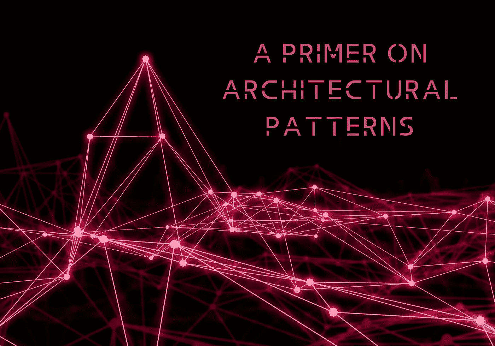
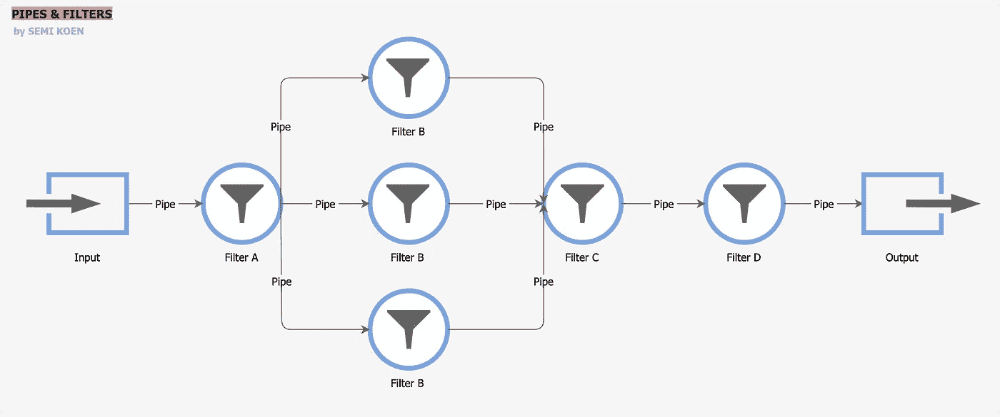
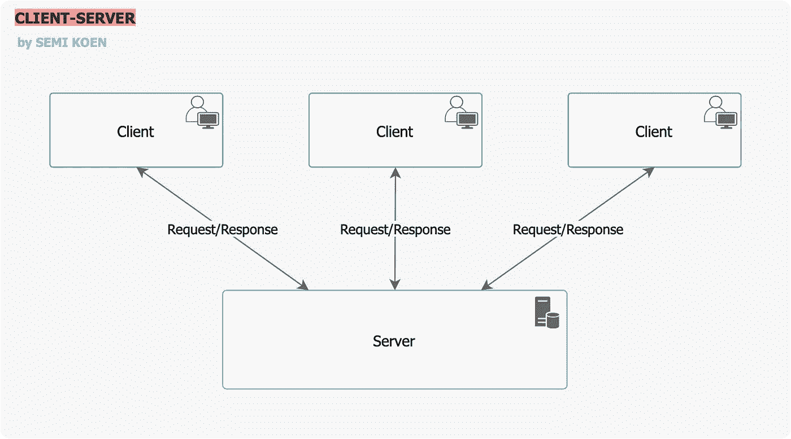
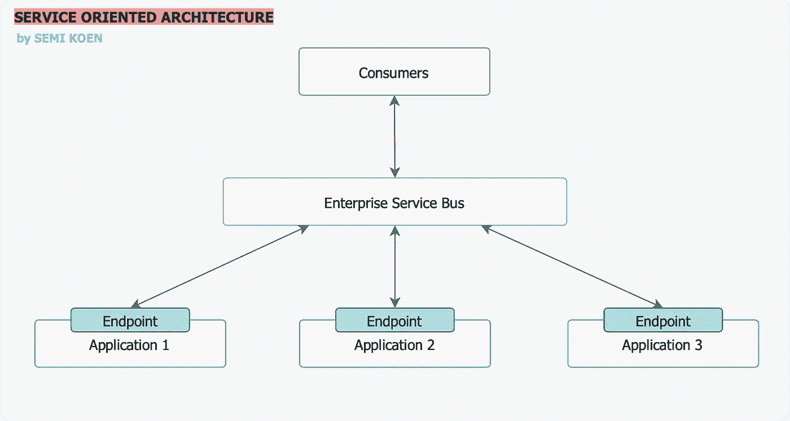
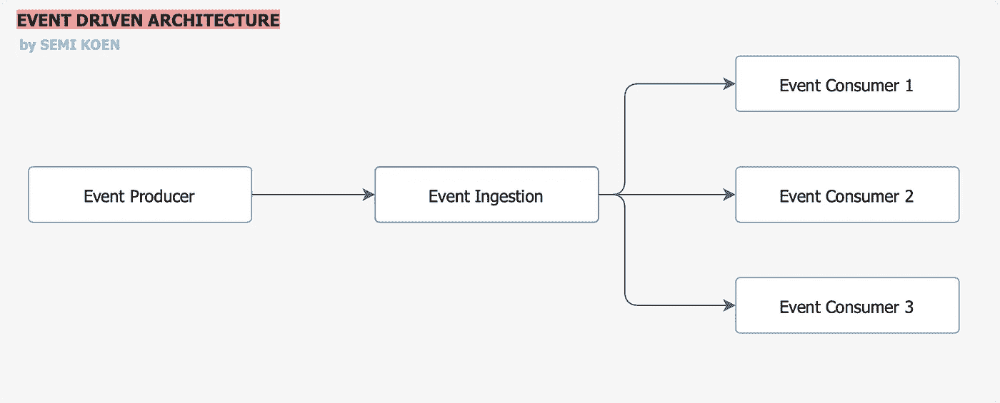
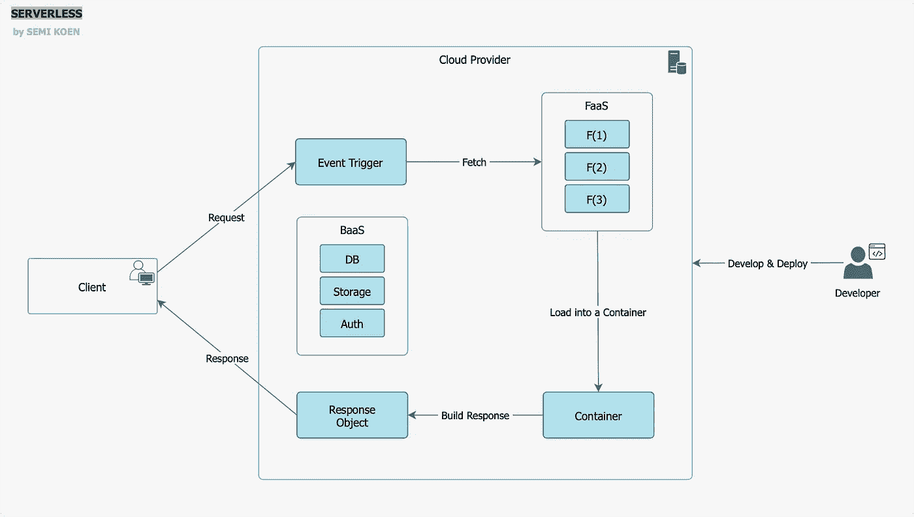
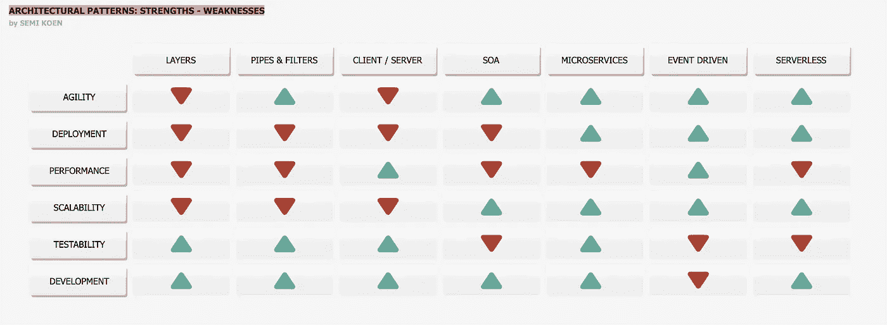

# 建筑模式入门

> 原文：<https://towardsdatascience.com/a-primer-on-architectural-patterns-fd1b22a4389d>

## 你需要知道的 7 大软件架构模式



作者图片

**大泥球**指的是缺乏任何结构设计的架构，因此导致复杂、紧密耦合和相互依赖的代码。

不幸的是，这是最流行的软件设计方式，它的普遍采用通常是无意的。它的出现是由于普遍缺乏对架构原则的理解、无纪律的开发实践、零碎的增长以及随着时间的推移技术债务的积累。


蜣螂由 [Pixabay](https://pixabay.com/photos/scarab-beetle-god-shit-italy-2490586)

你知道这种系统…我们都知道！！！

更可怕的是，这些系统构成了现实世界中软件的重要部分！但是有一种解决方法:架构模式！

一个**架构模式**是一个特定问题的可重用解决方案，帮助定义应用程序的基本特征和行为。为你的问题选择正确的模式，你可以避免重新发明轮子和潜在的讨厌的陷阱，如果你试图提出一个新的解决方案，它们可能会引起麻烦。

让我们探索七种最常见的模式，每个开发人员、架构师或数据科学家都需要熟悉这些模式。

# 1⃣ —层

Layers 模式是最常用的(也是最被滥用的)模式之一，它依赖于将代码划分为不同的、独立的层，这减少了它们之间的耦合。每一层都被标记为 **closed** ，这意味着一个请求必须通过它正下方的层才能到达下一层。它也有自己的职责，提供**级别的隔离**，因为它使我们能够在不影响其他层的情况下修改一层的组件。

```
➕ **Strengths:** It is conceptually easy to implement and the layers are clearly implemented and represented in the code. It promotes separation of concerns, maintainability, reusability and testability.➖ **Weaknesses:** Each layer introduces abstractions between the highest and lowest layers which can increase the complexity and the performance of the application and can cause what is known as the 'architecture sinkhole' anti-pattern, where requests flow through multiple layers as simple pass-through processing with little or no logic performed within each layer. It can also lead to a monolithic application that is hard to split afterwards.
```

这种模式有许多变体，但通常有四层:表示/UI 层、服务层、业务逻辑/领域层、数据访问层。它也是其他主要模式的灵感来源，例如 **MVC** (模型、视图、控制器)。


层

# 2⃣——管道和过滤器

在管道和过滤器模式中，每个过滤器负责一个数据操作或转换。数据通过管道从一个过滤器**流到下一个过滤器**，并且操作并行发生。这意味着筛选器在可用时立即产生输出，而不是等到所有输入都被消耗掉。过滤器是松散耦合的，因此它们可以被重用和重新组装以创建新的管道。

这种模式的典型用法是 Unix 管道命令。

```
➕ **Strengths:** It promotes performance, reusability/composition, and extensibility.➖ **Weaknesses:** Reliability can be an issue as if one component fails, the issue is propagated across the pipeline, but can be controlled by having filters for error handling. The parallel running nature of this paradigm can be computationally expensive and can even result in deadlocks when one filter cannot produce output before it processes all the input (e.g. sort operation)
```

批处理顺序模式类似于管道和过滤器，主要区别在于前者不是流式传输数据，而是通常将所有数据写入磁盘供下一阶段读取——相当老派:)。



管道和过滤器

# 3⃣ —客户端-服务器

在客户机-服务器模式中，系统的功能被组织成服务，每种类型的服务由单独的服务器提供。客户端访问服务器来使用这些**服务**。

服务器一直在监听客户端的请求。一旦接收到请求，服务器通过特定的协议打开与客户机的连接，处理请求并作出响应。请求的发送超越了进程和机器的界限，这意味着客户机和服务器可能位于不同的机器上。

```
➕ **Strengths**: Having a set of shared and distributed services makes it easier to manage, modify, and reuse software modules. Provides interoperability as client-server applications can be built irrespective of the platform, topology or technology stack.➖ **Weaknesses**: The server can get overloaded when there are too many requests, causing a performance bottleneck and can become a single point of failure.
```

一个 **REST** (表述性状态转移)架构是一个客户端-服务器架构，其中客户端通过一个统一的接口与服务器分离，服务器提供可寻址的端点(例如，通过一个 URL ),并且通信是无状态的(没有从先前的请求延续的信息或内存)。REST APIs(应用程序编程接口)是基于 web 的应用程序的行业标准。



客户端-服务器

# 4⃣——面向服务的架构(SOA)

对于一些组织来说，SOA 是取代单一应用程序的垫脚石，提供了一个更加灵活敏捷的环境。它提供了一组模块化服务，这些服务可以相互“交谈”以支持应用程序及其部署。

服务接口提供松散耦合，这意味着可以在很少或根本不知道集成是如何实现的情况下调用它们。传统上，SOA 包含一个**企业服务总线** (ESB)作为协调和控制这些服务的手段。

```
➕ **Strengths**: SOA produces interoperable, loosely coupled systems that are easier to maintain and scale, and as such it reduces the total cost of ownership (TCO). It also allows IT to respond to the changing market conditions by delivering software in an agile way.➖ **Weaknesses**: To achieve service integration, the ESB must oversee the messages from start to destination, which results in reduced overall performance. Also determining the version of a SOA system is not possible without knowing what services were running at a snapshot in time.
```

并非所有的应用程序都适合这种类型的架构，例如需要严格执行响应时间的情况。



面向服务的架构

# 5⃣ —微服务

微服务架构模式采用构建小型的、**专用的**和**自包含的**服务的方法，这些服务相互通信以使整个系统工作。每个服务都是独立部署的，因此提供了高度的解耦性，并且在保持与其他服务的清晰接口/契约的同时，还可以自主发展。

DevOps 可用于帮助组织从 SOA 过渡到微服务，因为后者通常在容器中运行，这使得它们更具可伸缩性和可移植性。

```
➕ **Strengths**: It promotes highly reusable, maintainable and (unit) testable services which are independently deployable. They provide improved fault isolation as failure of one microservice does not affect the working of others. With the polyglot APIs, developers can easily choose the best technologies and languages based on their needs.➖ **Weaknesses**: Complex communication between the services makes testing their interactions more difficult. Increased effort is required to catalogue, test, and fix version (in)compatibilities.
```

微服务提供的 API 的粒度通常与客户的需求不同。在这些情况下，实现了一个 **API 网关**，它是所有客户端的单一入口点，并以两种方式之一处理请求:要么简单地将请求路由到适当的服务，要么甚至将请求编排到多个服务。


微服务

# 6⃣ —事件驱动架构(EDA)

事件驱动架构是最常见的**异步**模式，它以描述事件及其处理(即事件的产生、检测和消费)的消息为中心。事件是**不可变的**(即它们不能被改变或删除)，并且它们是按时间顺序排列的。它们用于在服务之间实时触发或通信(即服务不轮询更新而是接收更新)。

事件可以通过多种方式发布，最常用的两种方式是:

⇾到**消息队列**，保证将事件交付给适当的消费者，或者
⇾到**代理**，其中事件不针对某个接收者，但是允许所有感兴趣的当事人(也就是订户)访问“主题”。发布/订阅消息系统通常被描述为**事件流架构**。

```
➕ **Strengths**: Provides asynchronous communication which allows for events to be queued or buffered and hence avoids blocking. In case of a fault, lost work is recovered by ‘replaying’ events from the past. Broker dependant, it can promote availability, reliability and scalability.➖ **Weaknesses**: Because of its asynchronous nature EDA systems must carefully handle inconsistent or duplicate events or incompatible versions. Also, they do not support ACID transactions.
```

EDA 中最流行的实践之一被称为 **CQRS** (命令查询责任分离)，它允许使用不同的模型来更新和读取域数据。

处理事务原子性的另一个重要实践是**事件源**，其中从不直接对数据执行更新和删除；更确切地说，实体的状态变化被保存为一系列事件——这使得能够在任何时间点重建应用程序的状态。

```
**💡** The EDA was further standardised with the [**Reactive Manifesto**](https://www.reactivemanifesto.org) which calls out for designing systems that have these 4 characteristics: Responsive, Resilient, Elastic and Message Driven.
```



事件驱动架构

# 7⃣ —无服务器

上面描述的所有架构都有一个共同点:它们对基础设施的依赖。

在无服务器架构中，云提供商可以轻松地按需管理服务器供应。应用程序托管在容器中，并部署在**云中**。开发人员不必担心规划服务器的资源(内存、CPU、IO)或设计这样一种拓扑结构来实现高可用性和可自动扩展的应用程序，云提供商通过虚拟化运行时和运营管理来解决这一问题。因此，这样的提供商通常根据请求的总数、特定时期内请求的频率或服务所有请求所花费的总时间来对他们的客户收费。

```
➕ **Strengths**: Freedom from infrastructure planning; cost-effectiveness as the pricing is dependent on the number of executions; ease of deployment and continuous delivery.➖ **Weaknesses**: Serverless is still in its infancy as a technology and there is a small knowledge base amongst the IT community. Vendor lock-in is a high risk as migrating from one platform to another is difficult. Debugging is complex due to the reduced visibility of the backend processes. Serverless is not efficient for long-running processes (dedicated servers or virtual machines are recommended).
```

无服务器包含两个不同但重叠的领域:

⇾功能是一种服务( **FaaS** ):运行在短暂容器中的定制代码。
⇾后端即服务( **BaaS** ):在后端方面严重依赖第三方服务的应用程序(例如数据库、云存储、用户身份验证等)。



无服务器

# 结束语

没有适用于所有项目的通用架构，因此理解架构模式的优点和缺点，以及一些最常见的设计决策是创建最佳设计的重要部分。同样值得注意的是，这些模式并不相互排斥；事实上，它们是相辅相成的！

> "架构是你希望在项目早期就能正确做出的决策."拉尔夫·约翰逊

我希望这篇文章是你学习之旅的良好起点。下面的矩阵总结了上面探讨的模式:



架构模式:优势——劣势

感谢阅读！

*我经常在媒体上写关于领导力、技术&的数据——如果你想阅读我未来的帖子，请*[*‘关注’我*](https://medium.com/@semika) *！*