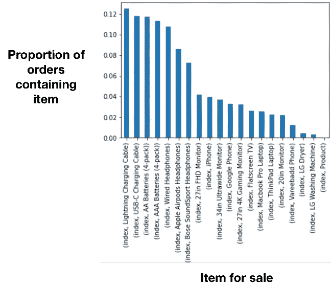

# Python 中关联分析的快速入门实用指南

> 原文：<https://towardsdatascience.com/a-quickstart-practical-guide-to-association-analysis-in-python-2ca1d53f8574>

## 初学者友好的教程与一个工作的例子

关联分析使用户能够发现数据中隐藏的关系。照片由 [JJ 英](https://unsplash.com/@jjying?utm_source=medium&utm_medium=referral)在 [Unsplash](https://unsplash.com?utm_source=medium&utm_medium=referral)

我最近完成了 DataCamp 的关联分析课程(由 Isaiah Hull 教授)，这是他们在[市场分析](https://app.datacamp.com/learn/skill-tracks/marketing-analytics-with-python)【1】的技能专门化课程的一部分。到目前为止，这个资源是我遇到的最实用的教程之一，值得一个很好的评论，所以感谢所有的贡献者！这篇博文只是我所学的一个总结，也是在处理任何形式的零售/交易数据时开始处理关联分析问题的一个简单方法。这不是对关联分析中理论概念的广泛回顾，这超出了本文的范围。

# 什么是关联分析？

关联分析使企业能够理解其数据中隐藏的关系[参见 2–4 了解更多关于该主题的介绍]。通常，这种类型的分析用于发现频繁同时发生的事件。例如，当我登录亚马逊这样的在线零售平台购买 MacBook 电脑时，我发现那些相同的用户也购买 AirPods。因此，如果我的任务是向这家在线零售商建议哪些产品可以与 macbook 交叉销售，我会告诉他们，将 macbook 和 AirPods 放在一起营销可能有助于提高这两种产品的销量。然而，这种事件是否偶然发生并不总是显而易见的，因为两者都是受欢迎的商品，也许这对零售商来说太明显了。在投入营销资金一起促销这两种商品之前，需要确信一起销售比单独销售更有效。

将 AirPods 和 MacBooks 配对在一起是从零售交易数据中得出的关联规则的一个例子。然而，对于公司来说，手动识别有意义的关联规则并不容易，因为数据的数量很大且很复杂。即使一个小零售店只有 40 件商品，并且想要找出如何在他们的在线商店上最好地放置成对的商品，他们也有 780 个可能的配对可以采用，假设他们只想一次交叉销售两件商品(=n！(n-r)！r=！40!(40–2)!2!= 780)[5–6].

# 在 Python 中用 pandas 和 mlxtend 包开始关联分析的 4 个简单步骤

本节提供了 4 个简单的步骤来开始使用 python 进行关联分析，并提供了一个实际的例子。我的 Kaggle [笔记本](https://www.kaggle.com/purswaninuri/association-analysis)和完整代码贴在文章底部。我使用的样本数据集是 [Kaggle 的电子商务](https://www.kaggle.com/datasets/knightbearr/sales-product-data)资源之一，包含电子产品的历史销售交易。

1.  **描述您的数据，并使用 OneHot 编码对其进行重组**

该过程的第一步是理解数据集(有多少事务，有多少列)，并将其组织成一种更易于分析的格式。然后，我确定我要分析的项目销售(产品)的列。

阅读并描述来自 Kaggle 的数据集:[https://www . ka ggle . com/datasets/knightbearr/sales-product-data](https://www.kaggle.com/datasets/knightbearr/sales-product-data)

这是上面代码片段的输出。“产品”列包含单个项目。一个订单中可以销售多种商品。在这个分析中，我们忽略了数量、价格和日期。有 17538 个唯一订单。

其次，我应用[一键编码](https://machinelearningmastery.com/why-one-hot-encode-data-in-machine-learning/)将每个订单 ID 表示为一个唯一的行，每列表示一个唯一的项目。我忽略了 quantity ordered 列，如果一个给定的项目在该订单中销售，则该订单的值为“True ”,否则为“False”。实际上，一个订单可以包含多个不同的项目，也可以包含一个项目的多个订单，但这里我简化了这个问题。

重新构建的数据集，其中每个订单 ID 存储为一行，每列包含一个 True/False 值，用于描述商品是否售出。

**2。确定项目的概率(支持频率)**

在本例中，支持频率是任何单个项目的销售次数(这里我们只对每个订单的每个项目计数一次)除以交易或订单的总数。在这个数据集中，有 17，538 个不同的订单，我观察到 USB 电缆、电池和耳机是最常见的销售项目。这种洞察力能否帮助零售商通过将不太频繁销售的商品与这些高频率、低成本的电子产品搭配起来，提高它们的销售？考虑到这一点，哪些产品可以搭配使用？

每个项目的支持(y 轴)是销售特定项目的总订单的比例。闪电充电和 USB-C 线似乎很受欢迎。N = 17538 个订单。

**3。使用** [**先验方法**](https://en.wikipedia.org/wiki/Apriori_algorithm#:~:text=Apriori%20is%20an%20algorithm%20for,sufficiently%20often%20in%20the%20database.)**【7】**计算潜在项目配对以识别有意义的规则

决定哪些产品可以一起销售的一种方法是计算所有可能的商品对(假设我们想一次销售 2 个)，并计算出各种指标，如在单独销售这些产品的交易中的信心和提升[8–9]。在这种情况下，很容易计算关联规则的所有组合，因为只有 20 种独特的商品要出售。但是，随着项目数量的增加，不可能计算所有的可能性。

理论上，应该选择更频繁地同时出现的项目对，但是需要证明这种配对不是由于个别项目非常受欢迎而偶然出现的。这就是为什么提升指标使零售商能够计算一起销售的两种商品相对于单个商品的支持度。如果 lift > 1，这意味着将这些物品搭配在一起可以促进销售，如历史数据所示。

工作示例(模拟数据)——计算 Airpods 和 Macbooks 搭配销售相对于单独销售的优势。lift > 1，这意味着将两个项目捆绑在一起可能对业务有利。

然后，我将 apriori 方法[7]应用于数据集，以确定最有意义的规则，如下面的代码片段所示。为了降低计算复杂性，apriori 方法丢弃了支持频率低的规则，从而留下了基于其频繁出现来提供更高销售提升的组合。apriori 方法采用先行项(例如 USB-C 电缆)和后续项(例如 Google Phone ),并计算关联规则的可能组合及其各自的置信度、提升度、杠杆和确信度。定义每个指标超出了本文的范围，但是我在本教程中根据 apriori 方法的输出得出了一些结论。

使用 python 的 mlxtend 库在步骤 1 中创建的 OneHot 编码熊猫数据帧上运行 apriori 算法。

上面代码片段的关联分析输出。用 python 的 mlxtend apriori 方法进行关联分析。每一行都是一个关联规则。用于评估每个关联规则有效性的示例输出结果和度量。

**4。总结对业务利益相关者的建议**

作为数据科学家，我们可以为我们的客户执行这种分析，客户可以是电子商务零售商，也可以是我们与其他内部团队合作的内部项目。因此，以一种商业友好的可消费的方式总结发现是至关重要的。

来自这些关联规则的建议有些直观。apriori 方法表明，当 iphones 与 lightning 充电线或谷歌手机与 USB-C 线配对时，提升了 1.4-1.5 倍。然而，这些规则似乎很明显，因为你每次买手机都需要一个充电器。因此，这并不意味着因果关系，即使规则显示交易有意义的提升。

因此，有必要将对数据的理解与更多的上下文联系起来，并从业务涉众那里获得一些关于他们试图从数据中回答的任何问题的指导。除此之外，用户可能希望查看其他指标，如销售价格、销售量和其他维度，如客户来源或购买日期，以确定是否有其他因素会影响活动的成功。

# 结论

尽管这绝不是对关联分析的全面介绍，但本文的目标是提供实用的示例和代码，以便快速开始处理与业务相关的问题。但是数据分析和处理只是故事的 50%,因为通过数据洞察向企业提供有意义的建议需要商业敏锐度、常识和将洞察转化为非技术利益相关者。

# 我在 Kaggle 上的示例代码和数据集

注意:除非另有说明，本文中的图片都是我的原创作品。

    

# 粘贴在下面的完整代码:

完整的代码粘贴在这里。关于工作版本，请查看我的 Kaggle 笔记本:[https://www . ka ggle . com/code/purswaniuri/association-analysis](https://www.kaggle.com/code/purswaninuri/association-analysis)

# 参考

1.  Python 中的营销分析，2022 年 10 月 21 日访问:[https://app . data camp . com/learn/skill-tracks/marketing-Analytics-with-Python](https://app.datacamp.com/learn/skill-tracks/marketing-analytics-with-python)
2.  关于关联分析的更多技术定义的伟大博客，2022 年 10 月 21 日访问:[https://towardsdatascience . com/association-analysis-explained-255823 C1 cf9 a](/association-analysis-explained-255823c1cf9a)
3.  Vijay Kotu，Bala Deshpande，载于[数据科学(第二版)](https://www.sciencedirect.com/book/9780128147610/data-science)，2019:[https://www . Science direct . com/topics/computer-Science/association-analysis](https://www.sciencedirect.com/topics/computer-science/association-analysis)
4.  关联规则教程，2022 年 10 月 21 日访问:[https://www . kdnugges . com/2016/04/association-rules-apriori-algorithm-tutorial . html](https://www.kdnuggets.com/2016/04/association-rules-apriori-algorithm-tutorial.html)
5.  组合计算器，2022 年 10 月 21 日访问:【https://www.statskingdom.com/combinations-calculator.html 
6.  关于推荐系统的斯坦福讲座，2022 年 10 月 21 日访问:【http://infolab.stanford.edu/~ullman/mmds/ch9.pdf 
7.  Apriori 方法，2022 年 10 月 26 日访问:[https://en . Wikipedia . org/wiki/Apriori _ algorithm #:~:text = Apriori % 20 is % 20 an % 20 algorithm % 20 for，fully % 20 frequency % 20 in % 20 数据库](https://en.wikipedia.org/wiki/Apriori_algorithm#:~:text=Apriori%20is%20an%20algorithm%20for,sufficiently%20often%20in%20the%20database)。
8.  信心与提升，2022 年 10 月 26 日访问:[https://www . the data school . co . uk/Liu-Zhang/understanding-Lift-for-market-basket-analysis](https://www.thedataschool.co.uk/liu-zhang/understanding-lift-for-market-basket-analysis)
9.  信心与提升，2022 年 10 月 26 日获取:[https://select-statistics . co . uk/blog/market-basket-analysis-understanding-customer-behaviour/](https://select-statistics.co.uk/blog/market-basket-analysis-understanding-customer-behaviour/)