# 作为数据科学家使用 Git 命令的真实案例研究

> 原文：<https://towardsdatascience.com/a-real-world-case-study-of-using-git-commands-as-a-data-scientist-e7775cccb4ba>

## 数据科学

## 配有分支插图


照片由 [Praveen Thirumurugan](https://unsplash.com/@praveentcom?utm_source=medium&utm_medium=referral) 在 [Unsplash](https://unsplash.com?utm_source=medium&utm_medium=referral) 上拍摄

你是数据科学家。随着数据科学日益成熟，软件工程实践开始悄悄进入。您被迫走出本地的 jupyter 笔记本电脑，与其他数据科学家在野外会面，以构建一个伟大的产品。

为了帮助你完成这个宏伟的任务，你可以依靠 Git，一个免费的开源分布式版本控制系统来跟踪每个人正在编写的代码。

```
**Table of Contents** 
1\. [Git commands for setting up a remote repository](#4318)
2\. [Git commands for working on a different branch](#7d63)
3\. [Git commands for joining in collaboration](#6e24)
4\. [Git commands for coworking](#ce6b)
5\. [Resolving merge conflicts](#4993)
[Wrapping Up](#c3e3)
```

更具体地说，让我们用一个实际的项目来工作(参见这里的最终产品<https://github.com/dwiuzila/ds-project-example>*)。为了尽量减少创建一个的麻烦，我们将使用著名的 [Cookiecutter 数据科学](https://drivendata.github.io/cookiecutter-data-science/)。安装`cookiecutter`并在本地创建一个项目模板。*

**

*相应地填写提示。在我们的例子中，情况如下。*

```
*project_name [project_name]: Data Science Project Example
repo_name [example_project_name_here]: ds-project-example
author_name [Your name (or your organization/company/team)]: Albers Uzila
description [A short description of the project.]: A simple data science project, template by cookiecutter
Select open_source_license:
1 - MIT
2 - BSD-3-Clause
3 - No license file
Choose from 1, 2, 3 (1, 2, 3) [1]: 1
s3_bucket [[OPTIONAL] your-bucket-for-syncing-data (do not include 's3://')]:
aws_profile [default]:
Select python_interpreter:
1 - python3
2 - python
Choose from 1, 2 (1, 2) [1]: 1*
```

*通过运行以下命令，将您的工作目录更改为`ds-project-example`文件夹。*

*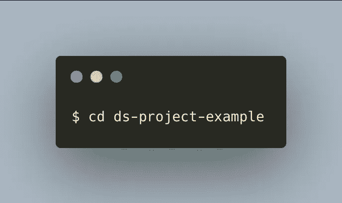*

# *1.设置远程存储库的 Git 命令*

*您现在在`ds-project-example`有一个本地项目。您需要将您的本地项目推送到 GitHub，以便与其他数据科学家合作。*

*为此，使用`git init`初始化一个空的 Git repo。您可以通过观察您的工作目录中有一个名为`.git`的隐藏文件夹或者通过运行`git status`来确认回购准备就绪。*

*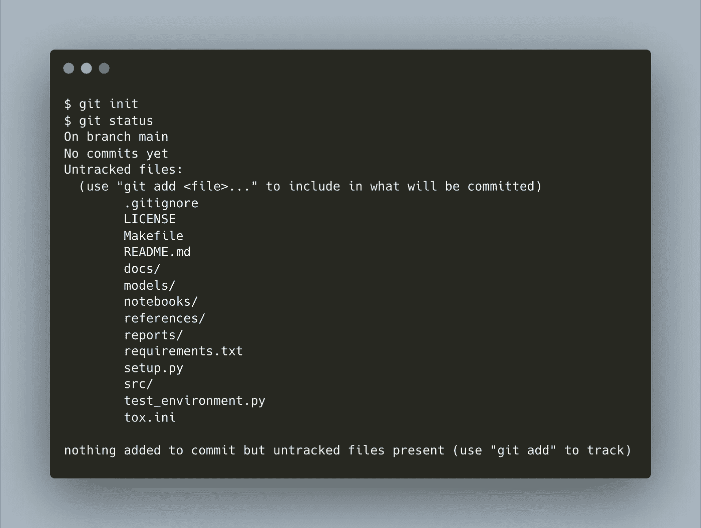*

```
*Your local:

⬤ main**
```

*如您所见，您正在一个名为`main`的分支上工作，并且有许多未被 Git 跟踪的文件。您可以使用`git add .`将所有这些文件添加到索引中，也就是您的工作目录中的文件和您的提交历史之间的“暂存区”。*

*要记录本地回购指数的变化，使用`git commit`。添加类似“使用 cookiecutter 设置 repo”的消息。*

*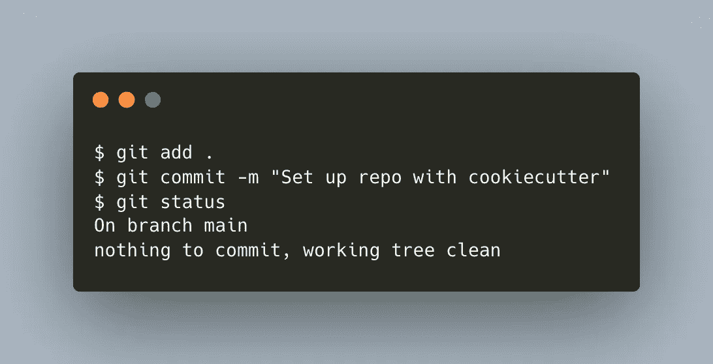*

```
*Your local:

⬤───⬤ main**
```

*现在，在[https://github.com/new](https://github.com/new)创建一个远程回购，并将其命名为`ds-project-example`。在将本地存储库推送到远程之前，您需要使用`git remote add`命令将远程存储库添加到存储本地存储库的目录中。*

*`git remote add`命令有两个参数:*

*   *一个远程名称，例如`origin`*
*   *一个远程 URL，在我们的例子中，是 https://github.com/dwiuzila/ds-project-example.git 的*

*运行`git remote add`命令后，你会在`.git/refs`文件夹中看到你现在有了一个本地头和一个名为`origin`的遥控器。*

*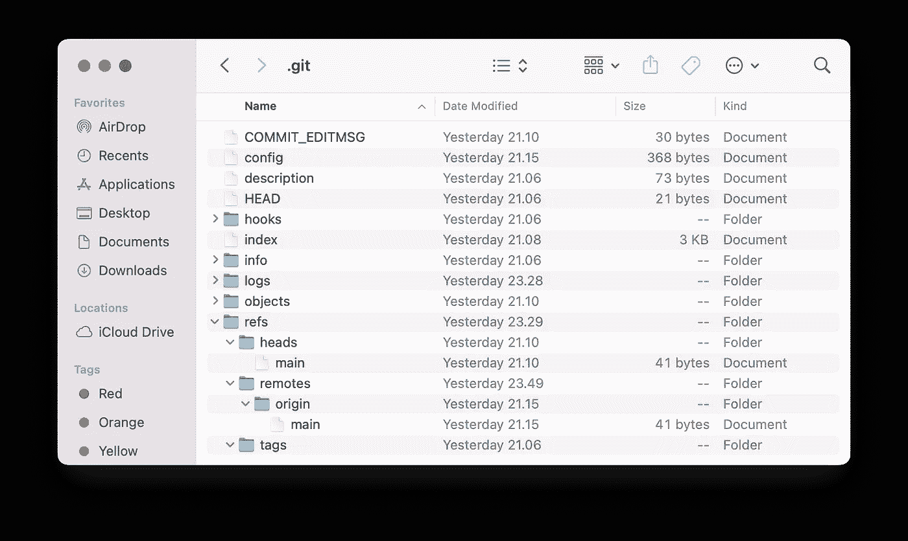*

*中的文件和文件夹。git 文件夹|图片作者[作者](http://dwiuzila.medium.com/membership)*

*现在，要将本地分支上的提交推送到远程 repo，使用`git push`。该命令有两个参数:*

*   *一个远程名称，例如`origin`*
*   *一个分支名称，例如`main`*

*总结一下:*

**

```
*Your local:

⬤───⬤ main*
        origin/main

Remote:

⬤───⬤ main*
```

*`git push`中的`-u`标志将您正在推送的分支(`origin/main`)设置为您正在推送的分支(`main`)的远程跟踪分支，因此 Git 知道您将来在推送/拉取分支时想要做什么。*

*完成所有这些之后，你的项目现在已经在 [GitHub](https://github.com/dwiuzila/ds-project-example) 上设置好了:*

*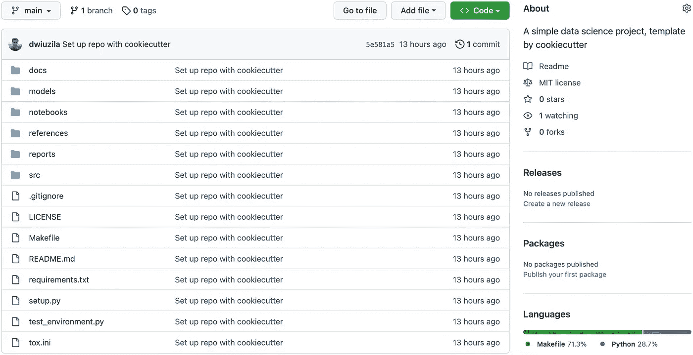*

*我们在 GitHub 上的远程知识库|图片由[作者](http://dwiuzila.medium.com/membership)提供*

```
*├── LICENSE
├── Makefile           <- Makefile with commands like `make data` or `make train`
├── README.md          <- The top-level README for developers using this project.
├── data
│   ├── external       <- Data from third party sources.
│   ├── interim        <- Intermediate data that has been transformed.
│   ├── processed      <- The final, canonical data sets for modeling.
│   └── raw            <- The original, immutable data dump.
│
├── docs               <- A default Sphinx project; see sphinx-doc.org for details
│
├── models             <- Trained and serialized models, model predictions, or model summaries
│
├── notebooks          <- Jupyter notebooks. Naming convention is a number (for ordering),
│                         the creator's initials, and a short `-` delimited description, e.g.
│                         `1.0-jqp-initial-data-exploration`.
│
├── references         <- Data dictionaries, manuals, and all other explanatory materials.
│
├── reports            <- Generated analysis as HTML, PDF, LaTeX, etc.
│   └── figures        <- Generated graphics and figures to be used in reporting
│
├── requirements.txt   <- The requirements file for reproducing the analysis environment, e.g.
│                         generated with `pip freeze > requirements.txt`
│
├── setup.py           <- makes project pip installable (pip install -e .) so src can be imported
├── src                <- Source code for use in this project.
│   ├── __init__.py    <- Makes src a Python module
│   │
│   ├── data           <- Scripts to download or generate data
│   │   └── make_dataset.py
│   │
│   ├── features       <- Scripts to turn raw data into features for modeling
│   │   └── build_features.py
│   │
│   ├── models         <- Scripts to train models and then use trained models to make
│   │   │                 predictions
│   │   ├── predict_model.py
│   │   └── train_model.py
│   │
│   └── visualization  <- Scripts to create exploratory and results oriented visualizations
│       └── visualize.py
│
└── tox.ini            <- tox file with settings for running tox; see tox.readthedocs.io*
```

# *2.用于处理不同分支的 Git 命令*

*您的`main`分支应该代表您代码的稳定历史。创建其他分支来试验新事物，实现它们，当它们足够成熟时，你可以将它们合并回`main`。*

*现在，要从本地`main`创建一个新的分支，使用`git checkout`。您可以使用`git branch`查看所有可用的分支以及您当前所在的分支。*

*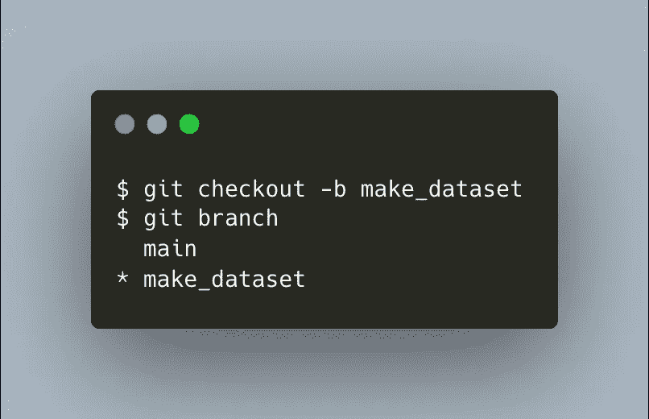*

```
*Your local:

⬤───⬤ main
        origin/main
        make_dataset*

Remote:

⬤───⬤ main*
```

*您已经创建了一个名为`make_dataset`的新本地分支，并签出了这个分支。在`make_dataset`上添加一些代码之后，您就可以添加、提交和推送变更到一个新的远程分支，也称为`make_dataset`和远程跟踪分支`origin/make_dataset`。你想推动的唯一改变是在`src/data/make_dataset.py`文件中。*

*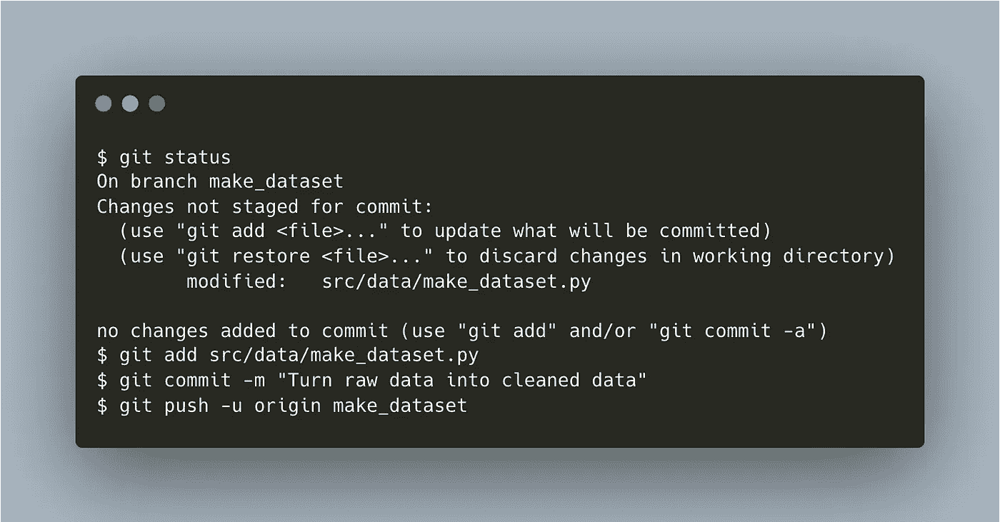*

```
*Your local:

⬤───⬤ main
      │ origin/main
      │
      └──⬤ make_dataset*
            origin/make_dataset

Remote:

⬤───⬤ main
      │
      └──⬤ make_dataset*
```

*你现在可以将远程`make_dataset`合并到远程`main`了，首先点击 GitHub 上的“比较&拉取请求”按钮，然后按照步骤操作。*

*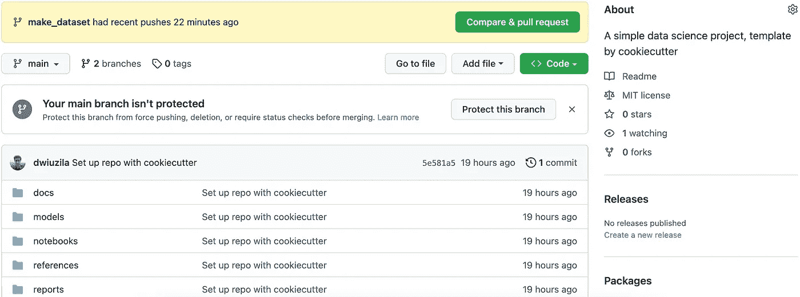*

*[作者](http://dwiuzila.medium.com/membership)比较和拉动请求分支|图片*

*成功合并后，会看到这样的东西。*

*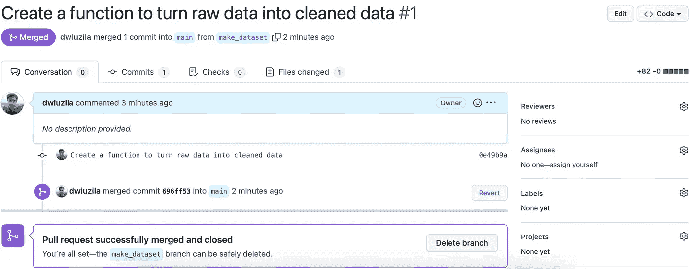*

*拉请求成功合并并关闭|图片作者[作者](http://dwiuzila.medium.com/membership)*

```
*Your local:

⬤───⬤ main
      │ origin/main
      │
      └──⬤ make_dataset*
            origin/make_dataset

Remote:

⬤───⬤──────⬤ main
      │      │
      └──⬤──┘*
```

# *3.用于加入协作的 Git 命令*

*你的项目又有了一个贡献者。假设他的名字是弘。首先，在您将远程`make_dataset`合并到远程`main`之前，Hiro 已经使用`git clone`克隆了您的远程回购。他还从克隆的回购协议中签出了自己的本地分支`train_model`。*

*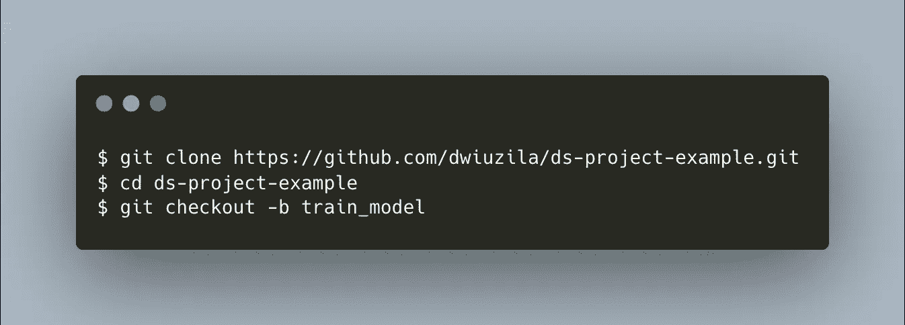*

```
*Your local:

⬤───⬤ main
      │ origin/main
      │
      └──⬤ make_dataset
            origin/make_dataset

Hiro's local:

⬤───⬤ main
        origin/main
        train_model*

Remote:

⬤───⬤──────⬤ main
      │      │
      └──⬤──┘*
```

*添加`src/configs/config.py`并与`src/models/train_model.py`一起编辑后，Hiro 生成:*

1.  *`models`目录中的四个训练模型，以及*
2.  *一个 JSON 文件，包含在`reports`目录中进行训练和验证分割的整体模型的性能。*

*为了确保万无一失，弘跑了`git status`。*

*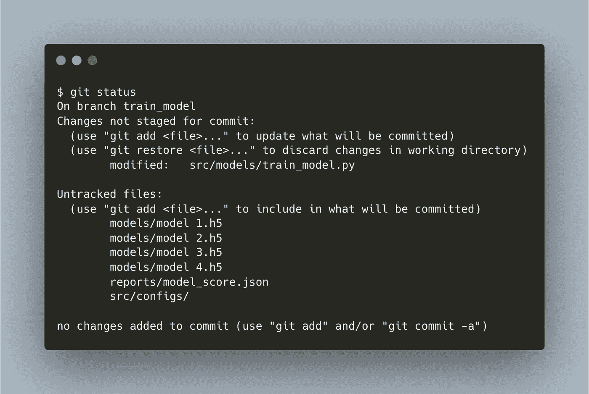*

*正如您之前所做的一样，Hiro 添加、提交并把他的本地分支中的更改推送到远程。然而，`models`目录不包括在内，因为它们占据了很大的空间。*

**

```
*Your local:

⬤───⬤ main
      │ origin/main
      │
      └──⬤ make_dataset
            origin/make_dataset

Hiro's local:

⬤───⬤ main
      │ origin/main
      │
      └──⬤ train_model*
            origin/train_model

Remote:

      ┌──⬤ train_model
      │
⬤───⬤──────⬤ main
      │      │
      └──⬤──┘*
```

# *4.Git 命令用于协同工作*

*你想给阿宽的作品加点东西。然而，现在你已经做了一些其他的工作:将`src/data/make_dataset.py`中的部分代码移到`src/features/build_features.py`中。所以，我们先说说那个。*

*首先，您使用`git pull`将所有变更从远程`main`拉到本地`main`，这样您就可以从最新版本的`main`中签出新的分支`build_features`。*

*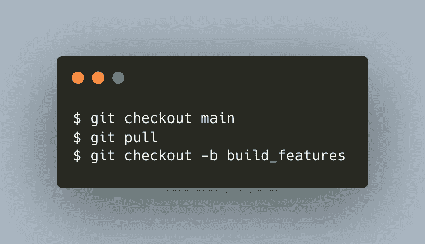*

```
*Your local:

⬤───⬤──────⬤ main
      │         origin/main
      │         build_features*
      │
      └──⬤ make_dataset
            origin/make_dataset

Hiro's local:

⬤───⬤ main
      │ origin/main
      │
      └──⬤ train_model
            origin/train_model

Remote:

      ┌──⬤ train_model
      │
⬤───⬤──────⬤ main
      │      │
      └──⬤──┘*
```

*在编辑`build_features`分支的中途，你想看看弘的进度。但是在分支中还有 2 个文件没有准备提交。*

*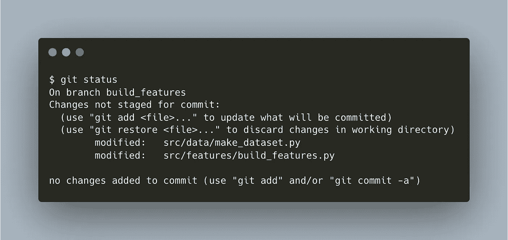*

*因此，您使用`git stash`将这些更改存储在一个脏的工作目录中。然后，您可以:*

1.  *从本地`main`创建一个本地`train_model`分支，*
2.  *将本地`train_model`的上游设置为`origin/train_model`，这样它可以跟踪远程`train_model`，并且*
3.  *从 Hiro 制造的遥控器`train_model`中提取。*

*在上面的第 3 步出现问题之前，一切都很好。因为:*

1.  *在你将你的远程`make_dataset`合并到远程`main`之前，Hiro 从本地`main`中取出他的本地`train_model`(参见 [**第 3 节**](#6e24) )，并且*
2.  *你从远程`main`拉到本地`main`这样你就有了最新版本的`main`(见 [**开头第 4 节**](#ce6b) )，*

*你的本地`main`比 Hiro 的更新更多(也称为“提前提交”)。因此，你需要一个更复杂的方法来拉遥控器`train_model`(提示:`git pull`就是`git fetch`后面跟着`git merge`)。*

*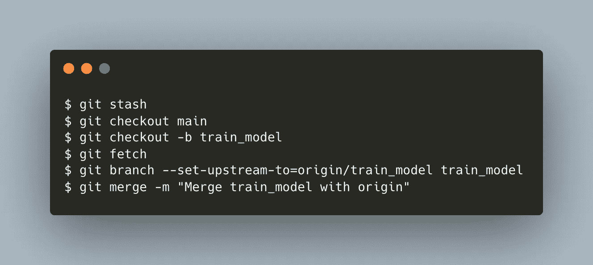*

```
*Your local:

      ┌──────⬤ origin/train_model
      │        ╲
      │         ⬤ train_model*
      │        ╱
⬤───⬤──────⬤ main
      │         origin/main
      │         build_features --> stash
      │
      └──⬤ make_dataset
            origin/make_dataset

Hiro's local:

⬤───⬤ main
      │ origin/main
      │
      └──⬤ train_model
            origin/train_model

Remote:

      ┌──⬤ train_model
      │
⬤───⬤──────⬤ main
      │      │
      └──⬤──┘*
```

*现在，在将最新的本地`main`与您的本地`train_model`合并之后，您已经准备好将更改推送到远程，并将任何内容从 stash 返回到`build_features`。*

*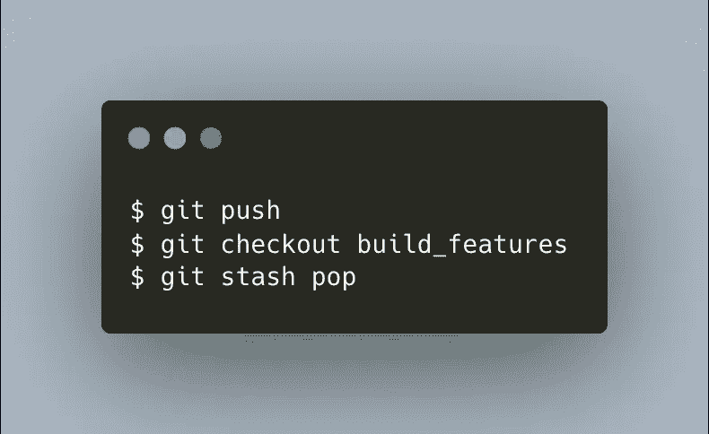*

```
*Your local:

      ┌──────⬤ 
      │        ╲
      │         ╲
      │          ⬤ train_model
      │         ╱   origin/train_model
      │        ╱
⬤───⬤──────⬤ main
      │         origin/main
      │         build_features*
      │
      └──⬤ make_dataset
            origin/make_dataset

Hiro's local:

⬤───⬤ main
      │ origin/main
      │
      └──⬤ train_model
            origin/train_model

Remote:

      ┌──────⬤
      │        ╲
      │         ⬤ train_model
      │        ╱
⬤───⬤──────⬤ main
      │      │
      └──⬤──┘*
```

*您创建并编辑另一个文件`src/configs/config.py`，暂存所有 3 个文件，提交并推送到远程。*

*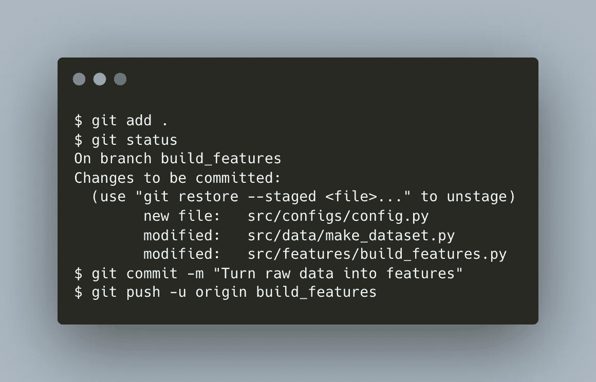*

```
*Your local:

      ┌──────⬤ 
      │        ╲
      │         ╲
      │          ⬤ train_model
      │         ╱   origin/train_model
      │        ╱
⬤───⬤──────⬤ main
      │       │ origin/main
      │       │
      │       └──⬤ build_features*
      │
      └──⬤ make_dataset
            origin/make_dataset

Hiro's local:

⬤───⬤ main
      │ origin/main
      │
      └──⬤ train_model
            origin/train_model

Remote:

      ┌──────⬤
      │        ╲
      │         ⬤ train_model
      │        ╱
⬤───⬤──────⬤ main
      │      ││
      └──⬤──┘└──⬤ build_features*
```

# *5.解决合并冲突*

*在所有东西都被推到远程之后，我们将不再使用本地回购。所以让我们关注一下远程回购。合并`train_model`和`main`。*

*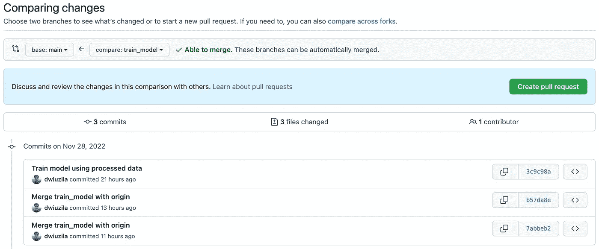*

*由[作者](http://dwiuzila.medium.com/membership)将 train_model 合并到主|图像*

*在请求 pull 并将`train_model`合并到`main`之后，这里是我们目前得到的结果。*

```
*Remote:

      ┌──────⬤
      │        ╲
      │         ⬤ main
      │        ╱
⬤───⬤──────⬤
      │      ││
      └──⬤──┘└──⬤ build_features*
```

*现在，合并`build_features`和`main`。这一次，两者不能自动合并。但是不要担心，您仍然可以创建拉请求。*

**

*将`build_features`合并到主|图片由[作者](http://dwiuzila.medium.com/membership)*

*原来`build_features`有必须解决的冲突，而罪魁祸首是`src/configs/config.py`。*

*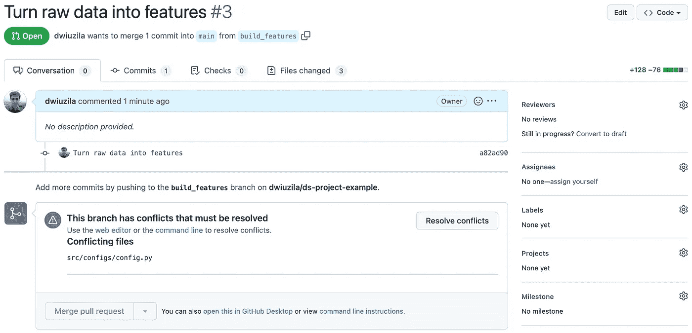*

*必须解决 build_features 和 main 之间的冲突|图片作者[作者](http://dwiuzila.medium.com/membership)*

*你看到问题了吗？Hiro 在该文件中为`train_model`分支增加了`n_splits`和`max_features`，该分支已经合并为`main`。但是，您还在同一个文件中为`build_features`分支添加了`loss`和`learning_rate`。合并操作变得不知道要做哪些改变。*

**

*由[作者](http://dwiuzila.medium.com/membership)解决 build_features 和 main | Image 之间的冲突*

*我们希望维护所有变量，因为它们在我们的项目管道中都是有用的。让我们就这样做，删除所有不必要的行。*

**

*解决冲突后提交变更|图片作者[作者](http://dwiuzila.medium.com/membership)*

*将`build_features`合并到`main`后，这里是我们在远程回购上的工作树。*

```
*Remote:

      ┌──────⬤
      │        ╲
      │         ⬤───┐
      │        ╱     │
⬤───⬤──────⬤      ├──⬤ main
      │      ││      │
      └──⬤──┘└──⬤──┘*
```

*我们完成了:)*

# *包扎*

**

*梅尔·普尔在 [Unsplash](https://unsplash.com?utm_source=medium&utm_medium=referral) 上拍摄的照片*

*我希望你从这个故事中学到了很多。已经向您介绍了几个基本的 GitHub 命令，并在构建数据科学项目的真实场景中使用它们。以下是一些最常见的(不以任何方式排序):*

```
*$ git add
$ git branch
$ git checkout
$ git clone
$ git commit
$ git fetch
$ git init
$ git merge
$ git pull
$ git push
$ git remote
$ git stash
$ git status*
```

*使用这些 git 命令，您可以创建/克隆新的 repos，浏览它们或它们的分支，并与世界另一端的任何人协作。*

**

*🔥你好！如果你喜欢这个故事，想支持我这个作家，可以考虑 [***成为会员***](https://dwiuzila.medium.com/membership) *。每月只需 5 美元，你就可以无限制地阅读媒体上的所有报道。如果你注册使用我的链接，我会赚一小笔佣金。**

*🔖*想了解更多关于经典机器学习模型如何工作以及如何优化其参数的信息？或者 MLOps 大型项目的例子？有史以来最优秀的文章呢？继续阅读:**

*

[艾伯斯·乌兹拉](https://dwiuzila.medium.com/?source=post_page-----e7775cccb4ba--------------------------------)* 

## *从零开始的机器学习*

*[View list](https://dwiuzila.medium.com/list/machine-learning-from-scratch-b35db8650093?source=post_page-----e7775cccb4ba--------------------------------)**8 stories********

[艾伯斯·乌兹拉](https://dwiuzila.medium.com/?source=post_page-----e7775cccb4ba--------------------------------)* 

## *高级优化方法*

*[View list](https://dwiuzila.medium.com/list/advanced-optimization-methods-26e264a361e4?source=post_page-----e7775cccb4ba--------------------------------)**7 stories********

[艾伯斯·乌兹拉](https://dwiuzila.medium.com/?source=post_page-----e7775cccb4ba--------------------------------)* 

## *MLOps 大型项目*

*[View list](https://dwiuzila.medium.com/list/mlops-megaproject-6a3bf86e45e4?source=post_page-----e7775cccb4ba--------------------------------)**6 stories********

[艾伯斯·乌兹拉](https://dwiuzila.medium.com/?source=post_page-----e7775cccb4ba--------------------------------)* 

## *我最好的故事*

*[View list](https://dwiuzila.medium.com/list/my-best-stories-d8243ae80aa0?source=post_page-----e7775cccb4ba--------------------------------)**24 stories********

艾伯斯·乌兹拉* 

## *R 中的数据科学*

*[View list](https://dwiuzila.medium.com/list/data-science-in-r-0a8179814b50?source=post_page-----e7775cccb4ba--------------------------------)**7 stories*******