# 凭经验快速回答任何问题的秘诀

> 原文：<https://towardsdatascience.com/a-recipe-to-empirically-answer-any-question-quickly-22e48c867dd5>

## 从学术界到企业工作，这份食谱适合你

托拜厄斯·拉德马赫在 [Unsplash](https://unsplash.com/?utm_source=unsplash&utm_medium=referral&utm_content=creditCopyText) 上拍摄的照片

经过多年的科学研究，我最终创造了一个启动任何研究项目的配方。我将要与大家分享的这个食谱，帮助我每天都有一个非常结构化的方法，减少遗漏某些东西的风险，并最大限度地提高效率。

你会看到，作为一些最好的厨师，掌握基本知识就足以做出一些伟大的东西。这也是我这里的做法。你将看不到花哨的命令、长长的代码行或复杂的安装包。这种方法让我在各自领域最有声望的期刊上发表了我的三篇科学论文:PNAS，环境研究快报，或管理科学(即将出版)。

探索数据可能是痛苦和无聊的，但它也是根据经验回答任何问题(在学术界或“真实”世界)的起点。因此，谨慎地做这一部分是绝对关键的。

让我用一个来自我作为研究人员的日常生活中的非常具体的例子来说明我的方法，看看我们如何能够快速地阐明一个问题，同时希望享受这个过程。

**案例研究:**在当前的热浪期间(2022 年 6 月)，我的一位同事找到我，她想知道这样的活动是否有助于执行环境政策。因此，我决定用这个问题来说明我研究两个变量之间关系的标准方法。

温度和降雨量如何影响环境政策？作者图片

在每一步，我都会解释我观察到了什么，以及它如何影响我的分析选择。这是我将在春季学期(由 EPFL/联合利华/IMD 的企业 4 协会)为可持续管理和技术硕士共同教授的方法。我会定期发布不同类型数据的类似分析(你可以在评论中建议下一步探索什么)。

**免责声明:**这是第一步，我想在一个小时左右的时间里初步了解一下数据。显然，每个部分都可以扩展。因此，我为一些我将在第二步探索的事情做了一些笔记。

## **好食谱的五个步骤:**

1.  为食谱选择配料(我如何选择变量)
2.  选择每种成分的正确数量(我如何选择我的样品)
3.  品尝和准备配料(单变量分析)
4.  一起烹饪配料(双变量分析)
5.  品尝新配方(结论)。

# 温度和环境政策示例:

## 1.变量选择

在这一节中，我将从概念上思考这些元素之间的关系，以及我将需要哪些关键成分。

**核心看点**:气候变化是一个全球性的、长期的、相对缓慢的现象。因此，热浪对气候变化规律的影响可以说是因果关系(例如，法国在 2020 年的行为预计不会影响同年或后年的平均气温)。

第一部分帮助我定义开始分析时需要哪些变量:

*   **成果:**环境政策，
*   **解释变量:**年平均气温、
*   **附加解释变量:**如果降雨量少，热浪可能会加剧，因此我也将增加平均年降雨量。

这是我会选择的最小成分列表:一个结果、一个解释变量和第三个变量，以探索影响的潜在异质性(这里是降雨量)。

## 2.选样

在这一节中，我将寻找数据可用性来定义一个清晰的样本。我将把我的初步分析建立在*政府环境指标数据集*的质量上，该数据集汇集了大量重要的数据集和数百个环境变量。

下面是我通过代码簿选择的变量列表([链接](https://www.gu.se/en/quality-government/qog-data/data-downloads/environmental-indicators-dataset) ):
- **cname** :国家名称
- **年份**:年份
- **oecd_eps:** 环境政策严格性指数(来自 Botta and Kozluk(2014))
-**cckp _ temp:**年平均气温(来自气候变化知识门户)【关键词:气候变化

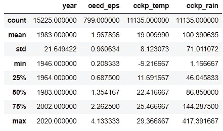

第一个表格显示变量 *oecd_eps* 只适用于 799 个观察值。

根据前面的表格，我将只限于有结果数据的国家( *oecd_eps* )和从 1993 年到 2012 年的年份，以获得相对恒定的样本量。上表中明显的“瓶颈”是结果变量 *oecd_eps。很明显，因为它只关注经合组织国家。*

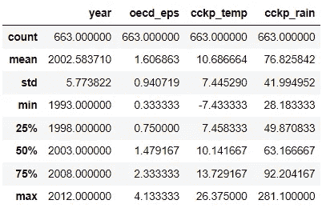

从“计数”行中，我们可以看到样本没有缺失值。

巴西和斯洛文尼亚几乎完全平衡的面板数据集(每个单位/国家的相同数量的观测值)具有较少的年份。

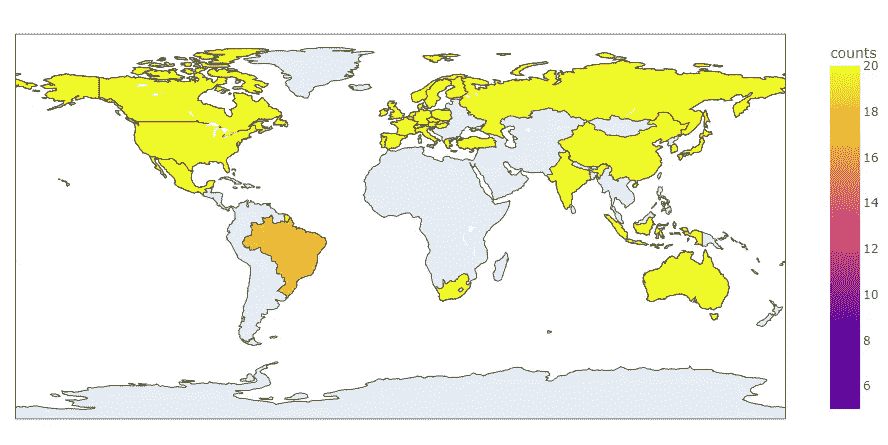

上面的地图显示，经合组织国家(包含在样本中)覆盖了每个大洲(南极洲除外)。非洲只有南非代表，而南美只有巴西。注意巴西上方黄色的小部分是法国的海外省:法属圭亚那。因此，重要的是要记住，欧洲代表了数据集的很大一部分，最终将决定结果。

# 3.单变量分析

在本节中，我将使用描述性统计来:

1.  **准备数据:**通过研究变量的分布，我将了解是否应该转换数据(例如，对数转换、定义分类变量、处理异常值等。)
2.  **选择正确的统计工具:**在这一步之后，我将了解每个变量的性质(连续、分类、二元等)，这使我能够选择正确的统计工具(相关性、条形图/线图、散点图等)。
3.  **了解潜在的变化:**我还发现观察变量如何随时间(线图)和空间(地图)变化也很重要。它帮助我更好地理解数据，并潜在地发现一些异常或有趣的冲击，以利用自然实验。

## 3.1 结果变量:环境政策严格指数

*   严格指数是一个连续变量，在所选样品中取值为 0.3 至 4.1。
*   平均值为 1.6，中位数略低(1.5)。

**观察:**

1.  直方图和表格:数据在右侧稍微不对称(偏斜度 0.48)，密度值非常低。偏斜度是不对称的度量。负值表示左侧不对称，空值表示分布完全对称，而正值表示右侧不对称。
2.  地图:环境政策的严格程度似乎与 GDP 高度相关:欧洲、北美或澳大利亚的值较高，而非洲、亚洲或南美国家的值较低。因此，在多变量分析中考虑这一点是很重要的(例如，作为控制变量包含在回归模型中)。
3.  线图:总体趋势是积极的。2007 年还有一个有趣的下降。我稍后会尝试探索这一点，看看它是否是由一部分国家推动的。

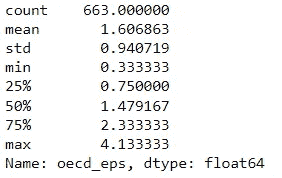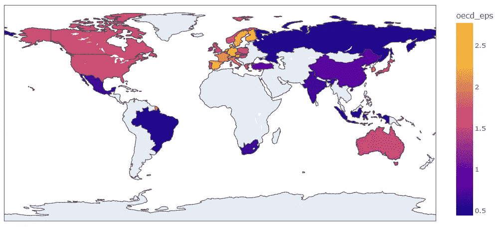

## 3.2 解释变量:年平均温度

*   年平均温度是一个连续变量，在所选样本中取值范围为-7.4 至 26.4。
*   平均值为 10.7 摄氏度，中位数为 10.14 摄氏度

**观察:**

1.  直方图和表格:数据非常对称，密度在分布的中间，有一组小值(加拿大和俄罗斯)。
2.  地图:平均温度与到赤道的距离高度相关(这里不奇怪)。即使结果是显而易见的，我发现检查我们是否得到了我们期望的东西总是有用的。它允许发现异常或不同数据集如何合并的问题。
3.  线图:总体来说也有一个积极的趋势。二十年来几乎两度的变化。1993 年和 1996 年有两次降温。这也是我稍后会调查的事情，以了解一些国家是否正在推动这一点。

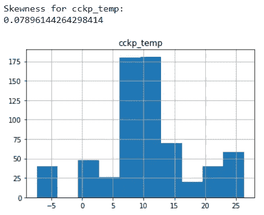

数组(['加拿大'，'俄罗斯']，dtype=object)

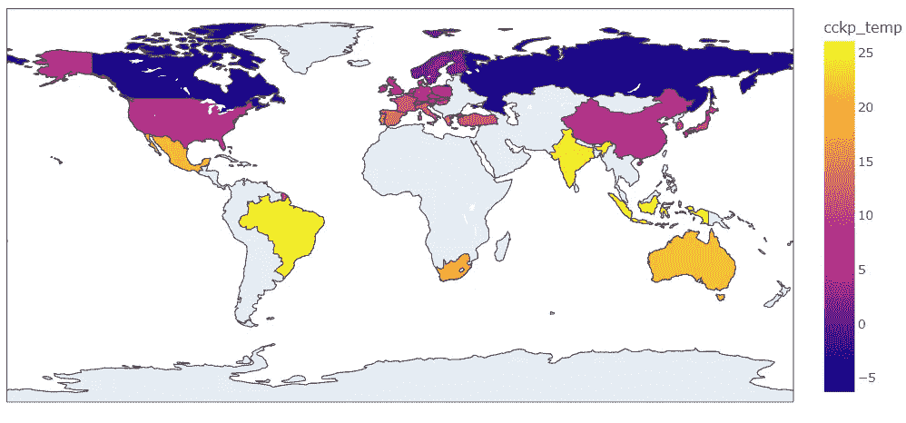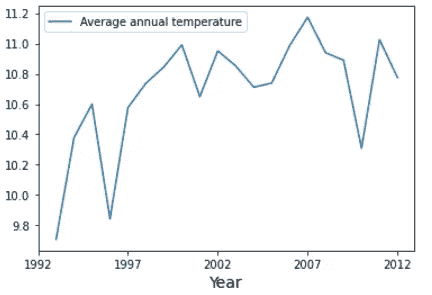

## 2.4 附加解释变量:平均年降雨量

*   年平均降雨量是一个连续变量，在所选样本中取值范围为 28 毫米和 281 毫米。
*   平均值为 76.8 毫米，中位数略低于 63.2 毫米

**观察:**

1.  直方图和表格:数据正偏，偏度为 2。在这个阶段，我不会对数据进行对数转换，主要有两个原因:a)不对称是“可接受的”(经验法则是偏斜度在-3 和 3 之间)，b)这将使解释(单位为毫米)和比较更简单(另一个主要解释变量也在水平上)。如果你不熟悉偏斜数据的日志转换思想，可以参考这篇[文章](/top-3-methods-for-handling-skewed-data-1334e0debf45)。
2.  图:印尼是个“异数”。至少可以说，它的降雨量显然是最高的。这一变量将用于观察降雨量多与少时(温度对环境政策的)影响是否不同。因此，由于我将在稍后的异质性练习中对降雨量变量进行二分法(高于/低于中位数),异常值不会影响分析。
3.  折线图:时间趋势比较嘈杂。

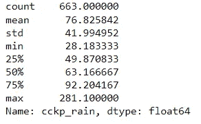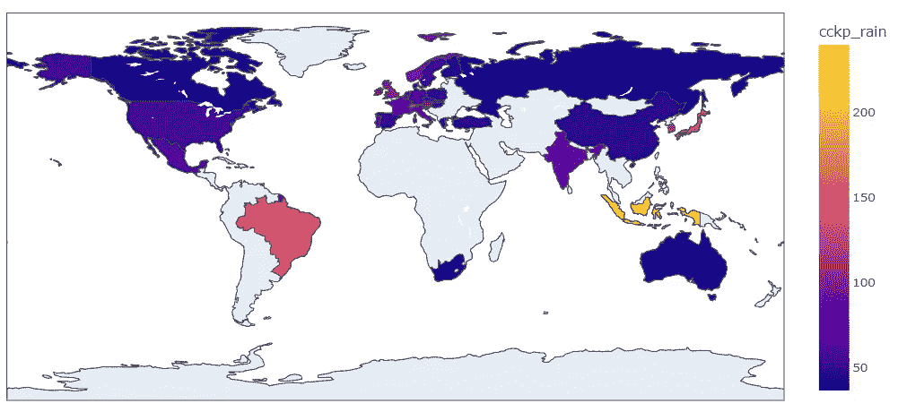

# 4.双变量分析:

既然我已经选好了数量并准备好了配料，我就把它们放在一起。我的结果和解释变量是连续变量。因此，我将从一个简单的散点图开始，因为它非常接近数据，允许我看到每个数据点，并且在给定样本大小的情况下足够了(例如，对于数百万个数据点，我更喜欢六边形图)。

为了帮助你遵循这些步骤，我把我的观察结果放在每张图表后面。

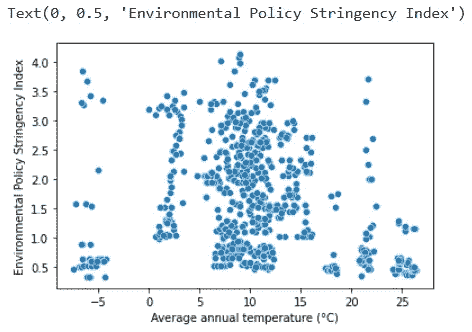

**观察:**看起来这些小点是垂直分布的。我猜年平均气温在国家之间的变化比在国家内部的变化要大。因此，对于分析来说，更有意义的是观察国内气温变化如何与结果相关联。为了证实这个想法，我将简单地绘制相同的图表，同时按国家给点着色。

**观察:**事实上，随着时间的推移，温度相对稳定，而国内的严格性指数有显著变化。

因此，让我们计算每个国家的温度变量的平均值的差异，而不是使用水平(国内变化)。

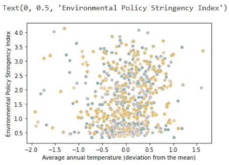

**观察:**关系更清晰，如预期为正。

**下一个？异质性:**现在让我们看看降雨量是否存在异质性。

**观察:**目测关系不清。然而，降雨量最多的国家似乎气温变化低，环境政策严格指数低(可能是印度尼西亚)。

让我们做一个样本分割，以探索降雨量高于或低于中位数的国家的温度和环境政策严格性指数之间的关系(异质性练习)。

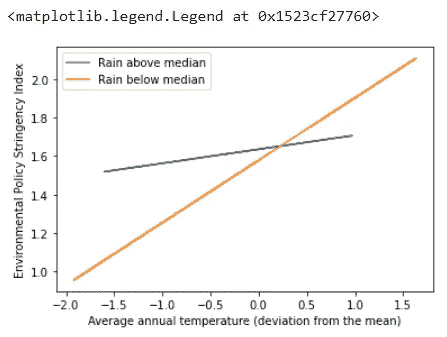

**观察:**环境政策与温度(偏离均值)的相关性为正。对于降雨量高于中值(0.036)的样本，相关性几乎为零，而对于降雨量低于中值(0.19)的样本，相关性相对较大。从上图中，我们可以看到，对于降雨量少的样本，线性拟合的斜率更陡，但截距更低。从这些简单的初步图表中得出任何结论都是英雄行为。然而，它暗示了一些潜在的有趣的异质性。这就是我对描述性统计的理解(顺便说一下，已经超过了双变量分析)。

# 5.结论

我们从这次探索中学到了什么？首先，它允许我向你展示我的食谱。第二，我们最终了解了温度和环境政策之间关系的新情况:

1.  (国内)温度变化与环境政策严格指数(1993 年至 2012 年经合组织国家)之间存在正相关关系。
2.  在同一年经历低降雨量的观测中，这种关系得到了有力的加强。
3.  从这个简单的异质性测试中，还不清楚这种联系是在平均少雨的国家(例如:澳大利亚、西班牙或南非)更强，还是在干旱年份的任何国家(例如:2003 年的法国)。

接下来:我现在要改进这个练习，并特别关注三件事:1。2007 年随着严格指数的下降发生了什么(一个国家，所有国家，并理解为什么)，2。探索哪些地区导致了 1998 年和 2010 年的总体气温下降(这可能会导致一个有趣的事件研究)。3.使用事件研究来检查这种影响是在同一年发生的，还是有滞后现象等。然后，根据研究结果，我将拟合一个多变量模型来量化影响和控制混杂因素。

[1]波维金娜、玛丽娜、娜塔莉亚·阿尔瓦拉多·帕雄和杰姆·梅尔特·达利。"政府环境指标数据集的质量，版本 Sep21 . "*哥德堡大学:政府质量研究所，https://www。gu.se/en/quality-government*(2021)。

[2]博塔、恩里科和托马斯·koźluk."衡量经合组织国家环境政策的严格性:综合指数方法."(2014).

3 世界银行集团。2021.气候变化知识门户。网址:[https://climateknowledgeportal.worldbank.org](https://climateknowledgeportal.worldbank.org)

[3] Harris，Ian 等人，“CRU TS 每月高分辨率网格多变量气候数据集第 4 版”*科学数据*7.1(2020):1–18。