# 一个句子比它的单词的总和更重要

> 原文：<https://towardsdatascience.com/a-sentence-is-greater-than-the-sum-of-its-words-56ce3967fcc6>

## 句子嵌入 101

图片由 [Ri Butov](https://pixabay.com/users/ri_ya-12911237/?utm_source=link-attribution&utm_medium=referral&utm_campaign=image&utm_content=6709160) 从 [Pixabay](https://pixabay.com//?utm_source=link-attribution&utm_medium=referral&utm_campaign=image&utm_content=6709160) 拍摄

在这篇文章中，我将提出句子嵌入的主题。我们将学习什么是句子嵌入，以及它们如何有所帮助。我们将回顾一些创建句子嵌入的基本(甚至是幼稚的)方法，以及该领域的一些最新进展。我们将以一个我在使用不同的句子嵌入技术时测量文档可视化质量的实验来结束。所以事不宜迟，让我们直接开始吧！

文章将按如下方式组织:

第一部分。什么是句子嵌入？
第二部分。示例应用
第 3 部分。一些基本方法
第四部分。sentence Bert[1]——街区里的新小子
第 5 部分。SimCSE [2] —输入无监督的句子嵌入
第 6 部分。实验—测量文档可视化质量— Kaggle 新闻数据集[3]

*   我在实验中使用的代码可以在这里找到——[https://github.com/erap129/DocumentVisualizations](https://github.com/erap129/DocumentVisualizations)

# 第一部分——什么是句子嵌入？

机器学习中的嵌入是世界上实体的向量表示，所以句子嵌入只是句子的向量表示。通常我们说它们是*分布的*向量表示，这意味着我们没有从数据中的特征到向量中的元素的 1:1 映射(例如，代表句子“快乐”的单个向量元素)，而是这些特征以我们无法预定义的方式分布在向量的不同元素中。

例如，在图 1 中，我们可以看到一个正在生成的句子嵌入的玩具示例。我们可以看到，嵌入成功地捕捉了前两个(关于食物的问题)和后两个(与时间表相关的事实)句子之间的语义相似性，同时保持了这两组句子之间的差异。

图 1:句子嵌入——玩具示例

# 第 2 部分—一个示例应用

那么，这些句子嵌入到底有什么用呢？让我们来看看我想到的一个假设的示例应用程序(这只是一个示例，我相信一旦您看到它，您将能够想到更多这些想法)。

在图 2 中，我们可以看到一个示例应用程序，其中用户编写了一段代码(Python 中的 insertion sort ),并希望找到相似的代码片段(可能是为了找到更好的实现，或者在其他语言中找到相同的函数)。用户获取该代码，并使用语句嵌入方法将代码片段转换成分布式向量表示。然后，用户查询其他代码片段嵌入的数据库，并使用具有余弦相似性的 K 个最近邻居找到与输入片段最相似的片段。

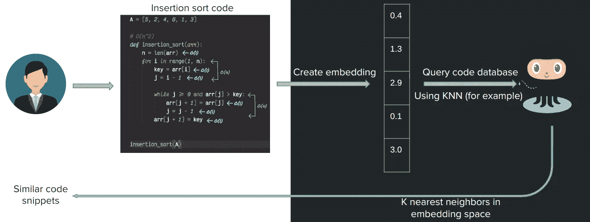

图 2:一个示例应用程序

# 第 3 部分—一些基本方法

该领域中最基本的方法是基于计数的。基于计数的方法的最简单的例子显示在图 3 的顶部，其中句子中每个单词的计数是句子的向量表示中的一个条目。这是一个*非分布式*向量表示，因为一个句子的单个特征(特定字数)可以直接映射到表示向量中的单个条目。其他方法，如 TF-IDF，通过根据整个数据集中每个单词的频率对这些值进行归一化，对此进行了改进，但它们仍然是基于计数的，没有考虑单词在句子中的顺序(这可能是数据丢失的主要原因)。

第二种方法显示在图 3 的底部，其中某些单词嵌入方法是现成的，句子的表示是这些单词嵌入的平均值。单词嵌入可以通过任何方法生成(GloVe [5]，word2vec，BERT 等)，但是我们将在后面看到，简单地取这些向量的平均值而不首先调整它们以更好地适应句子嵌入的任务是有缺点的。

图 3:一些基本的句子嵌入方法

# 第四部分——句子伯特——街区的新成员

句子嵌入领域的一项重大进展发生在 2019 年，当时 Nils Reimers 和 Iryna Gurevych 发布了句子-BERT 论文。他们引入了一种新方法来微调众所周知的 BERT 模型，以使用余弦相似性产生具有良好可比性的嵌入。

最初的 BERT [4]论文处理了语义文本相似性的问题，其目标是评估一对句子的相似程度(如图 4 所示的例子)，甚至在特定基准上达到了新的最先进的结果。

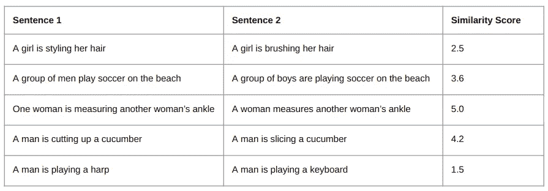

图 4。语义文本相似性(STS)任务的一个例子

伯特方法的问题在于其效率低得令人难以置信。BERT 通过一次对两个句子的标记进行编码(用一个特殊的`[SEP]`标记分隔)并在最后输出相似度的水平来解决这个任务，如图 5 所示，该图取自最初的 BERT 论文。要在 10K 句子的数据集中找到最相似的句子对，需要花费伯特 65 个小时的推理时间。因此，SBERT 的目标是创建可以简单地使用余弦相似性进行比较的嵌入，同时仍然在基准 STS 任务上产生最先进的结果。

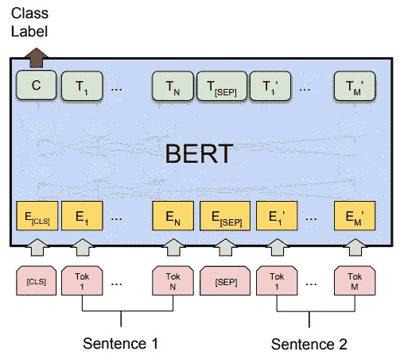

图 5:伯特对语义文本相似性任务的方法(图取自原始论文)

在这里，我将重点关注 SBERT 论文中提出的解决方案之一，即在自然语言推理(NLI)任务数据集的标记句子对上使用暹罗网络。该数据集中的句子对被标记为以下选项之一:蕴涵、矛盾或中性。

SBERT 引入并应用于原始 BERT 预训练模型的微调任务是获取每个带标签的句子对，并使用暹罗网络生成包含两个 BERT 表示的向量(串联`v, u, |u-v|`，其中`u`和`v`是 BERT 的输出)。具有 softmax 功能的前馈网络被附加在该结构的顶部，并且其输出确定句子对是蕴涵、矛盾还是中性的。图 6 描述了上述过程。

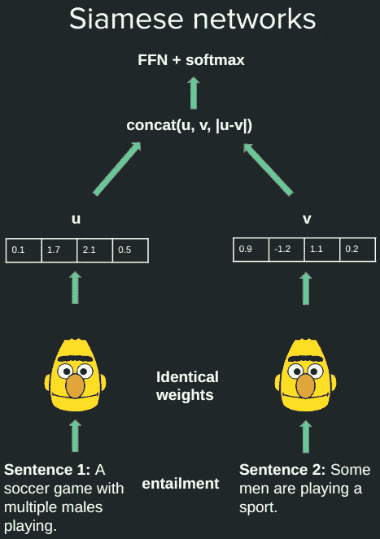

图 6:NLI 数据的 SBERT 微调程序

这个简单的微调任务创建了一个改进的 BERT 模型，该模型生成的句子表示可以使用简单的余弦相似度进行比较！在表 1(取自最初的 SBERT 论文)中，作者表明它们比朴素方法(平均手套嵌入、平均 BERT 嵌入)好得多，并且也比我们在这里没有涉及的其他句子嵌入方法好得多。

表 1。原始 SBERT 论文的结果

但是如果我们的数据没有可以用来训练 SBERT 的带标签的句子对呢？这就是 SimCSE 的用武之地…

# 第 5 部分— SimCSE —输入无监督的句子嵌入

由高天宇、姚兴成和陈撰写的 SimCSE 介绍了一种为了创建句子嵌入而微调语言模型的新颖方法。在这篇论文中，作者使用了对比学习，其中正面的例子是句子本身通过了不同的漏失屏蔽(稍后将详细介绍)。

*注意——该论文还提出了一种使用对比学习来创建句子嵌入的监督方法。在本文中，我选择将重点放在无人监管的部分。详情请参考原文。*

首先让我们复习一下对比学习:主要思想是把近邻拉到一起，把非近邻推开。在这个例子中，我们将跟随马里奥、路易吉和耀西。Mario 和 Luigi 是双胞胎，所以我们希望代表他们的嵌入在向量空间中接近。Yoshi 很可爱，但与 Mario 和 Luigi 不太相似，所以我们希望他的形象离我们远一点。

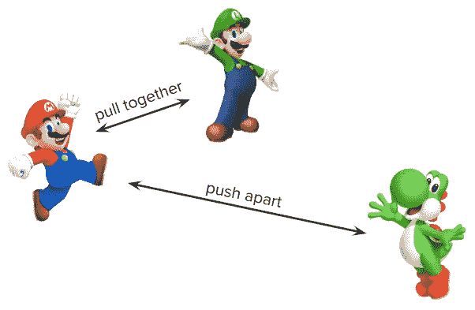

图 7:对比学习目标的卡通示例

但是我们如何在数字上实现它呢？当然是使用损失函数！在对比学习中，我们一般会用到一个叫 InfoNCE 的损失函数。图 8 是一个信息图，有助于我们理解 InfoNCE loss 函数，让我们一步步来看。

首先，在分子中，我们看到我们有一个`h_i`和`(h_i)^+`相似度的指数(抱歉符号不好)。我们看到`h_i`代表马里奥，`(h_i)^+`代表路易吉，因此我们当然希望分子大一些。另一方面，在分母中，我们有马里奥`h_i`与批次`(h_j)^+`中所有其他元素的相似性总和，这包括路易吉，但也包括我们不想让马里奥与之相似的其他东西，当然包括飞机、盘子和耀西。我们看到分子是分母的一部分，如果我们把它比作蛋糕，分子就是分母的一部分。这个切片应该尽可能大，以便最大化 Mario 和 Luigi 之间的相似性，同时最小化 Mario 和该批中其他所有事物之间的相似性。

请注意，有一个负对数函数包裹着这一切。我们看到，随着该分数越来越接近 1，负对数变得越来越小，因此通过对该目标函数使用梯度下降，我们正在推动相似的项目具有更高的相似性，而不相似的项目具有更低的相似性。

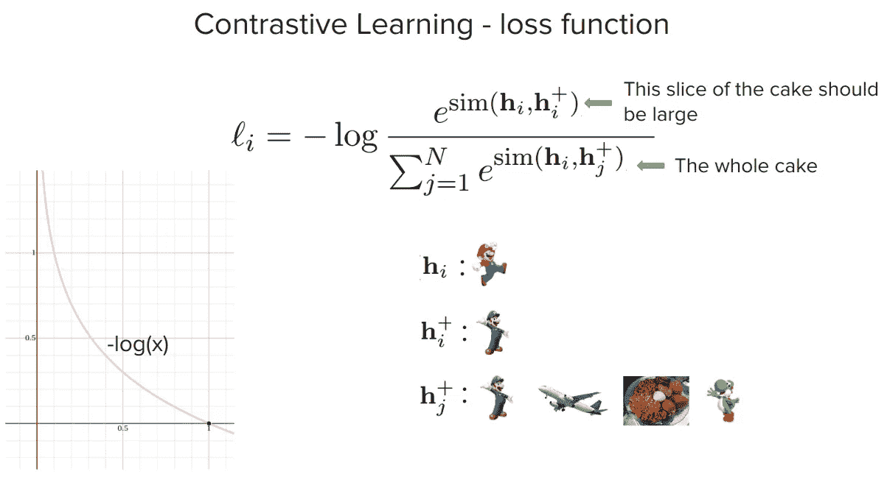

图 8:信息损失信息图

现在我们知道了对比学习是如何工作的，但是当没有这种标记数据可用时，辛姆斯西使用了哪个“马里奥、路易吉和耀西”？结果是，对于一个给定的句子，他们让它通过 BERT 两次，每次都使用不同的 dropout 掩码(提醒一下，dropout 是一个随机将输入的一小部分归零的函数)，因此对于一个给定的句子，接收到两个略有不同的嵌入。对于反面的例子，他们简单地使用了小批量中的所有其他句子(如果有很好的重排，其他句子应该会很不同)。

图 9 显示了这样的一个例子(包含来自 SimCSE 原始论文的一个图)。在左边，我们看到句子“两只狗在跑”通过网络传递了两次，从而创建了一个正对，而该批中的所有其他句子(一个主要在海上冲浪，一个小孩在滑板上)作为负对样本。右边是一个提示，通过随机屏蔽输入，辍学是如何工作的。

图 SimCSE 对比学习的积极和消极配对

好吧，但是为什么这个会有用呢？这背后的理论依据是什么？在这里，SimCSE 的作者向我们解释了两个术语，叫做对齐和一致性。

在图 10 中，我们可以看到对齐和一致性的等式，以及我们信赖的朋友 Mario、Yoshi 和 Luigi。对齐是成对实例的嵌入之间的预期距离。左边的术语是对准“损失”,我们的目标是使其最小化。我们看到它包含了我们想要最小化的所有正对(Marios 和 Luigis)的嵌入之间的距离。在右边，我们看到了均匀性的损失。我们有所有负对(Marios 和 Yoshis)之间距离的负次方，我们想要最大化它。

图 10:对齐和一致性

作者认为，预训练模型通常具有良好的对齐性——即，成对的正样本在嵌入空间中会很接近，但一致性较差——即，成对的负样本彼此之间不会相距足够远。图 11 摘自 SimCSE 的原始论文，它显示了他们在提高均匀性(最大限度地减少均匀性损失)的同时保持了良好的对准。红星代表 SimCSE 模型，其他符号是经过测试的其他基线。

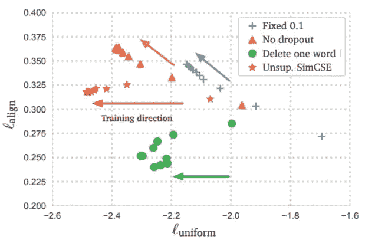

图 11: SimCSE 均匀性和排列随时间的变化

当我们在表 2 中查看 SimCSE 在 STS 基准测试任务上的结果时，我们看到了与我们之前查看的 SBERT 相似的结果，只是这次没有使用关于句子相似性的标记数据！他们只微调了维基百科的 100 万个句子。在我看来，这相当令人印象深刻。

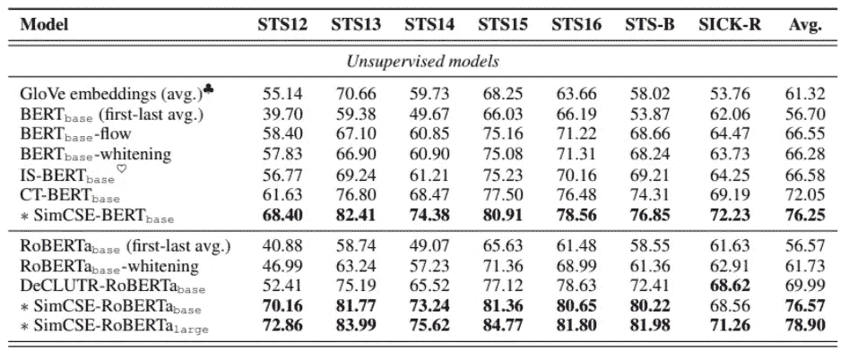

表 2:无监督 SimCSE 的结果

# 第 6 部分—实验—测量文档可视化质量— Kaggle 新闻数据集

本文理论部分到此为止。我现在将展示一个我使用上述模型进行的关于 2D 空间中文档可视化的实验。

我在这个实验中使用的代码可以在这里找到——https://github.com/erap129/DocumentVisualizations

来自 Kaggle — [的新闻类别数据集 https://www . ka ggle . com/datasets/RMI SRA/News-Category-Dataset](https://www.kaggle.com/datasets/rmisra/news-category-dataset)(在 attribute 4.0 International(CC BY 4.0)许可下发布)包含属于 42 个不同类别的新闻文章。数据集中的每篇文章包含以下数据字段:`category, headline, authors, link, short_description, date`。我只选取了`headline, short_description`字段，并创建了一个新字段，我将其命名为`long_description`。我的目标是使用几种方法创建每篇新闻文章的`long_description`的嵌入，并检查哪种方法能产生数据的最佳 2D 可视化。所以这里需要问几个问题。

*   给定一篇特定文章的句子嵌入，我如何创建 2D 可视化？

我用了 UMAP 算法。关于这个伟大的降维算法有太多的文档了，所以我在这里不再赘述。我只想说，我在所有实验中都使用了默认的超参数，没有进行任何调整。

*   *我如何定量比较不同可视化的质量？拥有一个“好”的可视化意味着什么？*

可视化的比较，当然是视觉上的“用眼”。但是如果我们仍然想要得到一个我们可以坚持的度量呢？也许我们正在让几十种算法相互竞争，而没有时间去观察它们？我看到了这篇文章— [使用类一致性选择高维数据的良好视图](http://graphics.uni-konstanz.de/publikationen/Sips2009SelectingGoodViews/Sips2009SelectingGoodViews.pdf)，它提出了一种称为*距离一致性*的度量，定义如下:

情商。1:距离一致性度量

对于可视化空间 *v(X)* 中的每个点*X’*，我们检查最近的类的质心是否不同于 *x* 的类，然后除以 *N* 的样本数，得到一个介于 0 和 1 之间的数。由于可视化的 *DSC* 较低，这意味着在可视化中代表不同组的聚类更突出，这是好的。只有当数据被标记时，这种方法才适用，这就是我们处理新闻数据集的情况。

*   哪些方法产生了哪些结果？我的发现与 SBERT 和 SimCSE 的论文一致吗？

让我们来看看实验结果。为了简单起见，我只使用了 Kaggle 新闻数据集中的 5 个类别:*食物&饮料、世界邮报、体育、离婚*和*风格。*我比较了以下创建可视化效果的方法:

*   TF-IDF —基于计数的方法，用于创建文档表示向量。用作基线。
*   bert_average —文档中所有标记的平均嵌入值，取自 bert 模型的最后一层(未针对句子进行微调)
*   bert _ cls——嵌入取自 BERT 最后一层的[CLS]令牌。
*   sbert_average —来自 sbert 的平均嵌入值(对句子的 bert 的监督微调)
*   sbert_cls —嵌入取自 sbert 最后一层的[CLS]令牌。
*   simcse_average —来自 simcse 的平均嵌入值(针对句子的 BERT 的无监督微调)
*   simcse_cls —嵌入取自 simcse 最后一层的[CLS]令牌。

以下是 *DSC* 测量的结果:

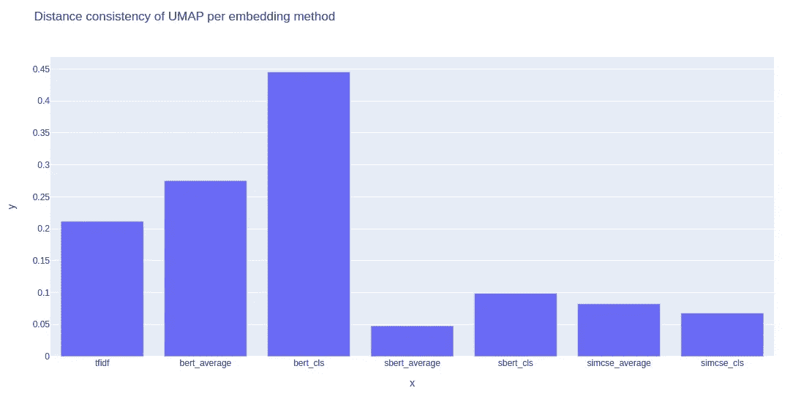

图 12:根据嵌入方法产生的可视化的 DSC

我们看到与 SBERT 和 SimCSE 论文非常相似的结果。未经微调的 BERT 与简单的 TF-IDF 基线有着激烈的竞争。在监督微调(SBERT)之后，以及通过非监督微调(SimCSE)，结果显著改善。在 BERT 和 SBERT 中，使用平均令牌嵌入作为降维的基础优于采用[CLS]令牌的嵌入，而对于 SimCSE 则相反。

让我们查看每种方法的实际可视化效果，以便更好地感受这里所做的工作。快速检查证实了 DSC 指标—获得较低 DSC 的方法在可视化中产生更多可辨别的聚类:

*   TF-IDF

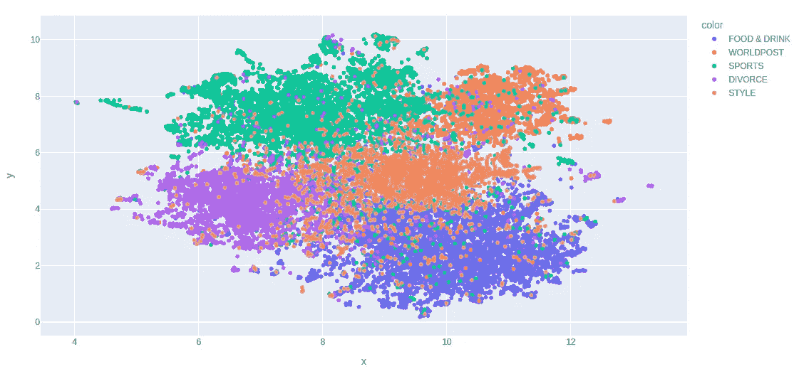

图 13:UMAP 的 tfidf 嵌入可视化

*   伯特平均值

图 14:UMAP 的伯特平均嵌入可视化

*   bert_cls

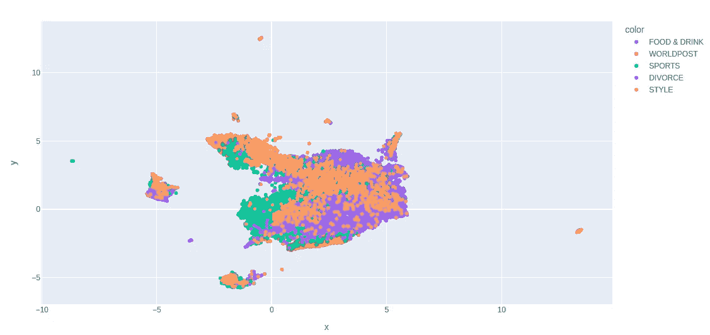

图 15:UMAP 的 bert_cls 嵌入可视化

*   sbert _ 平均值

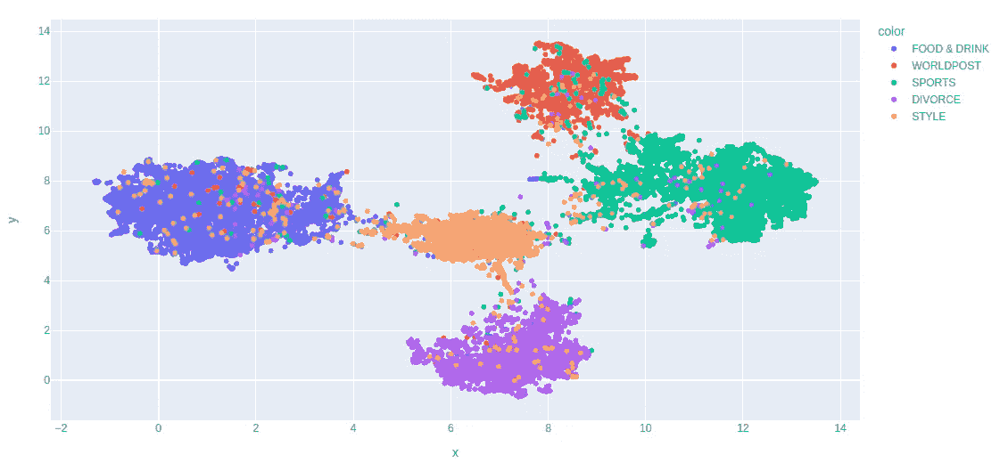

图 16:UMAP 的 sbert_average 嵌入可视化

*   sbert_cls

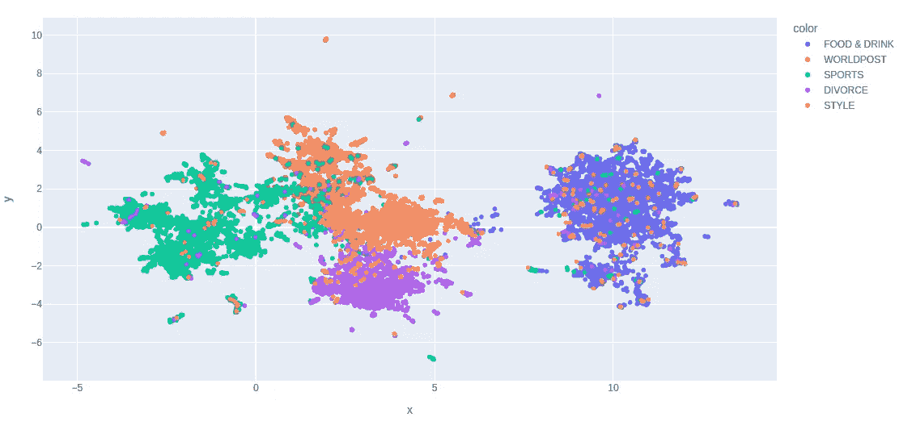

图 17:UMAP 的 sbert_cls 嵌入可视化

*   simcse_average

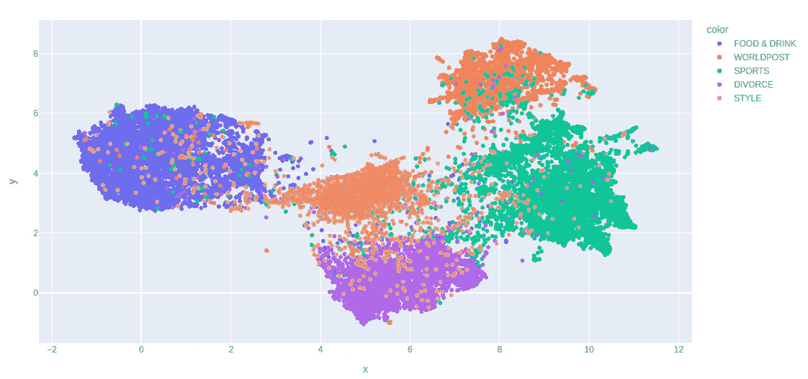

图 18:UMAP 的 simcse_average 嵌入可视化

*   模拟场景 _cls

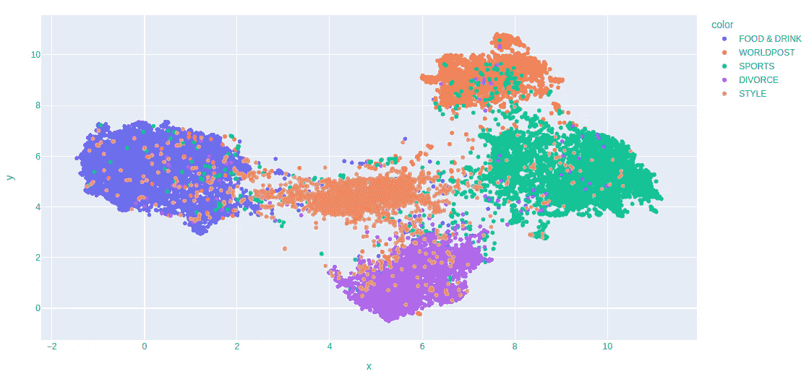

图 19:UMAP 的 simcse_cls 嵌入可视化

# 结论

在本文中，我们:

*   学习了什么是句子嵌入
*   了解通过微调 BERT(有监督和无监督)创建句子嵌入的两种最新方法
*   看到上述论文的结果也在可视化质量实验中重复

对于未来的工作，我认为在其他类型的文本数据而不仅仅是自然语言上尝试 SimCSE 会很有趣。例如，按照我在本文第 2 部分中的建议，编写一个查找相似代码片段的模型。SimCSE 不需要监督数据来微调句子的事实将允许对各种类型的数据进行训练。

我希望你喜欢阅读并学到一些新东西。感谢阅读！

# 参考

[1]—sentence BERT paper—[https://arxiv.org/abs/1908.10084](https://arxiv.org/abs/1908.10084)
【2】—SimCSE paper—[https://arxiv.org/abs/2104.08821](https://arxiv.org/abs/2104.08821)
【3】—ka ggle 新闻分类数据集—[https://www . ka ggle . com/datasets/RMI SRA/news-category-dataset](https://www.kaggle.com/datasets/rmisra/news-category-dataset)
【4】—BERT paper—[https://arxiv.org/abs/1810.04805](https://arxiv.org/abs/1810.04805)
【5】—手套嵌入—[https://nlp.stanford.edu/projects/glove/](https://nlp.stanford.edu/projects/glove/)