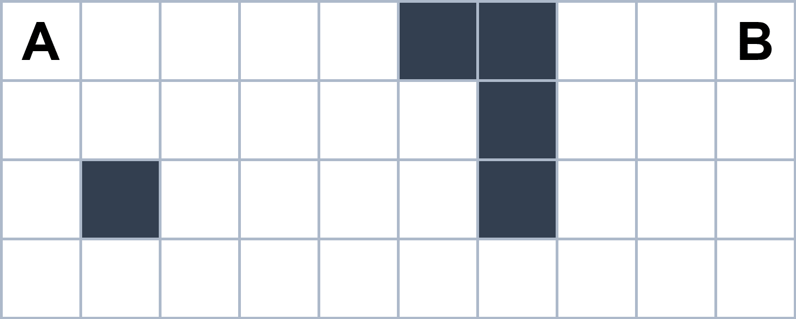
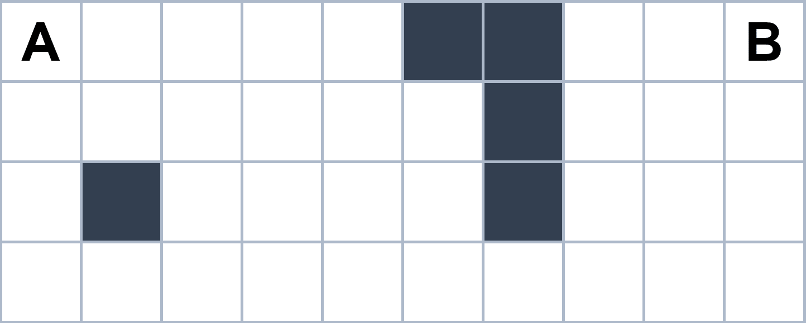

# 用帕斯卡三角形走一段短而直的路

> 原文：<https://towardsdatascience.com/a-short-and-direct-walk-with-pascals-triangle-26a86d76f75f>

## 如何通过计算路径来改进寻路算法

[扎克·克朗](https://buildzcapital.square.site/about)在 [buildz](https://buildzcapital.square.site) 上创作的[短路径蓝色水彩](https://buildzcapital.square.site/product/short-path-blue-watercolor/66)。(经许可使用)

Dijkstra 算法和 A*等经典寻路算法用于在视频游戏、移动机器人和建筑设计等应用中生成旅行路线。尽管这些算法很受欢迎，但它们产生的路径很少是直的。在本文中，您将学习如何使用受帕斯卡三角形启发的计数技术来计算高度直接的路径。这是我和我的同事开发的一个想法，最近在《人工智能研究杂志》上发表了。通过计算路径的简单步骤，您可以克服传统寻路的一个长期存在的问题。

# 丑陋路径问题

许多学科都需要计算最短和最直接的路径。建筑设计师使用寻路工具来分析人们需要走多远才能到达最近的紧急出口。一些建筑师更进了一步，模拟人群疏散大楼，这需要为每个大楼居住者生成逃生路线。视频游戏开发者依靠寻路算法来确定人工智能控制的代理应该如何在地图上从一个位置移动到另一个位置。

实现寻路的最简单和最流行的方法之一是将地图表示为网格，然后应用经典的搜索方法，如 Dijkstra 算法或 A*来寻找具有最短可能长度的网格路径。下面的动画显示了从起始位置 **A** 到目的地 **B** 的最短网格路径示例。阴影网格单元表示必须避开的墙壁或其他障碍物。我们暂时假设沿着网格路径的每一步都是在 4 个方向上的一步:北、南、东或西。

间接或丑陋的最短网格路径。(作者制作的动画)

上面的路径是从 **A** 到 **B** 的 400 条最短网格路径之一。这也是一条非常间接的途径。它没有利用明显的直线捷径。如果一个人没有义务按照网格行走的话，它会明显偏离一个人在现实生活中会选择的直接路线。在 [Red Blob Games](https://www.redblobgames.com/) 关于[实现 A*](https://www.redblobgames.com/pathfinding/a-star/implementation.html) 的教程中，Amit Patel 指出这些“丑陋的路径”是一个普遍遇到的问题。

> 当人们在网格上运行寻路时，我得到的最常见的问题是为什么我的路径看起来不直？
> 
> — [Amit Patel，Red Blob Games](https://www.redblobgames.com/pathfinding/a-star/implementation.html#troubleshooting-ugly-path)

丑陋路径问题可以通过在 A*路径搜索期间测试多达数十万条可能的直线捷径来以强力方式解决。2010 年发表的一个名为 Theta*的算法使用了这种方法[2]。为了避免所有这些视线测试，我们的策略是选择一条恰好接近直接路径的最短网格路径。在我们示例中的 400 条最短的网格路径中，下面的路径是我们要选择的路径。

高度直接或居中的最短网格路径。(作者制作的动画)

这个中心网格路径实际上并不比我们之前看到的间接网格路径短。两条路径都需要 15 次网格移动，每次移动的长度为一个网格间距。然而，中心路径更接近一个人在现实生活中的平滑路径。解决丑陋路径问题的一种方法是找到一种简单有效的方法来产生中心网格路径。输入*帕斯卡三角形*。

# 帕斯卡三角形

1655 年，法国数学家布莱士·帕斯卡出版了《三角形算术》,这是一部关于数字模式的著作，后来被称为帕斯卡三角形。

布莱士·帕斯卡 1655 年对算术三角形的阐释，现在被称为帕斯卡三角形。([公共领域](https://en.wikipedia.org/wiki/Pascal's_triangle#/media/File:TrianguloPascal.jpg))

帕斯卡对三角形的分析启发了牛顿对二项式定理的贡献以及莱布尼茨对微积分的研究。然而，我们应该承认帕斯卡不是第一个提出这种模式的人。它大约在 1000 年前在波斯和中国被发现，可能在 2000 年前在印度被发现。

帕斯卡三角形是通过在顶点和两个分叉的边上放置一个 1 形成的。每隔一个数字由前面两个数字相加生成。下面的动画显示了前 5 行的操作过程。

[帕斯卡三角形的动画](https://commons.wikimedia.org/w/index.php?curid=3902538)由[her fold](https://en.wikipedia.org/wiki/User:Hersfold)在[维基百科](https://en.wikipedia.org/wiki/Pascal's_triangle)上制作

帕斯卡三角形因其[许多迷人的性质](https://medium.com/i-math/top-10-secrets-of-pascals-triangle-6012ba9c5e23)而闻名。其中一个特性是帕斯卡三角形中的每个数字都可以被解释为路径计数:从三角形顶点到该数字位置的最短网格路径数。例如，动画底部中心的六边形网格单元的编号为 6，从三角形的顶部单元到底部中间单元正好有 6 条最短的网格路径。动画显示了一个六边形网格，但当帕斯卡的三角形被绘制在正方形网格上时，该属性也成立，如布莱士·帕斯卡的上图所示。

许多在线文章和视频解释了如何使用帕斯卡三角形来计算网格上的路径数。事实证明我们可以更进一步。帕斯卡三角形不仅向我们展示了如何计算所有可能的路径，还展示了如何从这些路径中选择一条最直接的路径。

# 计数寻路

新的寻路方法通过计算穿过每个网格单元的最短网格路径的数量来工作，然后选择具有最高计数的网格单元。

第一步是向前计算路径。如下图所示，我们首先将数字 1 分配给起始位置 **A** 。每当一个格网单元被赋予一个数字时，该数字将沿着任何最短的格网路径被复制到下一个单元。当多条路径收敛时，数字会相加。类似于帕斯卡三角形，结果是每个网格单元包含从 **A** 到该单元的最短网格路径数。例如，在动画中，在**和**之间有 12 条最短的网格路径。注意在 **A** 和 **B** 之间有 400 条最短的网格路径。

向前计算路径。(作者制作的动画)

接下来，我们反向重复这个过程。所以现在 **B** 被赋予数字 1，我们复制并添加数字，直到我们到达 **A** 。最后，每个网格单元包含从 **B** 到该单元的最短网格路径的数量。请注意，即使我们颠倒了方向，两个端点之间仍然有 400 条最短的网格路径。

反向计算路径。(作者制作的动画)

下一步是获取这两组路径计数，并将它们相乘以产生一组遍历计数。要理解这一概念，请看上面的动画，并找到从 **A** 到 **B** 的路径数为 12 和 20 的唯一网格单元。一侧的 12 条路径和另一侧的 20 条路径可以以 12 乘以 20 的不同组合来连接，这意味着在从 **A** 到 **B** 的途中有 240 条路径穿过该网格单元。您将在下面看到这个单元格的遍历计数是 240。动画显示了为每个格网单元计算的遍历计数。

将路径计数相乘以获得遍历计数。(作者制作的动画)

最后一步是从 **A** 开始，然后重复选择通向 **B** 且具有最高遍历计数的下一个网格单元。下面的动画显示了遍历计数，并展示了路径是如何生成的。

选择最高遍历计数以获得中心网格路径。(作者制作的动画)

该方法的输出是一个中心网格路径，一个高度直接的最短网格路径，近似于一个人可能行走的路线。

# 计算路径的好处

要了解路径计数的区别，下面是一个由 A*的典型实现产生的任意或“丑陋”的最短网格路径。该地图来自*龙腾世纪:起源*基准数据集【4】。网格路径呈现出大的、不必要的之字形，甚至路径的平滑版本也有明显的缺陷。点击图片仔细查看。

由*生成的任意最短网格路径(紫色)和平滑路径(绿色)。(图片由[Autodesk Research](https://www.autodesk.com/research)【1】，经许可使用)

当使用路径计数扩展 A*时，生成的中心格网路径在穿过地图的空白区域时会紧贴视线。如下图所示，锯齿现在已经尽可能的小了，并且很容易通过平滑去除。平均来说，计算中心网格路径比计算任意网格路径要多花大约 40%的时间。相比之下，从 A*切换到 Theta*可能会使计算时间增加两倍。如您所见，增加的路径计数步骤显著提高了结果的质量。

一个中心网格路径(紫色)和平滑路径(绿色)，由带有路径计数的*生成。(图片由 [Autodesk Research](https://www.autodesk.com/research) [1]提供，经许可使用)

你可能会注意到上面的中央路径看起来像是一条绷紧的路径，如果你放下一根绳子并拉紧它，你最终会得到这样的路径。这一观察结果与中心网格路径的理论特性相一致。假设我们要重复计算相同端点之间的中心路径，但是网格分辨率越来越细。中心极限定理表明，这条中心路径最终将被重新路由，以利用任何直线捷径，而且它还将收敛于一条绷紧的路径。换句话说，中心网格路径在极限情况下是完全直接的。

# 实际问题

新方法可以称为**中心网格路径规划**、**基于中心网格的寻路**，或者仅仅是**计数寻路**。如果您对实现该技术感兴趣，下面是一些需要记住的实际注意事项。更详细的指导可以在开放存取期刊论文“[基于网格导航的路径计数](https://www.jair.org/index.php/jair/article/view/13544)”[1]中找到。

1.  **先用 Dijkstra 或者 A*再计数路径。**本文中的动画示例是一个特例，其中每个可到达的网格单元都是最短网格路径的一部分。一般来说，使用 Dijkstra 的算法或 A*来构造最短网格路径的有向无环图(DAG)是一个好主意。完成后，路径计数操作将在 DAG 上执行，而不是在原始映射上执行。详细内容可参见本文件的第 3.1 节和第 3.2 节。底线是，通过计数寻路不是 Dijkstra 或 A*的替代，而是改进这些经典寻路方法的一种方式。
2.  **使用对数计算大的路径数。**路径数随着网格的大小呈指数增长。因此，虽然在我们的动画示例中总共有 400 条最短的网格路径，但在现实应用程序中，可能有超过 10 的 400 次方条路径。这意味着，如果用于直接表示路径计数，即使是 64 位浮点数也可能溢出。幸运的是，可以使用对数间接地处理路径计数。本文的第 3.2 节描述了这种方法的微小但极其重要的改进。
3.  **如果可能，允许对角移动。**在动画示例中，栅格移动被限制为 4 个基本移动:北、南、东和西。为了获得更高质量的结果，最好也允许 4 个对角线移动:东北、西北、东南和西南。在这种情况下，我们必须记住对角线移动大约比基数移动长 40%。我们还必须注意舍入误差，它可能会使同样短的路径看起来长度不同。期刊论文中的例子假设基数和对角线移动都是允许的。
4.  **如果需要，平滑最终路径。**常见的做法是在后处理步骤中平滑网格路径，去除不想要的曲折并缩短路径。事实证明，路径计数和路径平滑结合使用效果很好。论文的第 3.3 节证明了平滑中心栅格路径比平滑任意最短栅格路径产生更短的行驶路径。
5.  **将结果与现有的实现进行比较。在撰写本文时，至少有一个可用的基于中央网格的寻路工具，这是我和我的同事开发的一个架构设计工具，名为 [SpaceAnalysis](https://www.youtube.com/watch?v=MK5GivotqLM) 。随着越来越多的人了解这项技术，有望出现其他实现。**

# 结论

路径计数是帕斯卡三角形核心的一个众所周知的程序。这也是从经典寻路算法中获得更直、更直接的行进路线的实用方法。如果你需要一个简单的视频游戏导航方法，一个分析工具，或者甚至是一个移动机器人，[看看论文](https://www.jair.org/index.php/jair/article/view/13544)并开始计算路径！

# 参考

[1] R. Goldstein，K. Walmsley，J. Bibliowicz，A. Tessier，S. Breslav，A. Khan，[基于网格导航的路径计数](https://www.jair.org/index.php/jair/article/view/13544) (2022)，《人工智能研究杂志》，第 74 卷，第 917–955 页

[2] K. Daniel，A. Nash，S. Koenig，A. Felner， [Theta*:网格上的任意角度路径规划](https://jair.org/index.php/jair/article/view/10676) (2010)。人工智能研究杂志，第 39 卷，第 553-579 页

[3] C. Cobeli，A. Zaharescu，[围绕帕斯卡尔三角的散步——数字动机](https://www.jstor.org/stable/43679285) (2013) [ [PDF](https://rms.unibuc.ro/bulletin/pdf/56-1/PromenadePascalPart1.pdf) ],《鲁马尼数学科学协会数学通报》,第 56 卷，第 104 号，第 73-98 页

[4] N. R .斯特蒂文特，[基于网格的寻路基准](https://ieeexplore.ieee.org/document/6194296) (2012) [ [PDF](https://webdocs.cs.ualberta.ca/~nathanst/papers/benchmarks.pdf) ，《游戏中的计算智能和人工智能汇刊》，第 4 卷，第 2 期，第 144–148 页