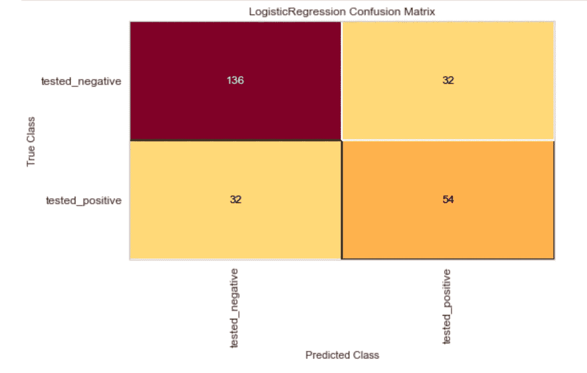
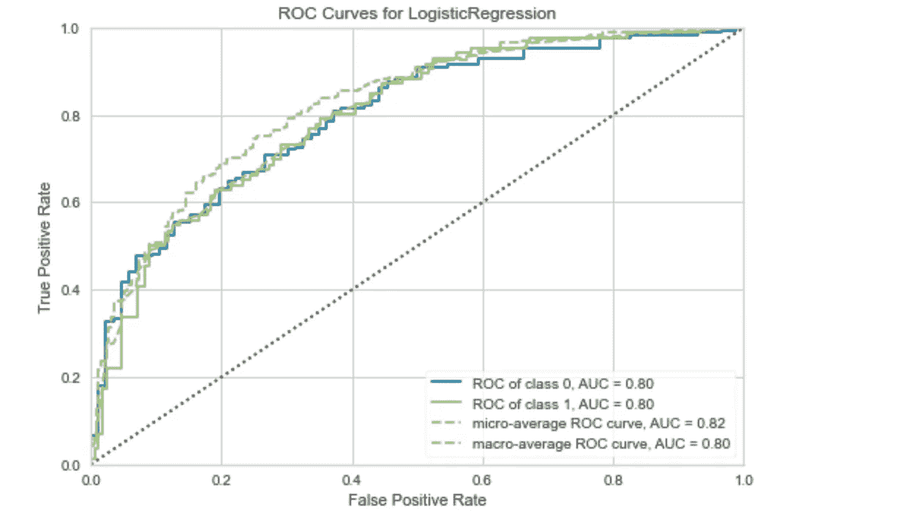
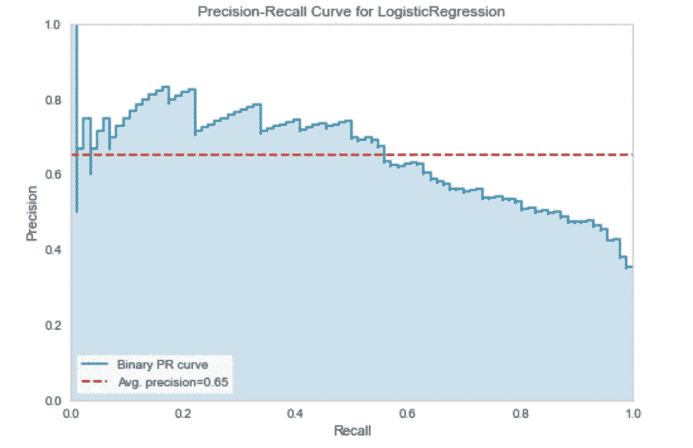
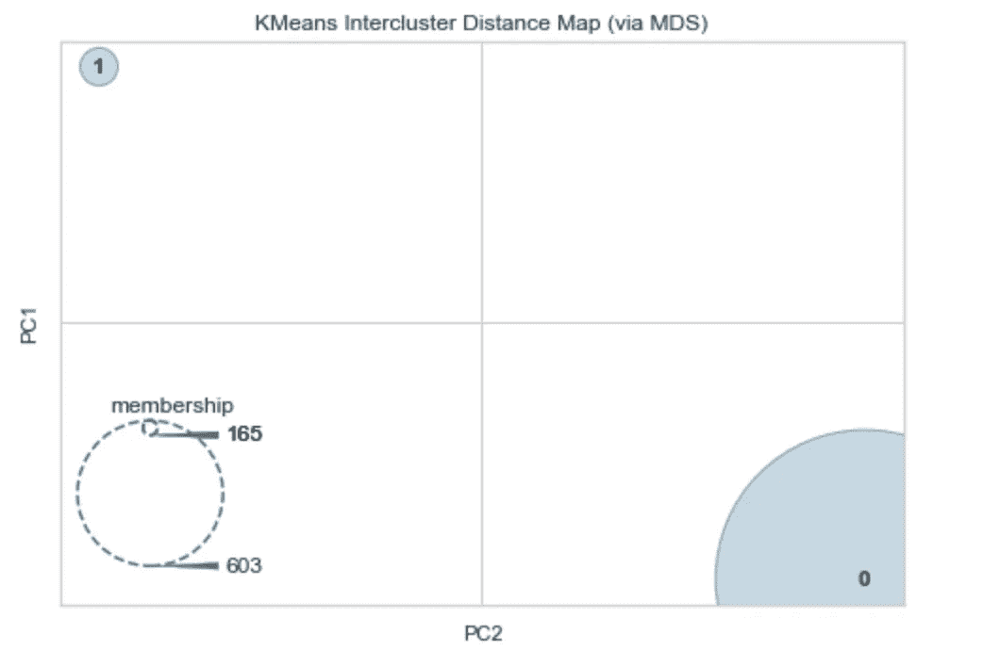

# 机器学习可视化的简单指南

> 原文：<https://towardsdatascience.com/a-simple-guide-to-machine-learning-visualisations-6c808ac925dd>

## 使用 Yellowbrick 创建简单有效的机器学习图

剩余剧情。图片作者。

开发机器学习模型的一个重要步骤是评估性能。根据您正在处理的机器学习问题的类型，通常有多种度量标准可供选择来执行此步骤。

然而，仅仅孤立地看一两个数字并不总是能使我们在选择型号时做出正确的选择。例如，一个单一的误差度量不能给我们任何关于误差分布的信息。它没有回答这样的问题:模型是在很小的次数上犯了很大的错误，还是产生了很多较小的错误？

目视检查模型性能也很重要，因为图表或图形可以揭示我们在观察单个指标时可能会忽略的信息。

[Yellowbrick](https://www.scikit-yb.org/en/latest/) 是一个 Python 库，致力于为使用 [Scikit-learn](https://scikit-learn.org/stable/) 开发的机器学习模型创建丰富的可视化。

在接下来的文章中，我将介绍这个方便的机器学习工具，并提供代码示例来创建一些最常见的机器学习可视化。

# 混淆矩阵

混淆矩阵是一种直观评估分类器预测正确率的简单方法。

为了说明混淆矩阵，我使用了一个名为“糖尿病”的数据集。该数据集包括患者的许多特征，如体重指数、2 小时血清胰岛素测量值和年龄，以及一个指示患者糖尿病测试呈阳性还是阴性的列。目的是利用这些数据建立一个模型，预测阳性糖尿病结果。

下面的代码通过 Scikit-learn API 导入这个数据集。

在二元分类问题中，模型做出的预测可能有四种可能的结果。

**真阳性:**模型**正确**预测阳性结果，例如患者的糖尿病测试为阳性，模型预测为阳性。

**假阳性:**模型**错误地**预测了阳性结果，例如，患者的糖尿病测试为阴性，但模型预测为阳性。

**真阴性:**模型已经**正确地**预测了阴性结果，例如，患者的糖尿病测试为阴性，模型预测为阴性。

**假阴性:**模型**错误地**预测了阴性结果，例如，患者的糖尿病检测呈阳性，但模型预测为阴性。

混淆矩阵将这些可能结果的数量可视化在一个网格中。以下代码使用 Yellowbrick ConfusionMatrix 可视化工具为模型生成混淆矩阵。

混乱矩阵。图片作者。

# ROC 曲线

分类器的初始输出不是一个标签，而是一个特定的观察值属于某一类的概率。

然后，通过选择一个阈值，将这个概率转化为一个类别。例如，我们可以说，如果患者检测呈阳性的概率高于 0.5，那么我们就指定阳性标签。

根据模型、数据和用例，我们可以选择一个阈值来优化特定结果。在糖尿病的例子中，遗漏阳性结果可能会危及生命，因此我们希望将假阴性降至最低。改变分类器的阈值是优化这一结果的一种方式，ROC 曲线是可视化这种权衡的一种方式。

以下代码使用 Yellowbrick 构建 ROC 曲线。

ROC 曲线。图片作者。

ROC 曲线绘制了真阳性率与假阳性率的关系。利用这一点，我们可以评估降低或提高分类阈值的影响。

# 精确召回曲线

ROC 曲线并不总是评估分类器的最佳方式。如果类别不平衡(一个类别比另一个类别有更多的观察值)，ROC 曲线的结果可能会产生误导。

在这些情况下，精确召回曲线通常是更好的选择。

让我们快速回顾一下我们所说的精确和召回的含义。

**精度**衡量模型在正确识别正类方面的能力。换句话说，在所有对积极类的预测中，有多少是正确的？

**回忆一下**告诉我们该模型在正确预测数据集中所有**正面观察结果方面有多好。**

在精确度和召回率之间经常有一个权衡。例如，你可能会以降低召回率为代价来提高精确度。

精确召回曲线显示了不同分类阈值下的这种折衷。

下面的代码使用 Yellowbrick 库为糖尿病分类器生成一条精确召回曲线。

精确召回曲线。图片作者。

# 星团间距离

Yellowbrick 库还包含一套用于分析聚类算法的可视化工具。评估聚类模型性能的一种常用方法是使用聚类间距离图。

聚类间距离图绘制了每个聚类中心的嵌入图，并基于成员关系显示了聚类之间的距离和每个聚类的相对大小。

我们可以通过仅使用特征(X)将糖尿病数据集转化为聚类问题。

在我们对数据进行聚类之前，我们可以使用流行的肘方法来找到最佳的聚类数。Yellowbrick 对此有一个方法。

肘法。图片作者。

肘形曲线表明两个集群是最佳的。

现在，让我们选择两个分类，绘制数据集的分类间图。

星团间距离图。图片作者。

从这里我们可以看到，两个集群之间有很大的距离。成员表明，有一个集群有 165 个观察值，另一个集群有 603 个观察值。这非常接近糖尿病数据集中两个类别的平衡，每个类别有 268 个和 500 个观察值。

# 残差图

基于回归的机器学习模型有自己的一套可视化方法。Yellowbrick 也为这些提供了支持。

为了说明回归问题的可视化，我们将使用通过 Scikit-learn API 获得的糖尿病数据集的变体。该数据集与本文前面使用的数据集具有相似的特征，但是目标是基线一年后疾病进展的定量测量。

在回归分析中，将残差可视化是分析模型性能的一种方法。残差是观察值和模型预测值之间的差值。它们是量化回归模型中误差的一种方法。

下面的代码为一个简单的回归模型生成一个残差图。

剩余剧情。图片作者。

Yellowbrick 库中基于回归的模型的其他可用可视化包括:

*   预测误差图。
*   阿尔法选择。
*   库克的距离。

Yellowbrick Python 库为使用 Scikit-learn 开发的模型提供了一种创建机器学习可视化的快速方法。除了评估模型性能的可视化，Yellowbrick 还有用于可视化交叉验证、学习曲线和特征重要性的[工具](https://www.scikit-yb.org/en/latest/api/model_selection/index.html)。此外，它还提供了[文本建模](https://www.scikit-yb.org/en/latest/api/text/index.html)可视化的功能。

正如文章中所描述的，单个评估度量模型可能是有用的，并且在某些情况下，如果您有一个简单的问题并且正在比较不同的模型，这可能就足够了。然而，通常情况下，创建模型性能的可视化是获得对机器学习模型有效性的真正理解的重要附加步骤。

如果您想了解更多关于单一评估指标的内容，我之前写过一篇文章，讨论了分类评估指标，还有一篇文章讨论了回归评估指标。

 [## 衡量分类性能的 8 项指标

### …用简单的英语解释

towardsdatascience.com](/8-metrics-to-measure-classification-performance-984d9d7fd7aa)  [## 回归的 3 个评估指标

### …用简单的英语解释

towardsdatascience.com](/3-evaluation-metrics-for-regression-80cb34cee0e8) 

感谢阅读！